---
layout: post  
title: (Paper Review) Segmentation  
subtitle: Video Object Segmentation with Adaptive Feature Bank and Uncertain-Region Refinement  
tags: [ai, ml, segmentation]  
comments: true
--- 

이 논문에서는 Semi-supervised video object segmentation을 위한 새로운 Matching-based framework를 제안한다.  
기존의 matching-based 방식에 region matching과 classification을 위해서 feature bank를 사용했지만, 지속적으로 커지는 feature bank에 정보를 효과적으로 구성하는 방법을 찾진 못했다.  
이를 해결하기 위해 저자는 동적으로 새로운 feature을 흡수하고 구식의 feature는 무시하는 adaptive한 feature bank를 소개하고 있다.  
또한 불확실한 region에 대한 segmentation accuracy를 높이기 위해 새로운 confidence loss와 fine-grained segmentation module을 제안다.  

```
Proceeding: NIPS 2020
Authors: Yongqing Liang, Xin Li, Navid Jafari, Jim Chen
```
[Source Code Link](https://github.com/xmlyqing00/AFB-URR)  
[Paper Link](https://proceedings.neurips.cc/paper/2020/file/234833147b97bb6aed53a8f4f1c7a7d8-Paper.pdf)

## Introduction
VOS(Video Object Segmentation)의 semi-supervised setting에서 성능에 가장 영향을 주는 두 스텝은  
(1) object의 region과 배경과 구별  
(2) segmentation의 boundary를 깔끔하게 구별  
하는 것이다.  

최근의 연구를 implicit learning과 explicit learing으로 카테고리화 할 수 있다.  
implicit 방식은 detection-based와 propagation-based learning을 포함한다. FCN 파이프라인을 사용하고 종종 비디오에서 새로운 물체에 대해 학습하기 위해 online fine-tune을 요구한다.  
explicit 방식은 물체의 appearance를 명시적으로 학습한다. 이 embedding 공간에서 pixel-wise classification로 공식화한다.  
object의 appearance를 기억하기 위해 embedding 공간을 설계하고 similarity 계산 이용해서 subsequent frame들을 segment 한다.  
그래서 이방식을 matching-based라고 칭하기도 한다. 최근에 이 방식은 VOS 벤치마크에서 SOTA를 달성하였다.  

matching-based VOS의 근본적인 이슈는 어떻게 이전 프레임의 정보를 이용하여 새로운 프레임을 명시적으로 segment 하느냐에 있다.  
메모리 크기는 제한적이고, 모든 프레임의 정보들을 기억하는 것은 불가능하다.  
대부분의 방식은 처음과 최근의 프레임을 이용하거나 프레임 uniformly sampling하여 사용한다.  
하지만 비디오가 점차 길어지면서 out-of-memory crash 문제를 일으키거나 key-frame을 샘플링 하지 못하는 문제를 발생시킨다.  

저자는 이를 해결하기 위해 Adaptive Feature Bank(AFB)를 도입하였다.  
weighted averaging과 least frequently used(LFU) index를 이용하여 구식의 feature를 무시하는 매커니즘을 사용한다.  
이 방법으로 다양한 object의 특징을 기억할 수 있고, 긴 비디오에서도 적은 메모리 만으로 동시에 segmentation을 수행할 수 있다.  

또한 uncertain-region refinement(URR)을 이용하여 segmentation의 퀄리티를 높였다. 
이는 segmentation의 모호함을 평가하는 새로운 confidence loss와 이 모호한 영역을 refine하기 위한 local fine-grained segmentation을 이용한다.  

## Approach


### Matching-based segmentation

첫번째 프레임과 gt annotation을 인코딩하여 feature bank를 설계하는데 사용한다.  
그다음 두번째 프레임부터 target object를 segmentation 하기 위해 feature bank를 이용한다.  
decoder는 matching 결과를 이용하여 segmentation을 수행한다. 

#### Encoders
* query Encoder: 현재의 frame을 인코딩하며, named query frame을 이용한다.  
    * ResNet-50의 layer3 feature map을 이용 (Size: H/8 X W/8 X 1024)
* Reference Encoder: Target object의 특징을 기억하기 위해 설계 
    * t-th frame을 segmentation 하기 위해서 past frame으로 1부터 t-1번째 까지를 사용
    * 각 프레임의 reference frame: L개의 물체를 구분하기 위해서 L 개의 feature map을 사용 (Size: L X H/8 X W/8 X 1024) 
    * Pj = {p1, p2, ..., pL}, j ∈ [1, t − 1].
    
#### Feature map embedding
기존의 matching-based 방식에서는 query feature map과 reference feature map간에 direct하게 비교를 수행했다.  
classification에서는 좋은 성능을 내지만 segmantic information에는 부족한 방식이다.  
이를 보완하기 위해 두 convolutional module을 이용하여 두 개의 key와 value embedding space로 인코딩을 수행한다.  
key를 이용하여 matching을 수행하고 value는 풍부한 sementic 정보를 보존하기 위해 다른 값을 갖을 수 있도록 허용한다.

#### Matcher
query frame과 feature bank 간의 similarity는 object by object 간에 수행된다.
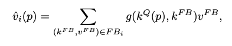  
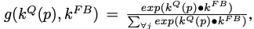  
i ∈ [1, L]  
query value와 가장 비슷한 value map과 concatenate를 수행 한다.
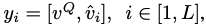

```python
    def forward(self, feature_bank, q_in, q_out):

        mem_out_list = []

        for i in range(0, feature_bank.obj_n):
            d_key, bank_n = feature_bank.keys[i].size()

            try:
                p = torch.matmul(feature_bank.keys[i].transpose(0, 1), q_in) / math.sqrt(d_key)  # THW, HW
                p = NF.softmax(p, dim=1)  # bs, bank_n, HW
                mem = torch.matmul(feature_bank.values[i], p)  # bs, D_o, HW
            except RuntimeError as e:
                device = feature_bank.keys[i].device
                key_cpu = feature_bank.keys[i].cpu()
                value_cpu = feature_bank.values[i].cpu()
                q_in_cpu = q_in.cpu()

                p = torch.matmul(key_cpu.transpose(0, 1), q_in_cpu) / math.sqrt(d_key)  # THW, HW
                p = NF.softmax(p, dim=1)  # bs, bank_n, HW
                mem = torch.matmul(value_cpu, p).to(device)  # bs, D_o, HW
                p = p.to(device)
                print('\tLine 158. GPU out of memory, use CPU', f'p size: {p.shape}')

            mem_out_list.append(torch.cat([mem, q_out], dim=1))

            if self.update_bank:
                try:
                    ones = torch.ones_like(p)
                    zeros = torch.zeros_like(p)
                    bank_cnt = torch.where(p > self.thres_valid, ones, zeros).sum(dim=2)[0]
                except RuntimeError as e:
                    device = p.device
                    p = p.cpu()
                    ones = torch.ones_like(p)
                    zeros = torch.zeros_like(p)
                    bank_cnt = torch.where(p > self.thres_valid, ones, zeros).sum(dim=2)[0].to(device)
                    print('\tLine 170. GPU out of memory, use CPU', f'p size: {p.shape}')

                feature_bank.info[i][:, 1] += torch.log(bank_cnt + 1)

        mem_out_tensor = torch.stack(mem_out_list, dim=0).transpose(0, 1)  # bs, obj_n, dim, pixel_n

        return mem_out_tensor
```

#### Decoder
matching 결과인 y를 이용하여 각 object의 mask를 독립적으로 예측한다.  
refinement module을 이용하여 feature map을 점진적으로 upscale한다.  
각 stage에서 previous stage와 query encoder로부터 온 feature map간 skip connection을 이용한다.  
최종적으로 object i에 대한 마스크인 Mi를 구한다.   
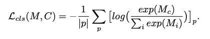

### Adaptive Feature Bank
AFB의 주요 특징은 새로운 feature를 흡수하고 구식은 제거하는 것이다.  

#### Absorbing new features
대부분 최근의 프레임이 더 중요한 정보를 가지고 있지만 초기의 프레임도 필요한 정보를 담고 있을 수 있다.  
그래서 초기 프레임을 단순히 무시하기 보다 이를 저장하고 weighted averaging을 이용하여 관리하는 방식을 취한다. 
새로운 특징이 추출되고, 이전 특징과 충분히 가깝다면 이들을 merge 하므로써 중복된 정보를 저장하는 것을 피할 수 있다.   


new feature embedding: a(i) = (Kp, Vp)  
old feature embeddings: b(j) = (Kfb, Vfb)  
Similarity Function:
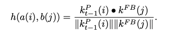

a(i)에 대해서 가장 비슷한 b(j`)을 구한 후 merging을 수행  
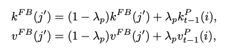  
비슷하지 않으면 feature bank에 추가한다.  

````python
    def update(self, prev_key, prev_value, frame_idx):

        for class_idx in range(self.obj_n):

            d_key, bank_n = self.keys[class_idx].shape
            d_val, _ = self.values[class_idx].shape

            normed_keys = NF.normalize(self.keys[class_idx], dim=0)
            normed_prev_key = NF.normalize(prev_key[class_idx], dim=0)
            mag_keys = self.keys[class_idx].norm(p=2, dim=0)
            corr = torch.mm(normed_keys.transpose(0, 1), normed_prev_key)  # bank_n, prev_n
            related_bank_idx = corr.argmax(dim=0, keepdim=True)  # 1, HW
            related_bank_corr = torch.gather(corr, 0, related_bank_idx)  # 1, HW

            # greater than threshold, merge them
            selected_idx = (related_bank_corr[0] > self.thres_close).nonzero()
            class_related_bank_idx = related_bank_idx[0, selected_idx[:, 0]]  # selected_HW
            unique_related_bank_idx, cnt = class_related_bank_idx.unique(dim=0, return_counts=True)  # selected_HW

            # Update key
            key_bank_update = torch.zeros((d_key, bank_n), dtype=torch.float, device=self.device)  # d_key, THW
            key_bank_idx = class_related_bank_idx.unsqueeze(0).expand(d_key, -1)  # d_key, HW
            scatter_mean(normed_prev_key[:, selected_idx[:, 0]], key_bank_idx, dim=1, out=key_bank_update)
            # d_key, selected_HW

            self.keys[class_idx][:, unique_related_bank_idx] = \
                mag_keys[unique_related_bank_idx] * \
                ((1 - self.update_rate) * normed_keys[:, unique_related_bank_idx] + \
                 self.update_rate * key_bank_update[:, unique_related_bank_idx])

            # Update value
            normed_values = NF.normalize(self.values[class_idx], dim=0)
            normed_prev_value = NF.normalize(prev_value[class_idx], dim=0)
            mag_values = self.values[class_idx].norm(p=2, dim=0)
            val_bank_update = torch.zeros((d_val, bank_n), dtype=torch.float, device=self.device)
            val_bank_idx = class_related_bank_idx.unsqueeze(0).expand(d_val, -1)
            scatter_mean(normed_prev_value[:, selected_idx[:, 0]], val_bank_idx, dim=1, out=val_bank_update)

            self.values[class_idx][:, unique_related_bank_idx] = \
                mag_values[unique_related_bank_idx] * \
                ((1 - self.update_rate) * normed_values[:, unique_related_bank_idx] + \
                 self.update_rate * val_bank_update[:, unique_related_bank_idx])

            # less than the threshold, concat them
            selected_idx = (related_bank_corr[0] <= self.thres_close).nonzero()

            if self.class_budget < bank_n + selected_idx.shape[0]:
                self.remove(class_idx, selected_idx.shape[0], frame_idx)

            self.keys[class_idx] = torch.cat([self.keys[class_idx], prev_key[class_idx][:, selected_idx[:, 0]]], dim=1)
            self.values[class_idx] = \
                torch.cat([self.values[class_idx], prev_value[class_idx][:, selected_idx[:, 0]]], dim=1)

            new_info = torch.zeros((selected_idx.shape[0], 2), device=self.device)
            new_info[:, 0] = frame_idx
            self.info[class_idx] = torch.cat([self.info[class_idx], new_info], dim=0)

            self.peak_n[class_idx] = max(self.peak_n[class_idx], self.info[class_idx].shape[0])

            self.info[class_idx][:, 1] = torch.clamp(self.info[class_idx][:, 1], 0, 1e5)  # Prevent inf
````

#### Removing obsolete features
cache 정책과 비슷하게 오래된 feature에 대해서 최근 사용된 빈도를 계산한다.(LFU)  
만약 각 matching에서 similarity가 10^-4보다 크다면 count를 증가시킨다  
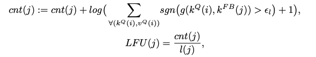  
feature bank의 크기가 정해진 크기를 초과하면 삭제를 진행한다. 

```python
    def remove(self, class_idx, request_n, frame_idx):

        old_size = self.keys[class_idx].shape[1]

        LFU = frame_idx - self.info[class_idx][:, 0]  # time length
        LFU = self.info[class_idx][:, 1] / LFU
        thres_dynamic = int(LFU.min()) + 1
        iter_cnt = 0

        while True:
            selected_idx = LFU > thres_dynamic
            self.keys[class_idx] = self.keys[class_idx][:, selected_idx]
            self.values[class_idx] = self.values[class_idx][:, selected_idx]
            self.info[class_idx] = self.info[class_idx][selected_idx]
            LFU = LFU[selected_idx]
            iter_cnt += 1

            balance = (self.class_budget - self.keys[class_idx].shape[1]) - request_n
            if balance < 0:
                thres_dynamic = int(LFU.min()) + 1
            else:
                break

        new_size = self.keys[class_idx].shape[1]
        self.replace_n[class_idx] += old_size - new_size

        return balance
```

### Uncertain-region Refinement

#### Confidence loss
decoding과 softmax normalization을 수행한 initial segmentation Mi는 [0, 1]의 값을 가지고  
합은 1이다. 이는 해당 object에 대한 likelihood를 뜻한다.  
pixel-wise uncertainity map U를 구하기 위해서 마스크에서 가장 큰 값과 두번 째로 가장 큰 값의 비율을 이용한다. 그리고 0에서 1의 값을 갖게 하기 위해 L2 norm을 수행한다.  
  

```python
def calc_uncertainty(score):
    # seg shape: bs, obj_n, h, w
    score_top, _ = score.topk(k=2, dim=1)
    uncertainty = score_top[:, 0] / (score_top[:, 1] + 1e-8)  # bs, h, w
    uncertainty = torch.exp(1 - uncertainty).unsqueeze(1)  # bs, 1, h, w
    return uncertainty
```

#### Local Refinement mechanism

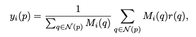    
  
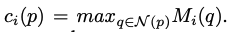  
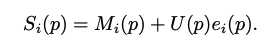  
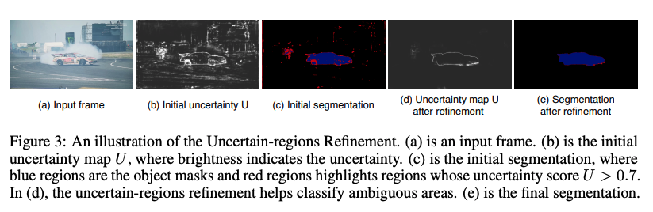  
e: local refinement mask  
c: confidence score  
S: final segmentation   

아래는 decoder 소스 코드의 일부이다.

```python
    def forward(self, patch_match, r3, r2, r1=None, feature_shape=None):

        p = self.ResMM(self.convFM(patch_match))
        p = self.RF3(r3, p)  # out: 1/8, 256
        p = self.RF2(r2, p)  # out: 1/4, 256
        p = self.pred2(NF.relu(p))
        p = NF.interpolate(p, scale_factor=2, mode='bilinear', align_corners=False)
        bs, obj_n, h, w = feature_shape
        rough_seg = NF.softmax(p, dim=1)[:, 1]
        rough_seg = rough_seg.view(bs, obj_n, h, w)
        rough_seg = NF.softmax(rough_seg, dim=1)  # object-level normalization

        # Local refinement
        uncertainty = myutils.calc_uncertainty(rough_seg) 
        uncertainty = uncertainty.expand(-1, obj_n, -1, -1).reshape(bs * obj_n, 1, h, w)

        rough_seg = rough_seg.view(bs * obj_n, 1, h, w)  # bs*obj_n, 1, h, w
        r1_weighted = r1 * rough_seg
        r1_local = self.local_avg(r1_weighted)  # bs*obj_n, 64, h, w -> AveragePooling(same padding)을 수행
        r1_local = r1_local / (self.local_avg(rough_seg) + 1e-8)  # neighborhood reference
        r1_conf = self.local_max(rough_seg)  # bs*obj_n, 1, h, w 

        local_match = torch.cat([r1, r1_local], dim=1)
        q = self.local_ResMM(self.local_convFM(local_match)) # convolution 수
        q = r1_conf * self.local_pred2(NF.relu(q))

        p = p + uncertainty * q
        p = NF.interpolate(p, scale_factor=2, mode='bilinear', align_corners=False)
        p = NF.softmax(p, dim=1)[:, 1]  # no, h, w

        return p
```
