---
layout: post    
title: (Paper Review) Robustness  
subtitle: Maximum-Entropy Adversarial Data Augmentation for Improved Generalization and Robustness      
tags: [ai, ml, robustness]    
comments: true  
--- 
adversarial data augmentation은 보지 못했던 데이터의 shift와 corruption에 대해 딥러닝 네트워크를 더욱 강건하게 학습하도록 만든다.  
하지만 source 분포와는 크게 다른 "hard" adverserial perturbation을 포함하는 허구의 target 분포를 생성하는 것은 매우 어렵다.  
이 논문에서는 adversarial data augmentation을 위한 새롭고 효과적인 regularization term을 제안한다.  
직관적으로 regularization term은 기본 source 분포를 교란하여 현재 모델의 예측 불확실성을 확대하도록 장려함으로써 더욱 강건하게 모델을 학습하도록 도와준다.  
 
```
Proceeding: NIPS 2020
Authors: Long Zhao, Ting Liu, Xi Peng, Dimitris Metaxas
```
[Source Code Link](https://github.com/garyzhao/ME-ADA)  
[Paper Link](https://proceedings.neurips.cc/paper/2020/file/a5bfc9e07964f8dddeb95fc584cd965d-Paper.pdf)  

## Introduction
딥러닝 네트워크는 같은 분포에서 온 train과 test 데이터 셋에 대해서는 매우 좋은 퍼포먼스를 보인다.
하지만 실제로는 train과 test 분포는 다른 경우가 대부분이다.
최근에는 model robustness를 위 보지 못한 data shift를 resemble 하기 위해 adversarial loss를 이용하여 허구의 target distribution을 생성한다.  
하지만 이런 heuristic loss function은 큰 dataset shift를 합성하기에는 역부족이다.  
이 문제를 완화하기 위해 information bottleneck(IB) 이을 사용하여 정보 이론 관점에서 adversarial data augmentation을 위한 정규화 기법을 제안한다.  

IB 원칙은 input variable에서 예측에 도움이 되지 않는 부분을 줄이고  optimal한 representation을 학습하도록 도와준다.  
최근에는 이런 IB를 이용한 방식이 많이 나오고 있지만 그럼에도 adversarial data augmentation의 효율성은 아직 불명확하다.  

IB 맥락에서 입력 X가 모델에 잘 Compressed(M(X, Y) = P(X and Y)/P(X)*P(Y) is high) 하지 않은 경우, 종종 domain의 외부 데이터에 대해서는 잘 일반화 되지 않는다. 
이 컨셉에 착안하여 저자는 IB function을 maximize하면서 adversarial data augmentation을  정규화하는 방식을 고안했다.  
특히, 상호 정보량을 최대화 하면서 source domain으로부터 크게 벗어난 허구의 "hard" target domain을 생성한다.  
하지만 상호 정보량을 직접적으로 최대화 하는 것은 어렵다. 그래서 같은 목표를 가진 효율적인 maximum-entropy regularizer를 개발하였다.  

## Background and Related Work
### Information Bottleneck Principle
입력 데이터 X를 출력 데이터 Y를 표현하는 latent representation Z로 정보를 압축하는 방법이다.  
X와 Z의 상호정보량은 I(X;Z) = D_KL(P(X and Z)/P(X)*P(Z))로 표현할 수 있으며, Z가 주어졌을 때 X의 불확실성을 뜻한다.  
I(X;Z)는 Z가 X를 얼마나 잘 compress했는 지를 표현하고, I(Y;Z)는 Z가 얼마나 Y를 잘 예측할 수 있는지를 표현한다.  
IB의 목적식은 아래와 같다.  
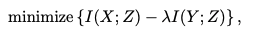  
compression과 accuracy 사이에는 tradeoff가 존재한다.  

### Domain Generalization
Domain Adaptation은 학습 과정에서 source domain에서 다른 분포를 가진 target domain으로 model을 transfer하는 방법을 뜻한다.  
반면에 Domain Generalization은 evaluation 과정에서 unseen domain에 대해 잘 transfer하도록 학습하는 것을 뜻한다.   
이 논문에서는 더 어려운 single source domain generalization setting을 타겟한다.  

### Adversarial Data Augmentation
우리는 네트워크를 single source domain P_0로 학습하여 다른 분포를 가지고 있는 unforeseen domain P에 배포 시키는 데 있다.  
(X, Y)가 P_0로부터 왔을 때 P_0에서 worst-case는 아래와 같이 정의된다.  
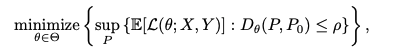  
_여기서 D는 Wasserstein metric을 의미한다_  
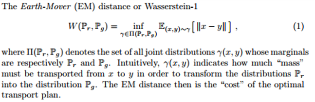  
worst case를 해결하기 위한 방법은 어떠한 data distribution P도 P_0에서 멀어져야 한다.  
실제로 학습 시 위 식은 임의의 ρ를 정의하기 어려우므로 아래와 같이 재정의 할 수 있다.  
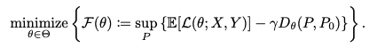

## Methodology
이 논문의 주요 아이디어는 IB 원칙을 adversarial data augmentation에 통합하여 대규모 Domain shift에 대해 모델 robustness를 개선하는 것이다.  
IB Lagrangian을 supervised-learning 시나리오에 적용하여 latent space Z가 classification 목적에 잘 부합하도록 한다.  
IB Lagrangian에 -I(Y;Z)는 prediction risk를 표현하는 cross entropy loss로 교체하여, L_ib(w; X, Y) = L_ce(w; X, Y) + b*I(X;Z)로 변형할 수 있다. 
이 식은 결국 근본적인 cross-entropy loss와 표현의 최소화인 regularizer I(X;Z)의 형태로 표현된다. 
따라서 위 식을 아래와 같이 다시 정의 할 수 있다.  
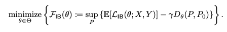  
이 식의 main challenge는 data 매우 큰 dimensionality를 가지고 있기 때문에 I(X;Z)를 계산하는 것이 불가능 하다는 것이다.  
이를 근사하기 위해서 최근에 사용하는 방식이 l2 penalty(weight decay)이다.  
아래 알고리즘에 adversarial data augmentation을 위해서 maximization phase에 I(X;Z)를 어떻게 효과적으로 적용할지 논의한다.  
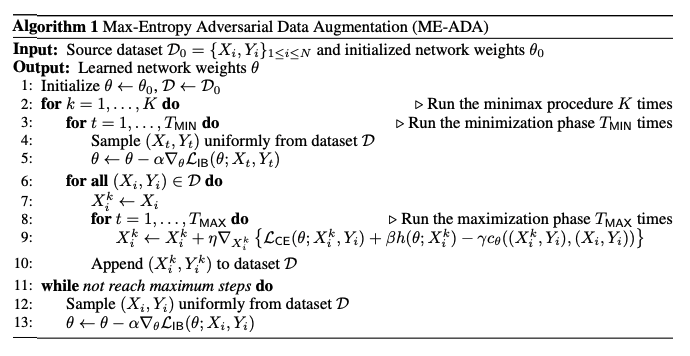

### Regularizing Maximization Phase via Maximum Entropy
직관적으로 상호정보량 I(X;Z)를 maximization phase에서 규제하는 것은 adversarial perturbation을 강화하면서 현재 모델을 효과적으로 "compress"하지 못한다.  
정보이론에서 이런 perturbation은 일반적으로 large domain shift에 적용되고, 잠재적으로 model 일반화와 강인성에 도움이 된다.  
하지만 Z는 매우 고차원이라 I(X;Z)를 maximize 하는 것은 불가능하다.
  
저자의 key result 중 하나는, classification 시나리오를 제한하므로써 효과적으로 I(X;Z)를 maximize하는 것이다.  
이 과정은 네트워크의 예측에 대한 entropy를 최대화 함으로써 효과적으로 적용될수 있고, 이는 I(X;Z)의 lower bound로 손쉽게 사용된다.  

딥러닝은 input에 대한 연속적 표현에 대한 Markov chain으로 고려할 수 있다(X --> Z --> Y)  
Data Processing Inequality에 의해서 I(X;Z) >= I(X;Y)를 구할 수 있다.  
반면에 각 maximization phase를 지나 data augmentation을 수행할때, model parameter는 고정되어 있기 떄문에, Y는 X에 대해 deterministic function이다.  
따라서, H(Y|X) = 0 이다.   
_H는 Shannon entropy를 뜻한다. 이는 모든 사건 정보량의 기대값을 뜻한다._  
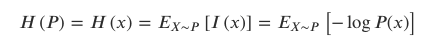  

이를 이용해 Proposition1의 식으로 표현할 수 있다.  
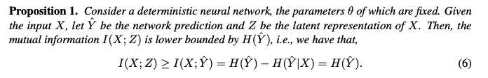  

여기서 H(Y)는 X를 필요로 하지 않는다. 따라서 I(X;Z)를 최대화 하는데는 input X의 dimensionality와는 상관 없음을 뜻한다.  
때문에, 고차원의 이미지 데이터에 대해서도 우리는 여전히 mutual information을 이와 같은 방법으로 최대화 할 수 있다.  

두번째 formulation은 Deterministic Information Bottleneck과 관련이 있다. 
I(X;Z)는 H(Z)로 근사할 수 있지만, 일반화 하기는 쉽지 않다. 대신에 H(Y)는 classification network의 softmax output으로 직접적으로 계산할 수 있다.  
따라서 Figure 5 식은 아래와 같이 표현될 수 있다.  
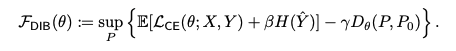
  
베이지안 관점에서 H(Y)는 예측 불확실성으로 표현할 수 있다. 그래서은 위 maximum entropy formulation은 data distribution을 perturbing 하는 것과 동일하다.  
H(Y)는 결국 학습 과정에서 access 할 수 있는 data distribution으로 부터 경험적인 추정치를 얻는 것이므로, 
source domain으로 부터 온 input x로 prediction을 수행한 결과로 표현할 수 있다.  
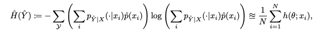  

위의 식들을 조합하면 Proposition2로 표현할 수 있다.  
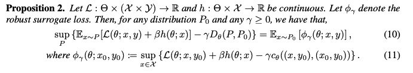  

k-th maximization phase에서 N개의 adversarial perturbed sample을 구하기 위한 방법은 아래와 같다.  
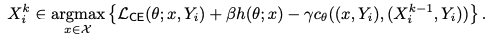  
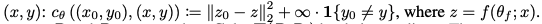 

경험적 엔트로피의 기대값은 실제 엔트로피 기대값과 비슷하다는 것을 보증할 수 있다.  
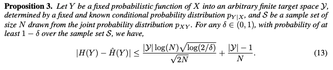   

### Maximum Entropy in None-Deterministic Conditions
딥러닝 모델이 통계론적이거나 Dropout layer를 포함하고 있다면 모든 모델은 deterministic하지 않다. 
그래서 X-->Y로의 mapping 문제는 매우 noisy하다. 때문에 Y가 X의 deterministic한 함수가 아닌 작은 perturbation 일 때, 최대 엔트로피 공식은 여전히 대략적인 의미로 적용된다  
우리는 이제 X와 Y의 joint distribution이 Y가 X의 deterministic 함수가 되는 것을 고려할 수 있다.
결과적으로 조건부 엔트로피 H(Y|X)는 0으로부터 O(-e log e) 만큼 떨어져 있다. 
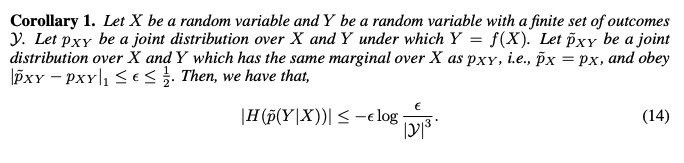
X와 Y의 관계는 완벽하게 deterministic 하진 않지만 e-close한 deterministic function에 가깝다고 말할 수 있다.  


