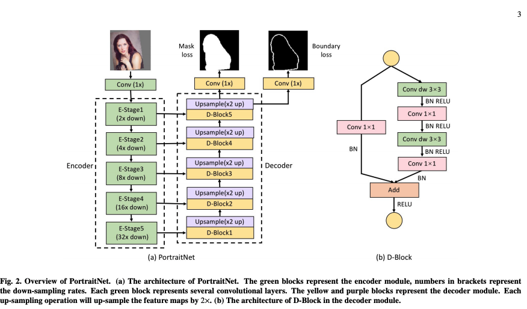
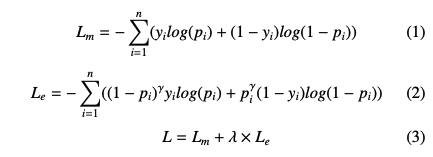
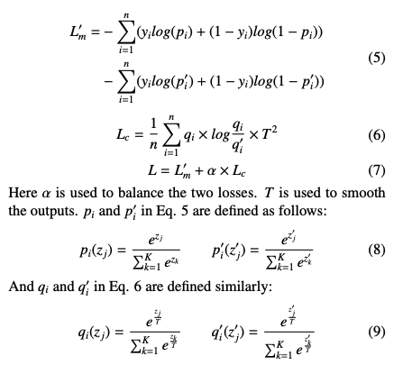
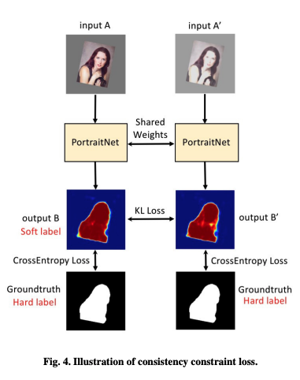
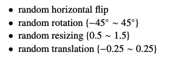
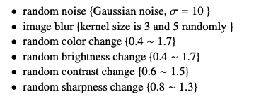
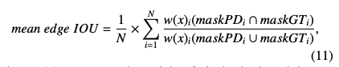
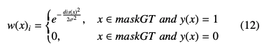
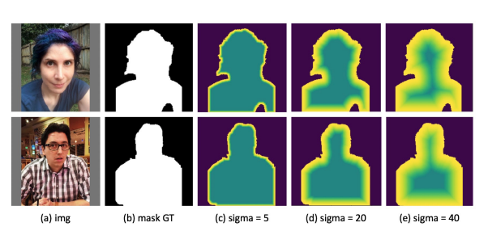

---
layout: post  
title: (Paper Review) Segmentation  
subtitle: (PortraitNet) Real-time Portrait Segmentation Network for Mobile Device  
tags: [ai, ml, portrait, segmentation]  
comments: true
--- 

비디오에서 배경을 변경하는 것과 같이 Real-time으로 portrait segmentation을 수행하는 것은 모바일 디바이스에서 필수적인 요소이다.
이 논문에서는 PortraitNet이라 칭하는 모바일에서 효율적으로 동작하는 real-time portrait segmentation model을 제안한다.
PortraitNet은 학습 단계에서 두 개의 auxiliary loss들을 가지고 있지만 테스트 단계에선 추가적인 비용이 없는 lightweight U-shape 구조이다.
두 auxiliary loss들은 boundary pixel의 정확도를 높이는 boundary loss와 조도의 변화에 강인하게 해주는 consistency constraint loss 이다. 
EG1800과 Supervise-Portrait 데이터 셋이서 SOTA를 달성했으며, 더 sharp한 boundary와 illumination 조건에서 좋은 성능을 보였다.
게다가 224x224 rgb 이미지를 iphone7에서 30fps 속도로 처리할 수 있다.  

```
Proceeding: 2019
Authors: Song-Hai Zhanga, Xin Donga, Jia Lib, Ruilong Lia, Yong-Liang Yangc
```

[Paper Link](http://yongliangyang.net/docs/mobilePotrait_c&g19.pdf)  
[Source Code Link](https://github.com/dong-x16/PortraitNet)

## Introduction
배경 수정 기능을 요구하는 application이 많아지면서 portrait segmentation의 중요성은 점점 커지고 있다.  
Semantic Segmentation은 dense prediction task로 분류할 수 있다. 각 픽셀이 어떤 클래스에 속할지 분류하는 것이 목표이기 때문이다.  
최근에 CNN을 이용해서 semantic segmentation은 큰 진보가 있었지만, 일반적인 케이스와 달리 Portrait image는 몇가지 독특한 특징이 있다. 
1. 적어도 한사람의 얼굴이 전체의 10% 이상을 차지한다. 
2. 그 경계가 모호하면서 복잡한 illumination에 놓여 있기 쉽다.  

모바일 디바이스에서 높은 정확도와 계산 효율성을 동시에 달성하기는 매우 도전적이다. 이전의 portrait segmentation 연구에서는 효율성보다 정확성에 더 집중해왔기 때문에, 
실시간 segmentation에는 적합하지 않았다.   
이 논문에서는 모바일 환경에서 real-time이 가능 새로운 PortraitNet를 제안한다. 
encoder에서 32X down-sampling rate을 가지고 큰 receptive field를 수용하면서 inferring 효율성을 높였다. 
또한 U-shape 구조로 up-sample 하면서 정확도를 높였다. decoder는 refined residual block과 up-sampling block으로 구성되어 있다. 
여기서 residual block의 일반 convolution을 depthwise separable convolution으로 교체하였다.
그리고 boundary의 정확도를 높이이고 illumination에 강인하게 만들기 위한 두 auxiliary loss들을 통해서 정확도를 높였다.  

## Method
### PortraitNet Architecture
  
일반적으로 portriat은 전체 이미지에서 큰 부분을 차지한다. 때문에 encoder은 풍부한 global과 spatial information에 대한 이해가 필요하다.
나아가 real-time performance를 얻기위해 32x down-sampling rate을 가지는 224x224의 작은 입력이미지를 사용한다.  
또한 U-shape 구조를 이용하여 32x up-sampling rate을 가지는 decoder를 사용한다. 
저자는 model의 능력을 완전히 활용하기 위해서 decoder 모듈에서 feature map을 fusion map으로 활용하여 concatenate 하였다.  
lightweight research에서 착안하여 depthwise separable convolution을 사용하여 inferring의 효율을 높였다.  
각각의 convolution layer 뒤에는 batch norm과 relu layer를 사용하였다. 
모델 복잡도를 줄이기 위해서 decoder의 구조는 encoder에 비해 훨씬 간단하다. 오직 up-sampling과 trainsition operation만으로 구성된다.  
up-sampling은 de-convolution을 사용하였고 각 layer는 2x로 up-sample을 수행한다.  
Fig-2의 (b) 처럼 decoder의 residual block을 수정하였다.  
PortraitNet은 MobileNet-v2를 encoder의 백본으로 사용하였고 massive depthwise convolution을 사용하여 running speed를 높였다.  

### Auxiliary Losses
속도를 높이기 위해 depthwise separable convolution을 사용했지만 이는 오히려 정밀도를 떨어뜨리는 문제를 발생시킨다.  
그래서 저자는 이를 보완하기 위한 두가지 보조 loss를 적용시켰다. 이 방법은 inferring에 추가적인 비용을 증가시키지 않으면서 학습 과정에서 성능을 높일 수 있다.  

#### Boundary Loss
일반적인 object segmentation과 달리 portrait segmentation은 그 boundary에 더욱 민감하다.  
때문에 네트워크는 더 sharp한 boundary를 생산할 수 있어야 한다.  
이를 위해서 original semantic segmentation loss에 추가적인 boundary loss를 사용하기 위해서 병렬적으로 boundary detection map을 예측하는 convolution layer를 추가하였다.  
추가적인 모듈을 붙인게 아니라 오직 하나의 conv layer만 사용하였다. 
이는 portrait image의 추축같은 특징을 학습하게 하여, segmentation의 효율을 높일 수 있다.  
GT를 만들기 위해서 mask 이미지에 Canny 알고리즘을 적용하였고, 학습의 어려움을 줄이기 위해 line 두께는 4로 설정하였다.  
이 GT에서 90% 이상의 pixel은 negative 이므로 학습하기 어려운 단점이 있다.
그래서 Focal loss를 이용하여 class balance를 맞췄다.   
  
Lm은 마스크의 cross-entropy loss 이고, Le는 edge의 focal loss이다. 
오직 하나의 conv만 사용하기 때문에 mask prediction layer와 invalid한 경쟁을 할 수 있기 때문에 lambda는 작은 값으로 설정해야 한다.  

#### Consistency Constraint Loss
GT mask는 0과 1로만 이루어진 hard label이다. 하지만 Distillation 연구에서 보았다시피 모델 학습에서는 soft label을 사용하는 것이 훨신 효과적이다.  
하지만 복잡한 model distillation을 사용하여 soft label을 생성하는 것 대신 data augmentation을 통해서 모델 자체적으로 soft label을 생성할 수 있다.  
일반적으로 data augmentation은 두가지 주요 카테고리로 나뉜다.  
1. Deformation enhancement: random rotate, flip, scale, crop, ...
2. Texture enhancement: brightness, contrast, sharpness, random noise, gaussian filtering, ...

먼저 오리지널 이미지를 생성하기 위해 Deformation enhancement를 이용하여 image A를 생성한다. 
그 다음 texture enhancement를 A에 적용하여 A' 이미지를 생성한다. 
A'의 모양은 A와 동일하다. 따라서 A와 A'의 heatmap은 동일해야 한다. 
하지만 texture augmentation으로 인해 A'의 예측 결과가 훨씬 안좋게 나온다.  
그래서 A의 예측 결과를 soft label로 사용하여 학습시킨다.  
Consistency loss는 KL divergence를 사용한다.  

  

## Experiment
### Data Augmentation
* Deformation augmentation
  
* Texture Augmentation

* Normalize Image
    * mean = ([103.94, 116.78, 123.68], BGR order)
    * val = (0.017)
    * (image - mean) * val

### Metric
일반적인 mean IOU에서 boundary의 정밀도를 측정하기 위해 고안한 식은 아래와 같다.   
  

w(x)는 pixel의 weight를 뜻한다.  
w(x)는 boundary에서 멀어질 수록 작은 값을 가지도록 셋팅되었다. dis(x)는 pixel x가 boundary로 부터 떨어진 정도를 뜻힌다.  
sigma는 감소 rate을 뜻한다.  
  


