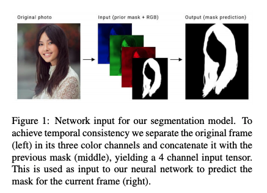
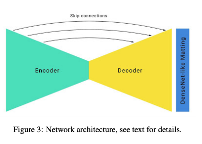
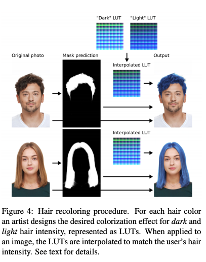

---
layout: post  
title: (Paper Review) Segmentation  
subtitle: Real-time Hair Segmentation and Recoloring on Mobile GPUs  
tags: [ai, ml, segmentation]  
comments: true
--- 

이 논문에서는 하나의 카메라로 모바일에서 실시간으로 hair segmentation을 수행하는 새로운 네트워크를 제안한다. 
이 모델은 모바일 gpu 환경에서 30-100+ FPS 속도를 낼 수 있다. 이미 주요 AR application에 배포되어 있으며 
백만명 이상의 사용자가 사용하고 있다.  

```
Proceeding: 2019
Authors: Andrei Tkachenka, Gregory Karpiak, Andrey Vakunov, Yury Kartynnik, Artsiom Ablavatski, Valentin Bazarevsky, Siargey Pisarchyk
```

[Paper Link](https://arxiv.org/pdf/1907.06740.pdf)   

## Introduction
이전에 비디오에서 많은 시각적 효과를 주기 위해서는 시간이 많이 소요되는 manual한 과정을 거쳐야 하거나, green-screen과 같은 환경이 필요했다.  
이 논문에서는 사용자가 AR application에서 realtime으로 이러한 기능을 사용할 수 있는 새로운 기술을 소개한다.  
모바일 환경의 비디오에서 좀 더 현실적으로 헤어의 색을 바꾸는 문제를 해결하기 위해 다음과 같은 제약 조건들이 있다.  
* 가벼운 모델이면서, 현재의 SOTA 모델에 비해서 10-30배는 빨라야 한다. 적어도 30FPS의 성능을 내야한다.  
* 비디오는 시간적 증복성을 활용하고 시각적 일관성을 유지해야한다.  

## Network Input
이 모델은 헤어를 배경에서 분리하기 위한 soft binary mask를 계산한다.  
AR application을 위해서는 시각적 일관성을 유지하는 것이 매우 중요하다.
현재의 방법들은 LSTM을 이용해 이를 해결하려 하지만, 모바일 환경에서는 계산적으로 매우 복잡하다는 문제가 있다.  
그래서 저자는 previos frame의 결과를 input image에 concate하여 4 channel input을 사용하는 방식을 고안했다.(RGB+1)  
  

## Dataset and ground truth annotation
높은 정확도를 내기 위해서는 GT 역시 높은 퀄리티를 내야한다.  
이를 위해 다양한 포즈와 배경 셋팅의 이미지를 라벨링 하였다. 하지만 헤어는 segmentation 하기 매우 어렵다.  
그래서 라벨링의 어려운 정도을 측정하기 위해 같은 이미지를 다른 사람들에게 배정하여 cross validation을 수행한 결과
88%의 IOU가 나왔다.  
이를 evaluation의 upper bound로 사용하였다.  

## Training Procedure
비디오 환경에서 temporal continuity 뿐만 아니라 사람이 갑자기 화면에서 사라지는 것과 같은 discontinuity까지 고려해야 한다.  
이런 문제를 강건하게 처리하기 위해 annotated gt를 이용해 previous frame mask로 만들 때 다음과 같은 방법을 사용하였다.  
* Empty Previous Mask: 첫번째 프레임은 이전의 프레임이 없기 때문
* Affine transformed gt mask: 작게 변형 시키면, 이전 프레임의 결과를 활용해 예측할 수 있게 하고, 크게 변형 시키면 이전의 프레임의 결과가 부적절할 경우 이를 무시하도록 학습하기 위해
* Transformed image: TPS(thin plate spline smoothing) 알고리즘을 이용해서 빠른 움직임을 표현

## Network architecture
기본적인 hourglass segmentation 네트워크 구조를 사용한다.  
  
mobile 환경에 더 customize하기 위해 아래와 같은 셋팅을 더했다.  
* big Conv kernel size, large stride, small number of channel
    * 고화질 영상을 처리하기 위해 큰 커널을 사용했지만, stride와 channel 수를 조정하여 계산 비용이 증가하지 않게 함.
* 속도를 증가시키기 위헤 큰 stride를 이용해 downsampling하고 up sample시 skip connection을 이용해 정보 손실 방지  
* E-Net의 bottleneck에서 squeezing layer의 factor를 16에서 32로 증가시켜 정확도 감소 없이 속도 증가
* edge의 정확도를 증가시키기 위해 DenseNet layer의 일부를 네트워크 첫부분에 추가

## Hair Recoloring
모든 종류의 헤어에 recoloring을 적용시킬 수 있기 위해 다음과 같은 두 과정을 제안한다.  

### Preparation
* reference가 될 두 헤어를 선택: 하나는 매우 밝은 컬러, 다른 하나는 매우 어두은 컬러
* 각 reference에 대해서 hair intensity의 평균을 구한다. 
* 원하는 컬러를 만들기 위해서 light와 dark를 조정한다. 이 과정은 manually 진행한다.  
* 마지막 셋팅을 reference lookup table에 저장한다. 

### Application
* hair segmentation mask를 구한다.
* hair intensity의 평균을 구한다. 
* reference light과 dark LUT를 아용하여 interpolate을 수행한다.  



