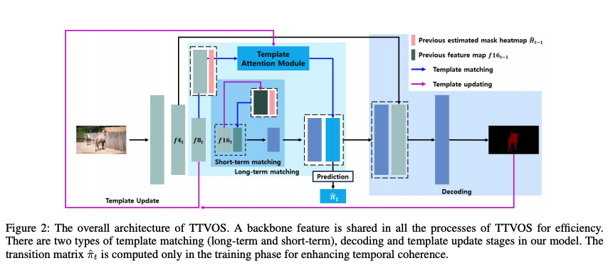
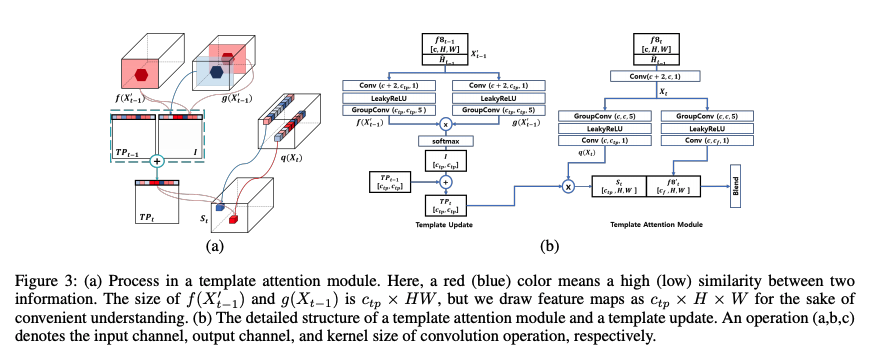
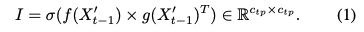
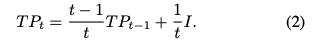
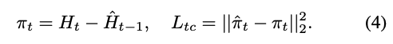
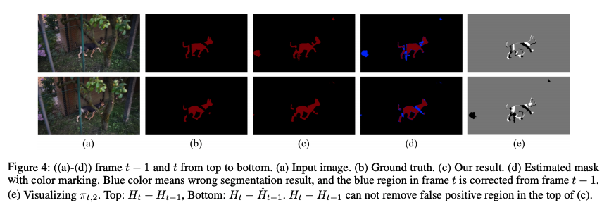
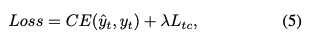

---
layout: post  
title: (Paper Review) Segmentation  
subtitle: (TTVOS) Lightweight Video Object Segmentation with Adaptive Template Attention Module and Temporal Consistency Loss   
tags: [ai, ml, video, segmentation]  
comments: true
--- 

Semi-supervised video object segmentation은 많은 앱에서 사용되고 있다. 
이 task는 class에 구애받지 않는 object를 주어진 segmentation mask로 tracking 하는 것이다. 
이를 위해서 optical flow, online-learning, memory networks과 같은 다양한 접근 방식이 사용되어져 왔다. 
하지만 위 방법은 높은 정확도를 보이지만 inference 시간이 길고, 복잡성이 크기 때문에 실제 앱 환경에는 제약이 있다. 
이러한 문제점을 해결하기 위해 고안된 template matching 방식은 빠르지만 많은 성능을 희생한다는 문제가 있다.
저자는 temple matching을 베이스로 하고 성능 하락을 줄이기 위해 temporal consistency loss를 사용하는 새로운 semi-VOS model을 제안한다. 
temple matching은 short-term과 long-term matching으로 구성된다.
short-term matching은 target object localization을 담당하고, long-term matching은 디테일과 
adaptive template attention module을 이용해서 object shape-chaning을 조절한다.
하지만 long-term matching은 새로운 template을 업데이트 할때 과거의 estimated result를 이용하기 때문에 error-propagation의 문제가 생긴다.
이 문제를 해결하기 위해 transition matrix 개념을 도입해서 이웃한 프레임간에 temporal coherence를 향상시켰다.  

```
Proceeding: 2020  
Authors: Hyojin Park, Ganesh Venkatesh, Nojun Kwak
``` 

[Paper Link](https://arxiv.org/pdf/2011.04445v1.pdf)  

## Introduction 
VOS는 자율주행, video 편집, 감시 시스템에 사용되는 필수 기능이다.
이 논문에서는 첫번째 프레임의 주어진 annotated mask에서 target을 pixel-wise resolution으로 track하는 semi-supervised video object segmentation task를 다룬다.  
정확한 트랙킹을 위해서 많은 접근 방식들은 optical flow, online-learning, memory netwrok 등을 사용해왔다.  

optical flow는 인기있는 방식 중 하나인데, 물체의 pixel-wise 움직임을 계산하여 propagate 하는 방식이다.
하지만 이 방식은 과도한 정보를 포함하고 있는 벡터의 정확한 흐름 계산을 과도하게 요구한다.
예를들어 binary information을 알고 있다면 (foreground, background) 벡터의 정확한 흐름을 알필요는 없다.   

또 다른 인기있는 방법은 첫번째 프레임과 이에 대한 gt mask를 가지고 fine-tune하는 online-learning 방식이다. 
이 방법은 각 비디오에 대해 specialize 하게 하지만 추가적인 시간과 메모리를 요구한다.  

마지막으로 memory network는 NLP 도메인의 QA task에서 key-value와 query components를 사용하는 개념을 도입하였다. 
target memory를 유지하고 현재의 프레임과 매칭하는 방식이다. 모양 변형과 occlusion을 조정하여 저장함에도 불고하고, inference할 때 추가적인 메모리와 시간이 증가한다는 단점이 있다. 

위의 방식들은 시간과 메모리 문제로 실제 환경에서 사용하는데 한계가 있다. 이 문제를 해결하기 위한 template matching 방법은 주어진 이미지와 annotation을 이용해서 target template을 디자인하여 사용한다. 
그리고 template과 현재 프레임의 feature 간의 유사성을 계산한다. 
이 접근 방식은 fine-tuning과 메모리 생성을 위한 추가적인 계산을 요구하지 않는다. 
SiamMask에서는 물체의 bounding box로 자르고 template을 생성한다. 이 template는 kernel처럼 작용하여 현재 이미지 feature과 depth-wise convolution을 수행하여 유사성을 계산한다. 
이 방식은 매우 빠르지만 매우 간단하고 template이 update 되지 않는 다는 점에서 정확도가 안좋다는 단점이 있다. 그래서 SiamMask는 물체의 모양 변화에 취약하다는 단점이 있다.  

이 논문에서는 adaptive template matching과 새로운 temporal consistency loss를 제안한다.  
1. template matching은 short-term과 long-term 매칭으로 구성되어 있으며 빠른 inference time과 더 복잡한 모델과 정확도 차이가 적다는 장점이 있다.  
구체적으로 short-term 매칭은 이전 프레임과 현재 프레임의 특징을 비교하여 localization을 수행하고 long-term 매칭은 더 정확한 마스크 생성을 위한 적응형 템플릿을 고안했다.   
2. 목표 물체의 모양 변화를 관리하기 위한 adaptive template을 사용한다. adaptive template은 feature를 다시 만들거나 추가적인 메모리 복사 없이 현재의 예측 결과를 이용하여 update 된다.   
3. 모델 학습을 위해 새로운 temporal consistency loss를 사용하여 error propagation 문제를 해결한다. 이전 프레임에서 잘못 예측한 픽셀을 수정할 수 있게 도와주 transition matrix를 생성한다.   

## Method
### Overall TTVOS Architecture
  
TTVOS는 feature extraction과 template matching, decoding, template update stage로 구성된다.  
template matching은 short-term matching과 long-term matchong으로 구성된다. 
short-term matching은 이전 정보를 이용해서 localization 특징을 강화한다. 작은 feature map을 사용하여 coarse segmentation map을 생성한다. 
하지만 두가지 문제가 있다. 
1. 오직 이전의 프레임만을 가지고 output mask를 utilize하는 것은 이전의 프레임의 결과에 영향을 크게 받는다. 
2. 작은 feature map 때문에 모양 변경과 target의 디테일한 모양을 디테일하게 조정하지 못한다.   
이런 문제를 해결하기 위해 long-term matching을 adaptive template mathing 방식으로 사용한다.  
그래서 전체 프레임들을 고려할 수 있고, 물체의 점진적인 변화를 tracking 할 수 있다. 그 다음 decoding과 template 업데이트를 수행한다.  

백본은 입력 이미지의 1/N 사이즈의 feature map fN_t를 추출한다. short-term matching은 f16_t과 이전 프레임의 정보(f16_t-1과 mask heatmap H_t-1을 concat)를 사용한다.
이 concatenated feature map은 몇개의 conv layer를 통과하여 previos frame에 대한 embedding 정보를 추출한다. 
이 정보는 f16_t와 섞여 localization 특징을 강화한다.  
long-term template matching stage에선, f8_t를 사용한다. 이는 이전의 mask heatmap과 concat되어 template attention module의 similarity map을 생성하기 위해 adaptive template과 비교된다.  
오직 학습시간에만 similarity map이 이웃한 프레임간의 temporal consistency를 강화하기 위한 trainsition matrix를 예측한다.  
similarity map은 shor-term matching result와 concat된다.  
  
마지막으로 f4_t를 더 정확한 마스크 생성을 위해 더한다. 저자는 upsampling을 위해 convTranspose를 사용했고, 마지막 upsampling stage에서 gred-effect를 제거하기 위해 PixelShuffle을 사용하였다.  
마지막 target mask를 예측한 다음 f16_t와 H_t를 다음 short-term template matching을 위해 사용하고, f_8t와 H_t를 다음 long-term template matching을 위해 사용한다.  
모든 백본 특징들은 multi-object case에서 공유되지만 두 템플릿 매칭과 디코딩은 물체별로 따로 수행된다.  
각 물체의 heatmap은 항상 2개의 channel을 가지고 있다. (foreground and background)
inference time에서 모든 heatmap은 soft aggretation 방식을 이용해서 합쳐진다.  

### Template Attention Module
우리는 target object의 embedding vector은 non-target object pixel과는 구분될 것이라고 추측할 수 있다. 
이 모델은 관련 없는 정보는 억제하는 self attention 방식을 이용 하여 이런 벡터를 찾아 내게끔 디자인하였다.  
각 현재의 embedding vector는 이전의 프레임들의 weighted-average를 이용하여 previous long-term template을 업데이트한다. 
그 다음 제안된 모듈이 target region의 섬세함을 강화시키기 위해 template matching을 통해 similarity map을 생성한다.  
  

현재의 embedding 벡터를 생성하기 위해 f8_t-1과 이전의 mask heatmap H_t-1을 concat한다. (X_t-1')
이는 각각의 f(), g() 브랜치로 forward하고 c_tp X HW로 reshape 한다음 embedding matrix I를 생성한다.  
    
I_ij는 j 채널 정보에 대한 i 채널의 view를 의미한다. X_t-1'는 H_t-1에 의해 대상 물체에서 멀리 떨어진 정보의 유입을 방해한다.  
그래서 I_ij는 오직 타겟 물체의 안쪽 또는 근처의 픽셀만 고려한다. 이는 마치 global pooling과 region-based operation과 유사하다. 

위 Figure3(a)에서 육각형은 이전 마스크를 이용해 target location을 예측한 것을 표현한다. f(X_t-1)과 g(X_t-1)은 HW plane을 따라 비교된다. 
만약 두 channel이 비슷하다면, I의 값은 클것이고 반대면 작을 것이다. 
마지막으로 long-term template TP_t는 I의 weighted average와 TP_t-1을 이용하여 업데이트 된다.  
    
template attention module은 c_tp X H X W 사이즈의 similarity map을 생성한다. 
query feature map q(X_t)는 c_tp X H X W 사이즈를 가진다.
similarity는 TP의 각 행과 q(X_t)의 각 spatical feature간 similarity 계산을 통해 생선된다. 
다음, Figure3(b)처럼 global similarity feature S_t와 modified feature map f8_t'를 concat하여 final feature map을 생성한다. 

큰 receptive field를 학습시킬때 계산 비용을 줄이기 위해 group convolution을 사용하였다 (group=4, kernel=5)
depth-wise convolution이 더 계산 비용이 적지만 더 많은 그룹을 사용할 수록 수행 시간이 길어진다는 단점이 있기 때문이다. 
또한 ReLU 대신 leakyRelu를 사용하였다. 

### Temporal Consistency Loss
이전 프레임이 잘못 예측할 경우 점진적으로 잘못된 tracking을 야기할 수 있다. 만약 모델이 잘못된 추정을 수정하는 방법에 대한 올바른 transition 정보를 얻는 경우 모델은 이런 오류 전파 문제를 해결할 수 있다.
저자는 template attention module의 output feature map을 이용해 transition matrix(π_t')을 계산한다. 
그래고 새로운 template consistency loss를 제안한다. 
    
π의 range는 (-1, 1)이고 두 개의 channel로 구성되어 있다.   
    
estimated previous mask를 사용하는 이유는 Figure4에서 알수 있듯이 false positive region을 효과적으로 지울 수 있기 때문이다.
 (Remove False Positive)    
overall loss는 아래와 같고 lambda는 5로 설정하였다.   
    

