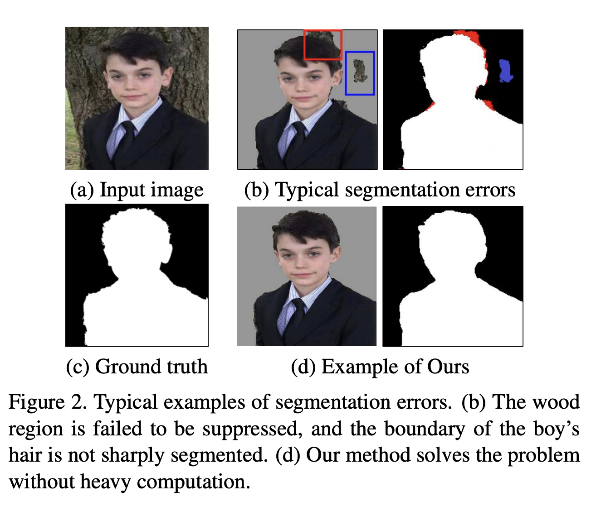
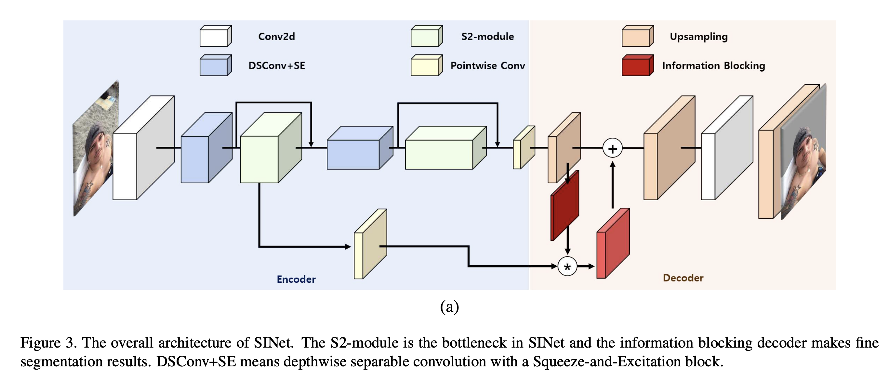
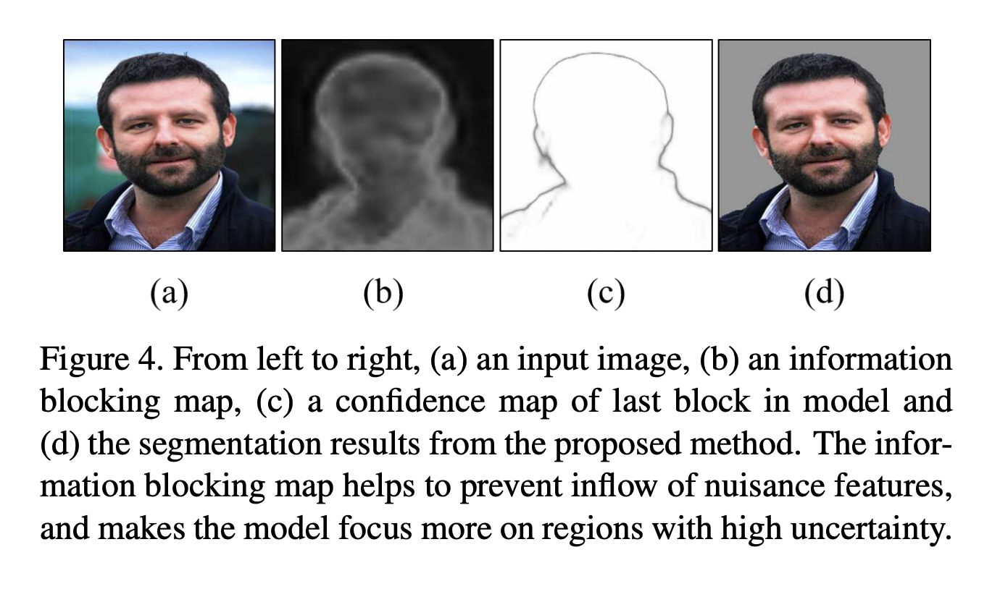
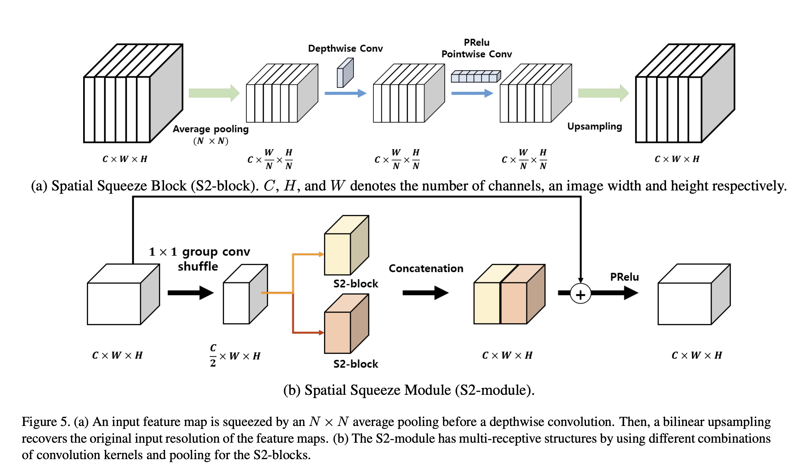
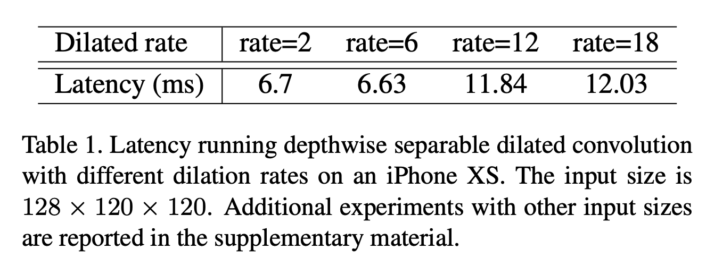
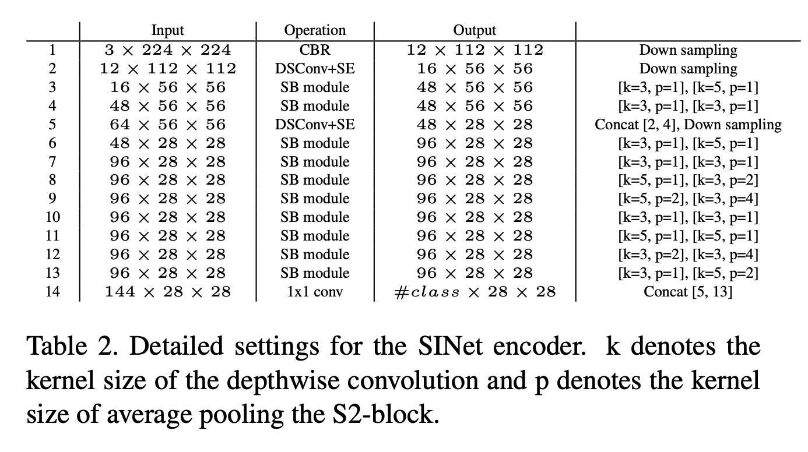
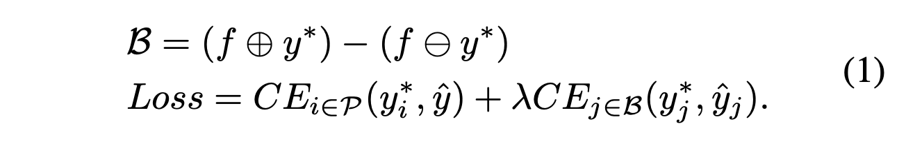

---
layout: post  
title: (SINet) Extreme Lightweight Portrait Segmentation Networks with Spatial Squeeze Modules and Information Blocking Decoder   
subtitle: AI Paper Review  
tags: [ai, ml, portrait, segmentation]  
comments: true
--- 

가볍고 강인한 portrait segmentation 알고리즘은 많은 얼굴 어플리케이션에서 중요한 task이다. 
하지만 object segmentation의 subset 정도로 중요하게 다루어 지지 않았다.
명백하게, portrait segmentation은 독특한 요구 사항이 있다. 
첫째로, portrait segmentation은 매우 가벼운 모델이여야 한다. 둘째로, 이 domain에 충분한 publie dataset이 없다. 
첫번째 문제를 해결하기 위해, information blocking decoder과 spatial squeeze module을 가진 매우 가벼운 SINet을 고안했다.
information blocking decoder는 global consistency를 회손 시키지 않으면서 confidence estimation을 통해서 local spatial information을 복고한다. 
Spatial squeeze module은 다양한 크기의 일관성에 대처할 수 있게 다양한 receptive field를 사용한다.
두번째 문제를 해결하기 위해 간단하게 portrait segmentation을 생성하는 방법을 고안했다. 
저자의 방법은 현재 존재하는 가벼운 모델 대비 더 좋은 성능을 내고 89.6k의 파라미터만을 가지고 있다. 
모바일 디바이스에서는 100.6FPS 속도를 낼 수 있다. 

```
Proceeding: 2020  
Authors: Hyojin Park, Lars Sjosund, Youngjoon Yoo, Nicolas Monet, Jihwan Bang, Nojun Kwak
```
[Code Link](https://github.com/HYOJINPARK/ExtPortraitSeg)  
[Paper Link](https://openaccess.thecvf.com/content_WACV_2020/papers/Park_SINet_Extreme_Lightweight_Portrait_Segmentation_Networks_with_Spatial_Squeeze_Module_WACV_2020_paper.pdf)  

## Introduction
segmentation task의 두가지 모순적인 문제가 있다.
1. long-range dependency와 global consistency를 처리 하는 것
2. local information의 디테일을 보존하는 것  
   
segmentation model이 global context information을 찾는데 실패하였기 때문에 나무 영역을 잘못 segment하였고, 나무와 머리색이 비슷하고 머리 카락의 영역이 작기 때문에 sharp 하게 segmentation 하지 못했다. 
이런 문제는 receptive field를 늘려 global information을 캡쳐하기 위한 기법인 stride length와 pooling으로 인해서 오히려 local information이 훼손되었기 때문이다. 
  
연구원들은 이런 문제를 해결하기 위해 몇가지 전략을 세웠다.
첫번째는 각 layer에 다양한 receptive field를 설계하는 것이다.
이런 multi-path 구조는 global과 local information 모두를 강화할 수 있지만  조각난 병렬 작업으로 인해 지연시간이 증가한다는 단점이 있다. 
비록 layer 층이 적더라도 고화질의 feature map 때문에 계산 비용이 무겁다.

이 논문에서는 새로운 lightweight SINet을 제안한다. 베이스라인 모델인 PortraitNet은 2.1M 파라미터를 가진 것에 비해 오직 86.9K 파라미터만을 가지고
정확도는 1% 이하로 떨어지지밖에 않았다. 

이 논문의 contribution은 다음과 같다. 
1. decoder의 information blocking scheme: low-resolution feature map에서 confidence를 측정하고, high-resolution feature map의 높은 confidence pixel의 영향을 막는다.
이로써 이미 확정적인 영역이 노이즈로 망쳐지는 것을 방지하고 모델이 불확실한 영역에 더 집중하도록 돕는다. 이는 translation에 강이하게 만들고 모델이 더 generalize하게 돕는다.
2. Spatial Squeeze module(S2-module): multi-path 구조가 효율적이게 한다. 많은 multi-path 구조는 다양한 receptive field를 관리하면서 다양한 크기의 장거리 속성을 처리한다. 
하지만 이는 커널 시작 및 동기화에 부적절한 구조로 실제 implementation에서 지연시간을 증가시킨다. 이 문제를 해결하기 위해 각 feature map에서 average pooling으로 spatial resolution을 줄이고 더 효과적으로 multi-receptive
field를 잘 수용하도록 한다.
3. 공개된 dataset은 매우 적고 크게 bias 되어 있다. 그레서 효과적인 data generation 방식을 통해 EG1800 데이터 셋을 풍부하게 augment 한다.

## Method
### Information Blocking Decoder
encoder-decoder 구조는 segmentation에서 가장 많이 활용되는 구조이다. 
encoder는 semantic feature를 추출해내고 decoder는 local information의 디테일을 다시 복구해낸다. 
디코더를 디자인하기 위해서 bilinear upsampling 또는 transposed convolution upsampling 블락을 사용하여 low-resolution feature map을 확장한다.
또한 최근에는 추가적인 안코더의 high-resolution feature map을 활용하여 더 정확한 segmentation result를 만들어 낸다.
대부분의 연구에서는 인코더의 high-resolution의 feature map을 concat하거나 element-wise summation 하면서 모든 정보를 활용한다.
하지만 high-resolution 정보를 사용하는 것은 이미 encoder에서 지워진 local information을 해칠 수 있다. 
그래서 저자는 불필요한 노이즈를 피하기 위해 꼭 필요한 clue만 사용한다.

새롭게 소개할 디코더의 구조는 information blocking 이다. 
low-resolution feature map의 confidence score를 측정하고 high-resolution으로부터 이미 확정적인 영역으로 부터 오는 information flow를 막는다.
information blocking 과정은 불필요한 정보를 지우고 high-resolution feature map이 오직 low confidence region에 집중하도록 한다.  
  

encoder의 마지막 feature map을 pointwise convolution을 통해서 class 수와 맞추고 bilinear upsampling을 ㅌ통해서 target segmentation과 같은 사이즈로 조정한다.
softmax 함수를 통해서 각 class에 대한 확률을 계산하고 confidence score c를 구한다. 
마지막으로 information blocking map을 (1-c)를 계산함으로써 구한다.
그리고 high-resolution feature map과 information blocking map을 pointwise하게 곱한다.
이로써 더 적은 confidence를 가지고 있는 영역의 정보를 더 많이 얻을 수 있고, 높은 confidence를 가지고 있는 영역은 원래의 값을 유지할 수 있다.   
  
위 그림에서 알 수 있듯이 edge 영역의 low confidence score를 가지게 되고 inner 영역이나 background는 이미 높은 confidence score를 가지게 된다.
그래서 더이상 inner는 local information이 필요 없다. 오히려 global consistency에 노이즈로 작용할 수 있다. 이를 block 함으로써 최종적으로 불확실한 영역은 줄어들고 inner part의 confidence score는 개선된다. 

### Spatial Squeeze Module
multi-path 구조는 더 적은 파라미터로 높은 정확도를 낼 수 있다는 장점이 있지만, 지연시간을 증가시킬 수 있다.
여기서 제안한 S2-module은 지연 시간을 증가시키는 문제를 해결할 수 있다. average pooling의 receptive field를 조정하여 이 latency를 줄일 수 있다.    
  
S2-module은 다양한 receptive field를 두개의 spatial squeeze block으로 커버하는 split-transform-merge scheme 라고 할 수 있다.
저자는 pointwise convolution을 이용해서 feature map의 사이즈를 절반으로 줄인다.
계산을 줄이기 위해서 group pointwise convolution과 channel shuffle을 사용하였다. 
줄어든 feature map은 각각의 s2-block을 통과하고 결과는 concat된다.
또한 input feature map과 merged feature map과 연결하는 residual connection을 도입하였다. 
마지막으로 PRelu를 통해 non-linearity를 utilize하였다.

S2-block에서 multi-receptive field를 포용하기 위한 dilated convolution 대신에 average pooling을 사용하였다.
그 이유는 첫번째로 지연 시간이 dilated rate에 영향을 받기 때문이다.  
  
두번째로는 multi-path 구조는 GPU 병렬 계산에 적합하지 않기 때문이다. 그래서 각 feature map을 squeeze 하여 사용한다. average pooling의 kernel size는 최대 4를 사용하였다. 
depthwise separable convolution은 kernel size를 3 또는 5를 사용하였다. 
DSConv와 pointwise convolution 사이는 PRelu activation을 사용하였다. 
pointwise convolution의 위치가 bilinear upsampling의 앞이나 뒤에 오는 것은 정확도에 큰 영향이 없어서 계산량을 줄이기 위해 pointwise conv를 upsampling 전에 두었다. 
Batch Norm은 depthwise conv와 bilinear upsampling의 뒤에 사용하였다. 

### Network Design for SINet
SINet은 S2-module을 bottleneck 처럼 사용하고 ds-conv를 feature map의 resolution을 줄이기 위해 stride 2를 주었다. 
실험적으로 이는 정확도를 증가시킴을 확인했지만 stride 1에 비해 지연시간을 증가시켰다. 
그래서 downsampling을 위해서 S2-module을 stride 2로 사용하는 대신 ds-conv를 Squeeze and Excite block와 사용하였다
첫번째 bottleneck을 위해 두개의 sequential S2-module을 사용하고 두번째 bottleneck으로는 8개를 사용하였다.   
  
각 bottleneck에는 residual connection을 더하고, input과 output을 concat 하였다. 
3x3 conv를 이용해서 classification에 사용하고 bilinear upsampling으로 입력 이미지 사이즈와 같게 만들었다. 

저자는 boundary part의 auxiliary loss가 정확도 향상에 도움이 된다는 것을 발견했다.
final loss는 아래와 같다.  
  
f는 모폴로지 dilation (+)와 erosion (-)을 위한 15x15 filter이다. 
P는 gt의 모든 픽셀을 의미하고 b는 모폴로지 연산으로 구한 boundary pixel을 의미한다.

### Data Generation
annotation data를 얻기 위해서는 많은 비용이 든다. 이를 해결하기 위해 다음과 같은 그럴듯한 상황을 고려했다
1. 사람이 직접 annotation 한다.
2. raw image만 있는 상황에서 pseudo gt를 만들기 위해서 face detector와 segmentation 모델을 사용한다.

2의 방법으로 선작업 후 사람은 각 pseudo gt에 대해서 quality 체크만 하는 방식을 사용하였다. 


