---
layout: post  
title: (PiiGAN) Generative Adversarial Networks for Pluralistic Image Inpainting     
subtitle: AI Paper Review        
tags: [ai, ml, inpainting, generative adversarial networks]  
comments: true
--- 

image의 missing area를 채우는 inpainting task는 최근 딥러닝으로 놀라운 결과를 이끌고 있다. 
하지만 이런 방법들은 다른 그럴듯한 결과를 무시하 하나의 optimal result를 생성하려고 시도한다.
저자는 inpainting의 불확실성을 고려하여 gt로 부터 style feature(latent vector)를 추출할 수 있는 새로운 style extractor를 가지고 있는 생성 모델을 제안한다.
추출된 style feature과 gt 모두 generator의 input으로 사용된다. gt를 근사하기 위해 consistency loss를 사용한다. 
반복 학습 후 generator는 multiple vector 집합과 style들을 맵핑할 수 있다. 제안된 모델은 image의 context 의미를 유지하면서 다양한 결과를 생성해낼 수 있다. 
또한 이 모델은 CelebA, PlantVillage, MauFlex 데이터셋에서 효과성을 입증했다. 다른 SOTA 모델들과 비교했을때 이 모델은 다양하고 좋은 결과를 생성해낼 수 있다.   

```
Proceeding: 2020
Authors: WEIWEI CAI, ZHANGUO WEI  
```

[Paper Link](https://ieeexplore.ieee.org/stamp/stamp.jsp?tp=&arnumber=9027849)  
[Code Link](https://github.com/vivitsai/PiiGAN)  

## Introduction
image inpainting은 이미지의 missing area를 이미지 자체만을 가지고 주어진 정보에 맞게 채워야하며 그럴듯한 이미지를 생성해내야 한다. 
하지만 missing area가 매우 크고 결과에 대한 불확실성은 매우 크다. 
예를들어 얼굴 이미지에 대해 inpainting을 수행할 때, 눈은 다양한 방향을 볼 수 있고, 안경을 쓸 수 도 있다. 비록 하나의 결과를 생성하는게 합리적으로 보일 수 있지만, 그 결과가 우리의 기대에 상응할지 판단하는 것은 어렵다. 
그래서 우리는 inpainting의 결과가 다양한 그럴듯한 이미지를 생성해내길 바란다. 이를 우리는 pluralistic image inpainting이라 부른다.  
  

앞선 연구에서는 undamaged area에서 비슷한 pixel block을 찾아 채우는 고전적인 texture synthesis 방법을 사용해왔다. 
하지만 만약 undamaged area에서 찾을 수 없는 역역을 채워야 한다면(예를들어 얼굴 같은) 이 방법은 동작하지 못한다. 
최근 GAN 모델이 활발히 연구되왔지만, Convolution network의 receptive field가 서로 떨어진 영역의 정보를 커버하기에는 너무 작기 때문에 boundary shadow, distorted result, blurred texture, 주변과 inconsistent 등의 문제가 생겼다.
최근에는 surrounding image feature를 참조하기 위해 spatial attention을 사용하고 있다. 
이런 방법들은 생성된 content와 context 정보간의 의미적 일관성을 유지할 수 있게 해준다. 
하지만 이런 방법은 unique한 optimal result 만을 기대하기 때문에 다양한 그럴듯한 결과를 생성하는데 한계가 있다. 

다양한 결과를 얻기 위해서 많은 방법들은 CAVE를 베이스로 하고 있지만, 특정 field에 제한되어 있고 targeted attributed가 필요하고 비합리적인 결과를 생성할 수 있다. 
더 좋은 다양한 결과를 얻기 위해서 저자는 GAN에 새로운 extractor를 추가하였다. 
이는 training set의 gt 이미지와 generator로 부터 생성한 fake 이미지로부터 style feature를 추출한다. 
CVAE-GAN의 encoder는 gt 이미지로부터 생성한 feature를 generator의 입력으로 직접 가져온다. 
label 자체가 마승킹된 이미지인 경우, 각 이미지와 일치하는 label 수는 일반적으로 하나이다. 따라서 생성된 결과는 매우 제한적일 수밖에 없다.

저자는 새로운 deep generative model 기반의 방식을 제안한다. 
각 iterative training round에서, extractor는 gt 이미지로부터 style feature를 추출하고 generator의 input에 함께 통과시킨다. 
그리고 consistency loss L1을 생성된 이미지가 gt와 가깝도록 만들어 주는데 사용한다. 
또한 무작위 벡터와 마스킹된 이미지를 생성하여 generator에 입력하여 가짜 이미지를 출력하고 consistency loss를 사용하여 추출된 스타일의 특징을 입력벡터에 최대한 가깝게 만든다. 
몇번의 iteration이 지나면 generator는 다양한 input vetor들에 상응하는 style vector과 맵핑하는 것을 배울 수 있다. 
또한 KL loss를 최소화 하면서 extractor에서 생성한 potential vector의 prior distribution과 posterior distribution 간의 차이를 줄인다. 

이 논문의 main contribution은 아래와 같다. 
* PiiGAN: 다양한 사실적인 이미지를 생성할 수 있는 generative adversarial network
* GAN을 개선시키는 새로운 extractor 디자인: 입력 이미지의 의미와 매칭하면서 다양한 스타일을 학습

## Proposed Approach
### Extractor
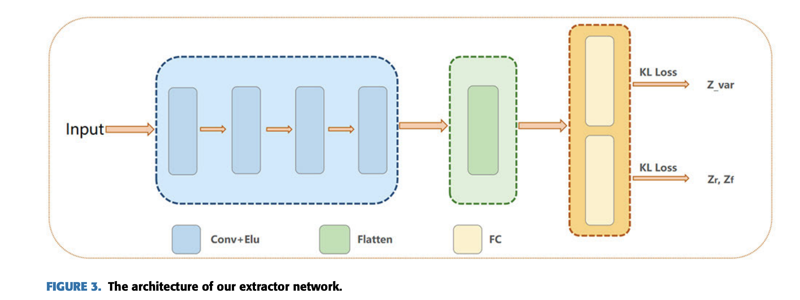  
extractor는 4개의 convolution layer와 하나의 flattened layer와 두개의 parallel fully connected layer로 구성되어 있다. 
각 conv layer는 Elus activation을 사용한다. 
모든 conv layer는 2x2 stride와 5x5의 커널을 사용하여 이미지의 해상도를 줄이고, 필터수를 늘려간다. 
* I_gt: gt image
* E: extractor
* Z_r: style feature from I_gt
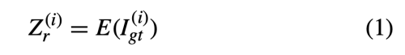  

* I_cf: fake image generated by the generator
* Z_f: latent vector extracted from I_cf
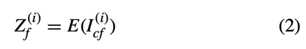  

VAE와 비슷하게 KL loss를 사용하여 prior p(z)와 Gaussian Distribution q(z|I)의 차이를 줄인다. 
latent vector Z의 p(z)는 isotropic multivariate Gaussian N(z;0, I)를 따른다. 
정리하면 아래와 같다.  
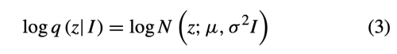  
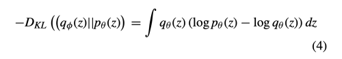  
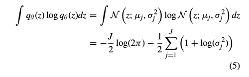  
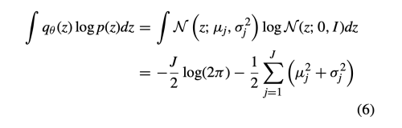  
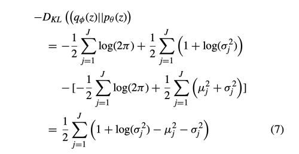  

### Pluralistic Image Inpainting Network: PiiGAN
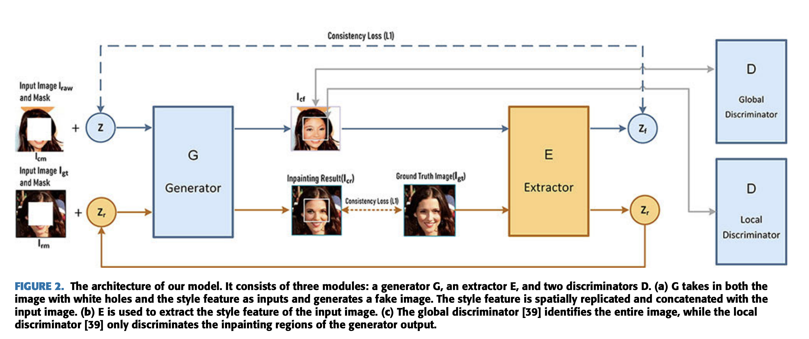  
저자는 generator 뒤에 새로운 네트워크인 extractor를 더하였다. 
image를 missing region인 white pixel과 concat하고 random vector를 생성하여 generator에 입력하고 fake image를 출력한다. (I_cf)
이를 extractor에 입력하여 style feature를 출력한다. 
또한 이와 동시에 training sample의 gt 이미지 중 랜덤하게 샘플하여 extractor에서 style feature를 출력한다. 
그리고 이 gt 이미지에 mask를 씌워 generator에 입력하여 I_cr을 얻는다. 
우리는 I_cr과 gt가 최대한 비슷하길 원한다. 
L1 loss를 사용하여 target과 estimaged value의 차이가 최소화 되게끔 한다. l2 대신 l1을 사용하는 이유는 더 강건하게 생성해낼 수 있기 때문이다.

#### Consistency Loss
generator 다음의 feature map과 extractor 사이의 일관성을 유지해야하고 perceptual loss는 직접적으로 conv layer 들을 optimize 하기 어렵기 때문에 저자는 perceptual loss를 변형하고 consistency loss를 제안했다. 
instance 별 loss는 아래와 같다. 
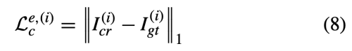  
* I_cr = G(Z_r, F_m)
* Z_r = E(I_gt)
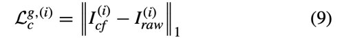  
* I_cf = G(Z_f, F_m)
* I_raw = fake image completed by the generator

#### Adversarial Loss
Wasserstein GAN을 improve 하기 위해 gradient penalty를 추가한 loss는 아래와 같다.  
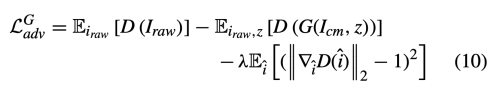  
lambda는 10을 사용하였다. 
inpainting에서는 오로지 missing region 만을 채우는 것이므로 local discriminator를 사용한다.  
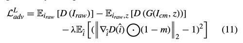  
* m: mask, missing region=1, others=1

#### Distributive Regularization
fixed potential prior p(z_r)에 sampling function q(z|I_gt)를 고정하기 위해 아래와 같은 KL loss를 사용한다.  
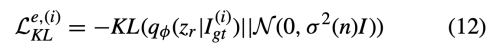  
또한 q(z|I_cf)에 대한 KL loss는 아래와 같다. 
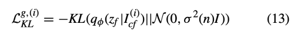  

#### Objective
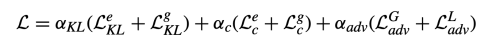  

#### Training
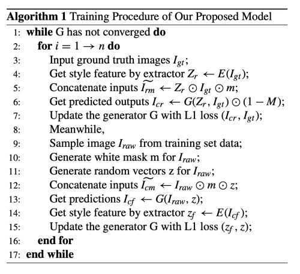  