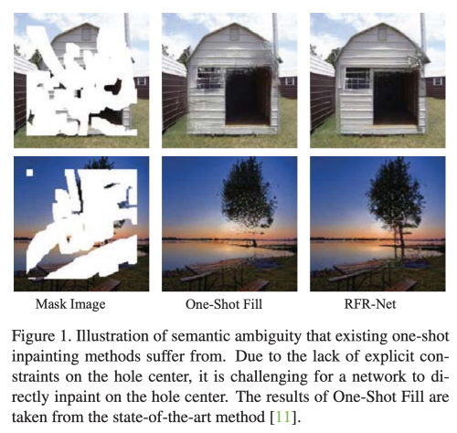
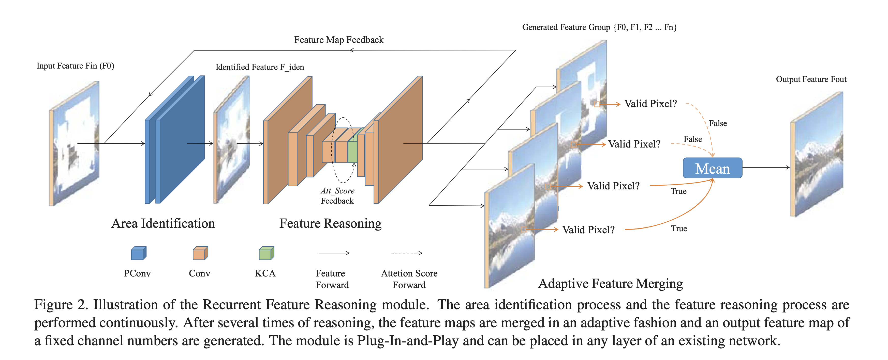
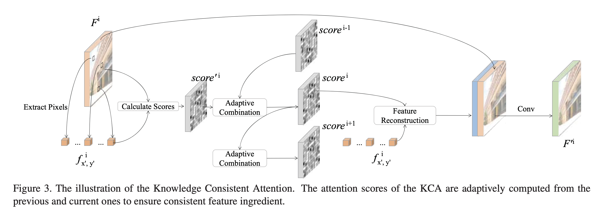
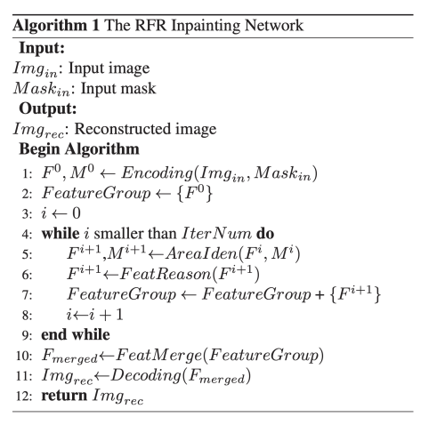

---
layout: post  
title: (Paper Review) GAN    
subtitle: Recurrent Feature Reasoning for Image Inpainting       
tags: [ai, ml, inpainting, generative adversarial networks]  
comments: true
---  

현존하는 inpainting method는 규칙적이거나 작은 결점에는 좋은 성능을 내고 있습니다. 하지만 큰 연속적인 구멍을 채우는 일은 가운데 부분에 대한 규약이 부족하기 때문에 매우 어렵습니다.
이 논문에서 Recurrent Feature Reasoning module과 Konwldege Consistent Attention(KCA) module로 구성된 Recurrent Feature Reasoning(RFR) network를 제안한다. 
사람이 퍼즐을 푸는 것과 비슷하게 (쉬운 곳부터 풀고 나서 추가적인 정보로 어려운 부분을 풀어가는 것), RFR 모듈은 반복적으로 feature map의 boundary를 infer하고 
이를 그 다음 힌트로 사용하여 풀어 나간다.
모듈은 점진적으로 구멍의 가운데를 제약해 나갈 수 있다. 
거리가 떨어진 정보를 포착하기 위해, KCA를 사용하였다. 
RFR을 현존하는 SOTA 모델에 붙여서 성능이 더 높아짐을 확인할 수 있었다.

```
Proceeding: 2020  
Authors: Jingyuan Li, Ning Wang, Lefei Zhang, Bo Du, Dacheng Tao  
```

[Paper Link](https://openaccess.thecvf.com/content_CVPR_2020/papers/Li_Recurrent_Feature_Reasoning_for_Image_Inpainting_CVPR_2020_paper.pdf)  
[Source Code Link](https://github.com/jingyuanli001/RFR-Inpainting)   


## Introduction
대부분의 SOTA 방법은 encoder-decoder 구조로 한방에 encoding 된 image를 재건한다.
이런 방법은 픽셀간의 관련성이 높아서 주변의 정보를 가지고 오기 쉬운 작고 좁은 결점을 가진 이미지에는 효과적이다.
하지만 결점이 큰 이미지와 떨어진 결점에 대해서는 픽셀간 관련성이 떨어지기 때문에 어렵다는 단점이 있다.
이런 상황에서 알려진 픽셀의 정보는 구멍의 가운데에는 유용한 정보를 제공하지 못하기 때문에 의미적으로 모호한 결과를 만들어 낸다.   
  
이를 위해 또다른 방법은 구멍 경계에서 중앙까지 점진적으로 페인팅을 하는 것이다. 하지만 이런 방법은 recurrent 디자인을 사용하지 않고 중복 모델을 렌더링 한다.
그래서 이런 방법은 계산 비용이 높아서 실생활에 사용하기 어렵다.
또한 이런 방법은 sub-network들이 있는 multi-stage 방법에는 적합하지 않고 input과 output이 같은 RGB space에 있는 one-stage에만 이용이 가능하다. 
결국 각 반복마다 feature map에서 rgb feature map으로 mapping 해야해서 결과의 distortion이 생기고 성능의 저하가 일어나게 된다.  

이 논문에서는 Recurrent Feature Reasoning Network(RFR-Net)이라 불리는 새로운 구조를 제안한다.
특히 반복적으로 infer 할 수 있고 구멍의 경계를 모으 plug-and-play 할 수 있는 모듈을 제안는한다.
이 방법으로 internal content는 점진적으로 강화되고 모델은 의미적으로 명백한 결과를 출력할 수 있다. 
다른 progressive한 방법들과 달리 RFR 모듈은 이 점진적 방법을 feature map space에서 수행할 수 있다. 
recurrent 디자인은 파라미터를 재사용하기 때문에 훨씬 가벼운 모델을 만들 수 있게 한다.
또한 계산 비용은 이 모듈을 위나 아래로 옮기면서 유동적으로 조정할 수 있다.
이는 고화질 이미지 inpainting에서 처음과 마지막 레이어의 계산 부담을 피하기 위해 필수적인 요소이다. 

RFR에서 더 높은 성능을 내기위해 attention 모듈은 필수적이다.
하지만 현존하는 attention 디자인은 RFR에서 서로 다른 recurrent에 있는 feature map간에 일관성을 고려하기 어려워 Suboptimal이다.
이로 인해 흐린 질감의 이미지를 생성할 수 있다.
이 문제를 극복하기 위해 Knowledge Consistent Attention(KCA) 매커니즘을 도입했다.
이는 recurrence 간에 attention score를 공유하고 patch-swap 과정을 가이드하기 위해 합쳐진다.
KCA의 도움을 받아 일관성을 강화되고 모델의 성능은 향상된다.
 
## Method
### Recurrent Feature Reasoning Module
RFR 모듈은 현존하는 네트워크의 어느 위치에나 붙이고 뗄수있는 반복적인 inference 디자인이다.
RFR은 다음과 같이 3 part로 구성되어있다.
1. Area Identification Module: 현재의 recurrence에서 추론할 area를 인
2. Feature Reasoning Module: 식인식 area를 추론
3. Feature Merging Operator: feature map들을 합침  
이 모듈 내에서 (1)과 (2)는 번갈아 반복적으로 작동한다. 
구멍이 매워지고 나서 모든 추론단계에서 생선된 모든 feature map은 고정된 채널 수의 feature map을 생성하기 위해 합쳐진다.  

  

#### Area Identification
area를 인식하는데 partial convolution이 기본 모듈로 사용된다.
partial conv는 mask를 업데이트하고 feature map을 conv 후에 renormalization 한다.   
  
  
m(x, y)는 x, y를 center로 가지는 mask patch를 가리킨다. 
이런 연산을 수행한 후 새로운 마스크의 hole은 점차 작아진다.
feature reasoning module로 보내기 전에 feature map은 normalization과 activation function을 거친다. 
input mask와 updated mask의 차이가 예측에 사용된다.
그리고 updated mask의 hole는 다음 recurrence에서 mask가 shrunk되기 전까지 유지된다. 

#### Feature Reasoning
이 모듈의 역할은 identified are를 높은 질의 값으로 매꾸는데 있다.
높은 질의 값은 더 좋은 결과 뿐만 아니라 다음의 추론에도 이점이 있어야 한다.
결과적으로 reature reasoning 모듈은 추론의 능력을 최대화 하기위해 복잡하게 디자인 되어야ㅏ 한다. 
하지만 저자는 몇개의 encoding과 decoding layer를 쌓고 skip connection을 연결함으로써 간단하게 디자인하였다.
feature value가 추론되고 나서 feature map은 다음 recurrence에 보내진다.
RFR 모듈은 증간 결과를 제약하지 않기 때문에 updated mask과 partially 추론된 feature map은 다른 processing을 거치지 않고 다음 과정으로 넘겨진다.

#### Feature Merging
만약 우리가 생성된 feature map을 바로 사용한다면, gradient vanishing 문제가 생길수 있고 이른 iteration에서 생긴 signal이 손상될 수 있다.
이 문제를 해결하기 위해 intermediate feature map을 합치는 과정이 필요하다.
하지만 conv를 사용하는 것은 channel을 concat 하는데 channel 수가 고정되기 때문에 recurrence의 수가 제한된다.
직접적으로 모든 feature map을 합치는 것은 각 map간의 불일치성과 현저한 신호가 흐려지기 때문에 이미지의 디테일을 지운다.
결론적으로 저자는 adaptive merging signal을 통해서 이 문제를 해결한다.  
  

### Knowledge Consistent Attention
inpainting 문제에서 attention 모듈은 더 좋은 성능을 내기 위해 많이 사용한다.
이는 배경에서 가능한 texture를 찾아내고 구멍을 이로 매꾸는데 사용한다.
하지만 각 recurrence에서 이 patch swapping 과정이 독립적으로 사용되는 걸 그대로 사용하면 sub optimal이다.
합성된 feature map간의 불일치는 merge될 때 손상을 입힐 수 있다. 
이 문제를 해결하기 위해 새로운 attention 모듈인 KCA를 제안한다.
KCA에서 score는 이전 반복에서 비례적으로 누적된 점수로 구성된다. 이로써 attention feature map 간의 불일치 성은 조정될 수 있다. 
  
hole feature location (x, y)와 (x', y') 간의 cosine similarity를 구한다.  
  
그다음 target pixel과 인접한 영역간의 유사성 평균으로 smoothing된 attention score를 구한다.  
  
픽셀의 최종 attention score를 계산하기 위해 먼저 이전에 반복된 픽셀의 점수를 참조할지 여부를 결정한다.
유효한 것으로 간주된 픽셀이 주어지면 현재 반복의 attention score는 현재부터 이전의 반복으로부터 계산한 원래 점수와 최종 점수의 가중 합으로 계산한다.
  
만약 최근 recurrence가 valid 하지 않는 다면 그냥 아해와 같이 계산한다. 
  
마지막으로 attention score는 feature map을 재건하는데 사용한다.  
  
feature map이 재건되고 나면 input feature과 재건 feature map을 concat하고 pixel wise convolution을 수행한다. 

### Model Architecture & Loss Functions
RFR 모듈 전에 2와 4개의 convolution layer를 쌓는다.
interNum=6로 설정하고 KCA 모듈은 RFR 모듈의 reasoning 모듈의 3번째에 추가한다.
  

image generation을 위해서 perceptual loss와 style loss를 pre-trained 고정된 vgg-16에 사용한다.
perceptual loss와 style loss는 gt와 생성된 이미지간의 차이를 계산한다.
이런 함수는 효율적으로 모델에게 image의 구조적 질감적 정보를 가르친다.
  
  
valid와 hole loss는 unmasked area와 masked area간의 차이를 L1으로 계산한 loss 이다.
  


