---
layout: post  
title: (Paper Review) Survey    
subtitle: A Survey on Visual Transformer       
tags: [ai, ml, computer vision, transformer, self-attention]  
comments: true
---  

Transformer는 self-attention 매커니즘에 기반하여 natural language processing에 먼저 사용되기 시작하였다.
큰 가능성을 보고 연구원들은 computer vision task에 이를 적용할 방법을 모색하였다.
transformer-based 모델은 다양한 visual 벤치마크에서 convolutional, recurrent network보다 비슷하거나 더 나은 성능을 보였다.
높은 성능과 인간의 유도된 편향이 필요하지 않아 computer vision에서 transformer는 점점 더 많은 관심을 받기 시작했다.

이 논문에서 서로 다른 task 별로 visual transformer을 분류하고 장단점을 분석하였다.
주요 카테고리는 backbone, high/mid-level vision, low-level vision, video processing을 포함한다.
또한 transformer의 base component로 사용되는 computer vision에서의 self-attention에 대해 간략히 살펴본다.
나아가 실제 디바이스 어플리케이션에서 사용될 수 있는 효율적인 transformer를 살펴보고 앞으로의 challenge에 대해 살펴보기로 한다. 

```
Proceeding: 2021  
Authors: Kai Han, Yunhe Wang, Hanting Chen, Xinghao Chen, Jianyuan Guo, Zhenhua Liu, Yehui Tang, An Xiao, Chunjing Xu, Yixing Xu, Zhaohui Yang, Yiman Zhang, Dacheng Tao
```

[Paper Link](https://arxiv.org/pdf/2012.12556.pdf)  

## 1. Introduction
서로 다른 타입의 task에는 다른 타입의 network를 사용해왔다.
예를들어 MLP나 FC는 고전적인 네트워크 구조이고, CNN은 이미지를 위한 네트워크 구조이고, RNN은 sequential하거나 time series data를 위한 네트워크 구조이다.
Transformer는 새로운 타입의 네트워크이다.
self-attention 메커니즘을 활용하여 본질적인 특징을 추출하고 AI application에 큰 활용도를 보이고 있다.

Transformer는 먼저 natural language processing (NLP)에 사용되어 큰 진보를 보여줬다.
그 중에서도 BERT는 SOTA를 보여준 모델이다.

NLP에서 transformer 구조가 큰 성공을 이룬것에 영감을 받아 최근에는 computer vision 영역에 이를 적용하려는 많은 시도가 이루어지고 있다.
CNN은 기본적인 요소로 고려되어 왔지만 transformer가 새로운 대체 방안으로 떠오르고 있다.

이 논문에서는 아래와 같이 분류하여 transformer 모델에 대해 overview 한다.  

  
Transformer의 주요 발전 마일스톤은 아래와 같다.  
  

## 2. Formulation of Transformer
  
Transformer는 같은 구조를 가진 몇개의 encoder/decoder 모듈로 이루어져 있다.
Encoder는 self-attention layer와 feed-forward (각 위치의 단어마다 독립적으로 적용) NN으로 이루어져있고 decoder는 추가로 Encoder-Decoder Attention으로 이루어져있다.
Transformer에 사용하기 전 sentence의 각 word를 512 dimension의 embedding vector로 변환한다. 

### 2.1 Self-Attention Layer
  
input vector는 세 개의 서로 다른 vector로 변환한다.
```
* q: query vector (1xd) = input(1x512)*W_q(512xd)
* k: key vector (1xd) = input(1x512)*W_k(512xd)
* v: value vector (1xd) = input(1x512)*W_v(512xd)
```
inputs(n개의 단어로 이루어진 문장)으로 부터 만든 q, k, v를 Q, K, V로 pack 한다. (nxd)  
Key와 Query로 단어 간의 attention score를 계산한다. (nxn) 
Attention Score와 Value를 곱해서 최종 결과를 얻는다. (nxd)  
  

Decoder module에 있는 encoder-decoder attention layer는 encoder module에 있는 self-attention layer와 유사하다.
단 key matrix K와 value matrix V는 encoder 모듈로부터 온다.
그리고 query matrix Q는 Decoder의 이전 layer로부터 구한다.

앞의 과정은 각 단어의 위치와는 무관하다. 즉, self-attention layer은 문장에서 단어의 위치 정보를 캡쳐하는 기능이 부족하다.
그래서 이 문제를 해결하고 최종 입력 벡터를 얻기 위해, d 차원의 positional embedding이 original input embedding에 더해진다.  

그런데 이 positional encoding은 아래와 같은 조건을 충족해야 한다.     
```
* 문장에서 단어의 위치마다 하나의 유일한 encoding 값을 출력해 내야 한다. 
* 서로 다른 길이의 문장에 있어서 두 time-step 간의 거리는 일정해야 한다. (d=1, d=2, d=3, ...)
* 모델의 일반화가 가능해야 한다. 더 긴 길이의 문장이 나왔을 떄 동일하게 적용할 수 있으려면 이 값들이 특정 범위 내에 있어야 한다. (0-1)
```

위의 조건을 충족하는 positional encoding 방법은 아래와 같다.  
  
* *pos* : 문장에서 단어의 위치 (row)
* i: 임베딩 벡터 내의 차원의 인덱스 (col)

```
inputs(nx512) = inputs(nx512) + positional_encoding(nx512) 
```
positional encoding을 사용하면 순서 정보가 보존되어 같은 단어라고 하더라도 문장 내의 위치에 따라서 트랜스포머의 입력으로 들어가는 임베딩 벡터의 값이 달라진다.

### 2.2 Multi-Head Attention
self-attention layer의 성능을 극대화 할 수 있는 방법이다.
주어진 참조 단어에 대해서 우리는 몇 가지의 다른 단어들을 함 집중하기를 바란다. 
하지만 single-head self attention layer는 하나 이상의 단어들에 대해서 equality하게 집중하는데 한계가 있다.

이는 attention layer에 다른 representation subspace를 제공함으로써 해결할 수 있다.
서로 다른 query, key, value matrices가 서로 다른 head에 사용된다.
이 matrices는 input vector을 서로 다른 representation subspace에 투영한다.

먼저 input vector를 query group, key group, value group 으로 변환한다.
각 group은 header 수 __h__ 개의 vector를 가지고 있고, 각 dimension은 __d/h__ 이다.

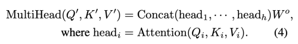  
MultiHead: ((n x (d/h)) x h) * (dxd)  = (n x d)   

### 2.3 Other Key Concepts in Transformer

#### Residual Connection in the Encoder and Decoder
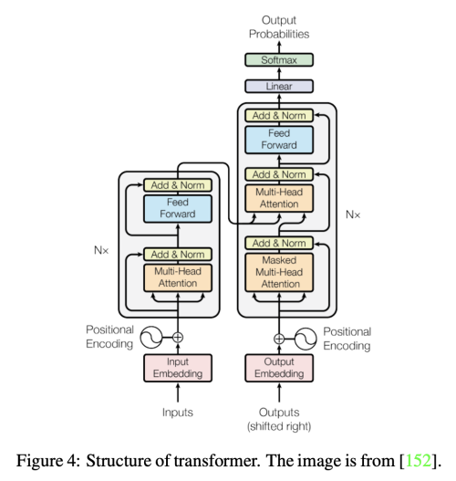  

encoder과 decoder의 sub-layer 사이사이에 residual connection이 추가된다.
이는 더 높은 성능을 내기 위해서 정보의 흐름을 강화시키는 역할을 한다.
layer-normalization은 residual connection 뒤에 위치한다.

```
LayerNorm(X + Attention(X))
```
BatchNorm이 채널 별로 정규화하는 반해 LayerNorm은 데이터별로 정규화를 수행한다.
그래서 BN은 시퀀스의 길이를 변경할 수 없지만, LN은 시퀀스의 길이를 자유롭게 변경할 수 있다.
그래서 Recurrent Network 구조에서는 LN을 사용한다.

#### Feed-Forward Network
self-attention layer 다음에 위치한다. 
구조는 다음과 같다.  
  
W_1, W_2는 linear transformation layers를 뜻하고, σ는 nonlinear activation function을 의미한다.

#### Final Layer in the Decoder
softmax layer을 통해서 다시 word로 출력한다.

#### Others
CNN이 Local한 특징만을 캡쳐하는데 비해, Transformer는 멀리 떨어진 특징을 캡쳐할 수 있고, 
RNN이 sequential하게 계산해야하는데 반해, Transformer는 parallel 하게 계산할 수 있어 쉽게 가속할 수 있다..

## 3. Revisiting Transformers for NLP
Transformer가 개발되기 이전에,RNN(GRU, LSTM)은 attention과 함께 쓰여 SOTA model로 인식되어져 왔다.
하지만 RNN은 이전 hidden state 부터 다음 step 까지 정보를 sequential하게 계산해야한다.
이는 학습 중 가속과 병렬처리를 할 수 없게 만들고, 긴 sequence를 계산하기 어렵게 만들거나 더 큰 모델을 요구한다.

2017년 글로벌 의존성을 획득하고 seq-to-seq natural language task를 해결하기 위한 목적으로 multi-head self-attention과 feed-forward network로 이루어진 Transformer가 
개발되었다. 이로써 Attention 매커니즘 자체가 attentive RNN에 비해 큰 성능을 낼 수 있음을 증명하였다.
나아가 Transformer 구조는 병렬 컴퓨팅으로 더 큰 데이터셋을 학습할 수 있게 만들었다.
이는 대규모 pre-trained models(PTMs)의 급증을 불러 일으켰다.

BERT와 그의 변형 모델들(SpanBERT, RoBERT)은 multi-layer transformer Encoder 구조의 pre-trained model들의 시리즈이다.
BERT는 BookCorpus와 English Wikipedia dataset으로 아래와 같은 task를 수행한다. 

- NLP task에서는 pre-trained된 language model을 사용하는 것이 매우 효율적이다.
- 특정 task에 대한 parameter를 최소화하기 위해 범용적인 pre-trained model을 학습하고 특정 task에 대해서 fine-tuning을 진행한다.

- Contribution
    * 대용량의 unlabeled data로 pre-training하고 특정 task에 대해서 transfer learning
    * Masked Language Model(MLM)을 활용하여 전후 정보를 모두 활용하여 pre-training하는 bidirectioanl 학습
    * Next Sentence Prediction(NSP) 학습 방법을 통해 문장 간의 연관성을 pre-training

- BERT는 Transformer의 구조 중 인코더만을 사용하고 bidirectional learning을 하는 모델이다.
- Input Representation  
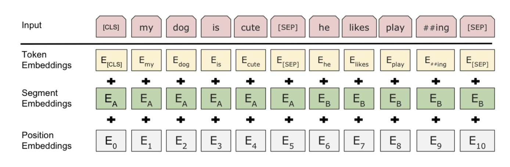 
[(그림 출처)](https://towardsdatascience.com/bert-explained-state-of-the-art-language-model-for-nlp-f8b21a9b6270) 
- Pre-Training
    * 모든 레이어에서 bidirectional한 방식으로 학습
    * unlabeled data 사용 
    * MLM(Masked Language Model): input 토큰의 일부분을 랜덤하게 마스킹하고 토큰의 마지막 softmax에서 어떤 단어인지 예측하는 방식  
        * 마스크는 랜덤하게 만들어지며 비율은 15% 정도 이다. (전체 문장이 아닌 마스킹된 단어만 예측하는 token-level)
        * 마스킹된 토큰의 80%는 [MASK] 토큰으로 변환하고 , 10%는 랜덤한 단어로, 10%는 기존 단어를 사용한다. 
            - transformer encoder 입장에서는 어떤 단어가 마스킹 되어 prediction 해야하는 지, random word로 바뀌었는지 모르기 때문에 
            모든 token에 대해서 분포적 contextual representation을 유지하도록 강제한다.  
        * 이를 통해서 문맥의 정보를 활용할 수 있는 모델로 학습된다.  
        * pre-training 에만 사용하고 fine-tuning에는 사용하지 않는다.  
        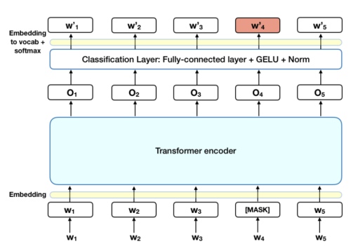 
        [(그림 출처)](https://towardsdatascience.com/bert-explained-state-of-the-art-language-model-for-nlp-f8b21a9b6270)  
    * Next Sentence Prediction
        * 두 문장이 연결되어 있던 문장인지 예측하는 방식 
        * 문장 간의 관계를 파악할 수 있는 모델로 학습 
        * 50%는 연결된 문장, 50%는 랜덤하게 뽑힌 문장으로 pair 쌍을 만들어 binary classification 수행
            * sentence_1_1+sentence_1_2: [isNext]
            * sentence_1_1+sentence_2_2: [noNext] 

Generative Pre-trained Transformer model(GPT, GPT-2)은 Transformer의 decoder 구조를 기반으로한 PTMs의 다른 타입 형태이다.
이는 masked self-attention 매커니즘을 사용한다. 
GPT와 BERT의 가장 큰 차이는 pre-training 방법에 있다.
* BERT와 달리 GPT 모델은 unidirectional language model로 left-to-right(LTR) language modeling을 사용하여 pre-training을 진행한다.
* BERT는 sentence seperator([SEP])와 classifier token ([CLS]) embedding을 pre-training에 사용하는 반에, GPT에서는 fine-tuning에서만 사용한다.

Unidirectional pre-training stage 덕분에 GPT는 자연어 생성 task에서 뛰어난 성능을 보였다.
더욱이 최근에는 massive transformer-based model인 GPT-3가 개발되었다. 이는 45TB의 압축된 plaintext dataset으로 pre-training 하여 
fine-tuning 없이 직접적으로 자연어 처리 downstream task에 바로 사용될 수 있다. 

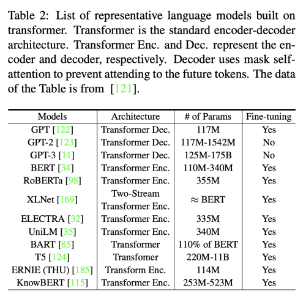  

## 4. Visual Transformer

### 4.1 Backbone for Image Classification

Transformer는 image classification의 backbone으로 활용할 수 있다.
[Wu et al.](https://arxiv.org/pdf/2006.03677v4.pdf) 은 ResNet을 베이스 라인으로 사용하고 마지막 stage의 Conv를 transformer로 교체하였다.
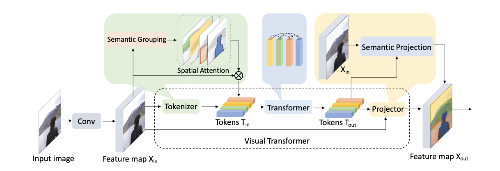    
(1) Conv layer network는 밀집된 분포와 low-level 패턴을 학습  
(2) Transformer network는 떨어진 분포와 고차원의 의미 개념을 학습  
(3) Output Token을 그대로 image-level prediction(classification)에 사용하거나, projector을 이용해서 pixel-level prediction(semantic segmentation)에 사용    

Transformer로 보내기 전에, Tokenizer를 사용하여 pixel을 Semantic하게 그룹지어 적은 수의 visual token으로 만든다. 각 visual token은 image의 semantic concept을 표현한다.

* Tokenizer
    * input feature map (X) : HxWxC
    * visual token (T): LxC (L: number of tokens << HW)
    * Filter-based Tokenizer
      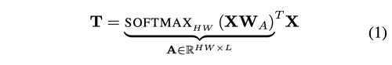  
        * W_A : CxL (X를 semantic group으로 변환하는 convolution filter)  
        * A^T X : L개의 visual token을 만드는 X 픽셀에 대한 weighted average
        * 하지만 고차원의 semantic concept은 sparse하고 각각은 오직 이미지에 적게 나타난다.
        그래서 고정된 Weight으로 고차원 컨셉을 한번에 학습하는 것은 매우 비효율적이다.  
        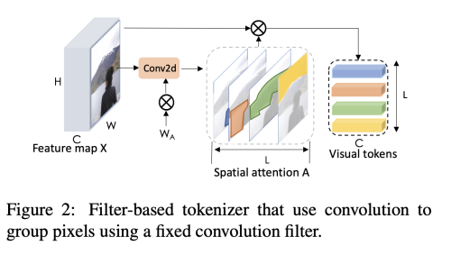  
    * Recurrent Tokenizer
        * filter-based tokenizer의 단점을 보완하기 위한 방법
        * 이전 layer의 visual token이 현재 layer의 새로운 token 생성을 가이드 해주는 역할을 해주며 점진적으로 정제된 visual token set을 얻게 해준다.  
        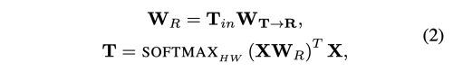  
        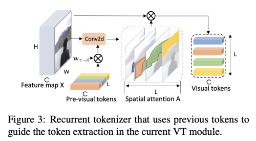  
* Projector
    * Visual Token은 pixel-level 디테일을 잃은 후 이기 때문에 feature map을 이용해서 정제하는 작업이 필요하다.
    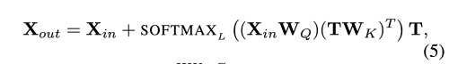  
        * X_in, X_out : HW x C (input, output feature map)
        * W_q, W_k : C x C (feature map의 Query weight, Token의 Key weight)
        * 위의 key-query product는 인코딩된 visual token을 원래의 feature map에 어떻게 다시 투영시킬지를 결정 
        

#### iGPT
image를 위한 generative pre-training 방법은 오래전부터 존재해왔다.
[Chen et al.](http://proceedings.mlr.press/v119/chen20s/chen20s.pdf) 은 이를 self-supervised 방법과 결합하여 다시 실험하였다.
* GPT-2 구조를 이용한다. 
* text data처럼 이미지 픽셀을 1D로 만들어 Sequence Transformer을 학습하고 
다음 픽셀을 예측하거나(auto-regressive), 마스킹된 픽셀 부분의 값을 찾도록 (BERT) 하는 구조이다.
* 이런 generative pre-training은 low-resolution 데이터에 좋은 성능을 보인다.
* 이미지의 2D spatial structure을 인코딩 하지 않음에도 불구하고 CNN 모델들과 성능이 거의 유사하거나 오히려 뛰어난 실험도 존재한다.

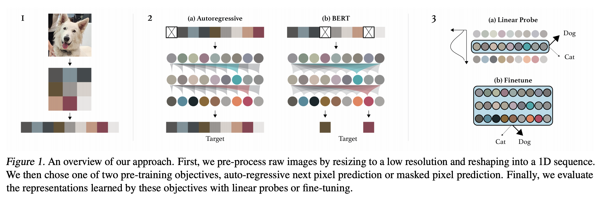  
1. 먼저 raw image를 low-resolution으로 resize 후 1D sequence로 Reshape
2. 두 Objective 중 선택하여 Pre-training
    (a) Auto-regressive: 이전 픽셀들을 이용하여 다음 픽셀을 예측  
    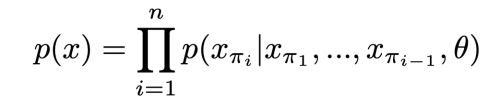  
      
        * attention logit nxn matrix에 표준 upper triangular mask를 사용  
    (b) BERT: 픽셀을 랜덤하게 마스킹 하고 마스킹된 픽셀을 예측  
    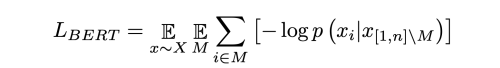  
    
3. Linear probes나 fine-tuning을 이용해 model evaluation 
    * fine-tuning
        * Sequence에 average pooling을 수행하여 d-dimensional vector 추출  
        * class logit으로 투영시키기 위해 Cross Entropy Loss 사용하여 학습   
        L = L_ce + {L_ar, L_bert}

#### ViT
[Dosovitskiy et al.](https://arxiv.org/pdf/2010.11929.pdf) 는 최근에 Vision Transformer (ViT)를 제안한다.  
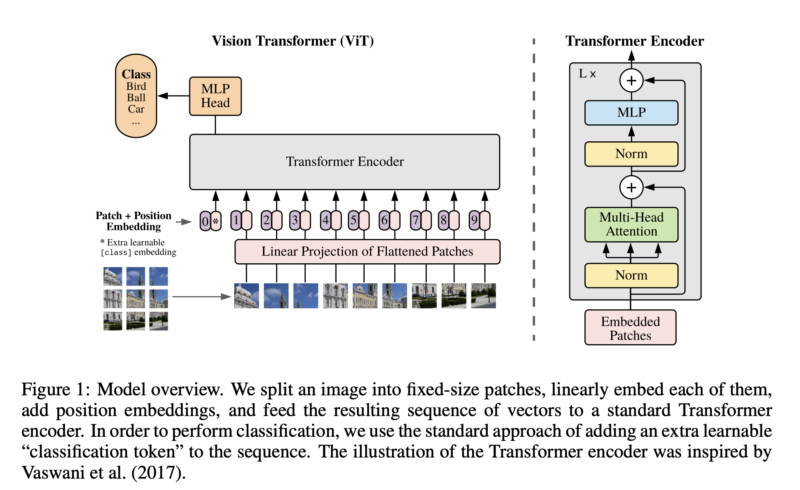  

2D 이미지를 처리하기 위해서 flattend 2d patch 들을 시퀀스로 reshape 한다. 
* Patch: N x (PxPxC)
* L: length of sequence (HW/PP)
* 위치 정보를 전달하기 위해 path embedding 에 positional embedding을 더한다. 
* BERT 처럼 embedded patch 시퀀스의 앞에 학습 가능한 [CLASS] 토큰을 사용하여 classification task에 사용한다.  
* 2D-aware positional embedding 을 사용해도 큰 성능상의 이점이 없어서 표준적인 1D-positional embedding 을 사용하였다. 
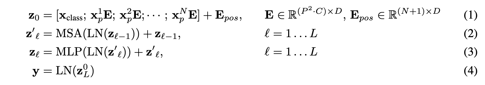    

* ViT는 large dataset으로 pre-training한 후에 작은 downstream task에 fine-tune 한다.
* Pre-training 시에도 classification head를 사용하여 supervised learning 한다. 
* fine-tuning에서는 pre-trained prediction head를 제거하고 D x K feed-forward layer를 초기화해서 붙인다.
    * K: downstream task의 class 수
    * pre-training resolution 보다 고차원을 사용하는 것이 더 효과적이다. 
        * 이를 위해서 pre-trained position embeddings에 2d-interpolation 을 수행한다.
        * 2D 구조에 대한 편향은 오직 해상도 변경이나 patch 추출 과정에서만 주입된다.
        
* Transformer은 translation equivariance와 locality와 같은 CNN 고유의 유도 바이어스가 없기 때문에 불충분한 양의 데이터에 대해 학습할 때에는 일반화가 잘 되지 않는다.
* 그럼에도 대규모 데이터 세트에 대한 훈련이 이런 편향을 능가한다는 것을 발견 했다.
* 하지만, ViT와 NLP transformer의 구조가 비슷하다는 점을 감안할 때, 패치간, 패치내의 상관관계를 명시적으로 식별하는 방법이 문제가 된다. 
비록 path 간의 사이즈는 동일하지만 그 복잡성을 다르다. 그래서 이 특징이 아직 완전히 사용되지는 못하고 있다. 


#### DeiT
[Touvron et al.](https://arxiv.org/pdf/2012.12877.pdf) 는 오직 ImageNet 데이터에만 학습시킨 경쟁력있는 convolution-free transformer를 제안한다.  
DeiT-B는 ViT-B와 같은 구조를 가지고 있다. 
단, 추가적 데이터셋 없이 ImageNet에 대한 강한 data augmentation 으로 83%의 Top-1 accuracy를 이루었다.
추가적으로 저자는 CNN을 teacher 모델로 사용하면 성능상의 이점을 얻을 수 있음을 발견했다. (Token-based distillation)  
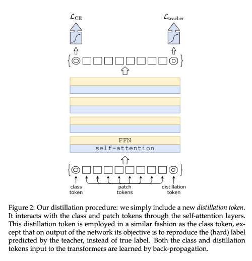  
* Distillation Token을 추가하고 teacher model의 prediction 결과를 distillation의 label로 사용

### 4.2 High/Mid-level Vision


   


