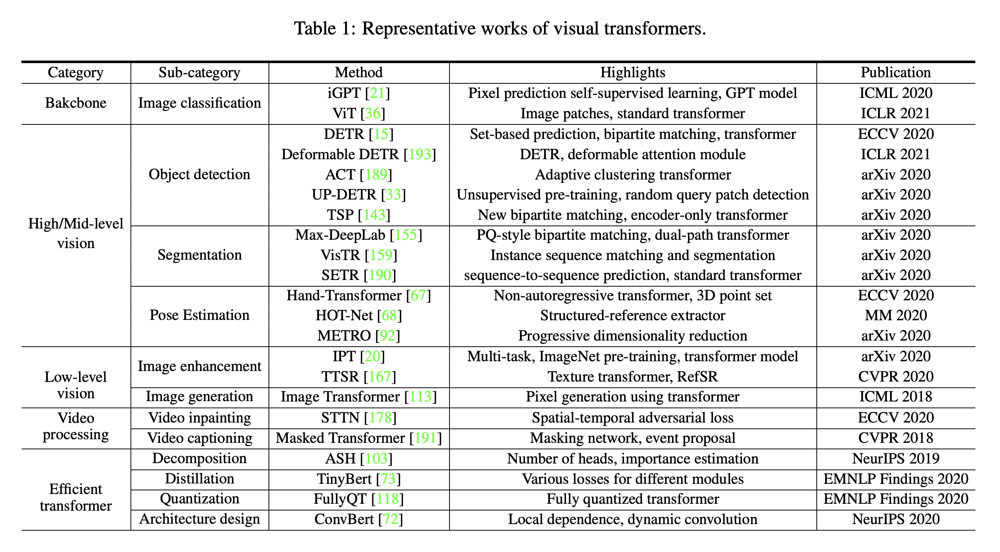
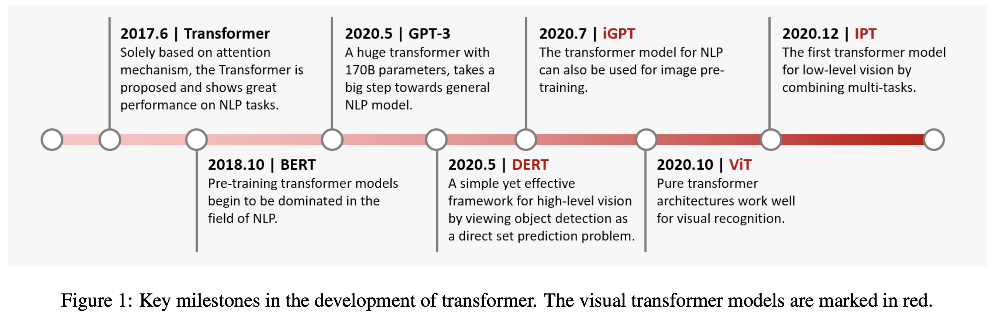
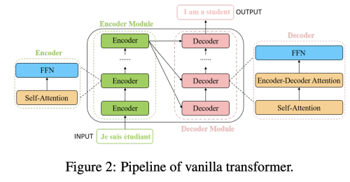
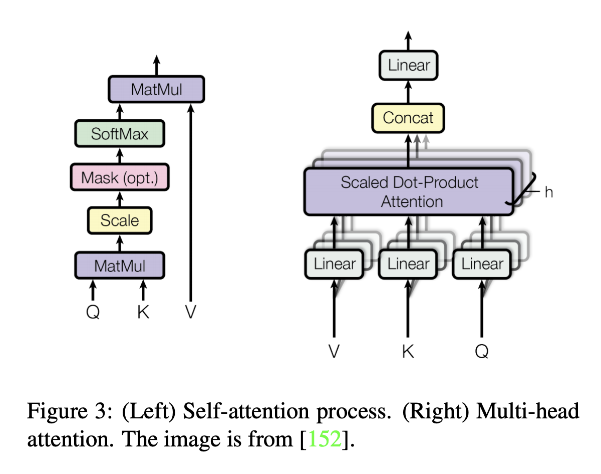
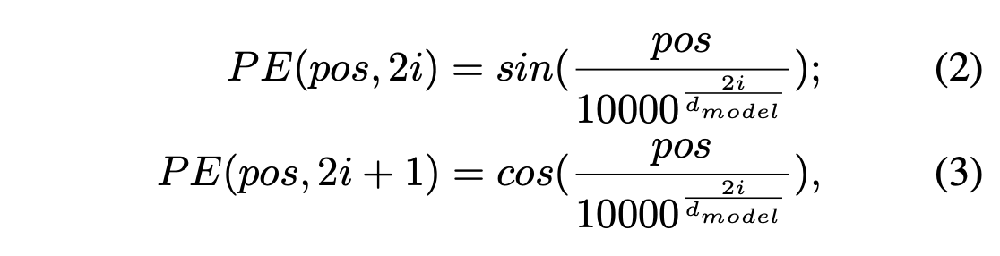

---
layout: post  
title: (Paper Review) Survey    
subtitle: A Survey on Visual Transformer       
tags: [ai, ml, computer vision, transformer]  
comments: true
---  

Transformer는 self-attention 매커니즘에 기반하여 natural language processing에 먼저 사용되기 시작하였다.
큰 가능성을 보고 연구원들은 computer vision task에 이를 적용할 방법을 모색하였다.
transformer-based 모델은 다양한 visual 벤치마크에서 convolutional, recurrent network보다 비슷하거나 더 나은 성능을 보였다.
높은 성능과 인간의 유도된 편향이 필요하지 않아 computer vision에서 transformer는 점점 더 많은 관심을 받기 시작했다.

이 논문에서 서로 다른 task 별로 visual transformer을 분류하고 장단점을 분석하였다.
주요 카테고리는 backbone, high/mid-level vision, low-level vision, video processing을 포함한다.
또한 transformer의 base component로 사용되는 computer vision에서의 self-attention에 대해 간략히 살펴본다.
나아가 실제 디바이스 어플리케이션에서 사용될 수 있는 효율적인 transformer를 살펴보고 앞으로의 challenge에 대해 살펴보기로 한다. 

```
Proceeding: 2021  
Authors: Kai Han, Yunhe Wang, Hanting Chen, Xinghao Chen, Jianyuan Guo, Zhenhua Liu, Yehui Tang, An Xiao, Chunjing Xu, Yixing Xu, Zhaohui Yang, Yiman Zhang, Dacheng Tao
```

[Paper Link](https://arxiv.org/pdf/2012.12556.pdf)  

## Introduction
서로 다른 타입의 task에는 다른 타입의 network를 사용해왔다.
예를들어 MLP나 FC는 고전적인 네트워크 구조이고, CNN은 이미지를 위한 네트워크 구조이고, RNN은 sequential하거나 time series data를 위한 네트워크 구조이다.
Transformer는 새로운 타입의 네트워크이다.
self-attention 메커니즘을 활용하여 본질적인 특징을 추출하고 AI application에 큰 활용도를 보이고 있다.

Transformer는 먼저 natural language processing (NLP)에 사용되어 큰 진보를 보여줬다.
그 중에서도 BERT는 SOTA를 보여준 모델이다.


> __*BERT (Bidirectional Encoder Representations for Transformers)*__
```
NLP task에서는 pre-trained된 language model을 사용하는 것이 매우 효율적이다.
특정 task에 대한 parameter를 최소화하기 위해 범용적인 pre-trained model을 학습하고 특정 task에 대해서 fine-tuning을 진행한다.

- Contribution
    * 대용량의 unlabeled data로 pre-training하고 특정 task에 대해서 transfer learning
    * Masked Language Model(MLM)을 활용하여 전후 정보를 모두 활용하여 pre-training하는 bidirectioanl 학습
    * Next Sentence Prediction(NSP) 학습 방법을 통해 문장 간의 연관성을 pre-training

BERT는 Transformer의 구조 중 인코더만을 사용하고 bidirectional learning을 하는 모델이다.

- Pre-Training
    * 모든 레이어에서 bidirectional한 방식으로 학습
    * unlabeled data 사용 
    * MLM(Masked Language Model): input 토큰의 일부분을 랜덤하게 마스킹하고 토큰의 마지막 softmax에서 어떤 단어인지 예측하는 방식  
        * 마스크는 랜덤하게 만들어지면 비율은 15% 정도 이다. (전체 문장이 아닌 마스킹된 단어만 예측하는 token-level)
        * 마스킹된 토큰의 80%는 [MASK] 토큰으로 변환하고 , 10%는 랜덤한 단어로, 10%는 기존 단어를 사용한다. 
        * 이를 통해서 문맥의 정보를 활용할 수 있는 모델로 학습된다. 

    * Next Sentence Prediction
        * 두 문장이 연결되어 있던 문장인지 예측하는 방식 
        * 문장 간의 relationship을 파악할 수 있는 모델로 학습 
        * 50%는 연결된 문장, 50%는 랜덤하게 뽑힌 문장으로 pair 쌍을 만든다
            * sentence_1_1+sentence_1_2 (label: isNext), sentence_1_1+sentence_2_2 (label: notNext)
```

NLP에서 transformer 구조가 큰 성공을 이룬것에 영감을 받아 최근에는 computer vision 영역에 이를 적용하려는 많은 시도가 이루어지고 있다.
CNN은 기본적인 요소로 고려되어 왔지만 transformer가 새로운 대체 방안으로 떠오르고 있다.

이 논문에서는 아래와 같이 분류하여 transformer 모델에 대해 overview 한다.  

  
Transformer의 주요 발전 마일스톤은 아래와 같다.  
  

## Formulation of Transformer
  
Transformer는 같은 구조를 가진 몇개의 encoder/decoder 모듈로 이루어져 있다.
Encoder는 self-attention layer와 feed-forward (각 위치의 단어마다 독립적으로 적용) NN으로 이루어져있고 decoder는 추가로 Encoder-Decoder Attention으로 이루어져있다.
Transformer에 사용하기 전 sentence의 각 word를 512 dimension의 embedding vector로 변환한다. 

### Self-Attention Layer
  
input vector는 세 개의 서로 다른 vector로 변환한다.
* q: query vector (1xd) = input(1x512)*W_q(512xd)
* k: key vector (1xd) = input(1x512)*W_k(512xd)
* v: value vector (1xd) = input(1x512)*W_v(512xd)
서로 다른 input(단어 n개로 이루어진 문장)으로 부터 만든 q, k, v를 Q, K, V로 pack 한다.  

  
* S: 서로 다른 벡터간의 점수를 계산하고 현재 위치에서 단어를 인코딩할 때 다른 단어에 주는 attention 정도를 결정한다. (nxn)
* Attention(Q, K, V): P(nxn) * V(nxd) = (nxd)

Decoder module에 있는 encoder-decoder attention layer는 encoder module에 있는 self-attention layer와 유사하다.
단 key matrix K와 value matrix V는 encoder 모듈로부터 온다.
그리고 query matrix Q는 Decoder의 이전 layer로부터 구한다.

앞의 과정은 각 단어의 위치와는 무관하다. 즉, self-attention layer은 문장에서 단어의 위치 정보를 캡쳐하는 기능이 부족하다.
그래서 이 문제를 해결하고 최종 입력 벡터를 얻기 위해, d 차원의 위치 임베딩이 original input embedding에 더해진다.  

그런데 이 positional encoding은 아래와 같은 조건을 충족해야 한다.
* 문장에서 단어의 위치마다 하나의 유일한 encoding 값을 출력해 내야 한다. 
* 서로 다른 길이의 문장에 있어서 두 time-step 간의 거리는 일정해야 한다.
* 모델의 일반화가 가능해야 한다. 더 긴 길이의 문장이 나왔을 떄 동일하게 적용할 수 있으려면 이 값들이 특정 범위 내에 있어야 한다.

위의 조건을 충족하는 positional encoding 방법은 아래와 같다.  
  
* *pos* : 문장에서 단어의 위치 (row)
* i: 임베딩 벡터 내의 차원의 인덱스 (col)

inputs(nx512) = inputs(nx512) + positional_encoding(nx512)  
positional encoding을 사용하면 순서 정보가 보존되어 같은 단어라고 하더라도 문장 내의 위치에 따라서 트랜스포머의 입력으로 들어가는 임베딩 벡터의 값이 달라진다.

### Multi-Head Attention
self-attention layer의 성능을 극대화 할 수 있는 방법이다.
