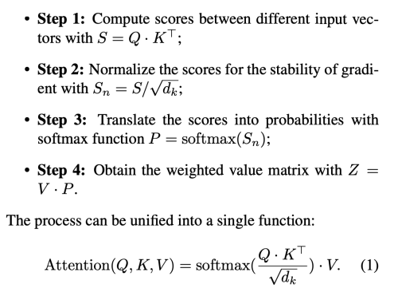
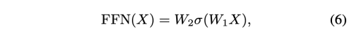
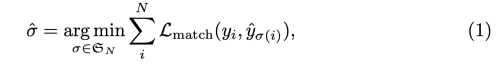

---
layout: post  
title: A Survey on Visual Transformer    
subtitle: AI Survey     
tags: [ai, ml, computer vision, transformer, self-attention]  
comments: true
---  

Transformer는 self-attention 매커니즘에 기반하여 natural language processing에 먼저 사용되기 시작하였다.
큰 가능성을 보고 연구원들은 computer vision task에 이를 적용할 방법을 모색하였다.
transformer-based 모델은 다양한 visual 벤치마크에서 convolutional, recurrent network보다 비슷하거나 더 나은 성능을 보였다.
높은 성능과 인간의 유도된 편향이 필요하지 않아 computer vision에서 transformer는 점점 더 많은 관심을 받기 시작했다.

이 논문에서 서로 다른 task 별로 visual transformer을 분류하고 장단점을 분석하였다.
주요 카테고리는 backbone, high/mid-level vision, low-level vision, video processing을 포함한다.
또한 transformer의 base component로 사용되는 computer vision에서의 self-attention에 대해 간략히 살펴본다.
나아가 실제 디바이스 어플리케이션에서 사용될 수 있는 효율적인 transformer를 살펴보고 앞으로의 challenge에 대해 살펴보기로 한다. 

```
Proceeding: 2021  
Authors: Kai Han, Yunhe Wang, Hanting Chen, Xinghao Chen, Jianyuan Guo, Zhenhua Liu, Yehui Tang, An Xiao, Chunjing Xu, Yixing Xu, Zhaohui Yang, Yiman Zhang, Dacheng Tao
```

[Paper Link](https://arxiv.org/pdf/2012.12556.pdf)  

## 1. Introduction
서로 다른 타입의 task에는 다른 타입의 network를 사용해왔다.
예를들어 MLP나 FC는 고전적인 네트워크 구조이고, CNN은 이미지를 위한 네트워크 구조이고, RNN은 sequential하거나 time series data를 위한 네트워크 구조이다.
Transformer는 새로운 타입의 네트워크이다.
self-attention 메커니즘을 활용하여 본질적인 특징을 추출하고 AI application에 큰 활용도를 보이고 있다.

Transformer는 먼저 natural language processing (NLP)에 사용되어 큰 진보를 보여줬다.
그 중에서도 BERT는 SOTA를 보여준 모델이다.

NLP에서 transformer 구조가 큰 성공을 이룬것에 영감을 받아 최근에는 computer vision 영역에 이를 적용하려는 많은 시도가 이루어지고 있다.
CNN은 기본적인 요소로 고려되어 왔지만 transformer가 새로운 대체 방안으로 떠오르고 있다.

이 논문에서는 아래와 같이 분류하여 transformer 모델에 대해 overview 한다.  

  
Transformer의 주요 발전 마일스톤은 아래와 같다.  
  

## 2. Formulation of Transformer

[참조하기 좋은 페이지](https://wikidocs.net/31379)  

  
Transformer는 같은 구조를 가진 몇개의 encoder/decoder 모듈로 이루어져 있다.
Encoder는 self-attention layer와 feed-forward (각 위치의 단어마다 독립적으로 적용) NN으로 이루어져있고 decoder는 추가로 Encoder-Decoder Attention으로 이루어져있다.
Transformer에 사용하기 전 sentence의 각 word를 512 dimension의 embedding vector로 변환한다. 

### 2.1 Self-Attention Layer
  

input vector는 세 개의 서로 다른 key, query, value vector로 변환한다.  

  


  

Decoder module에 있는 encoder-decoder attention layer는 encoder module에 있는 self-attention layer와 유사한 구조이지만 
단, key matrix K와 value matrix V는 encoder 모듈로부터 온다.
그리고 query matrix Q는 Decoder의 이전 layer로부터 구한다.

* Positional Encoding  
RNN이 자연어 처리에 유용했던 이유는 단어의 위치에 따라서 단어를 순차적으로 입력 받아 처리했기 때문에 단어의 위치 정보를 가지고 처리할 수 있었기 때문이다. 
하지만 앞의 Self-Attention은 단어의 위치 정보와는 무관하게 단어간 상관 관계만을 캡쳐하므로 위치 정보를 활용하지 못한다.  
그래서 이 문제를 해결하고 최종 입력 벡터를 얻기 위해, d 차원(input word embedding과 같은 512 차원)의 positional embedding을 original input embedding에 더한다.    

그런데 이 positional encoding은 아래와 같은 조건을 충족해야 한다.     
```
* 문장에서 단어의 위치마다 하나의 유일한 encoding 값을 출력해 내야 한다. 
* 서로 다른 길이의 문장에 있어서 두 time-step 간의 거리는 일정해야 한다. (d=1, d=2, d=3, ...)
* 모델의 일반화가 가능해야 한다. 더 긴 길이의 문장이 나왔을 떄 동일하게 적용할 수 있으려면 이 값들이 특정 범위 내에 있어야 한다. (0-1)
```

위의 조건을 충족하는 positional encoding 방법은 아래와 같다.  
  
* *pos* : 문장에서 단어의 위치 (row)
* i: 임베딩 벡터 내의 차원의 인덱스 (col)    
* 각 차원의 인덱스가 짝수인 경우는 sin, 홀수인 경우는 cos 함수를 사용한다. 
  [그림 참조](https://wikidocs.net/31379)    

```
inputs(nx512) = inputs(nx512) + positional_encoding(nx512) 
```

positional encoding을 사용하면 순서 정보가 보존되어 같은 단어라고 하더라도 문장 내의 위치에 따라서 트랜스포머의 입력으로 들어가는 임베딩 벡터의 값이 달라진다.

### 2.2 Multi-Head Attention
self-attention layer의 성능을 극대화 할 수 있는 방법이다.
주어진 참조 단어에 대해서 우리는 몇 가지의 다른 단어들을 함 집중하기를 바란다. 
하지만 single-head self attention layer는 하나 이상의 단어들에 대해서 equality하게 집중하는데 한계가 있다. (Softmax Function을 생각해보면 0-1까지 확률을 나눠 가짐)  

이는 attention layer에 다른 representation subspace를 제공함으로써 해결할 수 있다.
서로 다른 query, key, value Weights가 서로 다른 head에 사용된다. 
이 weights는 input vector을 서로 다른 representation subspace에 투영함으로써, 병렬로 수행하면서 서로 다른 시각으로 정보를 수집한다.  

먼저 input vector를 query group, key group, value group 으로 변환한다.  
  
각 group은 header 수 __h__ 개의 vector를 가지고 있고, 각 dimension은 __d/h__ 이다.

    
    

### 2.3 Other Key Concepts in Transformer

#### Residual Connection in the Encoder and Decoder
  

encoder과 decoder의 sub-layer 사이사이에 residual connection이 추가된다.
이는 더 높은 성능을 내기 위해서 정보의 흐름을 강화시키는 역할을 한다.  
* input embedding과 attention의 embedding dimension이 동일해야함 (d=c=512)    

layer-normalization은 residual connection 뒤에 위치한다.

```
LayerNorm(X + Attention(X))
```
* BatchNorm이 채널 별로 정규화(batch size 고정)하는 반해 LayerNorm은 데이터별로 정규화(batch size 유동적 변화 가능)를 수행한다.
* 그래서 BN은 시퀀스의 길이를 변경할 수 없지만, LN은 시퀀스의 길이를 자유롭게 변경할 수 있다.
* 그래서 Recurrent Network 구조에서는 LN을 사용한다.

#### Feed-Forward Network
self-attention layer 다음에 위치한다. 
구조는 다음과 같다.  
  
W_1, W_2는 linear transformation layers를 뜻하고, σ는 nonlinear activation function을 의미한다.

#### Final Layer in the Decoder
softmax layer을 통해서 다시 word embedding로 출력한다.

#### Others
CNN이 Local한 특징만을 캡쳐하는데 비해, Transformer는 멀리 떨어진 특징을 캡쳐할 수 있고, 
RNN이 sequential하게 계산해야하는데 반해, Transformer는 parallel 하게 계산할 수 있어 쉽게 가속할 수 있다..

## 3. Revisiting Transformers for NLP
Transformer가 개발되기 이전에 RNN(GRU, LSTM)은 attention과 함께 쓰여 SOTA model로 인식되어져 왔다.
하지만 RNN은 이전 hidden state 부터 다음 step 까지 정보를 sequential하게 계산해야한다.
이는 학습 중 가속과 병렬처리를 할 수 없게 만들고, 긴 sequence를 계산하기 어렵게 만들거나 더 큰 모델을 요구한다.

2017년 글로벌 의존성을 획득하고 seq-to-seq natural language task를 해결하기 위한 목적으로 
multi-head self-attention과 feed-forward network로 이루어진 Transformer가 
개발되었다. 이로써 Attention 매커니즘 자체가 attentive RNN에 비해 큰 성능을 낼 수 있음을 증명하였다.
나아가 Transformer 구조는 병렬 컴퓨팅으로 더 큰 데이터셋을 학습할 수 있게 만들었다.
이는 대규모 pre-trained models(PTMs)의 급증을 불러 일으켰다.

BERT와 그의 변형 모델들(SpanBERT, RoBERT)은 multi-layer transformer Encoder 구조의 pre-trained model들의 시리즈이다.
BERT는 BookCorpus와 English Wikipedia dataset으로 아래와 같은 방법으로 pre-training 하였다.   

- NLP task에서는 pre-trained된 language model을 사용하는 것이 매우 효율적이다.
- 특정 task에 대한 parameter를 최소화하기 위해 범용적인 pre-trained model을 학습하고 특정 task에 대해서 fine-tuning을 진행한다.

- Contribution
    * 대용량의 unlabeled data로 pre-training하고 특정 task에 대해서 transfer learning
    * Masked Language Model(MLM)을 활용하여 전후 정보를 모두 활용하여 pre-training하는 bidirectioanl 학습
    * Next Sentence Prediction(NSP) 학습 방법을 통해 문장 간의 연관성을 pre-training

- BERT는 Transformer의 구조 중 인코더만을 사용하고 bidirectional learning을 하는 모델이다.
- Input Representation  
 
[(그림 출처)](https://towardsdatascience.com/bert-explained-state-of-the-art-language-model-for-nlp-f8b21a9b6270) 
- Pre-Training
    * 모든 레이어에서 bidirectional한 방식으로 학습
    * unlabeled data 사용 
    * MLM(Masked Language Model): input 토큰의 일부분을 랜덤하게 마스킹하고 토큰의 마지막 softmax에서 어떤 단어인지 예측하는 방식  
        * 마스크는 랜덤하게 만들어지며 비율은 15% 정도 이다. (전체 문장이 아닌 마스킹된 단어만 예측하는 token-level)
        * 마스킹된 토큰의 80%는 [MASK] 토큰으로 변환하고 , 10%는 랜덤한 단어로, 10%는 기존 단어를 사용한다. 
            - transformer encoder 입장에서는 어떤 단어가 마스킹 되어 prediction 해야하는 지, random word로 바뀌었는지 모르기 때문에 
            모든 token에 대해서 분포적 contextual representation을 유지하도록 강제한다.  
        * 이를 통해서 문맥의 정보를 활용할 수 있는 모델로 학습된다.  
        * pre-training 에만 사용하고 fine-tuning에는 사용하지 않는다.  
         
        [(그림 출처)](https://towardsdatascience.com/bert-explained-state-of-the-art-language-model-for-nlp-f8b21a9b6270)  
    * Next Sentence Prediction
        * 두 문장이 연결되어 있던 문장인지 예측하는 방식 
        * 문장 간의 관계를 파악할 수 있는 모델로 학습 
        * 50%는 연결된 문장, 50%는 랜덤하게 뽑힌 문장으로 pair 쌍을 만들어 binary classification 수행
            * sentence_1_1+sentence_1_2: [isNext]
            * sentence_1_1+sentence_2_2: [noNext] 

Generative Pre-trained Transformer model(GPT, GPT-2)은 Transformer의 decoder 구조를 기반으로한 PTMs의 다른 타입 형태이다.
이는 masked self-attention 매커니즘을 사용한다. 
GPT와 BERT의 가장 큰 차이는 pre-training 방법에 있다.
* BERT와 달리 GPT 모델은 unidirectional language model로 left-to-right(LTR) language modeling을 사용하여 pre-training을 진행한다.
* BERT는 sentence seperator([SEP])와 classifier token ([CLS]) embedding을 pre-training에 사용하는 반에, GPT에서는 fine-tuning에서만 사용한다.

Unidirectional pre-training stage 덕분에 GPT는 자연어 생성 task에서 뛰어난 성능을 보였다.
더욱이 최근에는 massive transformer-based model인 GPT-3가 개발되었다. 이는 45TB의 압축된 plaintext dataset으로 pre-training 하여 
fine-tuning 없이 직접적으로 자연어 처리 downstream task에 바로 사용될 수 있다. 

  

## 4. Visual Transformer

### 4.1 Backbone for Image Classification

Transformer는 image classification의 backbone으로 활용할 수 있다.
[Wu et al.](https://arxiv.org/pdf/2006.03677v4.pdf) 은 ResNet을 베이스 라인으로 사용하고 마지막 stage의 Conv를 transformer로 교체하였다.
    
(1) Conv layer network는 밀집된 분포와 low-level 패턴을 학습  
(2) Transformer network는 떨어진 분포와 고차원의 의미 개념을 학습  
(3) Output Token을 그대로 image-level prediction(classification)에 사용하거나, projector을 이용해서 pixel-level prediction(semantic segmentation)에 사용    

Transformer로 보내기 전에, Tokenizer를 사용하여 pixel을 Semantic하게 그룹지어 적은 수의 visual token으로 만든다. 각 visual token은 image의 semantic concept을 표현한다.

* Tokenizer
    * input feature map (X) : HxWxC
    * visual token (T): LxC (L: number of tokens << HW)
    * Filter-based Tokenizer
        
        * W_A : CxL (X를 semantic group으로 변환하는 convolution filter)  
        * A^T X : L개의 visual token을 만드는 X 픽셀에 대한 weighted average
        * 하지만 고차원의 semantic concept은 sparse하고 각각은 오직 이미지에 적게 나타난다.
        그래서 고정된 Weight으로 고차원 컨셉을 한번에 학습하는 것은 매우 비효율적이다.  
          
    * Recurrent Tokenizer
        * filter-based tokenizer의 단점을 보완하기 위한 방법
        * 이전 layer의 visual token이 현재 layer의 새로운 token 생성을 가이드 해주는 역할을 해주며 점진적으로 정제된 visual token set을 얻게 해준다.  
          
          
* Projector
    * Visual Token은 pixel-level 디테일을 잃은 후 이기 때문에 feature map을 이용해서 정제하는 작업이 필요하다.
      
        * X_in, X_out : HW x C (input, output feature map)
        * W_q, W_k : C x C (feature map의 Query weight, Token의 Key weight)
        * 위의 key-query product는 인코딩된 visual token을 원래의 feature map에 어떻게 다시 투영시킬지를 결정 
        

#### iGPT
image를 위한 generative pre-training 방법은 오래전부터 존재해왔다.
[Chen et al.](http://proceedings.mlr.press/v119/chen20s/chen20s.pdf) 은 이를 self-supervised 방법과 결합하여 다시 실험하였다.
* GPT-2 구조를 이용한다. 
* text data처럼 이미지 픽셀을 1D로 만들어 Sequence Transformer을 학습하고 
다음 픽셀을 예측하거나(auto-regressive), 마스킹된 픽셀 부분의 값을 찾도록 (BERT) 하는 구조이다.
* 이런 generative pre-training은 low-resolution 데이터에 좋은 성능을 보인다.
* 이미지의 2D spatial structure을 인코딩 하지 않음에도 불구하고 CNN 모델들과 성능이 거의 유사하거나 오히려 뛰어난 실험도 존재한다.

  
1. 먼저 raw image를 low-resolution으로 resize 후 1D sequence로 Reshape
2. 두 Objective 중 선택하여 Pre-training
    (a) Auto-regressive: 이전 픽셀들을 이용하여 다음 픽셀을 예측  
      
      
        * attention logit nxn matrix에 표준 upper triangular mask를 사용  
    (b) BERT: 픽셀을 랜덤하게 마스킹 하고 마스킹된 픽셀을 예측  
      
    
3. Linear probes나 fine-tuning을 이용해 model evaluation 
    * fine-tuning
        * Sequence에 average pooling을 수행하여 d-dimensional vector 추출  
        * class logit으로 투영시키기 위해 Cross Entropy Loss 사용하여 학습   
        L = L_ce + {L_ar, L_bert}

#### ViT
[Dosovitskiy et al.](https://arxiv.org/pdf/2010.11929.pdf) 는 최근에 Vision Transformer (ViT)를 제안한다.  
  

2D 이미지를 처리하기 위해서 flattend 2d patch 들을 시퀀스로 reshape 한다. 
* Patch: N x (PxPxC)
* L: length of sequence (HW/PP)
* 위치 정보를 전달하기 위해 path embedding 에 positional embedding을 더한다. 
* BERT 처럼 embedded patch 시퀀스의 앞에 학습 가능한 [CLASS] 토큰을 사용하여 classification task에 사용한다.  
* 2D-aware positional embedding 을 사용해도 큰 성능상의 이점이 없어서 표준적인 1D-positional embedding 을 사용하였다. 
    

* ViT는 large dataset으로 pre-training한 후에 작은 downstream task에 fine-tune 한다.
* Pre-training 시에도 classification head를 사용하여 supervised learning 한다. 
* fine-tuning에서는 pre-trained prediction head를 제거하고 D x K feed-forward layer를 초기화해서 붙인다.
    * K: downstream task의 class 수
    * pre-training resolution 보다 고차원을 사용하는 것이 더 효과적이다. 
        * 이를 위해서 pre-trained position embeddings에 2d-interpolation 을 수행한다.
        * 2D 구조에 대한 편향은 오직 해상도 변경이나 patch 추출 과정에서만 주입된다.
        
* Transformer은 translation equivariance와 locality와 같은 CNN 고유의 유도 바이어스가 없기 때문에 불충분한 양의 데이터에 대해 학습할 때에는 일반화가 잘 되지 않는다.
* 그럼에도 대규모 데이터 세트에 대한 훈련이 이런 편향을 능가한다는 것을 발견 했다.
* 하지만, ViT와 NLP transformer의 구조가 비슷하다는 점을 감안할 때, 패치간, 패치내의 상관관계를 명시적으로 식별하는 방법이 문제가 된다. 
비록 path 간의 사이즈는 동일하지만 그 복잡성을 다르다. 그래서 이 특징이 아직 완전히 사용되지는 못하고 있다. 


#### DeiT
[Touvron et al.](https://arxiv.org/pdf/2012.12877.pdf) 는 오직 ImageNet 데이터에만 학습시킨 경쟁력있는 convolution-free transformer를 제안한다.  
DeiT-B는 ViT-B와 같은 구조를 가지고 있다. 
단, 추가적 데이터셋 없이 ImageNet에 대한 강한 data augmentation 으로 83%의 Top-1 accuracy를 이루었다.
추가적으로 저자는 CNN을 teacher 모델로 사용하면 성능상의 이점을 얻을 수 있음을 발견했다. (Token-based distillation)  
  
* Distillation Token을 추가하고 teacher model의 prediction 결과를 distillation의 label로 사용

### 4.2 High/Mid-level Vision
#### Generic Object Detection
Transformer based 방식은 두 가지 카테고리로 분류할 수 있다.
* Transformer-based set prediction
* Transformer-based backbone methods  
  

##### Transformer-based Set Prediction for Detection
[Carion et al.](https://arxiv.org/pdf/2005.12872.pdf) 는 object detection framework를 제 디자인한 Detection Transformer (DETR)를 제안하였다. 
DETER은 object detection을 직관적인 set prediction 문제로 보고 anchor 생성과 NMS(Non-maximum suppression) 후처리와 같은 수작업을 제거한
간단하고 fully end-to-end object detection 모델이다. 
  

DETR은 CNN 백본으로 시작하여 input image에서 feature를 추출한다.  
위치 정보를 보충하기 위해 Encoder는 flattened된 image feature에 fixed positional encoding을 추가하여 사용한다. 
또한 Decoder는 N개의 learned positional encoding(object-query)와 함께 encoder의 embedding을 사용하고, N개의 output embedding을 생성한다.
* 두 종류의 positional encoding을 사용한다.
    * Spatial Positional Encoding for Encoder
    * Output Positional Encoding(object queries) for Decoder : randomly initialized variable, No Built-in geometric prior,    

Decoder을 통해 고정된 사이즈인 N개의 output을 예측한다. (N > #of object in an image) 
모든 object 들을 하나의 set으로 여겨 예측의 중복이 없다. 
FFN(Feed-forward network)를 통해 최종적으로 bounding box coordinates와 class label을 예측한다.
* Bipartite Matching Loss
    * 예측한 N개의 object set의 순열(permutation)중 ground-truth object set과 L_match가 가장 작은 순열을 찾는다.
      
        * 단 GT set은 N 사이즈가 되도록 pad (no object)를 채워넣는다.
    * L_match는 각 쌍의 class와 box에 대한 pair-wise matching cost이다.  
      
        * object가 있는 gt와 그에 해당하는 쌍과의 matching cost
        * matching cost는 anchor와 같은 역할을 함
        * anchor 사용 시 duplicate 될 수 있지만, 위와 같은 방법은 one-to-one 매칭으로 중복을 방지한다.
    * 가장 작은 matching cost를 가진 output set 순열을 찾으면, Hungraian loss를 계산한다.
      
    * L_box는 L1 loss 만 사용하지 않고 scale-invariant한 gIOU loss를 함께 사용한다.  
      

DETR의 가장 큰 문제는 두가지가 있다. 
* DETR은 training schedule이 길다  
    * feature map에 있는 픽셀 모두가 query와 key가 됨. Feature map 크기 증가에 따라 quadratic complexity를 가짐.  
      
    * query와 key의 갯수가 많기 때문에 초기 attention score는 1/(HW)^2 로 매우 작은 값을 가져셔 ambiguous gradient 문제가 생김 
* Small object에 대한 성능이 좋지 않음  
    * Multi Scale Feature를 활용할 수 없기 때문에 

이런 문제를 해결하기 위해 [Zhu et al.](https://arxiv.org/pdf/2010.04159.pdf) 는 detection 성능을 크게 향상시킨 Deformable DETR를 제안한다.
  
  

* 각 query에서 고정된 수의 key를 추출
* input feature map: CxHxW
* q: query index
* z_q: content feature
* p_q: 2-d reference point (P_qx, P_qy)
* m: attention head의 index
* K: total sampled key (K << HW)
* A_mqk: scalar attention weight [0-1], z_q를 linear projection 하여 구함  
* ∆p_mqk: 2-d 실수 (unconstrained range), z_q를 linear projection 하여 구함 
* N_q: query element의 수
  

image feature map의 전체 spatial location을 보는 것이 아니라 reference point에서 작은 key point 만을 attention module에 사용한다. 
이 방법은 계산 복잡도를 크게 줄이고 빠른 수렴을 하게 도와준다.
더 중요한 것은, deformable attention module은 쉽게 multi-scale feature과 섞을 수 있어 작은 object detection에도 효과적이다. 

Deformable DETR은 DETR에 비해서 10배 이상 학습 비용이 낮으면서 1.6배 이상 빠르고 더 좋은 성능을 내었다.
그리고 iterative boundinb box refinement 방식과 two stage scheme를 사용함으로써 성능을 더 올릴 수 있었다.

[Zheng et al.](https://arxiv.org/pdf/2011.09315.pdf) 은 사전 학습된 DETR을 추가적인 학습 없이 계산 비용을 줄이는 Adaptive Clustering Transformer(ACT)를 고안하였다. 
Adaptive하게 locality sensitivity hashing(LSH) 알고리즘을 이용하여 query feature을 cluster하고 attention output을 선택한 프로토타입으로 표현한 query에 broadcast 한다.  
  
ACT는 pre-trained DETR 모델의 self-attention 모듈을 재 학습 시킬 필요 없이 교체하는데 사용한다.
이런 접근 방법은 정확도를 아주 조금만 감소시키면서 계산 비용은 크게 줄일 수 있는 방법이다.
정확도 감소는 multi-task knowledge distillation(MTKD) 방법을 이용하여 줄일 수 있다.


[Sun et al.](https://arxiv.org/pdf/2011.10881.pdf) 은 DETR 모델이 늦게 수렴하는 원인을 decoder의 cross-attention 모듈에 있음을 찾았다.
이 문제를 해결하기 위해 DETR의 encoder-only 버전을 제안한다. 이 모델은 detection 정확도와 training 수렴에 향상을 가져왔다.  
게다가 학습의 안전성과 빠른 수렴을 위해서 새로운 bipartite 매칭 scheme를 디자인하고, 
새로운 transformer-based set prediction model인 TSP-FCOS와 TSP-RCNN을 제안하였다. 
이는 encoder-only DETR에 feature pyramid를 사용한 모델이다.  
  

[Dai et al.](https://arxiv.org/pdf/2011.09094.pdf) 은 NLP의 pre-training transformer에 영감을 받아 object detection을 위한 unsupervised pre-training 기법인 UP-DETR을 제안하였다.
새로운 DETR 모델을 pre-train 하기 위해 unsupervised pretext task인 random query path detection을 제안하였다.
UP-DETR은 상대적으로 작은 데이터 셋만으로도 정확도를 크게 향상시켰다.
  
먼저 visual representation을 추출하기 위해서 CNN backbone을 frozen 하고 CxHxW의 feature map을 추출하고 positional embedding과 더한후 
multi-layer transformer encoder에 통과시킨다.
랜덤하게 크롭한 query patch를 얻기 위해서 random patch를 CNN backbone를 통해 patch feature를 얻고 Global Average Pooling을 통해서 query patch를 구한다. (C)
이를 position embedding을 의미하는 object query와 함께 Decoder에 통과시킨다.
CNN 파라미터는 전체 모델에서 공유된다.

Pre-training 과정에서 Decoder는 image에서 random query patch의 bounding box를 예측한다.
모델의 fixed prediction set의 갯수가 N이고 random patch의 갯수가 M이라면 N>M 이여야 한다.
그리고 각 query patch들은 N/M개의 object query에 더해진다. 
또한 query patch는 특정한 object query에 포함되는 그룹이 아니기 때문에 query shuffle을 해야한다.


##### Transformer-based Backbone for Detection
[Beal et al.](https://arxiv.org/pdf/2012.09958.pdf) 은 transformer를 Faster R-CNN과 같은 공통적인 detection framework의 백본으로 utilize한 ViT-FRCNN을 제안하였다.  
  
input 이미지를 여러 patch들로 나눈 뒤 positional embedding과 함께 vision transformer를 통과 시킨다.
output embedding feature는 detection head에 보내기 전에 spatial information에 따라서 feature map 처럼 해석한다. 
   
    
위와 같이 Transformer-based 방식은 CNN-based detector과 비교하여 정확도와 속도 측면에서 강한 성능을 보여줬다.

#### Other Detection Tasks
* Pedestrian Detection
    * Object의 분포가 일반적 task에 비해서 crowd하고 occlusion이 많기 때문에 추가적인 분석이나 Adaptation이 필요하다.
    * [Lin et al.](https://arxiv.org/pdf/2012.06785.pdf) 은 DETR과 Deformable DETR의 몇가지 특징이 성능상의 하락을 가져옴을 발견했다.
        * GT의 분포는 locally dense 함에 반면 query set은 uniformly sparse distribution을 가진다.
        * Decoder의 약한 attention field
    * 이를 해결하기 위해 Pedestrian End-toEnd Detector(PED)을 제안한다
    * 이는 Dense Queries and Rectified Attention Field(DQRF) 라는 새로운 Decoder를 제안한다
    * 또한 V-Match를 통해 추가적인 성능 향상을 이루었다.
* Lane Detection
    * [Liu et al.](https://arxiv.org/pdf/2011.04233.pdf) 은 PolyLaneNet에 기반한 LSTR 네트워크를 제안하였다.
    * Lane을 polynomial로 fitting한다.
    * Global context를 캡쳐하기 위해 transformer network를 이용하였다.
    
#### Segmentation
DETR의 decoder에 mask head를 붙여서 segmentation task에서도 경쟁률 있는 성과를 달성할 수 있다.
[Wang et al.](https://arxiv.org/pdf/2012.00759.pdf) 은 mask transformer를 사용한 Max-DeepLab을 제안하였다.
DETR과 비슷하게, end-to-end 형식이고 직접적으로 label에 해당하는 overlapping 되지 않는 mask 집합을 예측한다. 
Model 학습은 panoptic quality(PQ) style loss을 사용한다.
> Panoptic Quality(PQ) = Recognition Quality(RQ) * Segmentation Quality(SQ)   
> RQ = Pred_prob(class)   
> SQ = DiceCoefficient(m, gt_m)    

  
  

DETR가 CNN 백본에 Transformer를 쌓은 것과 다르게, CNN과 Transformer의 결합 효율성을
극대화 시키기 위해서 dual-path framework를 사용하였다.  
  
transformer를 backbone의 어떠한 resolution에도 적용 가능하다.

[Wang et al.](https://arxiv.org/pdf/2011.14503.pdf) 은 transformer 기반의 video instance segmentation인 
VisTR을 제안한다. 
각 instance로부터 mask squence를 얻기 위해 여러 프레임으로부터 구한 mask feature를 누적하고 3D CNN으로 segment 한다. 
  

[Zheng et al.](https://arxiv.org/pdf/2012.15840.pdf) 은 transformer 기반의 Semantic segmentation network(SETR)를 제안한다.
ViT와 유사한 방식으로 encoding 한다. 그리고 multi-level feature aggregation 모듈을 이용해서 pixel-wise segmentation을 수행한다.
  

### 4.3 Low-Level Vision
Image super-resolution이나 generation과 같은 low-level vision task에도 transformer를 활용한 사례가 조금 있다.

[Parmar et al.](https://arxiv.org/pdf/1802.05751.pdf) 은 처음으로 transformer를 image translation and generation task에 적용한 방법을 고안하였다.

Image transformer는 image representation을 추출하는 encoder와 Pixel을 생성하는 decoder로 이루어졌다.  
input embedding은 [h, w, 3, d] 을 가진다. d는 image value인 256 dim을 의미하고 3은 color space를 의미한다.  
이를 1x3 window size와 1x3 stride를 가지는 convolution을 이용해서 픽셀당 3 channel을 합쳐서 [h, w, d]로 변환한다. 
여기에 다른 transformer 모델과 마찬가지로 positional embedding 을 추가하여 학습한다. 
2차원의 좌표가 필요하기 때문에 2/d dim은 row 표현으로, 2/d dim은 col 표현으로 encode 한다.  

인코더는 pixel-channel 별 이미지 상황에 맞는 표현을 생성하고 디코더는 회귀적으로 각 단계에서 팍셀 당 한 채널씩 픽셀 강도의 출력 이미지를 생성한다.
  
픽셀 q에 대해서 이전에 생성한 픽셀들 m1, m2, ... 을 이용해서 q'를 생성한다.
decoder의 input은 이전에 생성된 픽셀들이 들어가므로 (특히 고화질 이미지 생성 task에서는 계산 비용이 크게 들어감 ), local self-attention sheme를 사용한다.
local self-attention 이후에 position-wise feed forward nn을 수행하는 데 이때, 모든 포지션에 대해서 파라미터는 동일하다. 

많은 현재의 연구들은 transformer 모델에서 각 pixel을 input으로 사용하는 것을 피하고 patch를 사용한다. 
[Yang et al.](https://arxiv.org/pdf/2006.04139.pdf) 은 Image Super-Resolution을 위한 Texture Transformer Network(TTSR)를 제안한다. 
reference-based image super-resolution에 transformer architecture를 사용한다. 
  
이는 reference 이미지로부터 관련있는 texture를 low-resolution 이미지로 transfer 할 수 있음을 보인다. 
* V: reference image
* K: down-sampled -> up-sampled reference image
* Q: up-sampled low resolution target image  
K와 Q간의 relevance를 구하고 이를 이용해서 hard-attention과 soft-attention을 계산한다.
```
hard attention map = argmax(relevance)  
soft attention map = max(relevance)  
```
* T = Value와 hard attention map으로 구하며 high-resolution texture image로부터 transferred한 특징  
```
F_out = F + Conv(Concat(F, T)) * S
```

[Chen et al.](https://arxiv.org/pdf/2012.00364.pdf) 은 transformer가 large pre-training dataset을 사용할 수 있다는 장점을 활용할 수 있는 Image Processing Transformer(IPT)를 제안한다.
이 모델은 super-resolution, denoising, derainig 등과 같은 task에서 SOTA를 달성하였다. 
  
위 그림에서 알 수 있듯이 IPT는 각 task 마다 서로 다른 head를 가지고 있고 공유하는 encoder, decoder와 task 마다 서로 다른 tail을 가지고 있다. 
head를 통해 구한 feature는 patch로 나누어지고, encoder-decoder 네트워크에 들어간다.
output은 다시 feature의 원래 사이즈와 같게 reshape 한다. 
transformer를 imageNet 데이터셋으로 pre-training 하는 방법은 아래와 같다.
1. 원본 이미지를 노이즈를 더하거나, rain, downsampling 등의 효과를 주어 corrupted 이미지를 생성한다.
2. 원본 이미지를 output의 최종 타겟으로 삼는다.  
이런 self-supervised 방식은 IPT 모델의 일반화 성능을 강화시킬 수 있고, 학습 후에는 각 task 마다, 해당하는 head, tail을 가지고 fin-tune만 시키면 된다.

[Wang et al.](https://arxiv.org/pdf/2012.09793.pdf) 은 3D indoor image generation을 위한 SceneFormer를 제안한다.
scene을 object의 sequence 처럼 처리함으로써 decoder는 object와 location, category, size를 predict 한다. 


### 4.4 Video Processing
