---
layout: post  
title: (컴퓨터공학과 전공 기초 시리즈) 컴퓨터 구조      
subtitle: Programming     
tags: [computer architecture, computer science, basic knowledge]    
comments: true  
---  
기본적으로 알고 있어야하는 __*Basic*__ 한 내용만을 다룹니다.  
아래 글은 Kocw의 [공개 강의 자료](http://www.kocw.net/home/search/kemView.do?kemId=1123313) 를 참조하여 만들었습니다.

## 1. 컴퓨터의 기본 구조
* Hardware  
* Software 
    * application software
    * System Software

### 하드웨어의 주요 요소
* 중앙처리장치 (CPU: Central processing unit)
    * 프로세서
    * 프로그램의 실행과 데이터 처리라는 중추적인 기능을 수행
    * 구성요소:
        * 제어 장치(CU: Control Unit): 기억 장치 속 프로그램 명령을 순차적으로 꺼내 분석하여 각 장치에 필요한 지령 신호를 주고, 장치간의 정보 조작을 제어  
        * 산술 논리 장치(ALU: Arithmetic and Logical Unit): 다양한 실제적 연산을 수행하는 장치 
            * 산술: +, -, x, /
            * 논리: AND, OR, NOT, XOR 
        * 레지스터 (Register): 한 비트를 저장하는 flip FLOP의 모임, CPU 내의 소규모 임시 기억 장소, 메모리 중 속도가 가장 빠름
        * CPU 내부 버스: ALU와 레지스터들 간의 데이터 이동을 위한 데이터 버스와 CU로부터 발생하는 신호들을 전달하는 제어 버스로 구성된 내부 버스 
            * 외부 시스템 버스들과 직접 연결되어 있지 않으며, 반드시 버퍼 레지스터들 또는 시스템 버스 인터페이스 회로를 통하여 시스템 버스와 접속   
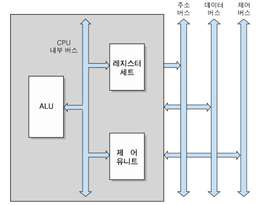  
    
* 기억장치 (Memory)
    * 주기억장치: RAM, ROM
        * CPU 가까이 위치, 고속 액세스
        * RAM(Random Access Memory): 휘발성 메모리, 응용프로그램 로딩, 사용 중 프로그램의 데이터 일시 저장 등과 같은 곳에 사용, 읽고 쓰기가 가능 
        * ROM(Read Only Memory): 비휘발성 메모리, 읽기만 가능 (PROM, EPROM은 쓰기도 가능), 변경 가능성이 없는 시스템 소프트웨어 저장 용도로 사용     
    * 보조저장장치: 
        * 읽기/쓰기 속도가 상대적으로 느림 
        * Hard Disk, CD-ROM
    
* 입출력장치 (I/O Device)
    * 입력 장치: 키보드, 마우스  
    * 출력 장치: 모니터, 프린터, 스피커  
    
* System Bus
    * CPU와 시스템 내의 다른 요소들 사이에 정보를 교환하는 통로
    * 동일한 성격을 가지는 전기적 신호선의 묶음
    * 기본 구성
        * 주소 버스: CPU로부터 기억장치 또는 I/O 장치로 주소 전송 (단방향)
        * 데이터 버스: CPU가 기억장치 또는 I/O 장치와 데이터를 전송 (양방향)
        * 제어 버스: CPU가 각종 시스템 요소들의 동작 제어를 위한 신호 전송 (양방향)
    
* 전원공급장치, 냉각 송풍기 등

### 정보의 표현과 저장 
* 컴퓨터의 정보: 2진수로 표현된 프로그램 코드와 데이터 
    * 2진수를 사용하는 이유?  
    : 전기적 신호를 전달할 수 있는 가장 간단한 방법이다. 1bit는 신호 on/off를 의미할 수 있다. 

####SI(국제 단위 규격)
* 1 Byte = 8 bit = 2^8  

|  <center>단위</center> |  <center>byte</center> |
|:--------|:--------:|
|**kilobyte (kB)** | 10^3 |
|**megabyte (MB)** | 10^6|
|**gigabyte (GB)** | 10^9 |
|**terabyte (TB)** | 10^12 |
|**petabyte (PB)** | 10^15 |
|**exabyte (EB)** | 10^18 |
|**zettabyte (ZB)** | 10^21 |
|**yottabyte (YB)** | 10^24 |  


#### Code
* 기계어
    * 컴퓨터 부품들이 이해할 수 있는 언어로써 2진 비트들로 구성  
    * 연산코드(op code)와 오퍼랜드(operand)로 구성 
    * op code: CPU가 수행할 연산을 지정한 비트들 
        * 3 bit를 이용한다면 2^3개만큼의 연산을 지정할 수 있음 
    * operand: 연산에 사용될 데이터나 데이터가 저장된 기억장치의 주소 
        * 5 bit를 이용한다면 2^5개 만큼의 기억 장소를 저장할 수 있음
    ```
      * 예시: 010 00101
    ```
* 어셈블리어
    * 고급언어와 기계어의 중간언어로 기계어와 일대일 대응이 되는 저급 언어.
    * 기계어를 사람이 해석할 수 있도록 기호화 한것.  
    * 컴퓨터와 가까운 언어이기 때문에 실행 속도가 매우 빠르다.  
    * 임베디드 프로그래밍이나 커널 프로그래밍 등에 필요  
    * 어셈블러를 통해 기계어로 번역한다  
    ```
    예시: Z = X+Y
    1) LOAD A, X  
    2) ADD A, Y  
    3) STA Z, A  
    ```
    
* 고급언어
    * 영문자와 숫자로 구성되어 사람이 이해하기 쉬운 언어
    * C, C++, Python, JAVA 등의 언어   
    * 컴파일러를 통해 기계어로 번역한다.  
    
#### 프로그램 코드와 데이터의 기억 장치 저장
* 프로그램을 시작하면 코드(명령어)와 데이터를 지정한 기억장소에 저장한다 
* 단어 단위로 저장한다
```
addr(0): 000 01010 -> 명령어
addr(1): 101 01100 -> 명령어
addr(2): 111 10110 -> 데이터
addr(3): 001 10000 -> 데이터  
```

## 2. CPU의 구조와 기능

### CPU 기능
* 명령어 인출
: 기억장치로부터 명령어를 인출  
* 명령어 해독
: 수행할 동작을 결정하기 위해 명령어를 해독
* 데이터 인출
: 명령어 실행에 필요한 데이터를 기억장치 혹은 I/O 장치로부터 읽음
* 데이터 처리
: 데이터에 대한 산술 / 논리 연산을 수행
* 데이터 쓰기
: 수행한 결과를 저장 

### Clock
CPU가 일정 속도로 동작하기 위해서는 일정한 간격의 전기적 pulse(On/Off)를 공급받아야 한다.
이를 '클럭' 이라고 한다.  
보통 한 신호 뒤 다음 신호가 올 때까지의 간격을 한 단위로 잡으머 Hz로 표시한다. (1초에 1번 진동 = 1Hz)  
이 클럭 수가 클 수록 컴퓨터 속도가 빠름을 의미한다.  

### 명령어 실행에 필요한 CPU 내부 레지스터들 
```
명령어: Op code (연산 코드) | Operand (데이터 주소)
```
* Program Counter (PC)
    * 다음 인출할 명령어의 주소를 가지고 있는 레지스터
    * 각 명령어가 인출된 후에 자동적으로 일정 크기(한 명령어 크기) 만틈 증가
* Accumulator (AC)
    * 데이터를 일시적으로 저장하는 레지스터
    * 레지스터의 길이는 CPU가 한번에 처리할 수 있는 데이터의 비트 수와 동일 (32bit, 64bit)  
* Instruction Register (IR)
    * 가장 최근에 인출된 명령어 코드가 저장되어 있는 레지스터 
* Memory Address Register (MAR)
    * Program Counter에 저장된 명령어의 주소가 시스템 주소 버스로 출력되기 전에 일시적으로 저장되는 주소 레지스터 
* Memory Buffer Register (MBR)
    * 기억장치에 쓰여질 데이터 혹은 기억장치로부터 읽혀진 데이터를 일시적으로 저장하는 버퍼 레지스터  
   
### 명령어 인출 사이클
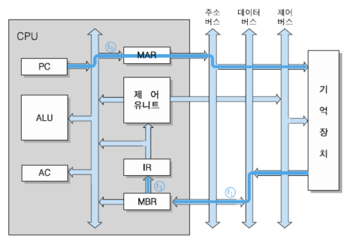  
PC에 있는 명령어 주소를 통해서 기억 장치에 있는 명령어를 읽어와 IR에 저장 

### 명령어 실행 사이클
* 명령어를 해독 하고 그에 따라 필요한 연산을 수행 (데이터 인출, 데이터 처리, 데이터 쓰기) 
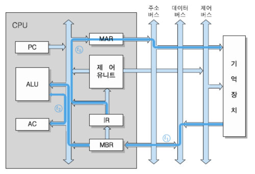 

#### LOAD 명령어 예시
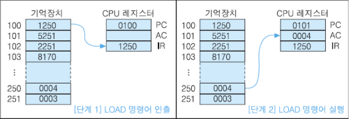  
```
LOAD Addr // 주소에 있는 데이터를 AC에 로드    
```
1. PC에 저장된 명령어 주소를 이용하여 기억 장치에서 실행할 명령어를 찾아 IR에 로드
2. IR에 지정된 명령어에 따라 Operand에 있는 데이터의 주소를 기억 장치에서 찾아서 AC에 로드
3. 다음 명령어 실행을 위해 PC=PC+1

#### ADD 명령어 예시
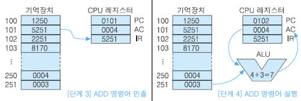  
```
ADD Addr // Addr에 있는 데이터와 AC에 있는 데이터를 더해 AC에 로드 
```
1. PC에 저장된 명령어 주소를 이용하여 기억 장치에서 실행할 명령어를 찾아 IR에 로드
2. IR에 지정된 명령어에 따라 Operand에 있는 데이터의 주소를 기억장치에서 찾고 AC에 저장되어 있던 데이터를 함께 ALU에 로드
3. ALU에서 IR에 지정된 OP CODE를 수행
4. 연산 결과를 AC에 로드 
5. 다음 명령어 실행을 위헤 PC=PC+1

#### STA 명령어 예시
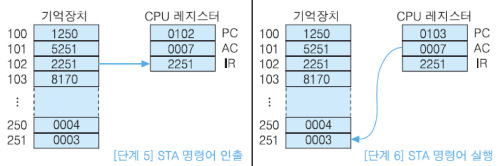  
```
STA Addr// AC에 있는 데이터를 Addr에 저장 
```
1. PC에 저장된 명령어 주소를 이용하여 기억 장치에서 실행할 명령어를 찾아 IR에 로드
2. IR에 지정된 명령어에 따라 AC에 있는 데이터를 Operand에 있는 데이터 주소로 보냄
4. 다음 명령어 실행을 위해 PC=PC+1

#### JUMP 명령어 예시
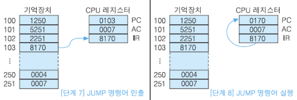  
```
JUMP Addr // Addr가 가리키는 명령어로 분기 
```
1. PC에 저장된 명령어 주소를 이용하여 기억 장치에서 실행할 명령어를 찾아 IR에 로드
2. IR의 operand가 가리키는 명령어 주소로 PC를 업데이트 

### 인터럽트 사이클
* 프로그램 실행 중 CPU의 현재 처리 순서를 중단 시키고 다른 동작을 수행하도록 요구하는 시스템 동작
* 인터럽트가 들어오면 해당 프로그램을 먼저 수행하고 종료되면 중단되었던 원래 프로그램을 계속 수행한다.
* 다중 인터럽트 발생시
1. 인터럽트 루틴을 처리 하는 중 새로운 인터럽트 요구가 들어와도 CPU가 이를 수행하지 않도록 방지 (interrupt flag)  
2. 인터럽트의 우선순위를 지정하여 우선 순위가 더 높은 인터럽트가 들어오면 현재 루틴을 중지하고 처리  
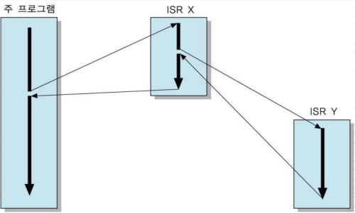  

### 간접 사이클
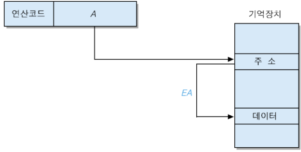  
IR(addr) -> MAR -> 기억장치[addr] -> 기억장치[기억장치[addr]] -> MBR -> IR(addr)

### 명령어 파이프라이닝
* CPU 의 프로그램 처리 속도를 높이기 위헤 CPU의 내부 하드웨어를 여러 단계로 나누어 동시에 처리하는 기술
#### 2단계 명령어 파이프라인
* 인출 단계와 실행 단계의 두 개의 독립적인 파이프라인 모듈로 분리
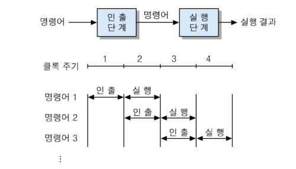  
* 명령어 처리 속도가 2배 증가하지만 두 단계의 처리 시간이 동일하지 않으면 두 배 향상 효과를 얻지 못함
* 그래서 파이프라인의 단계 수를 증가시켜 각 단계의 처리 시간을 같게 함.

#### 4단계 명령어 파이프라인
* 명령어 인출(IF), 명령어 해독(ID), 오퍼랜드 인출(OF), 실행(EX) 단계
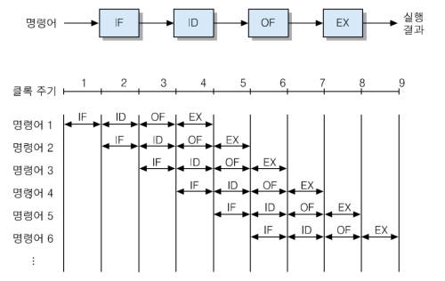  

* 단, 파이프라인 단계가 많아져도 무조건 효율이 증가하는 것은 아니다.
    * 모든 명령어들이 파이프라인 단계들을 모두 거치는 것이 아니다. 하지만 파이프라인 하드웨어 단순화를 위해 모든 명령어를 4단계를 거치게 해야한다.
    * IF, OF가 동시에 기억 장치를 엑세스 하는 경우 충동이 일어나 지연이 발생
    * 조건 분기 명령어가 실행되면 미리 인출 되어 처리하였던 명령어들이 무효화 된다 
* 이를 해결하기 위한 다양한 방법들이 있다 (생략)


### 듀얼코어 및 멀티코어
* CPU 코어: 명령어 실행에 필요한 CPU 내부 핵심 하드웨어 모듈
* 멀티-코어 프로세서: 여러개의 CPU 코어들을 하나의 칩에 포함
* 각 코어는 별도의 하드웨어 모듈로 이루어지며, 시스템 버퍼와 캐시만을 공유한다. (독립성)

## 3. 명령어의 구조와 주소 지정 방식

