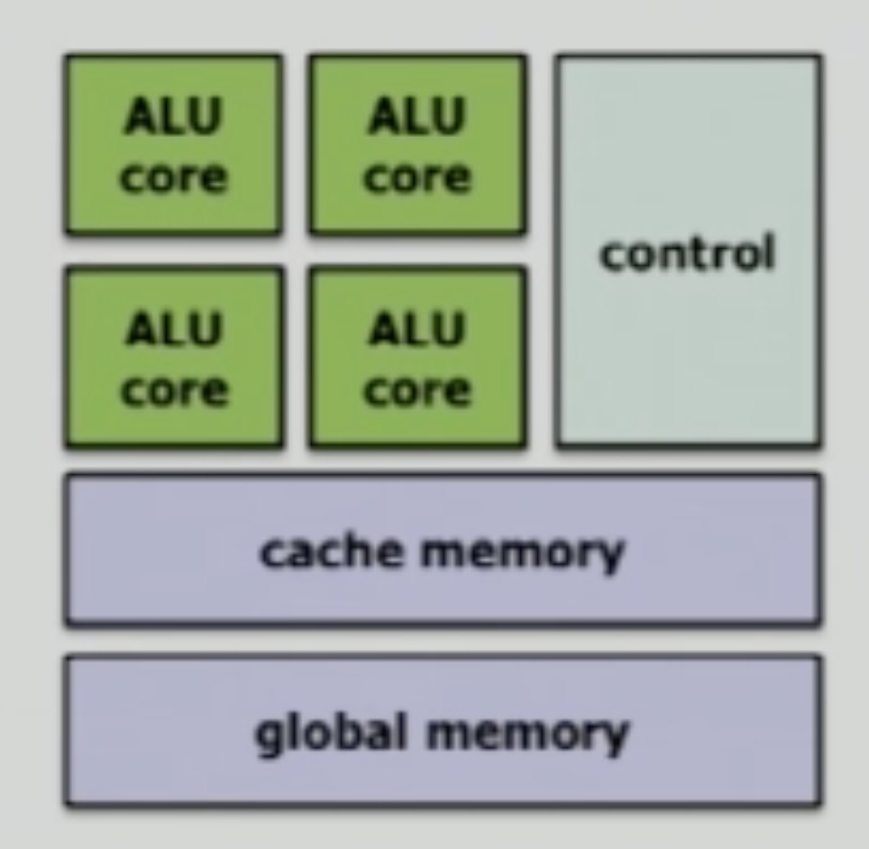

---
layout: post  
title: (컴퓨터공학과 전공 기초 시리즈) 병렬 프로그래밍        
subtitle: Programming     
tags: [parallel programming, computer science, basic knowledge]    
comments: true  
---  
기본적으로 알고 있어야하는 __*Basic*__ 한 내용만을 다룹니다.  
아래 글은 Kocw의 [공개 강의](http://kocw.or.kr/home/search/kemView.do?kemId=1322170) 를 참조하여 만들었습니다.

multi-core CPU 환경과 many-core GPU 환경에서의 병렬 프로그래밍을 배웁니다.  
CUDA, OpenCL, OpenMP 등의 Toolkit을 사용하여 병렬 프로그래밍을 쉽게 수행할 수 있습니다.

c++11 (2011) 부터 완전히 새로운 c++의 표준이 개발되었습니다. (Modern C++)
따라서 c++11 기준으로 예제 문제를 풀겠습니다.  

## Trends (2018 기준)
### FLOPS
* integer 연산은 1 clock에 가능하게 되었음. 그래서 컴퓨터 성능 측정에는 유효하지 않음. 
* Flops/s: floating point의 연산을 초당 얼마나 할 수 있는 지를 가르킴
* 현재 93PFlops 연산을 할 수 있는 super computer가 개발 되었고 지속적으로 더 높은 성능을 내는 컴퓨터가 개발 되고 있다. 
* Personal Super-computer: 
    * NVIDIA Tesla K20 GPU(2012): 3.52TFlops
    * k20x: 3.95TFlops
    * NVIDIA GTX 780(2013): 4TFlops
    * NVIDIA GeForce GTX 1080 Ti(2017): 11.340TFlops
    * SLI(Scalable Link Interface): 여러개의 그래픽 카드를 묶어서 하나의 그래픽 카드처럼 쓸 수 있는 기술로 4Tflops의 카드를 4개 묶으면 16TFlops를 이론적으로 낼 수 있음. 

## Intro
* CPU(Central Processing Unit) 
    * Intel, AMD
* GPU(Graphics Processing Unit) 
    * NVIDIA, AMD, Intel
* history  
    - 2003년 전까지: single core cpu (폰노이만 아키텍처)
    - 2003년 이후: multi-core cpu(2-8), many-core gpu(1024-4096)
    - 무어의 법칙: intel의 전직 CEO
        * 같은 크기의 칩에 들어갈 수 있는 트랜지스터의 갯수는 2년마다 2배씩 증가한다. 
        * 한계
            * 광속 : 3x10^8m/sec
            * 3GHz cpu: 초당 3x10^9 진동이 일어남. 1 clock에는 1/(3x10^9)sec 가 걸린다.
                * 즉, 1 clock에 전자는 3x10^8/3x10^9 = 1/10 m 이동 (10cm) 
            * 10GHx cpu는 3/100 m로 (3cm)로 1clock 3cm 이동하는 동안 모든 계산을 수행해야 한다. 
            * 이는 광속의 한계에 접근하기 때문에 CPU의 성능을 향상시키는 데는 한계가 있음을 알 수 있다. 
            * 그래서 현재는 3.0GHz에서 4GHz 사이의 cpu만 만들 수 밖에 없음 
            * 반면 트랜지스터의 수는 여전히 늘어나고 있음 (속도는 둔화)
            * 이 말은 cpu의 clock을 높이는 데는 한계가 있지만 사용 할 수 있는 로직 게이트의 숫자는 여전히 늘어나고 있음을 의미.
        * 많은 transistor를 사용할 시도
            * data-level parallelism for gpu
            * Thread-level parallelism for cpu 
    - 새로운 무어의 법칙의 필요성
    
* CPU
    * 하나의 쓰레드가 하나의 processor에서 돌아감.
    * __latency oriented design__: 명령을 내렸을 때 그 반응이 얼마만에 오는 지 
    * 실제 데이터를 메모리에서 가져와서 처리해야 하므로, 메모리에서 얼마나 빨리 데이터를 가져올지가 포인트 
    * 느린 메모리와 빠른 CPU 사이에서 데이터 버스를 이용해 통신을 해야하므로 bottleneck이 생길 수 밖에 없음
    * 이를 해결 하기 위한 방법
        * Cache 메모리를 증가시켜서 실제 메모리에 접근하지 않고 처리할 수 있게 하거나
        * Control Unit을 강화시켜 복잡한 스케쥴링으로 빠르게 처리  
        * ALU 강화로 계산 속도를 증진  

* GPU
    * 여러개의 쓰레드가 하나의 processor에서 돌아감.
    * __Throughput oriented design__: 명령을 한꺼번에 내렸을 때 얼마나 빨리 할 수 있는 지 
    * 하나의 쓰레드가 데이터를 가져오고 있을 때 다른 쓰레드는 다른 일을 하고 있게 끔
    * 쓰레드가 많기 때문에 하나의 쓰레드만 빠르다고 해서 속도가 빨라지지 않음 
    * 그래서 control unit과 cache, alu가 중요한 요소가 아님
    * 어떻게 동시에 많은 일을 처리할 지 알고리즘이 중요  

  
    
* OpenMP: Multi-core cpu를 위한 멀티 프로세싱 모델  
* CUDA: NVIDIA의 GPU를 위한 프로세싱 모델  
* OpenCL: 더 표준화된 병렬 프로세싱으로 Apple, Intel, AMD, Nvida 모두 사용, CPU와 GPU 모두에 사용 가능 

## History
그래픽스 분야에서 속도를 높이기 위해 빠른 하드웨어들을 만들기 시작했음.

### 그래픽스 순서
1. Vertex: 정점 처리
2. Raster: 기하 처리
3. Pixel: 픽셀 처리  
4. Blend: 렌더링  

* 각 vertext, pixel 처리들이 동시에 수행되어야 사용자에게 더 자연스럽고 빠르게 그래픽이 보일 수 있음
* 그래서 많은 트랜지스터를 이용해서 병렬처리가 가능한 구조로 만들기 시작 했음.

### 개발 흐름
(1) 그래픽스 초창기 시절에는 모든 하드웨어들이 hardwired 파이프라인 이었음 (고정된 계산만 수행)  
(2) 몇개의 모드를 줄 수 있게 변형   
(3) 프로그래머가 shader 프로그램 자체를 바꿔서 다른 기능을 수행 할 수 있게 함   
(4) 사용자가 c, c++로 프로그램 짜서 컴파일 하여 그래픽카드에 로드하여 수행 

### Tool 종류 

#### GPGPU (General Purpose GPU)
* 그래픽 processing unit을 일반적인 목적을 위해 사용하여 범용 GPU를 만들자.  
* 데이터를 모두 그래픽 데이터로 바꾸어 GPU에 넣어주고 결과를 다시 일반 데이터로 변환하자. 
* 이렇게 변환 과정이 있음에도 불구하고 CPU 보다 훨씬 많은 코어를 가지고 있기 때문에 빨랐음.

#### OpenGL
* 1992년 초 그래픽을 하드웨어 가속으로 처리 함과 동시에 여러 분야에서 사용할 수 있도록 하는 범용성을 보장하기 위해 발표된 그래픽 API
* OpenGL 자체는 비영리 컨소시엄인 크로노스 그룹이 개발하고 유지 관리하는 설명서이다.    
* 실제 OpenGL 라이브러리를 개발하는 사람은 그래픽 카드 제조업체이다.  
    * 따라서 Apple을 이용할때 openGL 라이브러리는 Apple이 자체적으로 관리하며, 버그가 발생하면 그래픽 카드 드라이버를 업데이트하면 된다.   
* GLSL(OpenGL Shading Language) 쉐이더 언어를 사용  
    * C 언어 기반 
    * *쉐이더: 컴퓨터 그래픽스에서 최종적으로 픽셀의 위치와 색상을 계산하는 함수*
* 표준안이 여러 관련 업체의 토론과 제안으로 이루어지기 때문에 버전 업데이트가 느림 
* 특정 컴퓨터나 장치에 사용된 하드웨어 및 드라이버에 따라 충돌로 인해 컴퓨터 프로세서가 그래픽 프로세서보다 빨라 OpenGL 모드가 더 느릴 수 있음 
* 가속 OpenGL 모드를 사용하는 응용프로그램을 작성할 때 가속 모드를 처리하는 방법의 구현이 표준화 되어있지 않아 드라이버마다 크게 다를 수 있다. 
* 지원 운영체제: Window, Linux, MacOS, Android(OpenGL ES), iOS(OpenGL ES)
 
#### Direct X
* 마이크로소프트에서 개발한 window 프로그램에 고성능 하드웨어 가속 멀티미디어를 지원하는 저수준의 API 집합
* 하나의 API가 아닌 컴포넌트 형태의 여러 API 들로 구성된 집합체 이므로 사용하고자 하는 컴포넌트를 확인해야 한다
    * Direct3D
    * Direct2D
    * DirectWrite
    * DXGI
    * DirectCompute: DirectX 11부터 도입된 GPGPU용 API
    * XAudio2
    * Direct Raytracing
    * DirectML: 기계 학습용 API, DirectX 12부터 도입, AMD, Intel, NVIDIA 그래픽 카드를 모두 지원, tf.1.15 버전부터 호환
    * DirectPhysics
* 지원 운영체제: Windows

#### Metal
* 애플이 개발한 그래픽 API
* 2012년 이후 발매된 모든 Mac에서 지원
* A7 및 이후 출시되는 AP를 탑재한 모든 iOS 모델 지원 
* 언리얼 엔진과 유니티 엔진도 지원, 최근에는 프리미어 프로도 지원 
* 기능적으로 OpenGL과 OpenCL을 합친 것과 유사 
* 2018년 macOS 모하비부터 OpenGL, OpenCL의 지원을 중단하겠다 선언, (모든 업데이트 중단)
* Swift를 사용
* 지원 운영체제: iOS, MacOS, tvOS, iPadOS

#### OpenCL
* 2009년 8월 발표된 GPGPU 프로그래밍용 API
* c 언어 기반(c99)
* 비영리 컨소시엄인 크로노스 그룹이 개발하고 유지 관리하는 설명서이다. (개발은 애플이 최초)
* 공개된 구격일 뿐 구현은 전적으로 개발사에 달려 있음 
* AMD, Intel, IBM에서 활발히 사용 중 
* NVIDIA는 OpenCL 1.2 까지만 지원 (CUDA에 집중)
* GPU 뿐만 아니라 CPU 등의 여러 장비를 동시에 통제할 수 있음
    * 여러 장비를 동시에 관리해야 하므로, 함수호출이 길어지고 초기화 과정도 하나하나 해줘야 하는 단점이 있음
    * 코드 길이가 김
* CUDA에 비해 OpenGL과 결합해 사용하기 좋음
    * ARM Neon, Intel SSE
* PyOpenCL 이라는 python wrapper 사용해 편리하게 사용 가능 (Java도 존재)
* 지원 운영체제: Android, iOS, Window, Linux

#### Vulkan
* 2016s년 발표된 그래픽용 API로 정식 명칭 발표 전까지는 OpenGL NG, glNext 등으로 알려짐 
* 크로스 플랫폼 지원 
    * OpenGL이 본래 크로스 플랫폼을 타겟으로 삼았던 것과 다르게 x86-64 기반과 ARM 기반의 태생적인 하드웨어 성능 차이로 인해 모바일 플랫폼만 OpenGL ES로 분리시켜 사용
* 특정하지 않는 세이더 프로그래밍 언어 
* 멀티스레딩을 이용한 멀티코어 병렬 처리 
    * OpenGL은 싱글스레드로 돌아가게 디자인
    * 작업을 모든 코어에 나누어 처리한 후 다 모아 Queue에 제출하기 때문에 CPU의 오버헤드가 줄어들고 전체 에너지 사용량이 줄어듦
    * 개발자가 싱글 스레드로 구현도 가능 
* 오브젝트 기반으로 여러 인스턴스 생성 가능
    * OpenGL은 글로벌 스테이트 기반이라 오직 하나의 인스턴스만 생성
* 저수준까지 직접 조절할 수 있게 설계되어 있기 때문에 기본적으로 코드가 매우 많고 어려움
* 지원 운영체제: windows, linux, android(>=7.0), maxOS, iOS(공식지원은 안함, 서드파티 라이브러리인 MoltenVK를 통해 제한적 사용)
    * 애플 기기를 위한 Vulkan API 드라이버는 존재하지 않음. 서드파티 라이브러리인 MoltenVK를 통해 VulkanAPI를 MetalAPI로 번역하여 사용할 수 있음 (But, 많은 제약사항이 있음)

#### Arm82

#### oneDNN

#### AVX512

#### CUDA (Compute unified device architecture)
대용량 병렬처리가 가능한 프로세서  
드라이버, language, 컴파일러, 디버거 모두 제공   

#### TensorRT