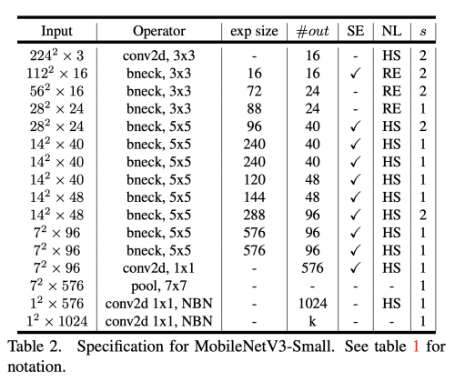

---
layout: post  
title: Searching for MobileNetV3         
subtitle: AI Paper Review    
tags: [ai, ml, mobileNetv3, lightweight model, network architecture search]    
comments: true
---  

Google Brain에서 나온 논문으로 상호 보완적인 검색기술의 조합으로 디자인한 차세대 MobileNet을 제안하는 논문이다.
NetAdapt 알고리즘을 이용한 hardware-aware network search 알고리즘의 조합으로 모바일 폰의 cpu를 위한 MobileNetV3 수정하였다.  
이 논문은 어떻게 search 알고리즘 자동화와 네트워크 디자인이 상호 보완적으로 동작하며 SOTA를 달성 할 수 있는지에 대해 설명한다. 
이 과정을 통해서 MobileNetV3-Large와 MobileNetV3-Small을 개발하였다. 
이 모델들은 object detection과 semantic segmentation에 적용되었다.
semantic segmentation을 위해서 저자는 새로운 효과적인 semantic decoder인 Lite Reduced Atrous Spatial Pyramid Pooling(LR-ASPP)를 제안한다. 
저자는 mobile classification, segmentation, detection에서 SOTA를 당성했다.
MobileNetV3-Large는 MobileNetV2에 비해서 20%나 지연시간을 줄이고 3.2%나 더 성능을 올렸다. 
MobileNetV3-Small은 6.6%나 더 정확도를 높였다. 
MobileNetV3-Large는 Detection에서 똑같은 정확도로 25%나 더 빠른 속도를 낼 수 있었다. 
MobileNetV3-Lare의 LR-ASPP는 Segmentation에서 MobileNetV2의 R-ASPP보다 34%더 빠른 속도를 낼 수 있었다.

```
Proceeding: 2019  
Authors: Andrew Howard, Mark Sandler, Grace Chu, Liang-Chieh Chen, Bo Chen, Mingxing Tan, Weijun Wang, Yukun Zhu, Ruoming Pang, Vijay Vasudevan, Quoc V. Le, Hartwig Adam  
```

[Paper Link](https://arxiv.org/pdf/1905.02244.pdf)  

## Introduction
이 논문의 목적은 모바일 디바이스 상에서 정확도와 속도간의 trade off를 최적화 하는 computer vision 구조를 찾는 것이다.
이를 달성하기 위해 (1) 보완적인 search 기술, (2) 모바일 환경에 실용적인 새롭고 효율적인 비 션형성 버전, (3) 새로운 효율적인 네트워크 디자인, (4) 새로운 효율적인 segmentation decoder을 제안한다.
이런 효율성은 다양한 케이스와 모바일 폰에서 측정 하였다. 
 
## Related Work
최근들어 정확도와 속도간의 trade-off를 최적화 하는 문제는 활발히 연구되고 있다. 
직접 구조를 디자인 하는 것과 알고리즘 적으로 네트워크 구조를 찾는 것 둘다 중요한 역할을 하고 있다.  

SqueezeNet은 1x1 conv를 squeeze와 expand module에 사용하여 파라미터의 수를 획기적으로 줄였다.

더 최근 연구는 operation의 수(MAdds)를 획기적으로 줄이는데 초점을 맞추어 실제 측정되는 지연시간을 줄였다.   

MobileNetV1은 depthwise seperable convolution을 사용하여 계산 비용을 줄였고, MobileNetV2는 inverted residual 과 linear bottleneck을 사용한 resource-efficient 블록을 사용하였다.   

ShuffleNet은 group conv와 channel shuffle을 사용하여 MAdds를 더 획기적으로 줄였다. 

CondenseNet은 학습 과정에서 유용한 dense connection을 유지하며 feature을 제사용하면서 group convolution을 학습한다. 

ShiftNet은 값비싼 spatial conv를 대체하기 위해 인터리브된 shift point-wise conv를 사용한다.   

이런 네트워크 디자인을 자동화하기 위해 처음엔 강화학습을 이용하였다. 

전체 구조를 찾는 것은 매우 large search space이기 때문에 Cell 단위의 구조를 찾기 시작하였다.

최근에는 block-level의 단계적 search space로 서로 다른 layer 구조를 가질 수 있도록 하였다. 

찾는 과정의 계산 비용을 줄이기 위해서 gradient-based 최정화 방식을 이용하기 시작하였다.

제한된 모바일 플랫폼에서 이미 존재하는 네트워크 구조를 수용하기 위해 더 효율적인 자동화된 네트워크 simplication 알고리즘을 제안하였다

Quantization은 네트워크의 precision을 줄여서 효율성을 늘린다. 

Knowledge distillation을 이용해 큰 네트워크로 작은 네트워크의 정확도를 높이기도 한다. 

## Efficient Mobile Building Blocks
MobileNetV2는 Linear Bottleneck과 inverted residual structure을 사용하여 낮은 등급의 특성을 활용하여 더욱 효율적인 레이어 구조를 만들었다. 
  
input과 output은 적은 channel을 가지고 있고, point-wise conv를 통해 expand한 뒤 depthwise conv를 수행 한다 .
그리고 residual connection은 적은 channel을 가진 bottleneck간 연결한다. 
이런 구조는 입력과 출력에서 간결한 표현을 유지하면서 내부적으로 더 높은 차원의 특징 공간으로 확장하여 비 선형별 채녈 변환의 표현성을 높인다. 

MnasNet은 MobileNetV2에다가 bottleneck 구조 사이에 squeeze와 excitation으로 이루어진 가벼운 attention 모듈을 추가했다. 
  
이 모듈은 depthwise conv 뒤에 위치하여 더 많은 표현에 적용된다. 

MobileNetV3는 더 효율적인 모델을 만들기 위해 위의 모든 레이어들을 조합하여 만들었다
또한 swish nonlinearities function을 사용하였다.  
  
```
f(x) = x*sigmoid(x)
```
ReLU 보다 더 깊은 네트워크에서 효과를 보인다. ReLU는 파라미터의 반을 0으로 만들고, 0이 된 파라미터들은 gradient가 더이상 업데이트 되지 않아서 40%의 죽은 뉴런을 만들어 버리는 문제가 있다.
Swish는 스무스 하면서 모노틱 하지 않은 함수로 좋은 성능을 보여줬다. 
또한 그냥 sigmoid가 아닌 hard sigmoid를 사용하였다. 
```
if x < -2.5: return 0  
if x > 2.5: return 1  
if -2.5 <= x <= 2.5: return 0.2 * x + 0.5  
```

## Network Search
MobileNetV3의 각 네트워크 블락을 최적화한 global network 구조를 NAS를 통해 찾는다
NetAdapt 알고리즘을 이용해서 각 layer의 필터수를 찾는다. 
이런 테크닉은 보완적이면서 주어진 하드웨어 플랫폼을 위해서 최적화된 모델과 합칠 수 있다. 

### Platform-Aware NAS for Block-wise Search
RNN 기반의 컨트롤러와 분해된 계층적 search space를 사용하여 Large Mobile 모델인
MnasNet-A1을 찾았다. 이를 initial Large Mobile model로 사용하고 netAdapt를 적용하고 다른 기법을 사용하여 최적화 하였다.

하지만 이런 reward design은 small model에 대해서는 최적화할 수 없음을 관찰하였다.
```
ACC(m) x [LAT(m)/TAR]^w
```
* ACC(m): accuracy
* LAT(m): latency
* TAR: target latency  

작은 모델에서는 latency의 변화보다 정확도의 변화가 더 드라마틱 하기 때문에 더 작은 weight(w) factor가 필요하다
(small: -0.15, large: -0.07) 
그래서 아예 처음부터 initial seed model을 설정하여 찾은 다음 NetAdapt와 다른 최적화 기법을 적용하여 MobileNetV3-small을 찾았다. 

### NetAdapt for Layer-wise Search 
이 접근은 platform-aware NAS의 보충 접근 방식으로 layer 각각을 순차적으로 fine-tuning한다. 
1. Seed Network로 시작하여 Platform-aware NAS로 네트워크 구조를 찾는다
2. 각 step 에서,   
(a) 새로운 proposal set을 생성: 각 proposal은 구조의 변화를 나타내는데 무조건 전 step 대비 latency가 줄어들어야 한다.  
(b) previous step의 pre-trained model을 사용하고 새로은 proposed 구조를 생성하고 missing weight은 random하게 initialize 한다. 
각 proposal에 대해서 fine-tune을 진행하고 정확도를 측정한다.  
(c) metric에 따라서 가장 좋은 proposal을 선택한다. 
    ```
    maximize(acc(t)-acc(t-1)/|latency(t)-latency(t-1)|)  
    ```
3. target latency에 도달할 때까지 반복한다.

## Network Improvements
### Redesigning Expensive Layers
시작 부분과 끝 부분의 layer들이 다른 layer에 비해서 비싼 비용을 가지고 있음을 발견했다.
저자들은 이런 느린 layer들을 정확도는 유지하면서 latency를 줄이는 방법을 제안한다.
이런 수정은 현재의 search space의 이외의 부분이다.

현재의 모델은 MobileNetV2의 inverted bottleneck 구조와 1x1 conv를 사용하여 prediction을 수행하는 final layer를 구한다.
이 layer는 rich feature를 가져야 하기 때문에 매우 종요하다. 하지만 이런 방식은 매우 큰 latency를 가진다.
latency를 줄이면서 고차원의 feature를 보존하기 위해서 저자는 이 layer를 average pooling layer를 지나가게 한다.
이 feature는 1x1의 spatial resolution을 가진다. 이 디자인의 계산 비용은 거의 free이다. 이렇게 함으로써 이전 bottleneck projection layer는 더이상 계산을 줄이기 위해 필요하지 않다.
projection과 filtering layer를 지우고 계산 복잡도를 줄일 수 있다.  
  

또다른 비싼 layer는 filter의 initial set이다. 
현대의 모바일 모델은 32 filter를 full 3x3 conv에 사용한다.
저자는 이 필터 수를 줄이고 다른 nonlinearities를 사용하여 중복을 줄이고자 하였다. 
필터를 16으로 줄이고 hard swish nonlinearity를 사용합으로써 32 filter와 동일한 정확도를 낼 수 있었다.

### Nonlinearities
Swish nonlinearity function은 모바엘에서 동작하기에는 계산비용이 비싸다.
그래서 이를 해결하기 위해 다음과 같은 방법 hard swish을 사용하였다.
```
f(x) = x * RELU6(x+3)/6
```
sigmoid function을 RELU6(X+3)/6로 대체하였는데, 
이 방법이 정확도에 큰 차이를 가져다 주진 않지만 모든 소프트웨어나 하드웨어에서 최적화 할 수 있다는 장점이 있다.
또한 quantized mode에서 precision loss가 없게 할 수 있다.
h-swish는 piece-wise function으로 메모리 접근의 수를 줄일 수 있어 latency 비용을 크게 줄일 수 있다.

네트워크가 깊어질수록 nonlinearity의 비용은 줄어든다. 왜냐하면 각 레이어의 메모리는 resolution이 낮아 짐에 따라 줄어 들기 때문이다.
swish는 오직 deeper network에서 사용해야 효과적임을 발견했다.
그래서 저자는 h-swish를 모델의 second half에서만 사용한다.

### Large squeeze-and-excite
* squeeze-and-excite bottleneck의 사이즈를 모두 1/4로 고정했더니 매개 변수의 수를 약간 증가시키면서 정확도를 증가시키지만 지연시간 비용은 늘어나지 않았다.

### Model Architecture
  
  

