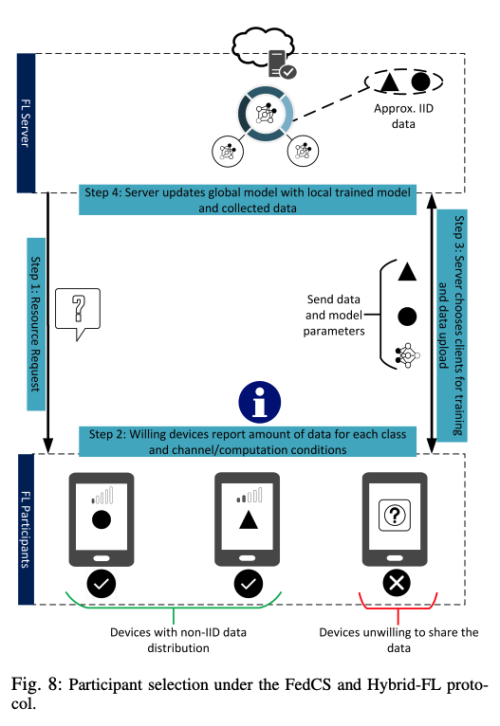

---
layout: post  
title: (Federated Learning in Mobile Edge Networks) A Comprehensive Survey   
subtitle: AI Survey     
tags: [ai, ml, computer vision, federated learning, mobile edge networks, data privacy]    
comments: true  
---  

```
Proceeding: 2020    
Authors: Wei Yang Bryan Lim, Nguyen Cong Luong, Dinh Thai Hoang, Yutao Jiao, Ying-Chang Liang, Qiang Yang, Dusit Niyato, Chunyan Miao     
```

[Paper Link](https://arxiv.org/pdf/1909.11875.pdf)  

## 1. Introduction
요새는 7억만의 IoT 디바이스와 3억만의 스마트폰이 존재한다. 
이런 디바이스들은 진화된 센서와 컴퓨팅, 그리고 소통 능력을 가지고 있다. 
따라서 의료 목적 및 대기 질 모니터링을 위해 다양한 크라우드 센싱 작업에 잠재적으로 배포될 수 있다. 
딥러닝의 발전에 따라, 의미있는 연구와 application을 위해서 수 많은 날씨 데이터를 end device로 부터 수집할 수 있다. 

잔통적인 cloud-centric 접근 방식은, 모바일 디바이스로부터 데이터를 수집하고 업로드 한뒤, 중앙 서버에서 데이터를 처리하는 과정을 거쳐야 했다. 
특히, IoT 디바이스나, 스마트폰에서 수집한 측정값이나, 사진, 비디오, 위치 정보를 data center에 수집하였다. 
이런 데이터들은 inference model을 위해서 효과적인 인사이트를 주지만, 이런 접근 방법은 아래와 같은 이유로 더이상 적합하지 않다. 
* 데이터 소유자의 프라이버시 민감도가 증가함에 따라, 데이터 프라이버시 법규가 제정되었다. 
* cloud-centric 접근 방식은 불필요한 긴 지연시간이 걸림
* 클라우드로 데이터를 전송하면 비정형 데이터와 관련된 작업이 백본 네트워크에 큰 부담을 줌  

요즘에는 데이터 소스는 클라우드의 밖에 위치하므로, Mobile Edge Computing(MEC)은 자연스럽게 최종 디바이스 및 에지 서버의 컴퓨팅 및 스토리지 기능을 활용하여
모델 교육을 데이터가 생성되는 위치에 가깝게 제공하는 솔루션으로 제안되었다. 

기존 MEC 접근 방식의 모델 훈련의 경우, 컴퓨팅 집약적인 작업이 클라우드로 오프로드되기 전에, 훈련 데이터가 low-level의 DNN까지 training을 먼저 하기 위해, 에지 서버로 먼저 전송하는 협업 패러다임이 제안되었다.
  
하지만 이 방식도 계산 비용이 많이 들고 지속적인 학습이 필욯한 application에는 적합하지 않다. 그리고 여전히 민감한 개인 정보의 이동을 요구한다. 
이는 사용자가 모델 학습에 참여하는 것을 꺼리게 만든다. 
비록 다양한 프라이버시 보호 방법이 있음에도 불구하고 많은 사용자들은 그들의 개인정보를 외부의 서버에 노출되지 않기를 바란다.

학습 데이터가 개인 디바이스에 보존 되는 것을 보증하기 위해 분산된 디바이스에서 학습하는 decentralized ML 방식인 Federated Learning(FL)이 등장하였다. 
FL 에서는 모바일 디바이스는 그들의 local data를 사용하여 FL 서버와 협동적으로 학습을 수행한다. 그리고 오로지 학습된 모델의 weight만을 FL 서버로 전송한다.
이 과정은 원하는 정확도에 도달할때 까지 여러번 수행한다. 
이로인해 ML 모델의 학습은 모바일 edge network에서 수행될 수 있다.
전통적인 cloud-centric training 접근방식과 비교하여 FL은 아래와 같은 강점을 지닌다. 
* 네트워크 대역폭의 매우 효울적인 사용: 데이터 전체를 전송할 필요 없이 오로지 모델의 파라미터만 전송하므로 communication 비용이 줄어든다. 
* Privacy: 클라우드로 사용자의 데이터가 전송될 필요가 없음. 이는 사용자로 하여금 모델 학습에 참여할 의지를 키울 수 있고 더 나은 모델을 학습시킬 수 있음
* Low latency: 모델이 지속적으로 학습되고 업데이트 될 수 있음.

FL은 최근 몇가지 application에서 성공을 거두고 있다. 
예를 들어 Federated Averaging 알고리즘 (FedAvg)는 Google의 Gboard에 적용되어 다음 단어를 예측 하는 모델의 발전을 가져왔다. 
또한 FL은 health AI의 진단 모델 개발에 사용되고 다영한 병원들과 정부 기관들간의 협동을 가능하게 했다. 

점점더 복잡해지는 모바일 edge network의 계산과 저장 제약을 감안할 때, 정적 모델을 기반으로 구축한 기존 네트워크 최적화 접근 방식은 동적 네트워크 모델링에 비해 상대적으로 열악하다. 
따라서 리소스 할당의 최적화를 위한 data-driven 딥러닝 접근 방식이 점점 인기를 얻고 있다. 
예를들어, 딥러닝은 네트워크 조건의 representation learning에 사용될 수 있는 반면, 강화학습은 동적 환경과 상호작용하면서 의사결정을 최적화 할 수 있다. 
하지만 앞서 말한 접근은 사용자 데이터가 input으로 들어가고 이런 데이터는 매우 민감하거나 자연적으로 접근 불가능할 수 있다.

FL을 수행하기 전에 몇가지 해결해야할 도전 과제 들이 있다. 
* 클라우드 서버로 raw 데이터가 전송될 필요가 없다 하도라도 고차원의 몯ㄹ을 업데이트 시키기 위해서는 여전히 통신 비용과 참가하는 모바일 디바이스의 통신 대역의 한계가 존재한다.
* 많고 복잡한 모바일 edbge network에서 참가하는 디바이스간의 다양성(데이터 질, computation power, 의지)이 잘 관리 되어야 한다.
* 악의적인 참가자 또는 서버가 있는 경우 개인정보를 보장하지 않는다. 최근 연구 결과에 따르면 악성 참여자가 FL에 존재할 수 있으며, 공유된 매개 변수 만으로 다른 참여자의 정보를 유추할 수 있음이 분명해졌다.
 그래서 프라이버시와 보안 이슈는 FL에서 여전히 고려되어야 한다. 
 
독자들의 편리함을 위해 저자는 이 서베이에서 논의한 관련 연구들을 아래와 같이 분류하였다.  
  

* FL at mobile edge network: 도전 과제를 해결하고 collaborated training 적용 관련 이슈 정리
* FL for mobile edge network: FL 최적화를 위한 application 탐색 

## 2. Background and Fundamentals of Federated Learning

### Federated Learning
FL 시스템에느 두개의 main entity인 data owners(participants)와 model owner(FL server)가 있다. 
*N* = {1, 2, ..., N}을 owner들의 개인적인 dataset D라고 하자. 
각 owner는 자신의 데이터인 D_i를 local model w_i의 학습에 사용한다. 그리고 오직 local model의 파라미터만을 FL 서버로 보낸다.
그리고 모아진 모든 local model 파라미터들을 global model w_G를 만들기 위해 더한다.
이것은 전통적인 중앙적인 학습 방식과 다르다.
FL의 일반적 구조와 학습 프로세스는 아래와 같다.   
  

FL 학습 과정은 다음과 같은 세 단계를 거친다.
* Step1 (Task Initialization): 서버에서 테스크와 목표 application 그리고, 필요한 데이터를 정의한다. 
또한 global model의 hyper parameter와 학습 과정을 정의한다. 그리고 서버는 initialized global model과 task를 선택된 participants에 배포한다.
* Step2 (Local model training and update): global model에 기반하여 각 참가자는 local data를 사용하여 local model parameter를 업데이트한다. 
각 참가자들의 목적은 interation t 동안 loss를 minimize하는 parameter w_i(t)를 찾는 것이다. 그리고 이 local model parameter를 server로 보낸다.
* Step3 (Global model aggregation and update): local model parameter를 누적하고 업데이트된 글로벌 모델 파라미터를 다시 data owner에게 보낸다. 
이때 서버도 모델의 global loss function을 원하는 만큼 minizie 하거나 원하는 정확도에 도달할때 까지 이를 반복한다.
classical한 누적 방식은 Algorithm1 처럼 FedAvg 방식이었다.   
  

### Statistical Challenge of FL
전통적인 분산된 ML은 center server가 모든 학습 데이터셋에 접근할 수 있었다. 
서버는 학습 데이터셋을 비극한 분포를 가진 subset으로 분리할 수 있었다. 그리고 이 subset은 참가자들의 노드에 분산 학습을 위해 분배되었다. 
하지만 FL은 local dataset은 오직 데이터의 소유자만 볼 수 있기 때문에 이런 접근 방식은 불가능하다.

FL 셋팅에서는 local dataset은 서로 다른 분포인 non-IID이다. 
그럼에도 FedAvg 알고리즘의 저자는 이런 non-IID에서도 원하는 정확도를 달성할 수 있음을 보여줬지만, 다른 저자는 그렇지 않은 것을 발견했다. 
예를들어 FedAvg로 학습한 CNN 모델은 centrally 학습된 모델 대비 51% 더 낮은 정확도를 보였다고 한다.
이 발견은 Earth mover's distance (EMD)와 비교하여 FL 참가자의 데이터 분포 차이로 정량화 되는 것을 볼 수 있다.   
만약에 데이터가 매우 non-IID이고 치우쳐저 있을 경우, 모든 클래스에 대해서 uniform한 분포를 가지도록 data-sharing 할 경우
각 참가자가 local model을 자신의 privcate data와 공유 받은 5%의 데이터로만 학습해도 EMD가 줄어들기 때문에 global model이 30%의 정확도 향상을 가져왔다. 

하지만 공통의 dataset은 항상 FL 서버를 통해서 공유 가능하지 않을 것이다. 대체 솔루션은 공통 데이터 셋 구축에 대한 기여도를 수집하는 것이다.
어떤 저자는 모든 FL 참가자로부터 수집한 data를 사용할 경우 class imbalance를 초례하고 이는 결국 모델의 정확도를 떨어뜨리는 문제를 발생시킴을 발견했다. 
그래서 Astraea framework가 제안되었다.   

initialization에서 FL 참가자들은 그들의 data distribution을 서버에 보낸다.
그리고 training step 전에 rebalancing step을 추가하였는데, 각 참가자들은 minority class에 대해서 data augmentation을 수행한다. 
(random rotation, shift) 이런 augmented data 로 학습이 끝난 후에, FL server로 파라미터를 보내기 전에, 중재자는 참가자들의 data distribution(uniform distribution에 가까 운 것을 찾음)을 통해서 최고의 기여자를 선택한다. 
이는 greedy 알고리즘을 통해 찾고 local data와 uniform distribution간의 KL Divergence가 최소가 되는 것을 찾는다. 

각 디바이스마다 서로 다른 데이터 분포를 갖을 경우, multi-task learning의 개념을 가져오는 많은 연구들이 생긴다. 
일반적으로 사용해오던 loss를 그대로 사용하는 것이 아니라 task 간의 관계를 고려하여 loss function을 수정한다.  
MOCHA(Matroid Optimization: Combinatorial Heuristics and Algorithms, [Source Link](https://github.com/coin-or/MOCHA)) 알고리즘은 최소화 문제를 approximate 문제로 푸는 대체 최적화 알고리즘으로 제안되었다. 
흥미롭게 MOCHA는 참가자들의 리소스 제한에 맞게 조정되게끔 설계되었다.
예를들어 approximate 정도는 네트워크 컨디션과 디바이스의 cpu 상태에 맞게 adaptively 하게 조정된다. 
하지만 MOCHA는 non-convex DL model에는 사용할 수 없다. 
FEDPER(Federated Learning with Personalization Layers) 접근 방식은 통계적인 이질성을 처리하는 multi-task learning 개념을 사용한다.
참가자는 FedAvg 알고리즘을 이용해서 base layer를 학습하고 이를 공유한다.
그 다음, 각 참가자는 각자의 데이터를 가지고 personalization layer를 학습한다. 
특히 이 방식은 참가자의 다양한 선호가 존재하는 추천 시스템에 적합하다. 
그러나 각 참가자는 개인화된 모델을 학습시키기 위한 로컬 데이터 샘플이 충분하지 않기 때문에 base layer의 공동 훈련의 높은 정확도가 중요하다는 점에 주목해야한다. 

데이터간의 이질성때문에, 분산 학습 알고리즘의 수렴은 항상 고민거리였다.
높은 수렴율은 각 참가자들에게 많은 시간과 리소스를 줄일 수 있게 해주고, 또한 적은 수의 커뮤니케이션 라운드가 참가자의 dropout을 줄이고
연합 교육의 성공률을 크게 높인다. 

FedProx 알고리즘은 training loss가 증가할 때, 모델 업데이트가 현재의 파라미터에 영향을 적게 받도록 adaptive하게 조정한다. 
비슷하게 LoAdaBoostFedAvg 알고리즘은 의학 데이터와 같은 data-sharing 접근 방식의 보안 방식이다. 
참가자들은 그들의 로컬 데이터를 이용해서 모델을 학습하고 현재의 CE를 이전 훈련 라운드의 손실 중앙값과 비교한다. 
만약 현재의 CE가 더 높으면 모델은 global aggregation 하기 전에 학습을 다시 진행함으로써 학습의 효율성을 높일 수 있다. 

또한 Communication cost는 이런 fast convergence로 어느정도 감소 시킬 수 있다.

### FL Protocols and Frameworks
확장성을 개선하기 위해 아래와 같은 FL 프로토콜이 제안되었다.  
  
이 프로토콜은 디바이스와의 불안정한 연결과 통신상의 안정성 이슈를 해결한다. 
프로토콜은 아래와 같이 3개의 phase로 구성되어 있다. 
1) Selection: FL 서버는 training round에 참가할 디바이스들의 subset을 선택한다. 
이 기준은 후에도 서버의 필요성에 따라 보정될 수 있다. 
2) Configuration: 서버는 선호하는 aggregation 매커니즘에 따라 구성된다. 그 다음 서버는 각 참가자에게 학습 일정과 global model을 보낸다.
3) Reporting: 서버는 각 참가자로부터 업데이트를 받는다. 그 다음 업데이트는 FedAvg 알고리즘을 통해 집계된다. 

FL 참가자의 규모에 따라 장치 연결을 관리하려면 속도 조정도 권장된다. 
속도 조정은 참가자가 FL 서버에 다시 연결할 수 있는 최적의 시간을 adaptively 관리한다. 
예를들어, FL 참가 규모가 작을 경우엔 충분히 참가 디바이스가 서버에 동시에 연결될 수 있다. 
반면에 참가 규모가 클 경우에는, 랜덤하게 디바이스를 선택하여 너무 많은 참가 디바이스가 동시에 연결되지 않도록 조정해야한다. 

통신 효율과는 별개로 local update가 일어날때 통신 안정성도 또 다른 해결해야할 문제이다. 여기에는 주로 두가지 관점이 있다. 
* Secure Aggregation: 로컬 업데이트가 추적되고 FL 참가자의 신원을 추론하는데 사용되지 않게 하기 위해 신뢰 가능한 third party server가 local model aggregation을 위해 배포된다. 
또한 비밀 공유 매커니즘으로 인증된 암호화를 사용하여 local update를 전송하는데 사용한다. 
* Differential Privacy: FL 서버가 local update의 owner의 신원 정보를 파악하는 것을 받지한다. 이를 위해 original local update에 모델 정확도를 해치지 않는 수준의 일정한 noise를 추가한다. 

최근의 몇몇 open-source 프레임워크를 통해 FL을 배포할 수 있다. 
* __Tensorflow Federated(TFF)__: TFF는 두 가지 layer로 구성되어 있다. 
    * FL API: 존재하는 tf model에 FL 알고리즘을 개인적으로 추가할 필요 없이 FL을 적용할 수 있게 해주는 high-level interface
    * Federated Core(FC) API: TF layer와 통신 operator를 통해 결합하여, 사용자가 커스텀화 되고 새로 디자인된 FL 알고리즘을 사용할 수 있게 한다.
    * 특징: 
        * 고성능 단일 및 다중 머신 런타임을 제공하는 데 많은 투자를 함
        * 압축 모델링 및 업데이트로 통신비용을 줄임
        * 차등 프라이버시가 있는 모델을 위한 새로운 알고리즘 연구(DP-FedAvg)
        * 악의적 공격에 대응하는 알고리즘 구현 가능
        * GAN도 FL 가능(DP-FedAvg-GAN)
        * 개인화 모델 개발 가능 (다른 사용자에게 다른 추론 모델을 제공)
    * Interface의 주요 구성 요소 
        * Model: 기존 모델을 래핑하여 tff에서 사용할 수 있도록 도와주는 클래스 및 함수. tff.learning.from_keras_model을 호출하거나 tf.learning.Model 인터페이스의 서브 클래스를 정의 
        * federation computation builder: 훈련 또는 평가를 위한 함수 
        * dataset: 시뮬레이션을 위해 미리 준비된 데이터 모음. 원래는 중앙 서버에서 분산 데이터를 다운로드하여 사용할 수 없어야 하지만, 쉬운 사용을 위해 로컬에서 다운로드하여 조작할 수 있도록 함 
    * Model ([Example](https://github.com/tensorflow/federated/blob/master/tensorflow_federated/python/learning/model_examples.py))
        * 직렬화: 모델 코드를 Tensorflow 그래프로 직렬화 할 수 있어야 한다. (TF 1.0 패턴을 따르며, 모든 코드는 TFF가 제어하는 tf.Graph 내에 구성되어야 함)
        * 집계: keras 사용하는 것이 좋음. FL에는 로컬 기기내 집계와 federation 집계라는 최소한 두 개의 집계 레이어가 있다.
            * 로컬 집계: 개별 클라이언트가 소유한 예제의 여러 배치에 대한 집계. 모델이 로컬에서 훈련됨에 따라 순차적으로 계속 진화하는 모델 매개 변수와 메트릭 통계 
                * 구조:
                    * tf.Variable에 배치수, 배치 사이즈, 배치당 손실의 합 등과 같은 집계를 보유
                    * 클라이언트의 후속 배치에 대해 순차적으로 Model에서 forward_pass 메서드를 여러번 호출하여 다양한 집계 변수를 업데이트
                    * Model에서 report_local_outputs 메서드를 호출하여 수집한 모든 요약 통계를 클라이언트가 내보낼 수 있는 간단한 메트릭 세트로 컴파일 
            * federation 집계: 시스템의 여러 클라이언트에 대한 집계. 클라이언트 전체에서 평균화되는 모델 매개변수와 로컬 집계의 결과로서 모델이 내보낸 매트릭에 모두 적용
                * 구조:
                    * 초기 모델 및 훈련에 필요한 모든 매개변수는 서버에서 훈련과 평가 라운드에 참여할 클라이언트에 배포 
                    * 각 클라이언트에서 독립적으로, 병렬로, 로컬 데이터 배치 스트림에 모델 코드가 반복적으로 호출되어 새로운 로컬 모델 매개변수 세트와 로컬 메트릭 세트를 생성 
                    * 분산 집계 프로토콜을 실행하여 모델 매개변수와 시스템 전체에서 로컬로 내보낸 메트릭을 누적하고 집계, Model의 federated_output_computation에서 TFF의 자체 계산언어를 사용
    * FL API 사용 예시
    

```python
import collections
import tensorflow as tf
import tensorflow_federated as tff

NUM_CLINET = 10
NUM_EPOCHS = 5
BATCH_SIZE = 20  
SHUFFLE_BUFFER = 100
PREFETCH_BUFFER = 10
NUM_ROUND = 10
def preprocess(dataset):
    
    # 28x28 image to 784 list
    def batch_format_fn(element):
        return collections.OrderedDict(
            x=tf.reshape(element['pixels'], [-1, 784]),
            y=tf.reshape(element['label'], [-1, 1])
        )
    return dataset.repeat(NUM_EPOCHS).shuffle(SHUFFLE_BUFFER).batch(BATCH_SIZE).map(batch_format_fn).prefetch(PREFETCH_BUFFER)

def make_federated_data(client_data, client_ids):
    return [
        preprocess(client_data.create_tf_dataset_for_clinet(x)) for x in client_ids # tf.data.Dataset 으로 변경 
    ]

emnist_train, emnist_test = tff.simulation.datasets.emnist.load_data() # 시뮬레이션 용 non-IID 데이터셋, 잘못 라벨링 되거나 노이즈가 많이 껴있음
sample_client_ids = emnist_train.client_ids[0:NUM_CLINET] # 일반적으로 무작위 샘플링
federated_train_data = make_federated_data(emnist_train, sample_client_ids)

# input spec을 만들기 위해서 데이터셋 예시를 만듦 
example_dataset = emnist_train.create_tf_dataset_for_client(emnist_train.client_ids[0])
preprocessed_example_dataset = preprocess(example_dataset)

def create_keras_model():
  return tf.keras.models.Sequential([
      tf.keras.layers.Input(shape=(784,)),
      tf.keras.layers.Dense(10, kernel_initializer='zeros'),
      tf.keras.layers.Softmax(),
  ])

def model_fn():
    # We _must_ create a new model here, and _not_ capture it from an external
    # scope. TFF will call this within different graph contexts.
    keras_model = create_keras_model()
    # tff.learning.Model 인터페이스의 인스턴스로 모델을 래핑, but keras 모델이 있는 경우 아래와 같이 쉽게 쓸 수 있음 
    return tff.learning.from_keras_model(
      keras_model,
      input_spec=collections.OrderedDict(
                  x=tf.TensorSpec(shape=[None, 784], dtype=tf.float32),
                  y=tf.TensorSpec(shape=[None, 1], dtype=tf.int64)),
      loss=tf.keras.losses.SparseCategoricalCrossentropy(),
      metrics=[tf.keras.metrics.SparseCategoricalAccuracy()])

# 일반적인 Federated Averaging 알고리즘 사용 
iterative_process = tff.learning.build_federated_averaging_process(
    model_fn, # 이미 생성된 인스턴스가 아니라 생성자로 모델 생성은 TFF에 의해 제어되는 컨텍스트에서 발생할 수 있음 
    client_optimizer_fn=lambda: tf.keras.optimizers.SGD(learning_rate=0.02),
    server_optimizer_fn=lambda: tf.keras.optimizers.SGD(learning_rate=1.0))

# 서버 상태를 구성
state = iterative_process.initialize()
# 서버 상태를 클라이언트에 푸쉬
# 서버에서 실행되는 함수가 아니라 전체 분산 계산의 선언적 함수 표현 (로컬 업데이트) 
for _ in range(NUM_ROUND):
    state, metrics = iterative_process.next(state, sample_client_ids) # 빠른 수렴을 위해 동일한 데이터셋 활용
```
  

* __PySyft__: PyTorch 프레임워크에 기반하여서 암호화되고 프라이버시가 보존되는 DL을 수행할 수 있게 한다. 
PySyft는 native Torch interface를 유지하도록 개발되었다. 즉. 모든 텐서 작업을 실행하는 방법은 PyTorch의 방법과 변경되지 않는다. 
SyftTensor가 생성되면 LocalTensor는 자동적으로 생성되어 기본 PyTorch 텐서에도 입력 명령을 적용한다. 
FL을 시뮬레이션 하기 위해, 참가자는 Virtual Workers로 생성된다. 그리고 data는 각 virtual worker에 분산되어 들어간다. 
그리고 data 주인과 저장 위치를 특정하기 위해 PointerTensor가 생성된다. 또한 global aggregation을 위해 virtual workers에서 모델 업데이트를 가져올 수 있다. 
* __LEAF__: FL에서 벤치마크로 사용할 수 있는 오픈소스 프레임워크의 데이터셋 이다. 예를들어 Federated Extended MNIST는 작성자를 기준으로 분할된 데이터세트를 만든다.
각 데이터세트의 작성자는 FL의 참여자로 간주되며 데이터는 로컬 데이터로 간주 된다. 이런 데이터 세트에 새로 설계된 알고리즘을 구현하면 연구간 신뢰할 수 있는 비교가 가능하다. 
* __FATE__: Federated AI Technology Enabler의 줄임말로 WeBank에서 개발한 오픈소스 프레임워크이다. 

### Unique Characteristics and Issue of FL
FL은 분산 ML에 비해 독특한 특징을 가진다. 
1) Slow and Unstable Communication
2) Heterogeneous Devices
3) Privacy and Security Concerns

## 3. Communication Cost
high dimensionality의 업데이트로 인해 많은 통신 비용이 발생하고 학습의 bottleneck이 생길 수 있다. 
또한 이 bottleneck이 더 심해지는 이유는 참가 device의 불안정한 네트워크 상태와 업로드 속도가 다운로드 속도보다 빠른 속도 불균형에 있다.
그래서 통신 효율성을 증가시키는게 필요하다. 아래와 같은 접근 방식으로 통신 비용을 줄이는 것이 고려되고 있다. 
* __Edge and End Computation__: FL 셋업에서 종종 통신 바용이 계산 비용을 뛰어 넘을 때가 있다. 왜냐하면 디바이스 내의 데이터셋은 상대적으로 작고 점점 참가자들의 모바일 디바이스의 프로세서는 빨라지고 있기 때문이다.
반면에 참가자들은 모델 학습을 오직 Wi-Fi에 연결되어 있을 때만 수행하길 원한다. 
따라서 모델 학습에 필요한 통신 라운드 수를 줄이기 위해 각 global aggregation 전에 edge node 또는 최종 디바이스에서 더 많은 계산을 수행할 수 있다. 
또한 알고리즘의 빠른 수렴이 보장되면 edge server 및 최종 장치에서 더 많은 계산을 수행하는 대신 관련된 라운드 수를 줄일 수 있다. 
* __Model Compression__: 분산 학습에 공통적으로 쓰이는 기법이다. 모델 또는 gradient 압축은 업데이트 관련 통신을 간결하게 할 수 있다. 
완전한 업데이트 통신 보다는 sparsification, quantization, subsampling 등으로 압축하여 업데이트한다. 
하지만 이런 압축으로 인해 노이즈가 발생할 수 있으므로 각 라운드 동안 전송되는 업데이트의 사이즈를 줄이면서도 학습 모델의 품질을 유지하는 것이 목표이다. 
* __Importance-based Updating__: 각 라운드에서 오직 중요하거나 관련 있는 업데이트만을 선택하여 통신하는 전략이다. 실제로 통신 비용을 절약하는 것 이외에도 참가자 일부 업데이트를 생략하면 global 모델의 성능을 향상시킬 수도 있다. 

### Edge and End Computation
  
global aggregation을 수행하기 전에 참가자의 end device에서 더 많은 computation을 수행하여야 communication round의 수를 줄일 수 있다.
참가자 디바이스의 계산량을 증가시키는 방법은 두가지 이다.  
(1) 각 라운드마다 참가자 수를 늘려 병렬화를 늘린다.  
(2) 각 참가차가 global aggregation을 위한 업데이트 전에 더 많은 계산을 수행한다.   
FederatedSGD 알고리즘과 FedAvg 알고리즘으로 이 두가지를 비교한다. 
FedSGD 알고리즘은 모든 참가자가 참여를 하며, 각 트레이닝 라운드마다 오직 하나의 pass만을 수행한다. 이는 마치 minibatch 사이즈가 각 참가자의 데이터셋크기와 같은 것을 의미한다.
이것은 centeralized DL에서 full-batch 학습과 비슷하다.
FedAvg 알고리즘을 위해서는 참가자가 더 많은 로컬 계산을 수행하도록 hyperparameter가 조정된다. 예를들어 각 참가자들은 각 통신 라운드에서 dataset epoch를 늘리거나 minibatch 사이즈를 더 작게 해서 훈련하게끔 한다. 
시뮬레이션 결과에서 (1)과 같은 병렬화는 특정한 threshold를 도달하는 데까지의 통신 비용을 줄이는데 효과가 없음을 보여줬다.
(2)처럼 선택된 참가자의 수를 유지하면서 참가자의 계산을 늘리는 것이 더 효과적이었다.
Federated Stochastic Block Coordinate Descent(FedBCD) 알고리즘은 각 참가자들은 global aggregation을 위한 통신 전에 multiple한 local update를 수행한다.
게다가 각 통신마다 approximate 보정이 적용되면서 convergence가 보증한다. 

또다른 통신 비용을 줄이는 방법은 수렴 속도를 증가시키게끔 학습 알고리즘을 바꾸는 것이다.
transfer learning과 domain adaptation에서 공통적으로 사용하는 two-stream 모델을 사용한다. 
각 학습 라운드에서 참가자는 global model을 수신하고 훈련 과정에서 참조하기 위해 이를 고정한다. 그리고 학습 중에 참가자는 이 고정된 global model을 참조하여 자기 자신의 local data 뿐만 아니라 다른 참가자들도 고려하여 학습할 수 있다. 
이는 Maxmimum Mean Discrepancy(MMD)를 loss function에 사용함으로써 달성할 수 있다.
MMD는 두 데이터의 분포 평균 차이를 알려준다. 로컬 모델과 글로벌 모델간의 MMD loss를 최소화함으로써, 참가자들은 더욱 global model로부터 일반화된 특징을 추출할 수 있고
결국 수렴 속도를 가속화 함으로써 통신 비용을 줄일 수 있다. 

edge server와 참여자 간의 전파 지연시간이 더 짧고 edge 서버는 중간 매개 변수 집계자의 역할을 할 수 있기 때문에 Cloud와 참여자간의 통신 비용을 줄일 수 있는 방법으로 고안되었다. 
HierachicalFL(HierFaVG) 알고리즘은 edge server가 local model의 파라미터들을 집계한다. 
미리 정의된 수의 edge server 집계 수가 만족되면 ede server는 cloud와 통신하여 global model aggregation을 수행한다.
따라서 참가자와 클라우드간의 통신은 여러 로컬 업데이트 간격 후에 한번만 발생한다. 
edge aggregation을 더 많이 사용할 수록 통신 비용을 더 줄일 수 있다. 
하지만 non-IID 데이터에 대해서는 edge와 cloud간의 차이가 커서 수렴이 더 잘 안될 수 있다. 하지만 여전히 통신 비용을 줄일 수 있고, remote cloud의 부담을 줄일 수 있기 때문에
좋은 접근 방법이다.

### Model Compression
참가자가 FL 서버로 보내는 모델 업데이트의 사이즈를 줄이기 위해 사용되는 방법이다.
구조화된 업데이트는 참가자 업데이트가 미리 지정된 구조를 갖도록 제한한다. 
low-rank 구조의 경우 각 업데이트는 두 행렬의 곱으로 표현되는 low-rank 행렬이되도록 적용됩니다.(W = W1 * W2 => nxn = nx1 * 1xn) 
여기서 하나의 행렬(W1)은 무작위로 생성되고 각 통신 라운드 동안 일정하게 유지되는 반면 다른 하나(W2)는 최적화됩니다. 
따라서 최적화 된 매트릭스(W2) 만 서버로 보내면됩니다.
random mask 구조에서는 각 라운드마다 독립적으로 설정한 sparsity pattern 만을 업데이트 한다. 그래서 0이 아닌 entry만 서버에 보내진다.
반면에 sketched update는 디바이스에서 업데이트 하기전에 압축된 형태로 encode하고 server에서는 aggregation 하기 전에 decode를 수행한다. 
sketched update의 한 예시는 디바이스에서 오직 업데이트할 matrix의 random subset 만을 통신하고, 서버에서 실제 평균에서 편향되지 않는 결과를 얻기 위해 subsampled update들을 평균하여 사용한다. 
또 다른 sketched update는 확률적 quantization 기법이다. 업데이트할 matrix는 벡터화 되고 각 scalar에 대해서 quantize를 수행한다. 
quantization으로 인한 오차를 줄이기 위해, Walsh-Hadamard 행렬과 이진 대각 행렬의 곱의 구조화 된 임의 회전을 양자화 전에 적용 할 수 있습니다.
시뮬레이션 결과에서는 low-rank보다 random mask가 더 좋은 정확도를 보였고, 뿐만 아니라 sketched 알고리즘 보다도 더 좋은 성능을 보였다. 
하지만 세 가지의 (subsampling, quantization, rotation) sketching tool 모두를 함께 사용하는 것이 모델의 빠른 수렴과 압축률을 보여줬다. 


### Importance-Based Updating
딥러닝 모델의 파라미터는 대부분 희박하게 분포되어 있고 0에 가까운 것이 많다. 
edge Stochastic Gradient Descent(eSGD) 알고리즘은 오직 중요한 gradient의 일부만을 각 통신 라운드에서 모델 업데이트를 위해 FL 서버와 통신한다. 
이 알고리즘은 오직 연속되는 두 개의 iteration 만을 추적한다. 만약 현재의 iteration의 loss가 이전 iteration 보다 작을 경우, 현재의 training gradient와 모델 파라미터가 training loss minimalization에 중요하다는 것을 의미한다. 
만약 loss가 이전에 비해 증가한다면 업데이트를 위해서 다른 weight가 선택된다. 
일반적으로 더 큰 은닉 가중치 값을 가진 매개 변수는 훈련 중 여러번 중요하다고 레이블이 지정 되었기 때문에 선택될 가능성이 더 높다.
무시되고 완전히 업데이트 되지 않아 수렴을 지연시킬 수 있는 작은 gradient는 잔차로 누적된다.
누적된 잔차가 threshold에 도달하면, 중요한 gradient로 선택되고 업데이트 될 수 있다.
50%의 drop 확률을 가진 eSGD는 thresholdSGD에 비해 월등한 성능을 보여주었다. 
eSGD는 통신할 gradient의 사이즈를 크게 줄일 수 있다는 장점도 있다.
하지만 여전히 eSGD는 standard SGD에 비해 성능이 떨어진다. 게다가 확률적인 task 일수록 성능이 더 크게 악화된다. 또한 hyperparameter 셋팅에 따라서 수렴 속도와 정확도가 변동이 생긴다. 
때문에 통신 비용과 학습 performance 간의 tradeoff 밸런스를 맞추기 위해 더 많은 연구가 수행되어야 한다. 

Communication-Mitigated Federated Learning(CMFL) 알고리즘은 global convergence를 보장하면서 통신 비용을 줄이기 위해 오직 관련있는 local model 만 업데이트를 수행한다. 
각 iteration에서, 관련있는 것인지 확인하기 위해 local update와 global update를 비교한다. 
local update와 global update간 동일한 기호를 가진 파라미터의 퍼센트가 관련성 점수로 계산 된다. 
사실 global update는 누정되기 전까지는 알 수 없다. 
따라서, global update는 previous interation에서 구한 것을 사용한다. 실험적으로 normalize된 두 연속적인 global update간의 차이가 0.05 보다 작은것이 99%를 차지 한다는 것을 밝혔기 때문이다.
CMFL 알고리즘은 통신 라운드 수를 크게 줄일 수 있었고, 불필요한 outlier에 대한 업데이트를 반영하지 않기 때문에 정확도도 조금 높일 수 있었다. 

  

### Summary and Lessons Learned
* 통신 비용은 FL을 적용하기 전에 풀어야할 메인 이슈이다. DL의 SOTA 모델은 높은 정확도를가지고 있지만, 많은 파라미터로 복잡도가 증가한다. 모바일 디바이스의 느린 업로드 속도는 효율적인 FL 적용을 방해할 수 있다.
* 위에서 살펴본 통신 비용을 낮추는 방법들은 정확도를 낮추거나, 높은 계산 비용을 불러일으킬 수 있다. 예를 들어 통신 라운드 별 많은 local 업데이트는 통신 비용은 줄일 수 있지만 수렴 속도는 느려질 수 있다. 
* 촤근들어 이런 tradeoff는 이론적이고 실험적으로 최적화하는 방법을 찾고 있다. 예를 들어 학습완료 시간과 에너지 소비간의 tradeoff를 최적화 하기 위해서 completion time과 energy consumption 간의 weighted sum을 하여
iterative 알고리즘을 이용하여 최소화를 수행한다. delay-sensitive 시나리오에서는 weight가 소요시간보다 에너지가 더 소비되도록 조정된다.
* 전달되는 모델의 크기를 직접 줄이기 위해 노력하는 것 외에도 FL에 대한 연구는 MEC 패러다임의 응용 프로그램과 접근 방식에서 영감을 얻을 수 있습니다. 예를 들어 base station을 중간의 model aggregation에 이용하여 device-cloud 간의 통신 비용을 줄일 수 있다. 
하지만 불행히도, 많은 edge server나 mobile device를 둘수록 수렴 이슈가 발생한다. 이는 non-IID 분산을 가질수록 이 문제는 커진다. 
이 문제는 multi-task learning에 영감을 받아서 해결할 수 있다. 
* 모바일 디바이스 간의 계산 능력에 대한 불일치성은 종종 고려되지 않는다. 예를들어, 통신 비용을 줄이는 방법은 때때로 각 라운드별 더 많은 local update로 edge device의 계산 비용을 늘릴 수 있다. 이 접근 방식은 처리 능력이 약한 장치에서는 실행 가능하지 않을 수 있으며, 지연 효과로 이어질 수 있다. 
따라서 resource allocation도 중요한 이슈이다. 

 ## 4. Resource Allocation
 각 참가자들의 다른 device들은 다른 퀄리티의 dataset, 계산 능력, 통신 bandwidth, 에너지 상태, 참가 의지를 가지고 있다.
 주어진 디바이스의 이질성과 리소스 제약은 학습 과정의 효율성을 위해 최적화 되어야 한다. 
* __Participant Selection__: 서버에 의해서 램덤하게 참가자들이 선택되고, 각 라운드에서 서버는 모델들의 평균을 구하기 전에 모든 참가 디바이스의 파라미터를 누적한다. 따라서, FL은 가장 느린 참가 디바이스에 의해서 학습이 지연될 수 있다.
그러므로, FL의 training 병목 현상을 해결하기 위해 새로운 참가자 선택 프로토콜이 조사되어야 한다.
* __Joint Radio and Computation Resource Management__: 모바일 디바이스의 계산 능력이 빠르게 증가하고 있음에도 불구하고, 많은 디바이스들은 여전히 radio 자원이 부족하다. 주어진 local model의 전달은 FL의 중요한 부분으로써, 많은 연구들이
 효율적인 FL을 위해서 새로은 wireless communication 기술을 개발하고 있다.
* __Adaptive Aggregation__: 전통적인 접근 방식은 global aggregation은 모든 참가자들이 특정한 local computation을 마치면 고정된 interval로 수행되었다.
하지만 adaptive calibrations의 주기는 리소스 제한에서 학습 효율을 높일 수 있는 방향으로 조사되었다. 
* __Incentive Mechanism__: 참가자들은 학습에 리소스가 소비되는데 적절한 보상 없이는 학습에 참여하고 싶지 않을 것이다. 게다가, 서버와 참가자간에는 정보의 비대칭성이 존재한다. 
그래서 인센티브 매커니즘은 정보의 비대칭에 대한 부정적인 영향을 줄이면서 참가를 늘릴 수 있게 조심스럽게 디자인되어야 한다.

### Participant Selection
  

학습의 bottleneck을 피하기 위해 FedCS 프로토콜이 개발되었다.
FL 서버는 선택된 랜덤한 참가자의 subset에 무선 channel 상태와 계산 능력에 대한 정보를 모으기 위해서 Resource Request를 보낸다. 
이 정보에 기반하여 MEC operator는 특정한 deadline까지 학습을 끝마칠 수 있는 가능한 참가자의 최대를 선택한다. 
각 라운드마다 최대 가능한 참가자를 선택함으로써 정확도와 효율성을 보존될 수 있다. 
최대화 문제를 해결하기 위해 greedy 알고리즘을 사용한다. 모델 업로드 및 업데이트에 가장 적은 시간이 걸리는 참가자를 반복적으로 선택한다. 
시뮬레이션에서 FedCS는 일반 FL에 비해서 각 라운드마다 더 많은 참가자를 포함할 수 있기 때문에 더 높은 정확도를 달성할 수 있다. 
하지만 FedCS는 오직 간단한 DNN 모델에만 테스트 되었다. 그래서 복잡한 모델에서는 얼마나 많은 참가자를 선택해야할 지 예측하기 어렵다. 
예를들어 복잡한 모델의 경우 더 많은 라운드를 필요로 하며, 너무 작은 참가자를 선택할 경우 성능이 크게 악화될 수 있다. 게다가 좋은 계산 능력을 가진 디바이스를 기준으로 참가자를 선택하는 것은 data distribution에 편향을 줄 수 있다.

FedCS 프로토콜을 참가자들의 data distribution까지 고려한 Hybrid-FL 프로토콜로 확장 하였다. 
참가자들이 가진 데이터셋은 non-IID하다. non-IID 데이터셋은 FedAvg 알고리즘의 성능을 매우 크게 악화시킨다. 
이 non-IID 데이터 특성을 해결하기 위해 제안된 조치 중 하나는 공개적으로 사용 가능한 데이터를 참가자들에게 배포하여 device의 데이터 셋과 population 간의 EMD를 줄이는 것이다.
하지만 이런 데이터셋은 항상 존재하지 않고, 참가자들은 보안적인 이유로 이런 데이터셋을 다운 받지 않을 것이다. 
그래서 대체 솔루션은 프라이버시에 민감하지 않는 제한된 참가자들의 input을 이용하여 근접 IID 데이터셋을 만드는 것이다.
Hybrid-FL 프로토콜은 Resource Request Step에서 MEC operator는 random한 참가자에게 그들의 데이터를 업로드하는 것을 허가할 것인지 묻는다.
참가자 선택 phase에서 계산 능력과는 별개로 업로드 데이터가 IID dataset에 근사할 수 있는 지를 기준으로 참가자를 선택한다.
서버는 모아진 IID dataset으로 학습을 하고 이 모델을 각 참가자들에게 학습된 global model과 합친다. 
시뮬레이션에서 참가자 데이터 중 1% 만을 공유하였을 때에, FedCS에 비해 크게 정확도가 상승될 수 있음을 보였다.
하지만 추천하는 프로토콜은 FL 서버가 악의적을 경우 사용자의 프라이버시와 보안 이슈를 헤칠수 있다. 
만약 참가자가 악의적일 경우 데이터는 업로드 전에 거절할 수 있다.
게다가 제안된 방법은 비디오와 이미지 같은 경우에 매우 비용이 많이 들 수 있다.
따라서 참가자가 다른 자원 봉사자의 노력에 무임 승차를 할 수있을 때 데이터 업로드에 자원 할 가능성은 거의 없습니다.
신뢰할만한 참가자들만 그들의 데이터를 업로드 하는 것이 실행 가능하게 하기 위해, 잘 디자인된 인센티브와 평판 매커니즘이 필요하다. 

일반적으로 모바일 edge network 환경은 다이나믹하고 많은 제약사항 때문에 불확실하다.
그래서 이는 학습의 bottleneck으로 작용한다.
이를 위해 Deep Q-Learning(DQL)이 리소스의 최적화를 위해 사용된다.
시스템 모델은 Mobile Crowd Machine Learning(MCML) 셋팅으로, 모바일 crowd network의 참가자들이 DNN 모델을 합동적으로 학습가능하다.
참가하는 모바일 디바이스는 에너지, cpu, wireless bandwidth에 따라서 제약된다.
그래서 서버는 학습 에너지와 시간을 줄이기 위해 적합한 양의 데이터, 에너지, cpu 사용량을 결정해야한다. 
모바일 환경의 불확실성에서, 확률적인 최적화 문제가 공식화 된다.
이 문제에서, 서버는 agent이고 cpu, 에너지 상태는 state space, 데이터 수와 에너지는 action space이다. 
목표를 달성하기 위해 reward function은 데이터, 에너지 소비, 학습 지연시간의 누적 식으로 정의된다.
서버의 큰 state, action space 이슈를 해결하기 위해, DQL 테크닉은 Double Deep Q-Network(DDQN)을 사용한다.
이 방법으로 랜덤한 방식 대비해서 학습 시간이 55%나 감소할 수 있었고 에너지 소비도 31%나 감소하였다. 
하지만 이 방법은 오직 극소수의 모바일 디바이스에만 적용가능하다.

앞서 언급한 리소스 할당 접근 방식은 FL 학습의 효율성 향상에 중점을 둔다.
그러나 이로 인해 일부 FL 참가자들은 제한된 컴퓨팅 또는 통신 리소스를 가진 자이기 때문에 학습 집계단계에서 제외될 수 있다. 
이른 불공정한 자원 할당의 결과는 일반적으로 탐구되는 주제이다.
예를들어 큰 컴퓨팅 능력을 가지고 있는 디바이스는 많은 라운드에서 높은 확률로 선택이 되고 데이터 분포의 대부부을 차지 하게 될 것이다.
그래서 이런 공정성도 고려하는 것이 추가적인 FL의 목적이 되었다.
공정성은 참가자들간의 FL 모델의 성능 차이로 정의된다. 만약 테스트 정확도의 차이가 클경우, 이는 많은 편향과 공정성 부족을 의미한다. 그래서 학습된 모델은 특정 참가자에겐 높은 정확도를 보이고 나머지에겐 낮은 정확도를 보일 것이다.
q-Fair FL(q-FFL) 알고리즘은 FedAvg 알고리즘에서 더 큰 loss를 가진 디바이스에는 더 큰 weight를 주는 방식을 채택하였다.
q-FFL은 testing 정확도의 차이가 작고, AFL 대비 수렴이 빠름을 보였다. 하지만, 학습 과정의 지연자 때문에 수렴이 때때로 느려질 수 있다.
따라서, 비동기 집계 접근 방식을 q-FFL과 사용하는 것이 고려되고 있다. 

이와 반대로 FL의 로걸 모델 참가자를 학습과정에 제외시키는 접근 방식도 제안되었다.
global FL 모델에 큰 영향을 주는 사용자에게 base station의 자원 블록을 할당한다. 선택된 사용자는 base station과 계속 연결된다.
이 사용자의 모델 파라미터는 feedforward nn의 input으로 사용되어 사용자의 모델 파라미터를 예측하는데 사용되고 training iteration에서는 제외된다.
이를 통해 base station은 더 로컬에서 훈련된 FL 모델 매개변수를 global aggregation의 각 반복에 통합할 수 있으므로 FL의 수렴 속도가 향상된다. 

### Joint Radio and Computation Resource Management
  

이전까지 대부분의 FL 연구는 직교적 접근 방식인 Orthogonal Frequency-division Multiple Access(OFDMA) 방식이었지만,
통신 지연 시간을 줄이기 위해서 muti-access Broadband Analog Aggregation(BAA)이 제안되었다. 
```
* OFDMA
    - 한 사용자가 모든 유효한 부반송파를 독점하는 것이 아니라, 여러 사용자가 유효한 부반송파의 부분집합을 서로 다르게 분할 할당받아, 
      시간 구간별로 서로 다른 부반송파 집합을 사용자별로 사용하는 방식
    - 사용자별 채널 상황과 전송속도에 따라 적응적으로 각 사용자에게 좋은 주파수 대역과 비트수를 결정 
* Broadband
    - 주파수 분할 다중화 기법을 이용해 하나의 전송매체에 여러 개의 데이터 채널을 제공
    - 하나의 단일 링크를 통해 복수의 전송 채널을 전송할 수 있는 기술로, 각 채널은 서로 다른 주파수로 이뤄지기 때문에 다른 네트워크의 통신을 방해하지 않는다. 
```
서버에서 통신과 계산을 분리하여 global aggregation을 수행하는 대신, BAA 방식의 다중 채널 접속 특징을 이용하여 계산과 통신을 통합하기 위해 over-the-air computation 개념을 세웠다.
BBA는 대역폭 전체를 재사용하는 반면 OFDMA는 직교적으로 대역폭을 할당하여 사용하기 때문에, 직교 접근 방식에서는 통신 지연이 참가자의 수에 따라 직접적인 비율로 증가하게 된다.
반면  multi-access 스케마에서는 지연시간은 참가자 수와 독립적이다.
BAA 통신 중 signal-to-nosie ratio(SNR, 노이즈 전력 대비 신호 전력의 세기)의 bottleneck은 주어진 디바이스 중 가장 먼 propagation distance를 가진 것이다.  
SNR을 증가시키기 위해서, 참가자 중 긴 propagation distance를 가진 디바이스는 dropout 한다.
하지만 이것은 모델 파라미터의 잘림을 초례할 수 있다.
따라서 SNR-truncation trade-off를 해결하기 위해 세가지 scheduling schemes가 고려된다.  
1) Cell-interior scheduling: threshold 이상의 거리에 있는 참가자는 스케쥴링하지 않음   
2) All-inclusive scheduling: 모든 참가자를 고려  
3) Alternating scheduling: edge server가 앞선 두가지 방식을 번갈아 사용    

BBA와 OFDMA를 테스트하였을때 정확도는 비슷하였지만 지연 시간은 10배에서 1000배 정도 줄어들었다. 
세 스케줄링 방법 비교에서는 사용자들의 위치가 빠르게 바뀌는 환경에서 cell-interior 방식이 all-inclusive에 비해 월등히 높은 정확도를 보였다. 
사용자의 위치가 거의 바뀌지 않는 환경에서는 alternating이 cell-interior에 비해 뛰어난 결과를 보였다. 
over-the-air computation을 위해서 error accumulation과 gradient sparsification을 도입하였다. 
이전에는 전력 제약 문제가 있는 gradient vector는 전송되지 않고 완전히 삭제되었다.
모델 정확도를 향상시키기 위해서는, 전송되지 않은 gradient vector는 처음 error accumulation vector에 저장되어야 한다.
그리고 다음 라운드에서 error vector를 이용해서 local gradient 예측을 수정한다.
게다가 대역폭 제한이 있을 때, 참가 디바이스에 gradient sparsification을 적용하여 가장 큰 진폭을 가진 element만 전송된다. 전송되지 않은 element는 error accumulation vector에 순차적으로 더해지고 다음 
라운드에서 local gradient 수정 예측에 사용된다.
이런 error accumulation이나 gradient sparsification이 있는 경우 gradient를 올바르게 수정하고 대역폭을 효율적으로 쓸 수 있기 때문에 테스트 정확도가 더 높았다. 

또한 over-the-air computation동안에 신호의 distortion이 발생하여 aggregation error가 발생할 경우 모델의 정확도가 떨어질 수 있다.
따라서, 신호의 distortion이 있어도 threshold 이하만 발생할 수 있도록 training을 위한 참가자 수를 최대화 하여 통계적 학습 성능을 최대화 시키는 참가자 선택 알고리즘이 제안되었다. 
평균 제곱 오차 (MSE) 제약의 비 볼록성과 최적화 문제의 다루기 어렵 기 때문에, 최대화 문제를 해결하기 위해 볼록 함수 차 (DC) 알고리즘이 제안되었습니다.
제안된 DC 알고리즘은 global optimization이 exponential time complexity를 가져 non-scalable함에 비해 Scalable하고 near-optimal 성능을 낼 수 있다. 

### Adaptive Aggregation
  
FedAvg 알고리즘은 파라미터 누적을 동기적으로 진행하기 때문에 각 학습 라운드는 가장 느린 디바이스의 속도와 같다.
게다가 모델은 학습 라운드가 이미 진행 중일 때 중간에 참가할 수 있는 참가자를 고려하지 않는다. 
비동기적인 FL을 위해서, 서버는 로컬 업데이트를 수신할때 마다 global model을 업데인트한다. 
이런 비동기적 방식은 훈련 라운드 중간에 참여하는 참가자와의 연합이 서로 다른 처리 능력을 가진 디바이스들을 포함할 때 강력한 방식이라는 것을 발견했다. 
하지만 data가 non-IID 하고 unbalanced 할때 모델 수렴이 매우 느려지는 것을 발견했다.
아를 해결하기 위해 FedAsync 알고리즘이 제안되었다.
예를 들어 이전 학습 라운드에서 받았어야할 늦은 업데이트에 대한 weight는 작게 설정한다. 
여젼히 비동기 FL은 다양한 디바이스의 제약속에서 일반화 하기는 어려움이 있는 동기적 FL 접근 방식이 아직도 많이 사용되고 있다, 
다이나믹한 리소스 제약을 더 잘 관리하기 위해서 adaptive global aggregation scheme가 제안되었다.
이는 global aggregation의 주기를 다양화하여 사용 가능한 리소스를 효율적으로 사용하면서 모델 성능을 원하는 데로 올리는 것을 추구한다,
저자는 edge server aggregation의 총 수와 local 업데이트와 global aggregation의 interval 차이에 따라 training loss에 어떤 영향을 주는 지 조사하였다.
만약 global aggregation이 너무 시간을 많이 잡아먹으면, edge aggregation의 수를 늘린다. 
시뮬레이션을 통해서 똑같은 time budget에서 adaptive aggregation이 성능상의 큰 차이를 가져 올 수 있음을 확인하였다.
하지만 수렴에 대한 보증은 오직 convex loss에만 유효하다는 단점이 있다.

### Incentive Mechanism 
training 서비스 제공자 역할을 하는 참여자에게 서비스 가격 책정 체계를 제안한다.
또한 모델 업데이트 전송에 대한 에너지 비효율성을 극복하기 위해, 모델 업데이터 전송 및 거래를 지원하는 협력 중계 네트워크를 제안한다.
모델 소유자는 buyer이고 참가자는 seller의 역할을 하는 Stackerberg game과 같이 모델링 한다.
Stackerberg game은 합리적인 참여자가 비협조적으로 자신의 이익을 극대화하는 가격을 결정한다. 
lower-level subgame에서 모델 소유자는 모델 정확도와 학습 데이터 크기 간의 오목한 관계 증가를 고려하여 수익을 극대화하기 위해 학습 데이터의 크기를 결정한다.
upper-level subgame에서 참가자는 개인의 이익을 극대화하기 위해 data unit의 가격을 결정한다. 
나아가 여기에 DRL 기반의 접근 방식을 추가하였다. 
FL 서버는 참여 수준과 edge node의 지불 내역에 반응하여 incentive 소비를 최소화 하는 방향으로 지불을 결정하는 대리인 역할을 한다. 
edge node는 지불 policy에 반응하여 최적의 참여 수준을 결정한다. 
