---
layout: post  
title: (Image Classification with Deep Learning in the Presence of Noisy Labels) A Survey  
subtitle: AI Survey     
tags: [ai, ml, computer vision, noisy label, image classification]    
comments: true  
---  

```
Proceeding: 2021    
Authors: G¨orkem Algana, Ilkay Ulusoyb  
```

[Paper Link](https://arxiv.org/pdf/1912.05170.pdf)  

## Preliminaries

### Label Noise Model

레이블 노이즈는 instance feature, 데이터의 실제 레이블 (class) 및 레이블 지정자 특성의 세 가지 요인의 영향을 받을 수 있다.
label noise는 세가지 subclass로 카테고리화 된다.
* Random Noise: 완전히 랜덤으로, instance feature이나 class에 영향을 받지 않음
    * p_e의 확률로 true class에서 라벨이 바뀜 
* Y-dependent noise: instance feature와는 독립적이지만 class에 영향을 받음
    * p_e = p(e|y) 
    * 즉, 특정 클래스에 대해서만 mislabeled 될 확룰이 크다는 의미
    * 예를 들어, 3이라는 숫자가 5보단 8이라는 숫자로 잘못 인식될 확률이 크다. 
* XY-dependent noise: instance feature와 class 모두에 영향을 받음 
    * p_e = p(e|x,y)
    * y-dependent 케이스에 추가적으로 다른 클래스에 있는 다른 instance의 feature와 비슷할 경우 mislabeld 될 확률이 크다.
    * 예를 들어, 3을 쓴 특정 사람의 필기체가 5를 쓴 필기체랑 유사할 경우 잘못 인식될 확률이 크다.
    * 이런 노이즈 모델이 다른 두 노이즈 모델보다 더 해결하기 어렵다. 
    
레이블 지정자의 특성도 위의 노이즈 모델로 설명이 가능하다. 

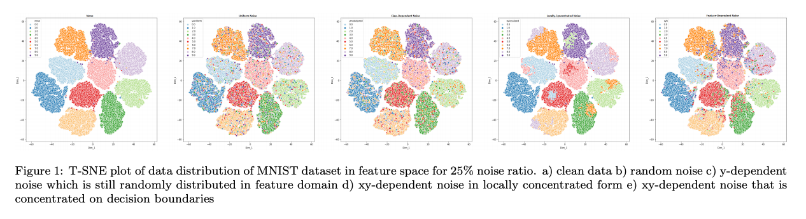

### Sources of Label Noise
라벨 노이즈는 데이터셋 모으는 과정이나 다양한 도메인에서 발생하는 문제이다.
이 글은 이러한 문제에 대한 다양한 솔루션에 초점을 맞추고 있지만, 현상을 더 잘이해하기 위해 라벨 노이즈의 원인을 조사하는 것도 도움이 될것이다.

먼저, 웹과 소셜 미디어에서 데이터를 얻기 위해 어지러운 사용자 그나, search engine을 사용한 자동화 시스템을 사용할 것이다.
이런 과정은 노이즈 라벨을 얻게 한다.

두번쨰로, 데이터셋은 여러 전문가가 레이블을 지정하여 다중 레이블 데이터 세트를 만들 수 있다. 
각 전문가들의 전문 수준이 다양하고, 그들의 의견이 서로 충돌할 수 있다.
한 전문가보다 다양한 전문가를 통해 데이터를 얻어야 하는 몇가지 이유가 있다. 
여러 전문가는 서로의 예측 결과에 대해 double-check를 할 수 있다.
하지만 전문가를 이용하는 것 보다 crowd-source 플랫폼을 통한 라벨링은 빅데이터 라벨링의 비용을 줄여준다.
하지만 이 방법은 전문적이지 않기 때문에 많은 노이즈를 추가할 수 있다.
몇몇 라벨러들은 완전히 랜덤하게 선택하는 스패머일 수 있다.

세번째로, 데이터는 전문 분야에 있는 사람에게 조차 너무 복잡할 수 있다. 이런 복잡성은 전문 경험이 부족하거나 라벨링 경험이 부족할 때 온다.

마지막으로 라벨 노이즈는 정규화 또는 poisoning의 목적으로 부터 올 수 있다. 

### Methodologies
알고리즘 분류 방법 중 하나는 noise free subset의 필요성에 따라 분류할 수 있다.
* noise model based: 노이즈 구조에 대한 정보가 학습 과정에 쓰임
    * 일반적으로 학습 중 noise에 대해 무시하거나, de-emphasizing을 통해서 noise-free 정보를 추출하는 데 목적이 있다.
    * 나아가 다른 방법은 노이즈 라벨을 올바르게 수정하여 데이터 셋의 질을 높이는 데 목적이 있다.
        * 이 방법은 노이즈에 대한 정확한 예측에 따라 성능차이가 난다.
    * 노이즈 모델 기반 방법의 장점은 분류 및 라벨 노이즈 추정의 분리이며, 이는 분류 알고리즘으로 작업하는 데 도움이됩니다.
    * 또 다른 좋은 측면은 노이즈 구조에 대한 사전 지식이 있을 경우 시스템에 삽입 된이 추가 정보로 쉽게 시작할 수 있다는 것입니다.
    
* noise model free methods: 노이즈 구조에 대한 명확한 모델링 없이 노이즈에 강건한 전략을 개발하는 것이다.
    * 이런 접근 방식은 분류기는 노이즈에 민감하지 않고, 과적합으로 인해 성능 저하가 발생한다.
    * 그래서 주요 포커스는 정규화를 통해 과적합을 피하는데 집중한다. 

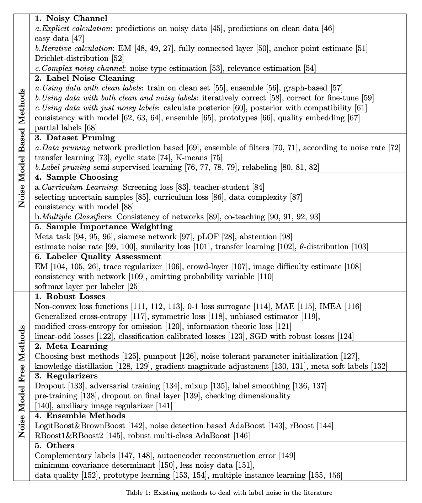

## Noise Model Based Methods
노이즈가 포함된 데이터셋 D_n을 돌면서 노이즈가 없는 숨겨진 분포인 D에 최적화된 estimator를 찾아내는 것이 목적이다.
mapping function M: D->D_n 을 알면, 노이즈 샘플의 효과를 역으로 계산할 수 있다. 
이 알고리즘은 노이즈 구조를 찾고, 예측한 노이즈 파라미터와 함께 베이스 분류기를 학습한다.
더 좋은 분류기를 학습하기 위해서는 더 좋은 M의 예측이 필요하고, 더 좋은 분류기는 M을 더 정확하게 예측한다.
따라서 chicken-egg 문제에 봉착한다.

### Noisy Channel
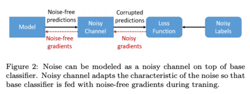  

Objective function은 아래의 Risk 식을 최소화 하는 것이다.   

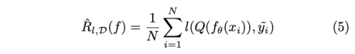  

* l: loss function 
* Q(f(x)) = T*f(x)
* T: noise transition matrix
* T_ij = p(y^=j | y=i)
    * 주어진 true label이 noise label로 나타날 확률
* 주어진 라벨 분포와 매치 하면서 예측 결과를 수정하는 것이므로 loss-correction 이라고도 부름 
* 이 방식의 단점은 확장성이다. 클래스의 수가 증하가면 transition matrix T의 크기가 지수적으로 증가하기 때문이다.
* 이런 문제를 피하기 위해서 가장 가능성있는 노드나, 미리 정의한 노드만을 연결하여 사용하기도 한다.
    * 이런 제한은 사람의 경험으로 결정하기 때문에 추가적인 노이즈가 주입될 수 있다.
* 노이즈 채널은 오직 학습 과정에서만 사용한다. 검증 과정에서 분류기의 예측은 noise-free 이기 때문이다.
* 이런 접근 방식은 noise channel parameter 예측에 매우 큰 영향으르 받는다. 그래서 주요 포커스는 Q 를 예측하는 데 있다.

노이즈 채널을 만드는 방식은 아래와 같다.

#### 1. Explicit calculation
* 분류기는 처음에 easy 데이터 셋으로 학습하여 클래스간의 관계 유사성을 학습하도록 하고,
  그 다음 계산한 유사도 매트릭스를 noise transition matrix로 활용한다.
* 다른 방법은 confusion matrix를 노이즈 데이터와 깨끗한 데이터 모두에서 구하는 것이다. 
  그리고 두 confusion matrix 간의 차이를 transition matrix로 활용한다. 

#### 2. Iterative calculation
* Noise matrix는 베이스 분류기를 학습 하는 과정에서 점진적으로 예측된다.
* EM(Expectation maximization)을 사용하여 학습 과정에서 주어진 분포와 주어진 예측에서의 noise transition matrix의 예측간 매칭을 수행한다. 
* 특정 클래스에 속한다는 것을 확신할 수 있는 anchor point에 대한 class probability를 사용하여 noise transition matrix를 설계한다. 
* 단, noise-free subset이 없을 경우 anchor point는 높은 노이즈 클래스 사후 확률을 이용해 추출한다. 
* matrix는 학습 과정에서 loss를 최소화 하는 방향으로 업데이트 된다.
* softmax probability를 사용하는 대신 noise transition matrix는 Dirichlet-distributed 공간(사전 켤레 확률)으로 투영 함으로써 베이지안 형식으로 모델링한다. 

#### 3. Complex noisy channel
* 단순히 네트워크의 결과 뿐만 아니라 data에 대한 추가적인 정보를 사용한다.
* 예를 들어 label noise type(no noise, random noise, structed noise) 에 대한 정보를 얻기위해 추가적 CNN을 이용하여 노이즈 타입을 해석하고 
  이를 같이 활용하여 예측 라벨과 노이즈 라벨들을 매칭한다.
  
### Label Noise Cleaning
가장 명백한 솔루션은 노이즈 라벨을 찾고, 올바르게 수정하는 것이다.
하지만 전체 데이터 셋을 일반적인 방식으로 cleaning 하는 것은 매우 비싼 작업이다.
그래서 몇몇 작업은 오직 의심이 가능 샘플 들만을 라벨러에게 보내서 재 라벨링을 하게 끔 했다.
하지만 이 방법 역시 확장성 있는 방법이 아니다.
이를 해결하기 위한 여러가지 알고리즘이 개발되었다.
라벨 수정 알고리즘이 들어간 risk 식은 아래와 같다.

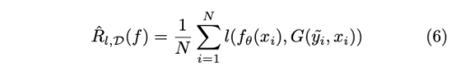  

* G(y^, x) = p(y|y^, x) : label cleaning algorithm
* G는 feature extractor에 의존하여 데이터를 feature domain에 맵핑하여 noiseness를 조사한다.
* 몇몇은 pre-trained network를, 다른 이들은 베이스 분류기를 feature extractor로 사용한다. 
* 이는 iterative framework로 classifier가 정확할 수록 label cleaning이 더 정확해지고, 라벨의 질이 좋아질 수록 분류기의 성능은 더 좋아진다.
* 이런 방법은 노이지 라벨이 있는 샘플들에서 정보를 제공하는 hard sample을 구별하기 어렵게 만든다. (hard sample을 노이즈 샘플로 분류해버릴 수 있기 때문)
    * 그 결과 너무 많은 샘플을 지워 버리거나 라벨을 바꿔버릴 수 있다.

cleaning 알고리즘은 clean 데이터의 필요 유무에 따라 나눌 수 있다. 

#### 1. Using data with clean labels
* 만약 clean 데이터가 모델을 학습시키기에 충분하다면, clean data로 학습한 모댈을 이용해서 noisy label 데이터를 수정하면 된다.
* 그리고 relabeling을 위해서 주어진 noisy label과 predicted label 간의 alpha blending을 사용
* 모델 앙상블을 사용해서 모든 모델이 해당 라벨에 동의하면 예측된 라벨로 변경하고, 그렇지 않으면 임의의 라벨을 배정한다.
    * 노이즈 라벨을 그대로 유지하는 대신 랜덤 라벨을 배정할 경우, 노이즈 구조를 탈피할 수 있게 하고, 노이즈가 라벨 공간에서 uniform하게 분포할 수 있게 한다.
    
#### 2. Using data with both clean and noisy labels
* 노이즈 라벨과 사람이 이를 올바르게 수정한 데이터 셋 쌍이 추가적으로 있을 경우 
* label cleaning network
    * input: noisy label, extracted feature (noisy data)
    * loss: | 사람이 수정한 라벨 - predicted label |
    * output: correct label 
* label cleaning network와 베이스 분류기는 jointly하게 학습한다.
* label cleaning network는 노이즈 라벨을 사람이 올바르게 수정한 데이터 쌍에서 label을 올바르게 예측하는 방법을 배우고,
  베이스 분류기에 noisy data의 수정한 라벨을 제공한다.

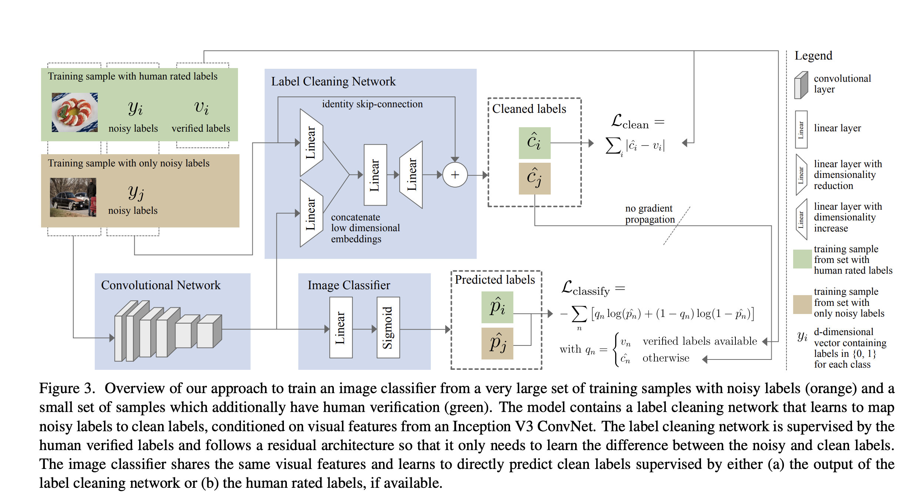  


#### 3. Using data with just noisy labels
* noise-free 데이터 셋이 없을 경우, 더 깨끗한 사후 라벨 분포로 점진적으로 수정해 나간다.  
    * 하지만 이런 방법은, 학습 정확도를 높이기 위해 결국 모든 라벨을 하나의 클래스로 바꿔 버리는 문제를 만들 수 있다.
    * 그래서 추가적인 정규화 방법을 사용한다
    * noisy label은 소수 그룹에 있다고 가정 하고, 
      사후 라벨 분포가 주어진 noisy label 분포로 부터 너무 발산하지 않도록 하는 추가적인 compatibility loss 를 사용 한다. 
      이렇게 함으로써 다수의 clean label을 잃지 않도록 한다.
* noisy data로 학습 시 모델은 먼저 올바르게 label된 데이터로 학습이 된 다음 노이즈 데이터에 과적합 한다고 주장한다. 
  그래서 학습 중 각 instance에 대한 loss value로 샘플이 noisy할 확률을 추정할 수 있다고 가정한다. 
    * 첫번째 단계에서, loss value를 이용해서 데이터셋을 clean, noisy set 두가지로 분류한다.
    * 두번째 단계에서, 노이즈 데이터의 실제 라벨을 예측하기 위해, 깨끗한 데이터에 대해 약한 분류기 앙상블 학습을 진행한다. 
    * 이 후, 노이즈 데이터를 수정하고 두 subset 데이터를 병합하여 사용한다.  
* 각 클래스에 대한 해당 클래스의 deep feature distribution을 표현할 수 있는 프로토타입을 구성하는 방법도 있다. 
  그 다음 데이터 샘플과 프로토타입간 유사성을 확인하여 수정된 라벨을 찾는다.
  

### Dataset Pruning
* noisy 라벨을 수정하는 대신, 그냥 삭제하는 방법이다. 
* 정보 손실을 가져오지만 성능 향상에 노이즈가 미치는 나쁜 영향을 방지할 수 있다.
* 이 방법은 너무 많은 샘플을 삭제할 수 있는 리스크가 있다. 그래서 불필요한 데이터 손실을 방지하기 위해 최대한 적은 샘플만을 삭제 하는 것이 핵심이다.

#### 1. Removing Data
* base network를 기준으로 잘못 분류된 데이터들을 삭제한다.
* 이때 노이즈 필터 앙상블 방법을 사용하여 모든 예측을 합산하여 가장 높은 noisiness level이 나올 경우 삭제한다.
* 이는 라벨 correction 방법으로 확장할 수 있는데, 다수의 노이즈 필터가 같은 라벨로 분류할 경우 해당 라벨을 수정할 수 있다. 
* 확률적 분류기를 사용햐여 학습 데이터를 두 subset으로 분리할 수 있다. (clean & noise)
    * noise rate: size of noise subset
    * 이 noise rate에 의존하여 base network의 결과에 대한 신뢰도를 고려하여, unconfident 한 샘플을 삭제 한다. 
* 네트워크의 learning rate을 cyclic 하게 조정하면서 네트워크 상태를 underfitting과 overfitting 사이를 싸이클릭하게 변하도록 한다.
  underfitting 될 경우 noisy sample에 대한 loss는 매우 클 것이고, 이 샘플을 지운다. 
* noisy data 로 모델을 학습 시킨 다음에 feature vector를 추출하고 k-means 알고리즘으로 클러스터링 한 후, outlier를 삭제한다.

#### 2. Removing Labels
* 가장 간단한 옵션은 labeled 데이터, unlabeled 데이터로 semi-supervised learning을 수행하는 것이다.
* 주어진 라벨과 model 예측 결과에 대한 moving average 간의 consistency를 사용하여 label의 노이즈 유무를 판단한다. 
  다음 iteration에서는 clean sample 에 대해서만 학습을 진행한다. 주어진 라벨이 아니라 prediction label과 비교하는 방법도 있다
* clean이 대다수 라는 가정하에 labeled, unlabeled data를 랜덤하게 나누고, 수행할 수도 있다

### Sample Choosing
minimize 해야할 목적 risk 식은 아래와 같다.  
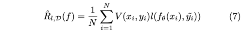  
* V(x, y) = {0, 1} : decide to whether use the given data (x, y) or not
* V가 static function 이었으면 모든 학습 과정에서 똑같은 샘플만을 선택하게 되므로, dataset pruning과 같은 의미를 가진다
* 이와 다르게, 샘플 선택 방식이 지속적으로 베이스 분류기를 모니터 하면서 다음 학습 iteration을 위해서 샘플 선택을 하는 것이다.

#### 1. Curriculum Learning
* 인간의 인지에서 영감을 얻은 CL은 쉬운 샘플에서 시작하여 훈련을 guide 하기 위해 더 어려운 샘플을 거치도록 제안한다
* 이런 학습 전략은 self-paced learning(자기 주도 학습)이라고 한다.
* CL은 쉬운 샘플에 초점을 맞추기 때문에 학습 속도를 느리게한다고 주장하면서, 훈련 중에 때때로 잘못 예측되는 불확실한 샘플을 선택하도록 제안한다. 
  노이즈가 많은 샘플 항상 잘못 예측되어야하므로은 이러한 샘플은 노이즈가 없는 것으로 간주됩니다.
* data가 덜 복잡할 수록 더 많은 clean label이 있을 것이라고 기대할 수 있다. 
  따라서 학습은 덜 복잡한 데이터로 시작하고 점차 복잡한 데이터로 학습을 한다.
    * 이때 다음 샘플은 네트워크의 예측 결과의 consistency로 선택할 수 있다.
    * 만약 데이터 라벨과 모델 예측이 일치할 경우 학습 데이터로 선택한다. 
* 그러나 모델이 너무 회의적이어서 망상적인 방식으로 라벨을 선택할 위험이 있다. 따라서 일관성 균형이 설정되어야한다. 

#### 2. Multiple Classifiers
* 여러 분류기를 사용하여 학습 할 다음 데이터 배치를 선택하는 데 도움을 준다.
    * 학습 된 표현의 차이로 인해 네트워크가 서로의 실수를 수정할 수 있으므로 여러 모델이 견고성을 제공 할 수 있다.
    * 이 설정이 작동하려면 분류기 초기화가 필수적이다. 가중치 초기화가 동일한 경우 레이블에 동의하지 않기 때문에 업데이트가 없기 때문이다.
    * 레이블은 두 네트워크가 주어진 레이블과 일치하지 않으면 잡음이있는 것으로 가정하고 모델 가중치에 대한 업데이트는 두 네트워크의 예측이 충돌 할 때만 발생합니다.
* 공동 교육의 패러다임이 소개되며, 두 네트워크는 서로에 대해 다음 데이터 배치를 선택한다. 
    * 다음 배치는 쌍 네트워크에 따라 손실 값이 작은 데이터 배치로 선택한다.
    * 하나의 네트워크를 사용하면 잡음 관련 오류가 누적되는 반면 두 개의 네트워크는 잡음 오류를 더 성공적으로 필터링한다고 주장한다.
    * 공동 교육을 사용하는 또 다른 작업은 먼저 주어진 시대 수에 대해 선택된 하위 집합에서 두 개의 네트워크를 훈련시킨 다음 전체 데이터 세트로 이동한다.
  
### Sample Importance Weighting
Sample choosing과 유사하지만, 각 instance에 noise level에 따라 weight를 배정한다.
깨끗한 데이터가 더 강조되어 모델 업데이트가 더 잘되도록 한다.
minimize 해야하는 risk는 아래와 같다.  

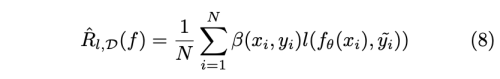  
* b(x, y): instance dependent weight, not binary value, dynamic function(학습 중 계속 바뀜)
* 학습중 b가 너무 빠르고 sharp 하게 바뀌지 않도록 하는 것이 중요
* 학습 중 누적된 에러에 영향을 많이 받아서 편향된 subset 데이터를 얻기 쉬움 
* 그래서 이런 negative effect를 없애는 데 많은 집중을 함 

#### 1. Meta-learning
* 긱 iteration 에서 주어진 mini-batch의 weighting factor를 위해서 gradient descent step을 수행한다. 
* 절대적인 계산 방식 대신 MLP를 사용하여 weighting function을 예측하기도 한다.

#### 2. Siames Network
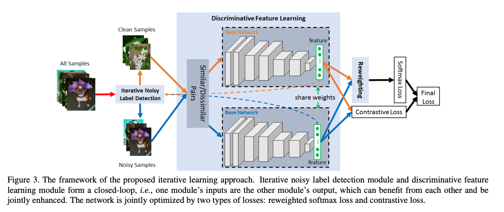  
* 같은 클래스의 데이터쌍과 다른 클래스의 데이터 쌍을 Siames 네트워크에 넣어 Constrastive loss로 학습 
* 이와 동시에 iterative하게 계산되는 weighting factor로 분류기를 학습함으로써, 노이즈 샘플을 reweighting 할 수 있다.

#### 3. Abstention
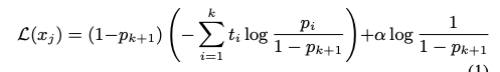  
* 혼란을 주는 샘플을 버리게끔 하고, 대신 모든 샘플을 버리지 않게 abstention penalty를 준다. 

### Labeler Quality Assessment
각 라벨러는 서로 다른 전문성 레밸을 가지고 있다. 
그래서 서로의 라벨이 충돌할 수 있다. 이는 특히 crowd-source 데이터나, 높은 전문성을 요구하는 데이터에서 극명하게 나타난다. 
이 경우 노이즈 라벨러의 특성을 알 수 없고, gt-label도 알 수 없다.
만약 노이즈가 y-dependent하면 noise transition matrix를 이용해 라벨러의 특징을 모델링 할 수 있다. 
xy-dependent할 경우 데이터의 복잡성을 고려해야 한다. 라벨러와 모델의 예측 일치성을 고려하여 라벨러의 신뢰도를 측정할 수 있다.
각 라벨러를 위해 분리된 softmax layer를 학습하고 추가적인 네트워크가 true class를 예측한다. 
이를 셋팅은 각 라벨러를 모델링할 수 있고, 분리된 네트워크로 노이즈 구조를 탈피할 수 있게 한다. 

## Noise Model Free Methods
이 방법은 모델링 없이 라벨 노이즈에 강인하게 학습하도록 하는 것이다.
노이즈 데이터를 anomaly라고 가정하므로, 이 방법은 overfit을 피하는 것과 유사하다.
분류기의 internal 노이즈 tolerance에 의지하고, regularizing을 이용해 노이즈 데이터를 memorization하는 것을 피하게 한다.

### Robust Loss
* loss function이 노이즈가 존재해도 성능이 저하되지 않게 디자인 된다.
* loss(f(x), y) = C (C is constant)일 경우 loss function이 uniform noise에 관대하도록 한다.
* CCE(Categorical Cross Entropy) 보다 MAE(Mean Absolute Cross Entropy)가 더 노이즈에 관대하다. 
    * CCE는 abnormal 샘플에 민감하지만, MAE는 모든 데이터 포인트를 똑같이 여기기 떄문이다. 
    * 하지만 underfitting 을 야기할 수 있기 때문에, IMAE(Improved MAE)를 제안한다.
    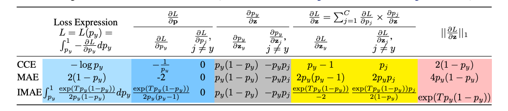  
* CE loss는 not symmetric 하다 l(f(x), y) != l(y, f(x)). 
    * symmetric CE로 노이즈 라벨을 강건하게 처리할 수 있다. l(f(x), y) + l(y, f(x)) 
* 노이즈 사전 확률을 알고 있을 때, Proxy Surrogate Losses를 제안한다
    * 0-1 loss가 일반적 convex loss보다 robust 하다
    * 1{y=1} : 0-1 loss, a: (1-p)/2, l: convex loss function
    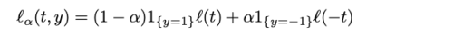  
* 높은 confident로 prediction 했는데, label과 달랐을 경우 노이즈로 인식하여 적게 penalty를 주는 CE 구상

### Meta Learning
* 메타러닝은 단순히 task에 대한 복잡한 기능을 학습할 뿐만 아니라 학습하는 법을 학습한다.
* 메타 목적을 위해 추가적은 learning loop를 도입한다.
* 이 방법의 단점은 계산 비용의 증가에 있다. 
* Pumpout 방식은 메타 목적을 scaled gradient ascent를 이용해서 노이즈 라벨로부터 받은 피해를 회복하는데 있다.
* model-agnostic-meta-learning(MAML)은 최적의 weight initialization을 찾는다. 
    * 다양한 task에 동시에 학습 시켜서 새로운 task에도 빠르게 adapt 할 수 있게 하는 방식
* Student-teacher 방식으로 최적의 weight initialization을 찾음 
    * 다수의 student 네트워크를 합성 노이즈 데이터로 학습 
    * teacher 모델은 raw data(합성 제외)에 일관된 예측을 하게끔 학습 
    * student는 합성 노이즈 데이터가 에폭마다 바뀜에도 불구하고 일관된 예측을 할 수 있게 robust 하게끔 학습된다. 
    * 마지막으로 이 student들의 weight을 exponential moving average로 구해 initialize로 사용 
* clean 데이터를 얻을 수 있을 경우
    * teacher model을 clean 데이터로 학습하고 student에 transfer 하는 방식 
    * teacher 기반으로 gradient를 조정할 수도 있음 
    

### Regularizers
* Overfitting 을 방지하는 기능
* 노이즈가 random noise일 경우 효과적인 방법이다.
* 가장 많이 쓰이는 방법은 dropout, weight decay, adversarial training, mixup, label smoothing 등이 있다
* 모델 dimensionality를 작은 수부터 큰 수로 변경시키며, 복잡도가 증가하며 overfit 하기 전에 stop 
* 다른 도메인 데이터셋으로 pre-train 한 후, noisy labeld dataset으로 fine-tune

### Ensemble Methods
* AdaBoost 알고리즘은 overfitting 위험이 큼
* BrownBoost, LogitBoost 알고리즘 사용

