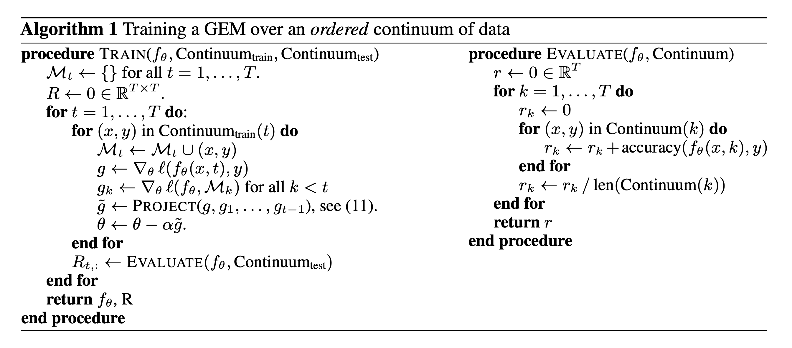
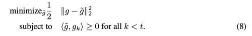
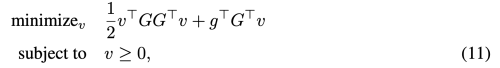
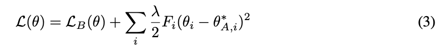
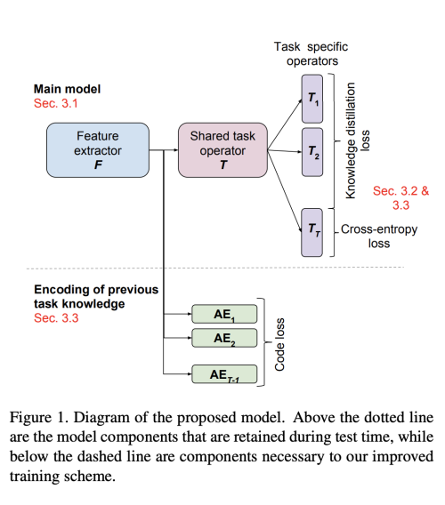
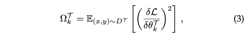
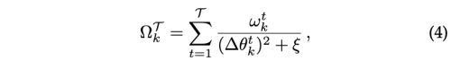

---
layout: post  
title: (A Continual Learning Survey) Defying forgetting in classification tasks  
subtitle: AI Survey     
tags: [ai, ml, computer vision, continual learning, lifelong learning, task incremental learning, image classification]    
comments: true  
---  

딥러닝 네트워크는 별개의 훈련단계에서 일반화된 학습을 통해 지식을 습득한다. 하지만 이 지식은 정적인 실체이며, 원래 task를 목표로 하지 않고 이 지식을 확장하려고 하면 
네트워크의 치명적인 망각 현상을 초래할 수 있다. 
Continual Learning은 새롭게 다시 학습할 필요 없이 서로 다른 task 간에 누적 학습이 가능하도록 하는 패러다임이다. 


```
proceeding: 2021
Authors: Matthias De Lange, Rahaf Aljundi, Marc Masana, Sarah Parisot, Xu Jia,
Ales Leonardis, Gregory Slabaugh, Tinne Tuytelaars 
```

[Paper Link](https://ieeexplore.ieee.org/stamp/stamp.jsp?tp=&arnumber=9349197)  
[Source Code](https://github.com/MATTDL/CLSURVEY)

## Introduction
* Continual Learning: 끝없는 데이터 stream 에서 지식을 점진적으로 확장해 나가고, 이를 미래의 learning에 사용 할 수 있는 방법이다.
* 동의어: Sequential Learning, incremental Learning, lifelong learning
* 주요 challenge: catastrophic forgetting (새로운 task, domain을 학습할 때 이전에 배웠던 지식을 잊어먹지 않게 하는 것이 중요)
* stability-plasticity 딜레마

## Continual Learning Approach
### Replay Methods
이 작업 라인은 샘플을 원시 형식으로 저장하거나 생성 모델을 사용하여 pseudo 샘플을 생성합니다. 
이 이전 작업 샘플은 잊어 버리는 것을 완화하기 위해 새로운 작업을 학습하는 동안 재생됩니다.
리허설을 위해서 이 데이터를 input으로 재사용하여 새로운 task에 대해서 최적화 수행시 이전 task에 대한 간섭을 방지한다.
Rehearsal methods은 새로운 task에 대해 학습할 때 명시적으로 제한된 저장된 데이터의 subset을 사용하여 재학습 시킨다. 

가장 주목할 만한 것은 class incremental learner iCaRL 이다.
학습된 feature space에서 각 class의 평균에 가장 근접한 subclass를 선택하여 저장한다.
테스트 time에 모든 샘플에 대해서 nearest-mean classification을 위해 평균을 계산한다.

Rolnick et al. 은 data incremental learning에서 고정된 budget을 만족시키기 위해 제한된 수의 샘플링을 수행하는 방법인 reservoir 샘플링을 제안한다. 
Continual Prototype Evolution(CoPE)은 최근접 평균 분류기 접근 방식과 효율적인 reservoir 기반 샘플링 방식을 결합합니다.

반면 리허설 방식은 저장된 샘플의 하위 집합에 과적합 되는 경향이 있고, 공동 훈련에 의해 제한되는 것처럼 보이지만,  
constrained optimization은 backward/forward transfer를 위해 더 많은 여유를 남겨두는 대안 솔루션이다.

**GEM(Gradient Episodic Memory)** 에서는 incremental setting에서 오직 새로운 task의 업데이트에 대해서만 constraint를 가한다.
이는 이전 task gradient를 first order Tayer series approximation을 통해서 예측 gradient direction을 구함으로써 수행한다.
  
* M: Memory 
* T: Task
* Project
    
  위 Quadratic problem을 풀기 위해 재정의 하면 아래와 같은 식으로 바꿀 수 있다.  
    
  * G = −(g1, . . . , gt−1)
  * g˜ = Gv + g

#### GEM 구현 예시
기존 class의 순서가 유지 되면서 새로운 class가 추가되는 시나리오에 한함

* Utility Code

```python
import torch
import numpy as np
import quadprog

# Auxiliary functions useful for GEM's inner optimization.
def store_grad(pp, grads, grad_dims, tid):
    """
        This stores parameter gradients of past tasks.
        pp: parameters
        grads: gradients size=(num_total_parameter, num_task)
        grad_dims: list with number of parameters per layers
        tid: task id
    """
    # store the gradients
    grads[:, tid].fill_(0.0) # 초기화 
    cnt = 0
    for param in pp():
        if param.grad is not None:
            beg = 0 if cnt == 0 else sum(grad_dims[:cnt]) # parameter 사이즈의 누적 합 
            en = sum(grad_dims[:cnt + 1])
            grads[beg: en, tid].copy_(param.grad.data.view(-1))
        cnt += 1

def overwrite_grad(pp, newgrad, grad_dims):
    """
        This is used to overwrite the gradients with a new gradient
        vector, whenever violations occur.
        pp: parameters
        newgrad: corrected gradient
        grad_dims: list storing number of parameters at each layer
    """
    cnt = 0
    for param in pp():
        if param.grad is not None:
            beg = 0 if cnt == 0 else sum(grad_dims[:cnt])
            en = sum(grad_dims[:cnt + 1])
            this_grad = newgrad[beg: en].contiguous().view(
                param.grad.data.size())
            param.grad.data.copy_(this_grad)
        cnt += 1


def project2cone2(gradient, memories, margin=0.5, eps=1e-3):
    
    """
        Solves the GEM dual QP described in the paper given a proposed
        gradient "gradient", and a memory of task gradients "memories".
        Overwrites "gradient" with the final projected update.
        input:  gradient, p-vector, 현재 task의 gradient 
        input:  memories, (t * p)-vector (이전 task의 gradient 들)
        output: x, p-vector (projecting current task gradient if necessary)
        margin: higher = more memory strength
    """
    memories_np = memories.cpu().t().double().numpy()
    gradient_np = gradient.cpu().contiguous().view(-1).double().numpy()
    t = memories_np.shape[0] # number of task 
    P = np.dot(memories_np, memories_np.transpose())
    P = 0.5 * (P + P.transpose()) + np.eye(t) * eps
    q = np.dot(memories_np, gradient_np) * -1
    G = np.eye(t)
    h = np.zeros(t) + margin
    v = quadprog.solve_qp(P, q, G, h)[0]
    x = np.dot(v, memories_np) + gradient_np
    gradient.copy_(torch.Tensor(x).view(-1, 1))

```

* Continual Learning Model

```python
import torch
import torch.nn as nn
from torch.autograd import Variable
import copy
import torch.optim as optim

class Net(nn.Module):
  
    def __init__(self, n_outputs, n_tasks, args):
        # Prepare Continual Learning Setting
        
        super(Net, self).__init__()
        self.net = torch.load(args.prev_model_path)
        
        last_layer_index = str(len(self.net.classifier._modules) -1)
        # last layer num of input filters
        num_ftrs = self.net.classifier._modules[last_layer_index].in_features
        
        # save original task layer
        original_head = copy.deepcopy(self.net.classifier._modules[last_layer_index])
        
        # 새로운 task로 마지막 layer 교체
        self.net.classifier._modules[last_layer_index] = nn.Linear(num_ftrs, n_outputs)
        
        # Copy old head weights into new head
        original_head_output_size = original_head.out_features
        self.net.classifier._modules[last_layer_index].weight.data[:original_head_output_size].copy_(
            original_head.weight.data)  
        self.net.classifier._modules[last_layer_index].bias.data[:original_head_output_size].copy_(
            original_head.bias.data) 
        del original_head

        # allocate episodic memory
        self.memory_data = None
        self.memory_labels = torch.LongTensor(n_tasks, args.n_memories)

        # allocate temporary synaptic memory
        self.grad_dims = [] # size : (num_parameter), 파라미터의 사이즈를 저장 
        for param in self.parameters():
            self.grad_dims.append(param.data.numel())
        self.grads = torch.Tensor(sum(self.grad_dims), n_tasks) # size: (num_total_parameter, n_tasks), task 별 gradient의 합을 저장 
        
        # allocate counters (num class per task)
        self.cum_nc_per_task = [sum(args.nc_per_task[:idx + 1]) for idx, nc in enumerate(args.nc_per_task)]
        
        self.observed_task = []
        
    def compute_offsets(self, task_idx, cum_nc_per_task):
      """
          Compute offsets (for cifar) to determine which
          outputs to select for a given task.
          Output idxs: [offset1, offset2[
      """
      if task_idx == 0:
          offset1 = 0
      else:
          offset1 = int(cum_nc_per_task[task_idx - 1])
      offset2 = int(cum_nc_per_task[task_idx])
      return offset1, offset2
    
    def forward(self, x, task, args=None, train_mode=False, p_retain_unit=0.5):
        output = self.net.classifier(x)
        
        # make sure we predict classes within the current task (1 head)
        offset1, offset2 = self.compute_offsets(task, self.cum_nc_per_task)
        if offset1>0:
            output[:, :offset1].data.fill_(-10e10)
        if offset2 < self.n_outputs:
            output[:, offset2:self.n_outpts].data.fill_(-10e10)
        return output

    def train_cl(self, x, task, y, paths, args=None):
      
        # compute gradient on previous task and train
        if len(self.observed_task) > 1:
            for tt in range(len(self.observed_task)-1):
                self.zero_grad()
                
                past_task = self.observed_task[tt]
                offset1, offset2 = self.compute_offsets(past_task, self.cum_nc_per_task)
                
                # 해당 task의 dataset을 가져옴 
                transform = args.task_imgfolders['train'].transform
                input_imgfolder = self.memory_data.convert_imagefolder(transform, self.memory_labels, entry=past_task)
                input_dataloader = self.memory_data.get_dataloader(input_imgfolder, batch_size=args.batch_size)
                        
                # 해당 task의 dataset으로 gradient를 계산 
                for data in input_dataloader:
                    inputs, targets = data
                    outputs = self.forward(inputs, past_task)[:, offset1: offset2]
                    ptloss = self.ce(outputs, targets)
                    ptloss.backward()
                
                # 해당 task의 gradient를 self.grads에 저장 
                store_grad(self.parameters, self.grads, self.grad_dims, past_task)

        # now compute the grad on the current minibatch
        self.zero_grad()

        offset1, offset2 = self.compute_offsets(task, self.cum_nc_per_task)
        outputs = self.forward(x, task)[:, offset1: offset2]

        _, preds = torch.max(outputs.data, 1)
        correct_classified = torch.sum(preds == y.data)
        loss = self.ce(outputs, y)  # No offset to y! (task-specific labels, task-specific output)
        loss.backward()
        
        # check if gradient violates constraints
        if len(self.observed_tasks) > 1:
            # copy gradient
            store_grad(self.parameters, self.grads, self.grad_dims, task)
            indx = torch.cuda.LongTensor(self.observed_tasks[:-1]) # current is not yet observed
            dotp = torch.mm(self.grads[:, task].unsqueeze(0),  # matrix multiplication:
                            self.grads.index_select(1, indx))
            
            constraint_violations = (dotp < 0).sum() # 현재와 이전 task들의 gradient 방향이 서로 반대일 경우 
            if constraint_violations != 0:
                batch_stats['projected_grads'] = [constraint_violations.item()]
                # gradient projection
                project2cone2(self.grads[:, task].unsqueeze(1),  # Gradient current task
                              self.grads.index_select(1, indx), self.margin)  # All gradient vectors of previous tasks
                # copy gradients back
                overwrite_grad(self.parameters, self.grads[:, task],
                               self.grad_dims)
        self.opt.step()

        return loss, correct_classified, batch_stats
```

A-GEM(Average-GEM)은 이전 task data의 버퍼에서 랜덤하게 선택한 샘플을 통해서 direction을 예측한다. 
Aljundi et al은 task 경계가 없는 순수한 online continual learning 설정에 대한 솔루션으로, 과거 데이터의 실현 가능한 영역에 최대한 근접한 샘플 하위 집합을 선택하도록 제안한다.

만약 이전의 샘플이 없다면, pseudo rehearsal 을 대체 전략으로 사용할 수 있다. 
랜덤한 input으로부터 얻은 이전 모델의 output은 이전 task 샘플을 근사할 수 있다.
하지만 deep network와 large input vector에서는 random input은 input space를 커버할 수 없다.
최근, generative model은 고품질 이미지를 생성하고 이를 재 학습하는데 사용할 수 있지만 이는 오히려 더 복잡한 방법일 수 있다.

### Regularization-based methods
이 방법은 이전 task들의 데이터를 저장함으로써 얻는 프라이버시 이슈와 memory 이슈를 해결하기 위해 고안되었다.
새로운 task에 대해서 학습할 때 이전의 지식을 고려하게끔 loss function에 regularization을 수행한다.

#### Data-focused methods
이 방법의 기본 개념은 새로운 task를 학습할 때 이전 모델로부터 knowledge distillation을 수행하는 것이다.
Silver et al.은 새로운 task의 input에 대한 previous task model의 output을 이용한다. 
LwF은 previous model 의 output을 soft label로 사용한다.
하지만 이 방법은 domain shift에는 취약하다.
이를 극복하기 위해 Triki 은 얕은 autoencoder의 점진적인 통합을 촉진하여 해당 저차원 공간에서 학습된 task feature를 제한한다.

#### Prior-focused methods
모델 파라미터의 distribution을 예측하여, 새로운 데이터를 학습할 때 prior로 활용한다.
일반적으로 모든 신경망의 매개변수의 중요성은 타당성을 보장하기 위해 독립적이라고 가정한다.
later task에 대해 학습 중, 중요한 매개변수에 대한 변경은 패널티를 받는다.

**EWC(Elastic Weight Consolidation)** 은 가장 먼저 제안된 방법이다.
  
* F: Fisher information matrix

##### EWC 구현 예시 
현재 파라미터와 이전 파라미터의 차이에 대한 피셔 정보량이 작도록 학습
* 피셔 정보량: 미지의 모수에 대해서 데이터 X가 제공할 수 있을 정보량

* Prepare regularize parameter

```python
import torch

def initialize_reg_params(model, freeze_layers=None):
    freeze_layers = [] if freeze_layers is None else freeze_layers
    reg_params = {}
    for name, param in model.named_parameters():
        if not name in freeze_layers:
            print('initializing param', name)
            omega = torch.FloatTensor(param.size()).zero_()
            init_val = param.data.clone()
            reg_param = {}
            reg_param['omega'] = omega
            # initialize the initial value to that before starting training
            reg_param['init_val'] = init_val
            reg_params[param] = reg_param
    return reg_params

# set omega to zero but after storing its value in a temp omega in which later we can accumolate them both
def store_prev_reg_params(model, freeze_layers=None):
    freeze_layers = [] if freeze_layers is None else freeze_layers
    reg_params = model.reg_params
    for name, param in model.named_parameters():
        if not name in freeze_layers:
            if param in reg_params:
                reg_param = reg_params.get(param)
                print('storing previous omega', name)
                prev_omega = reg_param.get('omega')
                new_omega = torch.FloatTensor(param.size()).zero_()
                init_val = param.data.clone()
                reg_param['prev_omega'] = prev_omega
                reg_param['omega'] = new_omega

                # initialize the initial value to that before starting training
                reg_param['init_val'] = init_val
                reg_params[param] = reg_param

        else:
            if param in reg_params:
                reg_param = reg_params.get(param)
                print('removing unused omega', name)
                del reg_param['omega']
                del reg_params[param]
    return reg_params

def diag_fisher(model, dset_loader, data_len):
    reg_params = model.reg_params
    model.eval()

    for data in dset_loader:
        model.zero_grad()
        x, label = data
        
        output = model(x)
        loss = torch.nn.functional.nll_loss(torch.nn.functional.log_softmax(output, dim=1), label, size_average=False)
        loss.backward()

        for n, p in model.named_parameters():
            if p in reg_params:
                reg_param = reg_params.get(p)
                omega = reg_param['omega']
                omega += p.grad.data ** 2 / data_len  # Each datasample only contributes 1/datalength to the total
                reg_param['omega'] = omega
    return model


# set omega to zero but after storing its value in a temp omega in which later we can accumolate them both
def accumelate_reg_params(model, freeze_layers=None):
    freeze_layers = [] if freeze_layers is None else freeze_layers
    reg_params = model.reg_params
    for name, param in model.named_parameters():
        if not name in freeze_layers:
            if param in reg_params:
                reg_param = reg_params.get(param)
                print('restoring previous omega', name)
                prev_omega = reg_param.get('prev_omega')
                prev_omega = prev_omega.cuda()

                new_omega = (reg_param.get('omega')).cuda()
                acc_omega = torch.add(prev_omega, new_omega)

                del reg_param['prev_omega']
                reg_param['omega'] = acc_omega

                reg_params[param] = reg_param
                del acc_omega
                del new_omega
                del prev_omega
        else:
            if param in reg_params:
                reg_param = reg_params.get(param)
                print('removing unused omega', name)
                del reg_param['omega']
                del reg_params[param]
    return reg_params


def accumulate_EWC_weights(dset_loader, dset, model_ft, batch_size):
    """
    accumulate fisher information matrix with the previously computed one,
    if this is the first task then initialize omega to zero and compute current fisher.
    """
    # in case of the first task, initialize reg_params to zero
    if not hasattr(model_ft, 'reg_params'):
        reg_params = initialize_reg_params(model_ft)
        model_ft.reg_params = reg_params
        
    # store previous omega values (Accumulated Fisher)
    reg_params = store_prev_reg_params(model_ft)
    model_ft.reg_params = reg_params
    
    # compute fisher
    data_len = len(dset)
    model_ft = diag_fisher(model_ft, dset_loader, data_len)
    # accumulate the current fisher with the previosly computed one
    reg_params = accumelate_reg_params(model_ft)
    model_ft.reg_params = reg_params

    return model_ft

```

* Optimizer

```python
class Weight_Regularized_SGD(optim.SGD):
    r"""Implements stochastic gradient descent with an EWC penalty on important weights for previous tasks
    """

    def __init__(self, params, lr=0.001, momentum=0, dampening=0,
                 weight_decay=0, nesterov=False):
        super(Weight_Regularized_SGD, self).__init__(params, lr, momentum, dampening, weight_decay, nesterov)

    def __setstate__(self, state):
        super(Weight_Regularized_SGD, self).__setstate__(state)

    def step(self, reg_params, closure=None):
        """Performs a single optimization step.
        Arguments:
            closure (callable, optional): A closure that reevaluates the model
                and returns the loss.
            reg_params: a dictionary where importance weights for each parameter is stored.
        """

        loss = None
        if closure is not None:
            loss = closure()
        index = 0
        reg_lambda = reg_params.get('lambda')  # a hyper parameter for the EWC regularizer

        for group in self.param_groups:
            weight_decay = group['weight_decay']
            momentum = group['momentum']
            dampening = group['dampening']
            nesterov = group['nesterov']

            for p in group['params']:
                if p.grad is None:
                    continue
                d_p = p.grad.data

                # This part is to add the gradients of the EWC regularizer

                if p in reg_params:
                    # for each parameter considered in the optimization process
                    reg_param = reg_params.get(
                        p)  # get the corresponding dictionary where the information for EWC penalty is stored
                    omega = reg_param.get('omega')  # the accumelated Fisher information matrix.
                    init_val = reg_param.get('init_val')  # theta*, the optimal parameters up until the previous task.
                    curr_wegiht_val = p.data  # get the current weight value
            
                    # get the difference
                    weight_dif = curr_wegiht_val.add(-1, init_val)  # compute the difference between theta and theta*,

                    regulizer = weight_dif.mul(2 * reg_lambda * omega)  # the gradient of the EWC penalty
                    d_p.add_(regulizer)  # add the gradient of the penalty

                    # delete unused variables
                    del weight_dif, curr_wegiht_val, omega, init_val, regulizer
                # The EWC regularizer ends here
                if weight_decay != 0:
                    d_p.add_(weight_decay, p.data)
                if momentum != 0:
                    param_state = self.state[p]
                    if 'momentum_buffer' not in param_state:
                        buf = param_state['momentum_buffer'] = d_p.clone()
                    else:
                        buf = param_state['momentum_buffer']
                        buf.mul_(momentum).add_(1 - dampening, d_p)
                    if nesterov:
                        d_p = d_p.add(momentum, buf)
                    else:
                        d_p = buf

                p.data.add_(-group['lr'], d_p)
                index += 1
        return loss
```


Variational Continual Learning(VCL)도 비슷한 방법을 제안한다.
Zenke 은 weight의 중요성을 task training중 online으로 예측하는 방법을 제안했다.
Aljundi 은 유연성을 증가시키고, online user adaptation을 허용하는 unsupervised 방식으로 중요성을 예측하는 방법을 제안한다. 

#### Parameter isolation methods
모델 구조 사이즈에 제한이 없을 때, 새로운 task를 위해 새로운 branch를 더할 수 있을 경우 사용됨
이떄 previous task parameter는 고정하거나 각 모델에 사본을 적용한다.
previous task parts는 새로운 task 학습 중 masked out 한다.
이는 멀티 헤드 설정에 구속되어 서로의 공유 헤드에 대처할 수 없다.
이는 Expert Gate라는 방법으로 auto-encoder gate를 통해서 문제를 회피할 수 있다.


### Compared Methods
#### 1. Replay Methods
##### iCaRL 
class incremental 방법에 집중한 방식이다
각 클래스에 대한 feature mean과 가까운 샘플들을 선택하고 저장한다.
학습 중, 이전 모델 예측과 이전에 학습된 클래스에 대한 현재 모델 예측에서 얻은 대상 간의 distillation loss와 함께 새 클래스에 대한 추정 손실이 최소화 된다.

##### GEM
현재 task gradient를 previous task gradient의 feasible area에 projecting 함으로써 최적화 문제에 제한을 가한다.
작가는 관측된 증가된 backward transfer를 gradient projection으로 대체한다.

이 방법의 주요 단점은 클래스 수에 대한 확장성이 제한되어 raw input 샘플의 추가 계산 및 저장 등 추가 작업이 필요하다는 것이다.
하지만 고정 메모리는 메모리 소비를 제한하며, 원래 분포를 나타내는 표본 집합의 기능을 저하시킨다.
또한 raw sample의 저장은 개인정보 문제로 이어질 수 있다.

#### 2. Regularization-based methods
##### Learning without Forgetting (LwF)
새로운 task에 대해서 학습 전에, 새로운 task data에 대한 network의 output을 저장한다.
그리고 이는 prior task의 지식으로 학습에 사용한다.
하지만, 새로운 task의 데이터가 이전 task와 얼마나 관련있나에 많은 영향을 받는다.
데이터 분포의 shift는 점진적인 에러를 형성해낸다.
이런 에러는 class-incremental setup 에서도 생길 수 있다.
또다른 단점은 새로은 task data를 미리 모두 forward하고 저장함으로써 computational cost, memory cost가 추가적으로 필요하다는 것이다.

##### Encoder Based Lifelong Learning (EBLL)
LwF를 확장한 방법으로 previous task의 low dimensional feature representation의 중요성을 보존한다.
각 task를 위해서 under-complete autoencoder가 end-to-end로 최적화되고, lower dimensional manifold로 projecting 한다.
학습 과정에서, 추가적인 regularization term은 현재 예측이 이전 task의 최적 예측에서 벗어나는 것을 방지한다.
필요한 메모리는 작업수에 따라 선형적으로 증가하지만, auto-encoder의 크기는 backbone 네트워크의 작은 부분에 불과하다.
주요 계산 오버헤드는 auto-encoder 훈련에서 발생하고 최적화 샘플에 대한 기능 예측을 수집한다.   
  

##### Elastic Weight Consolidation (EWC)
베이지안 프레임워크에서 파라미터의 불확실성을 소개한다.
순차적 베이지안 추정에 따르면, previous task에 대한 사후 확률은 새로운 task의 사전확률을 구성하며, 이전 작업의 중요도 가중치를 전파하는 매커니즘을 구축한다.
실제 사후확률은 다루기 힘드므로, Fisher Information Matrix를 통한 Laplace 근사를 사용하여 추정한다.
최소 근처에서 FIM은 손실의 양의 준정부호 2차 도함수와 동등함을 보여주며, 실제로 추가 backward pass를 피하기 위해 경험적 FIM에 의해 근사화 된다.  
  
여기서 오메가는 task 학습 이후 weight의 중요성을 나타낸다. 
FIM은 최적화 작업 후 근사되어 0에 가까운 기울기를 유도하므로 정규화 강도가 처음에는 매우 높고 나중에는 정규화가 거의 없어진다.
이런 문제를 해결하기 위해 EWC의 변형이 제안된다. 

##### Synaptic Intelligence (SI)
EWC가 새로운 task의 importance weights를 학습 이후에 분리되어 구하는 반면, 학습 과정에서 online으로 추정한다.  
  
누적된 중요도 가중치는 EWC와 같이 task T 의 학습 이후에 여전히 업데이트 된다.
확률적 경사 하강법은 훈련중 근사 경사에서 노이즈를 발생시키므로 저자는 중요도 가중치가 과대평가되는 경향이 있다고 말한다.
또한 importance weight이 재현되지 않으므로 pretrained network에 대해서 catastrophic forgetting이 필연적이다.

##### Memory Aware Synapses (MAS)


##### Incremental Moment Matching (IMM)

#### 3. Parameter isolation methods
##### PackNet

##### HAT