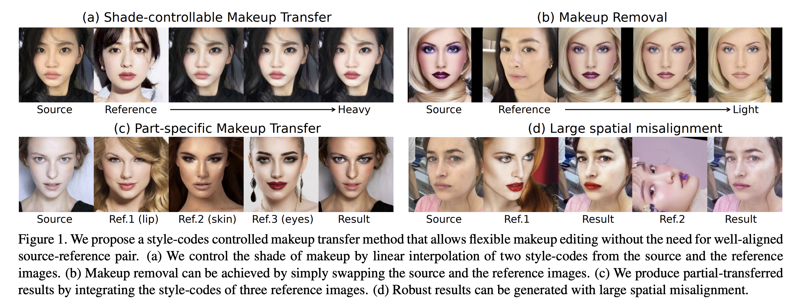
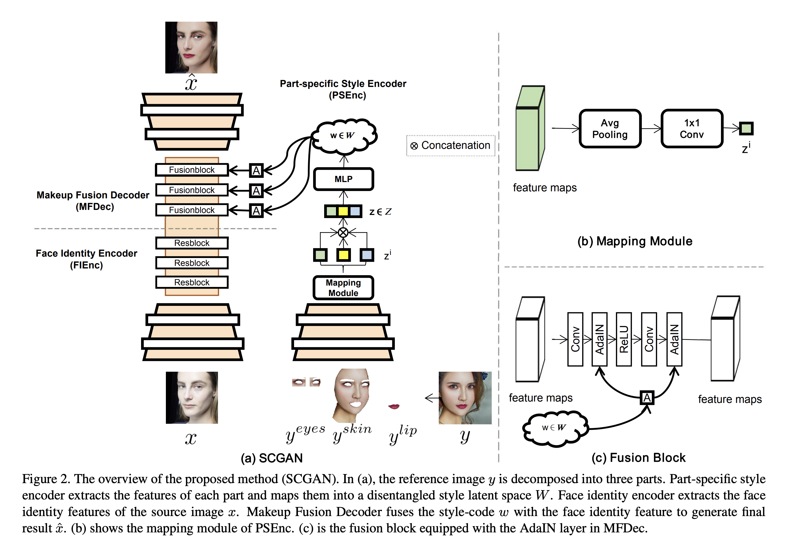
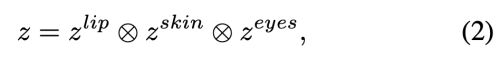
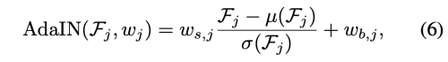
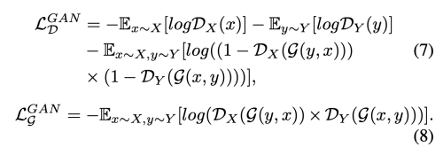
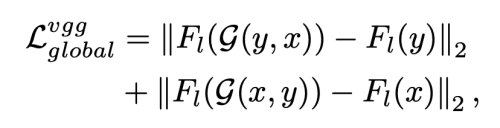
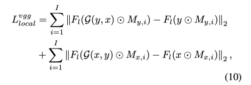
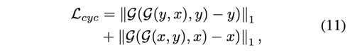
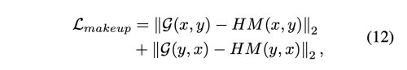
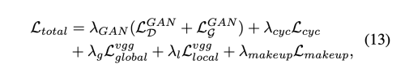

---
layout: post  
title: Spatially-invariant Style-codes Controlled Makeup Transfer        
subtitle: AI Paper Review    
tags: [ai, ml, GAN, make-up filter, SCGAN]    
comments: true
---  

재배치 하지 않은 reference image로부터 makeup을 transfer 하는 것은 매우 도전적인 과제이다.
이전의 방법들은 이런 장벽을 두 이미지간에 대응을 pixel-wise 계산하여 해결하였지만, 이는 부정확하고 계산 비용이 매우 높았다.
이 논문에서. 우리는 메이크업 transfer 문제를 extraction-assignment 프로세스로 나누어 본다.

결론적으로 저자는 Style-based Controllable GAN 모델을 제안한다.
이는 세가지 구성요소로 되어있다.
1. target style-code encoding
2. face identity features extraction
3. makeup fusion

특히,  Part-specific Style Encoder encodes 는 레퍼런스 이미지의 컴포넌트 별 메이크업 스타일을 중간의 latent space W에 style-code로 인코딩한다.
style-code는 spatial information을 무시하기 때문에, 공간 재배치를 하지 않아도 된다.
또한, style-code는 컴포넌트별로 정보를 embedding 하기 때문에, 다양한 레퍼런스로 부분적인 메이크업 수정을 할 수 있다.
style-code와 source identity feature를 를 통합하여 여러 AdaIN 레이어로 이루어진 Makeup Fusion Decoder를 거맃면, 최종 결과를 얻을 수 있다.
저자의 목적은 이미지 공간 재배치 없이 메이크업 지우기, shade 통제 가능한 메이크업 transfer, 부분적 메이크업 transfer 등이 가능한 유연한 makeup transfer를 만들어 내는 것이다. 

[Paper Link](https://openaccess.thecvf.com/content/CVPR2021/papers/Deng_Spatially-Invariant_Style-Codes_Controlled_Makeup_Transfer_CVPR_2021_paper.pdf)   
[Code Link](https://github.com/makeuptransfer/SCGAN)

  

## Related Work
### Makeup Transfer
CycleGAN은 makeup transfer 문제에서 가장 많은 영감을 준 방법중 하나이다.
두 unpaired 이미지 싹으로 image-to-image translation을 진행한다.
하지만 이 방법은 reference image를 특정할 수 없다.
PairedCycleGAN 은 비대칭적 함수를 통해서 메이크업을 transfer/removal을 수행할 수 있다. 그리고 consistency loss를 통해서 특정한 메이크업 이미지를 transfer 할 수 있다.
BeautyGlow는 Glow 프레임워크를 이용하여 latent feature를 makeup feature와 non-makeup feature로 분리할 수 있다.
그리고 이 feature를 재결합하여 다시 image로 변환한다.
BeautyGAN은 Dual input/output GAN을 소개한다. makeup transfer과 removal을 통시에 수행하며 makejup loss를 이용해 local detail을 수정한다.
Local Adversarial Disentangilng Network는 여러 중복된 local discriminator를 사용하고, 비대칭 loss 함수를 이용하여 local 디테일을 유지한다.
비록 위의 방법들은 훌륭한 성능을 내었지만, spatial misalignment 문제에서는 그렇지 못했다.

PSGAN은 이런 spatial misalignment 문제를 attention mechanism 을 이용하여 해결하려 한다.
픽셀별 대응을 설계하여, face parsing mask와 facial landmark를 사용하여 부분적 메이크업 transfer를 달성한다.

하지만, pixel-to-region attention은 매우 모호하다. attentive matrix는 계산적으로 비깐 반면에 local transfer에 유연하지도 않다.
반면, 제안한 style-code design 은 큰 유연성과 조절성을 제공한다.

### Style Transfer
사람들은 source image로 다양한 종류의 스타일을 transfer하려고 시도한다.
전통적인 style transfer는 세가지 카테고리로 분류된다.
1. Stroke-based rendering 
2. Region-based techniques 
3. Example-based rendering 

CNN 기반의 모델 방법이 빠르게 적용되어 왔지만, 이런 스타일 transfer 방법은 local-understanding과 조절성이 부족해서 face-specific 메이크업 transfer 어플리케이션에 적합하지 않다.

## Approach
### Formulation
* X: non-makeup image domain
* Y: makeup image domain

source image x, reference image y가 주어졌을 때, 두 도메인 간의 맵핑 함수는 아래와 같다.
* x_ = G(x, y)
* y_ = G(y, x)

  

우선 네트워크는 세가지 구성요소로 되어있다.
1. PSEnc: Part specific Style Encoder
   reference image로 부터 특징을 추출하여 1D style-code w로 인코딩한다. 
   reference image를 세 주요 컴포넌트로 분리하여 PSEnc의 차례로 feed 한다.
2. FIEnc: Face Identity Encoder
   source image로 부텉 얼굴의 identity 특징을 추출한다.    
3. MFDec: Makeup Fusion Decoder'
   메이크업 스타일과 얼굴 identity feature를 섞고 메이크업된 결괴를 얻는다.
   
### Network Structure
#### Part-specific Style Encoder
스타일 코드는 단순히 얼굴 특징을 평균화하여 얻을 수 있지만 1-d 벡터로 변환하면, 획득한 벡터는 훈련 데이터와 유사한 확률 밀도를 따르므로 얼굴 구성요소 사이에 피할 수 없는 얽힘 문제를 겪게 한다.
이 문제를 처리하기 위해 두가지 핵심 전략을 제시한다.
1. StyleGAN에 영감을 받아서 non-linear mapping network를 도입한다.
처음의 style-code를 intermediate style latent space로 embed 한다. 이를 통해 생성된 스타일 코드는 학습 데이터의 분포에 제한적이지 않게 되고, 분해 할 수 있게 한다.
   
2. face parser를 적용하여 reference face를 입술, 스킨, 눈으로 분리하여 사용한다.

part-specific style code를 concatenation 하여 initial style=code z를 얻는다  
  

이를 MLP(3 fully connected layer)를 통하여 w를 얻는다.
* w = MLP(z)

#### Face Identity Encoder
두 downsamping conv layer와 세개의 res block 으로 이루어져 있다.
이때, resblock은 AdaIN layer 없이 공통의 것을 사용한다.

#### Makeup Fusion Decoder
style-code w와 face identity feature F를 점진적으로 섞어 메이크업을 transfer 한다.
three fusion block과, 두 개의 upsampling conv layer로 이루어져있다.

두 AdaIN 레이어는 fusion block에 사용된다.
style-code w는 학습가능한 affine transform을 통해 specialized 되고, 각 fusion block을 통과한다.

  

* 여기서 w_s, w_b는 scaled, biased style 이다.
* M, sigma는 channel-wise mean, standard deviation 이다.

#### Full Objective
메이크업 이미지와 non-makeup 이미지는 unpaired 이기 때문에 cyclic 한 방식을 이용해 학습시킨다.

* X: non-makeup domain
* Y: makeup domain

SCGAN은 bidirectional mapping (X->Y, Y-X)를 학습한다.

* Adversarial Loss
SCGAN의 generator가 더 현실적인 이미지를 생성할 수 있도록 한다. 두가지의 discriminator D_x, D_y를 사용하여 fake와 real을 구분해 낸다.
  
두  discriminator의 구조는 Markovian Discriminator과 똑같다.

  

* Global Perceptual loss
이미지는 두 가지 도메인으로부터 오기 때문에, pixel-level의 제약이 불가능하다. input과 output의 face identity가 동일함을 보증하기 위해서 perceptual loss를 사용하여 global face identity를 유지한다.
  
  

* Local Perceptual Loss
non-transferrred part를 변경 불가능 하게 하기 위해 local perceptual loss를 사용한다
  (치아, 눈썹 등)
  
  

* Cycle consistency loss
unpaired image로 unsupervised 방식으로 학습하기 때문에 cycle consistency loss를 사용한다.
  
  

* Makeup loss
Histogram Matching(HM)을 사용하여 transferred image를 pseudo gt로 사용한다.
  local 히스토그램 매칭으로 이루어져 있다. (피부, 입, 눈)
  
  

* Total loss

  
  
### Implementation Details
* MT dataset 사용: 3834 female, 1115 non-makeup, 2719 makeup
* random select 100 non-makeup, 250 makeup for testing
* image size: 256x256
* extract feature Relu_4_1 layer of VGG16 (global perceptual loss, local perceptual loss) 
* Adam (b1=0.5, b2=0.999)
* fixed learning rate: 0.0002
* batch size=1

