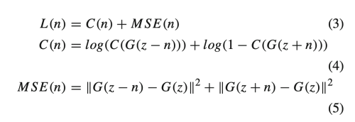

---
layout: post  
title: Adaptive semantic attribute decoupling for precise face image editing        
subtitle: AI Paper Review    
tags: [ai, ml, GAN, make-up filter, Face attribute editing, Quantitative control]      
comments: true  
---  

사용자가 특정한 얼굴의 특징을 정교하게 수정하는 어플리케이션은 다양한 영역에서 사용되고 있다. (virtual makeup, face aging, facial expression transfer, face synthesis)
하지만 높은 레벨의 사람 인지능력과 latent space의 특징 벡터간의 갭 때문에, 개개인의 얼굴 특징을 조절하는 것은 매우 어렵다. 
이 논문에서는 의미론적인 disentaglement 알고리즘을 이용하여 개인의 얼굴에 adaptive하게 attribute 를 조절하는 vector를 추출하는 방법을 제안한다.
추출된 조절 벡터의 coefficient를 조작하여, 단일 속성의 변형을 실현할 수 있다. 
superposition of control vector를 통해 보완전익 modification effect도 얻을 수 있다. 
Classification과 content loss는 수정을 제한하여 다른 특징이 영향받는 것을 방지할 수 있다. 

[Paper Link](https://link.springer.com/content/pdf/10.1007/s00371-021-02198-z.pdf)  

  

## Proposed framework

  
이전의 방법들은 오직 하나의 control vector 만 추출되고 모든 얼굴에 대해서 특징을 수정하려고 사용된다. 
고차원에서 의미론적인 경계는 curved 되어 있고, 모든 얼굴에 대해서 같은 방향으로 변화를 유도하는 것은 최적의 방법이 아닐 것이다.
InterFaceGAN의 가정에 따르면, 이런 subspace는 female part와 male part로 분리될 수 있다.
예를 들어 n1이 성별을 변경하는 control vector라고 하면, z1을 n1을 따라서 변경하면 성공적일 수 있지만 z2의 경우에는 boundary에 걸치게 되면서 다른 특징도 변형시켜 버릴 수 있다.
그래서 정확한 얼굴 속성을 제어하고, 독립적인 수정 효과를 얻기 위해서는 z2에 대해서 고유한 제어벡터인 n2를 계산하는 것이 중요하다. 

latent space 안의 semantic 특징을 adaptive하게 분리함으로써 정교한 face editing framework를 제안한다. 
어떠한 사용자의 고유 특징도 control vector optimal을 통해서 추출할 수 있다.
제어 벡터의 방향을 따라 원본의 잠재코드를 조절 가능한 양으로 변경하고 수정된 잠재코드로 영상을 재생하여 정확한 얼굴 속성 편집을 구현합니다.

* modification of latent code
  
    - a: modification coefficient
    - n: computed control vector

* k-th modification
  
  

### Attribute control vector adaptive to individual face
각 얼굴의 latent code에서 개개인의 특징 컨트롤 벡터를 분리하기 위해, decoder와 pre-trained generator, attribute classifier를 조합시킨 프레임워크를 제안한다.
decoder는 최적화 기반으로 학습하고, input latent code로부터 control vector 를 추출한다.

  

위 그림은 안경의 특징을 추출하는 학습 프레임워크를 나타낸다. 

1. face image의 latent code z 를 랜덤하게 선택한다.
2. 이 latent code를 decoder의 input으로 넣고, initial control vector n을 얻는다.
3. 새로운 latent code인 z-n과 z+n 쌍을 생성한다.
4. z+n과 z-n은 pre-trained generator에 넣어서 안경을 쓰고/안쓴 얼굴을 예측한다.
5. 두 얼굴 이미지를 attribute predictor를 이용해 분류한다. 그리고 z-n 으로부터 구한 얼굴은 rating score가 낮게, z+n 으로부터 구한 얼굴은 rating score가 높에 나오길 기대한다.
6. attribute rating score과 MSE loss를 통해 loss를 계산하고 decoder의 파라미터를 최적화한다.
7. 반복적으로 loss 값을 감소시킨다.

### Design of the decoder for computing control vector
디코더 네트워크를 설계하기 위해서 세계의 connected layer를 사용한다.
  
각 layer는 RELU를 사용한다.
loss function은 classification loss (attribute classification 정확도), MSE (per-pixel image change before and after attribute editing) 로 구성된다.  
  

### Selection of pre-trained generator
이 논문에서는 styleGAN을 사용하였다.

### Design of the Attribute Classifier
Attribute classifier는 decoder에게 가이드를 제공해주게끔 디자인되었다.

  
256x256 pixel로 이미지를 리사이즈 하여 사용한다.
output은 binary attribute classifier 이다.

## Experiments
### Training of attributes classifier
* train:val = 8:2
* Attribute: male, smiling, eyeglasses, young

eyeglasses 의 정확도가 높게 나타남

### Training of control vector decoder

attribute classifier와 generator을 선행학습을 시키고 나서, 
각 개별 얼굴에 맞는 control vector를 추출하기 위해 decoder를 학습시킨다. 

### Result
  
