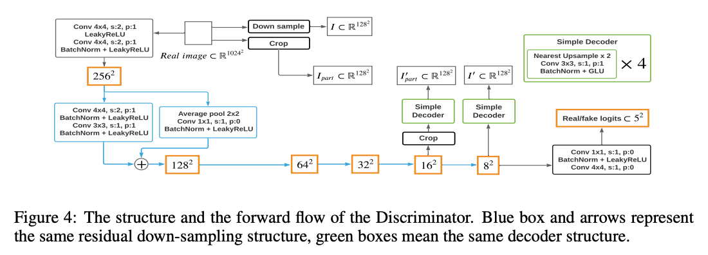

---
layout: post  
title: Towards Faster and Stabilized GAN Training for High-fidelity Few-shot Image Synthesis      
subtitle: AI Paper Review    
tags: [ai, ml, GAN, light-weight, FastGAN]        
comments: true  
---  

GAN에서 높은 성능을 내기 위해서는 large-scale의 CPU cluster와 다양하고 많은 training image가 필요하다.
이 논문에서는 few-shot image 합성을 적은 계산 비용으로 수행하는 법을 연구한다.
저자는 1024x1024 해상도에서 뛰어난 성능을 낼 수 있는 light-weight GAN 구조를 제안한다.
모델은 단지 몇시간안에 하나의 RTX-2080 GPU 에서 수렴하고, 학습 데이터가 100개 이하더라도 학습 성능을 유지할 수 있다.
저자가 제안한 모델은 skip-layer channel-wise excitation module과 feature encoder 로써 학습된 self-supervised discriminator를 사용한다.
다양한 이미지 도메인을 포함하는 13 데이터셋을 커버하며, StyleGAN2의 SOTA와 비교하여 뛰어난 성능을 보였다.

[Paper Link](https://arxiv.org/pdf/2101.04775.pdf)  
[Source Code](https://github.com/odegeasslbc/FastGAN-pytorch)  

## Related Works
### Speed up the GAN training
* depth-wise convolution을 사용하여 computing time을 줄임.
* optimization path를 축소하기 위해 min-max-min problem으려 변경 
* coreset 선택을 통해서 훈련 샘플의 각 배치를 준비하고, 더 빠른 수렴을 위해 더 나은 데이터를 준비하도록 제안

하지만 이방법들은 학습 속도에서 제한된 개선만을 가져왔다.
더욱이, 합성 quality는 더 좋아지지 않았다.

### Train GAN on high resolution
고화질 학습은 매우 어려운 문제이다.
1. 증가된 모델 파라미터는 G를 최적화하기 위해 더욱 엄격한 gradient flow를 야기
2. target distribution은 매우 spare해서 convergence 가 어려움 

이를 해결하기 위해 multi-scale GAN 구조를 사용하기를 제안한다. 하지만 이 방법은 계산 비용을 증가시켰다.

### Stabilize the GAN training
G의 모드의 붕괴는 GAN을 학습시키는데 있어 큰 도전 과제이다.
게다가 적은 학습 샘플과 더 적은 계산 비용으로 학습시키는 것은 더 큰 문제가 된다.
D는 dataset에 오버피팅되고, 그래서 G를 학습시키기에 의미있는 gradient를 전달하지 못한다.

D의 오버피팅을 막기 위한 방법으로, regularizing the gradient, normalizing the model weights, augmenting the training data를 사용하는 방법이 제안되었다.
하지만, 학습 배치 사이즈가 제한되어 있을 때, 속도를 degrade 시키는 영향을 주고, 정규화를 위한 적합한 배치 통계를 거의 계산할 수 없다는 문제가 있다.

그 동안에, D의 self-supervision은 GAN의 학습에 안정적 영향을 주는 것으로 밝혀졌다. 
하지만, 보조적인 self-supervision task는 이미지 도메인에서 활용이 제안적이다. 게다가 이전 연구들은 모두 저화질 이미지와, 계산 비용 제한 없는 환경에서만 연구되었다.

## METHOD
  

모델의 최소화 디자인을 위해서 G의 각 resolution에서 하나의 conv-layer 만을 사용하고, G와 D 모두에서 오직 3 channel(input, output) 만을 사용한다.
이 디자인은 SOTA 모델에 비해서 훨씬 작고, 학습이 빠르다. 이와 동시에, 작은 데이터셋에서도 robust하다.

### Skip-Later Channel-wise Excitation
고화질의 이미지를 합성해내기 위해서, G는 더 많은 conv-layer를 사용함으로써 깊어져야함은 피할 수 없다. 
하지만 이는 학습 시간을 더 길게한다. 
딥 모델을 학습시키기 위해서, skip-layer connection을 사용하는 Residual Structure를 사용하는 방법을 제안한다. 
하지만 이는 이미 GAN에서 널리 사용되고 있으며, 계산 비용을 증가시킨다.

그래서 저자는 skip-connection 아이디어를 Skip-Layer Excitation (SLE) 으로 변경시켰다.
1. skip-connection은 서로 다른 conv layer의 activation으로 부터 온 값들을 element-wise addition 하는 것. 
따라서 spatial dimension이 같아야 한다. 저자는 addition 대신에, channel-wise multiplication을 제안한다.
2. skip-connection은 오직 같은 resolution에서만 사용되었다. 이와 대조되게 저자는 spatial-dimension이 같을 필요 없이 더 longer-range에 사용되도록 하는 방법을 제안한다.
SLE는 ResBlock에 비교하여 gradient의 흐름을 더 짧게함과 동시에, 추가적 계산 비용이 들지 않게 한다.

  
* x_low: 8x8
* x_high: 128x128
* F: adaptive average pooling layer
* x_low -> adaptive average pooling: 4x4 -> conv-layer : 1x1 -> LeakyReLu
* x_low channel = x_high channel

SLE는 Squeeze and Excitation module 처럼 channel-wise re-calibration을 수행한다.
또한, channel-wise multiplication은 Instance Normalization과 일치한다.
SLE는 StyleGAN 처럼 G가 콘텐츠와 스타일 속성을 자동으로 분리할 수 있게 해준 다는 것을 보여준다. 
x_low를 다른 합성 샘플로 교체함으로써 G는 컨텐츠는 바뀌지 않고 스타일만 바뀐 결과를 생성해낼 수 있다.

### Self-supervised Discriminator

저자는 강하고 심플한 regularization을 D에 적용한다. D를 encoder로 취급하고, 매우 작은 decoder와 학습한다.
auto-encoding 학습은 D가 이미지의 특징을 추출할 수 있도록 한다.
decoder는 D와 함께 간단한 reconstruction loss로 학습된다.

  
* f: intermediate feature map from D
* g: processing on f and decoder
* T: processing on sample x from real images

  

서로 다른 scale feature-map을 위한 두 개의 decoder를 사용한다.  
* f1: 16x16, f2: 8x8  

디코더는 오직 4 conv-layer를 사용하여 128x128의 이미지를 생성해낸다.
저자는 랜덤하게 f1을 1/8로 크롭하고, real image에서 똑같은 portion을 crop 하여 I_part를 만든다.
그리고 real image를 resize하여 I를 얻는다. 
디코더는 I'_part를 cropped f1으로부터 생성하고, I'를 f2로부터 생성한다. 
최종적으로 D와 디코더는 I_part와 I'_part, I'와 I를 매칭하는 loss를 최소화한다.

Reconstructive training은 D가 더 보완적인 표현을 input으로부터 추출하고, f2로부터 전체적인 composition과 f2로부터 디테일한 질감을 커버하게 만든다.
self-supervision training을 통한 regularized D는 G의 합성 성능을 크게 올려준다.

비록 저자의 D를 위한 self-supervision 전략은 auto-encoder의 형태로부터 왔지만, 이 방법은 근본적으로 GAN과 AE를 합친다는 것에서 부터 다르다.
저자는 adversarial loss의 hinge version을 사용하여 iterative 하게 D와 G를 학습한다.

  

### Metrics
1. Frechet Inception Distance(FID)
    * Frechet Distance는 곡선을 따르는 점들의 위치와 순서를 고려한 곡선간 유사성을 측정하는 방법이다. 이는 두 분포 사이의 거리를 측정하는데 사용된다.
    * univariate normal distribution 의 프레쳇 거리: d(X, Y) =  (mx - my)^2 + (sigx-sigy)^2  
    * 사전에 훈련된 Inception V3 모델을 사용하여 실제 이미지와 가짜 이미지의 embedding 벡터를 사용하고, 이 벡터가 다변량 정규 분포에 가깝다고 가정하고 FID를 측정한다.
      
    * 유사한 이미지 일수록 낮은 FID를 출력한다.
2. Learned Perceptual Image Patch Similarity(LPIPS)

## Result
  
