---
layout: post  
title: (PIRenderer) Controllable Portrait Image Generation via Semantic Neural
Rendering     
subtitle: AI Paper Review      
tags: [ai, ml, computer vision, GAN, facial animation, video synthesis, video generation, face generation]      
comments: true  
---  

이 논문에서는 얼굴에 대한 모션을 3d morphable face model을 이용해서 컨트롤하는 Portrait Image Neural Renderer 를 제안한다. 
이 모델은 photo-realistic portrait image를 정교한 modification으로 생성해낸다.
더욱이 이 모델은 오디오로부터 sequential motion을 추출하여 audio-driven facial reenactment task도 수행할 수 있다. 
이 모델은 하나의 reference image와 driving audio stream 으로부터 설득력 있는 움직임의 일관된 비디오를 생성할 수 있다. 

[Source Link](https://github.com/renyurui/pirender)  
[Paper Link](https://arxiv.org/pdf/2109.08379.pdf)  

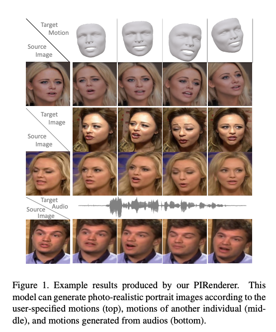  

## Related Work
* portrait editing: modify facial expression, head rotations, translations of a given image or video

### Portrait Editing via Semantic Parameterization
컴퓨터 애니메이션 컨트롤과 유사한 의미 제어 공간을 사용하여 portrait image를 편집하면 사용자에게 직관적인 컨트롤을 제공할 수 있다.
일부 모델 기반 방법은 3DMM의 렌더링 이미지를 통합하여 expression, pose등의 매개변수를 수정하여 인물 사진을 편집한다. 
이 방법들은 좋은 결과를 내었지만, subject-specific 방법으로 임의의 사람에 대해서는 적용할 수 없다.
X2Face는 source texture에 공간적으로 transform을 수행하는 warping operation을 적용하여 조금더 일반화할 수 있는 모델을 만들었다.
하지만 source의 pose만을 수정할 수 있다. 최근 StyleGAN이 진짜 같은 합성 이미지를 생성할 수 있게 학습되어왔다.
이 장점을 활용하여 StyleRig는 3DMM을 통해 StyleGAN을 제어하는 방법을 설명했다. 
하지만, 이는 real-word image editing을 지원하지 않는다.
PIE는 real image에 대한 상응하는 embedding을 계산하는 최적화된 방법을 제안하였다. 하지만 iterative optimization operation 이 각 input image에 대해서 필요하기 때문에, 알고리즘의 효율이 떨어진다.

### Portrait Editing Via Motion Imitation
많은 모델들은 다른 사람의 움직임을 흉내내게 학습이 되었다.
일부 방법은 GAN을 통해서 이미지 to 이미지 translation의 비디오 대응물로 모델링하여 이 task를 해결한다.
이 접근 방법은 한 사람에 대해서 labeled video에 대해서 몇시간 학습이 필요하다. 그래서 각 사람에 대해서 retrain을 해야하는 단점이 있다.
이후 효율적인 spatial transformation module이나 source neural texture를 target에 주입하는 방식을 사용하여 더 좋은 일반화 성능을 내었다.
이 방법은 실제같은 이미지를 임의의 사람에 대해서 생성할 수 있다. 하지만 이 또한 subject specific(랜드마크, 엣지, parsing map)이나 motionentangled (e.g. sparse keypoints) descriptors에 의존하기 때문에, 소스 이미지를 직관적으로 편집하는 능력이 부족하다.

### Portrait Editing via Audio
오디오 스트리밍과 소스 이미지를 통해 이에 상응하는 비디오를 만들어내는 방법이다. 일부 방법은 오디오 신호와 이미지 간의 관계를 모델링하여 수행한다.
하지만, 오디오 입력은 완벽하게 타겟 포즈를 설명할 수 없기 때문에, 이 방법은 고정된 머리 방향의 영상을 생성해낸다.
그래서 완벽한 머리 움직임을 제공할 수 없다.
실제 이미지에서의 관계 없는 요소의 방해를 피하기 위해, 몇몇 모델은 먼저 오디오 입력을 중간결과에 매칭한 다음(랜드마크, 3DMM) 최종 이미지를 생성하도록 제안한다.

3DMM의 이전을 통합하는 논문은 렌더링된 이미지에 대한 사실적인 질감을 합성하고 결과를 소스 이미지와 혼합하여 대상을 생성한다.
그러나 이런 방법은 비디오 입력이 필요하며, 단일 이미지에 대해서는 작동하지 않는다. 한편, 그들은 주제별, 개인별 적용전 추가 미세 조정이 필요하다,.

저자가 제안한 이 모델은 오디오 스트림에 대한 다양한 모션을 생성하고 이러한 모션을 임의의 대상에 대해서 사실적인 비디오로 생성할 수 있다. 

## Our Approach 
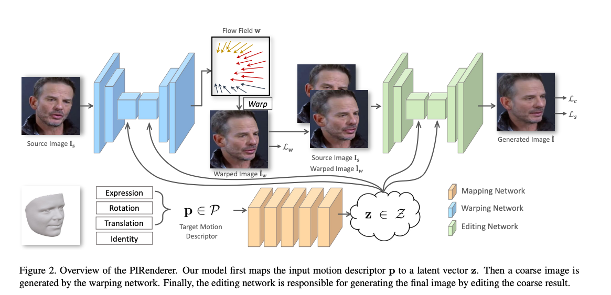  

저자는 semantic neural rendering model PIRenderer를 제안한다.
target motion descriptor p의 가이드를 따라서 주어진 이미지 I_s에 대해서 모델은 표정, translation, head pose등을 변환한 실제같은 portrait image I^ 을 생성한다. 단, 이때 identity, illumination, background는 변하지 않는다.

### 1. Target Motion Descriptor
직관적이고 정교한 editing을 수행하기 위해 semantically 의미있는 control이 제공되어야한다.
이 논문에서는 모션 descriptor로써 3DMM의 subset parameter가 사용된다. 
3DMM으로 얼굴의 3D shape S 아래 식으로 parameterized 된다.    
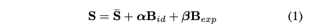  
* S_ : average face shape
* B_id: base of identity computed via PCA based on 200 scan of human faces
* B_exp: base of expression computed via PCA
* a: size 80
* b: size 64
* R: head rotation
* t: head translation
* p: {b, R, t}

현재 나와있는 3d face reconstruction model은 real-word portrait image I로부터 coefficient를 추출하기 위해 사용되었다.
하지만 coefficient extraction은 estimation에 에러를 생성해냈다.
비록 3D face reconstruction 방법은 상대적으로 정확한 결과를 냈지만 에러와 노이즈는 피할 수 없는 문제이다.
추출된 모션 p와 실제 타겟의 모션간의 미스매칭은 성능의 감소를 가져왔다.

이런 문제를 완화하기 위해 연속 프레임이 있는 window 계수를 중앙 프레임의 모션 descriptor로 사용한다.
그래서 네트워크는 인접한 프레임간의 관계를 추출하여 오류를 피할 수 있다  
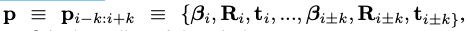  
* k: radius of window

### 2. PIRenderer for Semantic Control
source portrait image I_s와 target motion descriptor p가 주어지면 PIRenderer는 다른 정보는 유지한체 target motion을 따라하는 portrait image I를 생성한다,

#### The Mapping Network
motion descriptor p로부터 latent vector z를 생성한다.
* z = fm(p)  

학습된 latent vector z는 후에 adaptive instance normalization (AdaIN)를 제어하는 y=(ys, yb)를 생성하기 위해 affine transformation 에 의해 추가로 변환된다.   

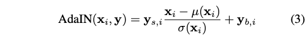  

#### The Warping Network
CNN은 input에 대해서 효율적으로 spatially transform을 수행하는 데에 대해선 부족하다.
source의 질감을 유지하고 더 좋은 일반화 성능을 내기 위해, 저자는 source image의 중요한 정보를 공간적으로 변환하기 위해 warping network g_w를 사용했다.
warping network는 정확한 3D geometric shape를 유지하고, input source와 desired target간의 deformation을 예측한다.
source image I_s와 latent vector z를 input으로 삼고, target을 생성하기 위해 샘플링 할 수 있는 source의 위치를 지정하는 좌표 오프셋인 flow field w를 생성한다. 
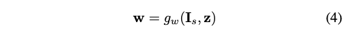  

네트워크는 auto-encoder 구조로 디자인되었다.
AdaIN operation이 각 conv layer의 뒤에 사용되어 motion을 주입한다.
저자는 전체 resolution의 flow field를 예측하지 않는다.
output flow는 input image의 1/4 해상도를 가지고 있다.
학습과 평가 과정에서, 저자는 predicted flow를 resolution matching을 위해 upsample한다.
flow field w를 구하고나서, I_w = w(I)가 계산된다. 

저자는 warping network를 정확한 flow field를 계산하기 위해 warping loss Lw를 이용하여 constrain 한다. 
하지만 task에서 gt_ flow field가 제공되지 않는다. 
warped image I_w와 target image I_t 간의 reconstruction error를 계산하기 위해새, warping loss는 pre-trained VGG19를 이용한 perceptual loss를 기반하여 계산된다.  
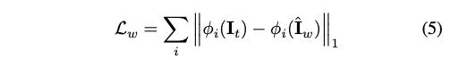  
pyramid downsampling 을 하여 multiple resolution에 대해서 구한다.

#### The Editing Network
warping network는 spatial transform에 효율적이지만, source 이미지에 존재하지 않는 content를 생성하는데는 한계가 있다.
게다가 artifacts는 warping operation에 의해서 생성되어 성능을 저하시킨다.
그래서 editing network g_t는 I_wf를 수정하기 위해 디자인되었다.
editing network는 I_w, I_s, z를 input으로 입력받고 final I_를 생성한다.  
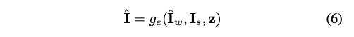  

editing network는 warping network와 비슷한 구조를 사용한다. 
AdaIN operation이 latent vector z를 주입하기 위해 사용된다.
skip connect layer를 사용하여 source의 texture를 유지한다.

editing network의 reconstruction loss L_c와 stype loss L_s를 사용하여 학습한다.
L_c는 warping loss와 유사한 구조를 가진다.  
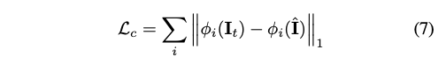  
Style loss L_s 또한 VGG-19 activation map을 사용하고 G는 gram matrix를 의미한다.  
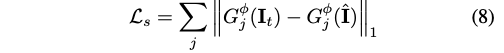  

final loss는 아래와 같다.   
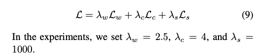  

### 3. Extension on Audio-Driven Reenactment
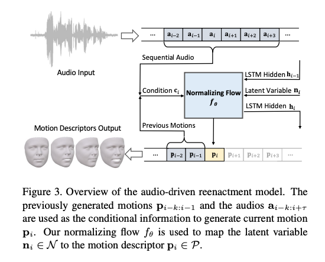  
이 task는 audio와 motion 간의 관계가 필요하다.
하지만 audio signal을 직접적으로 진짜같은 이미지로 변환하는 것은 매우 어렵다.
모션과 관계 없는 요소인 identity, illumination이 방해를 줄것이다.
따라서 중간 결과로 3DMM과 같은 의미상 의미 있는 매개변수화를 사용하면 작업을 크게 줄일 수 있다.
결과적으로 저자는 audio로부터 sequential 3DMM coefficient를 생성하는 추가적인 mapping function f를 도입하여 성능 향상을 가져왔다.

f의 근본적인 도전과제는 여러 가능한 output을 핸들링하는 것이다.
deterministic motion을 생성하도록 훈련하면  네트워크는 모든 가능한 결과에 대한 평균값을 생성하도록 제한되고 결국 네트워크는 artifact를 생성하게된다.

이런 이유로, f를 단일 오디오 stream에서 다양한 모션을 생성할 수 있는 확률론적 모델로 outlining하면 이 문제를 줄이는 데 도움된다.
Normalizing flow를 사용하여 모델을 디자인하였다. 

flow 정규화의 핵심 아이디어는 샘플을 단순한 분포에서 더 복잡한 분포로 매핑하는 invertible하면서 미분가능한 비선형 매핑함수를 훈련시키는 것이다. 

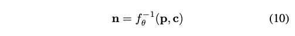   
* n: latent vector
* p: motion 
