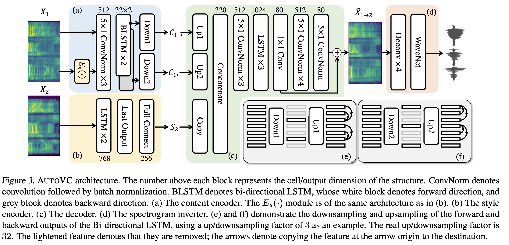
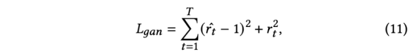

---
layout: post  
title: (MakeItTalk) Speaker-Aware Talking-Head Animation Rendering     
subtitle: AI Paper Review      
tags: [ai, ml, computer vision, GAN, facial animation, video synthesis, video generation, face generation]      
comments: true  
---  

[Source Link](https://github.com/yzhou359/MakeItTalk)  
[Paper Link](https://arxiv.org/pdf/2004.12992.pdf)  

  

오직 한 장의 얼굴 이미지와 오디오 input으로 말하는 영상을 만들어내는 방법을 제안한다.
오디오로부터 직접적으로 픽셀을 생성해내는 기존의 방식과 다르게, 먼저 input 오디오에서 content와 화자의 정보를 분리해낸다.
오디오 content는 강인하게 얼굴 영역과 입술의 움직임을 컨트롤하고, 화자에 대한 정보는 얼굴의 표정의 특징과 고개의 움직임을 컨트롤한다. 
이 방법의 또 다른 주요 요소는 얼굴의 랜드마크 예측을 통해 화자를 다이나믹하게 반영한다는 것이다.
이 중간의 표현을 통해서, 우리 방법은 많은 만화, 그림등을 포함한 다양한 portrait image를 하나의 unified framework를 통해 작동한다.
게다가 이 방법은 학습 과정에서 관찰할 수 없었던 얼굴이나 캐릭터에 대해서도 잘 동작한다.

## Related Work 
### Audio-driven facial landmark synthesis
Eskimez는 노이즈에 강인한 synchronized facial landmark를 생성해내는 방법을 제안한다. 그 후 Chen은 decoupled block을 학습시켜 먼저 landmark를 얻고나서, rasterized video를 생성한다.
Attention mask를 통해 가장 많이 바뀌는 부분에 집중(입술) 하게끔 한다. Greenwood는 forked Bi-directional LSTM network로 추출한 landmark를 통해서 jointly하게 얼굴 표정과 고개 돌린들을 학습하게 한다. 
대부분의 이전의 audio-to-face animation 은 speech content가 일치하는데 집중하고, 학습 중 모드의 붕개나 평균화를 통해서 스타일이나 신원 정보가 누락되는 문제가 발생했다.
반면, 이 논문에서 제안하는 방법은 오디오 content와 화자의 정보를 분리하여, 화자-dependent 한 랜드마크를 추출하여 사용한다.

### Lip-sync facial animation
GPU 파워가 증가함에 따라서, audio-to-video 의 end-to-end 프레임워크가 가능하게 되었다. 
Chen은 cropped 된 lip의 움직입을 각 프레임에서 합성해내는 방법을 제안했다.
그 다음 Chung은 GAN이나 encoder-decoder를 통해서 얼굴 전체 이미지를 생성하는 방법을 제안한다
그러나 조작된 얼굴 모델을 위한 오디오 기반의 말하는 초상화의 경우 입력 만화 모델에는 수동 조작 및 대상 변경뿐 아니라 나머지 머리 부분을 입술 너머로 애니메이션화하기 위한 아티스트 개입이 필요했습니다. 
하지만 이 논문의 방법은 매뉴얼한 input이 필요 없다. 또한 위의 방법은 화자의 정체성이나 스타일을 포착하지 못한다. 게다가 동일한 문장을 두 개의 다른 목소리로 말하면 더 표현력 있고 사실적으로 만드는 데 필요한 역학이 부족하여 동일한 얼굴 애니메이션을 생성하는 경향이 있습니다.

### Style aware facial head animation
Swajanakorn이 제안한 방법은 re-timing 다이나믹 프로그래밍을 이용하여 화자의 움직임을 재생산해내는데, 이 방법은 오직 single subject 에 대해서만 수행할 수 있다.
또다른 이른 연구에서, Liu는 색감, 깊이, 오디오를 사용하여 facial animation을 생성한다. 하지만 이방법도 보지 못했던 화자에 대해서 일반화 시킬 수 없다.
Cudeiro는 화자의 스타일을 latent representation에 위치시키려 시도 한다. Thies는 사람의 스타일을 static blendshape base에 인코딩한다.
하지만 두 방법모두, lower facial animation (입술)에만 집중하고, 얼굴의 움직임은 예측하지 못한다.
더 이 노눔ㄴ과 유사한 방법으로 Zhou는 image 도메인에서 분리한 identity와 content를 audio-visual representation으로 jointly 하게 학습한다
하지만, 그들의 identity 정보는 static facial appearance에만 집중하기 때문에 화자의 다이나믹을 담지 못한다.
하지만 화자의 인식은 단순한 고정된 모습을 넘어 많은 측면을 포함한다. 개인의 facial expression과 head movements는 모두 중요한 요소로 작용한다.
저자의 방법은 화자의 id를 static appearance와 head motion dynamics와 jointly 하게 학습시킨다.

### Warpping-based character animation
Fiser는 비디오와 거기서 뽑은 landmark를 통해 수행하는 방법을 제안한다.
Weng는 사람의 template를 fitting 함으로써, 모션 캡쳐 데이타를 이용해 사람의 움직임을 만들어낸다.
반면, 이 모델은 오직 오디오를 통해서 표정과 고개의 움직임을 합성해낸다. 

### Evaluation metrics
검증은 identity/style을 평가하는 것이 매우 중요하고, 동시에 적절한 벤치마크를 설정하는 것은 중요하지 않다.
Agarwal은 action unit을 통해서 style의 분포를 시각화한다. 
현재 존재하는 quantitative metrics는 pixel-level의 artifact를 잡아내는데 더 집중했다. 
Action unit은 Gan-based 접근방법에서 표현령을 평가하는 대안으로 제안되었다.
저자는 표정과 고개 움직임을 평가하기 위한 고차원의 다이나믹한 metrics의 모음을 제안한다.

### Image-to-image translation
image-to-image translation은 talking face synthesis, editing에서 공통적으로 많이 사용하는 접근 방법이다.
Face2Face와 VDub는 두 개의 talking-head videos 사이 강인한 appearance transfer에fmf tngodgksek.
그 후로 adversarial training이 채택되어 transferred 결과를 더 향상시켰다.
예를들어 Kim은 cycle-consistency loss를 사용하여 style을 transfer하여 one-to-one transfer에서 좋은 성능을 내는 방법을 고안했다.
Zakharov는 few-shot learning 을 개발하여 자연스러운 사람의 움직임을 생성하기 위해 landmark를 효율적으로 사용하였다.
이런 기존의 방법들에 기반하여, 저자는 image-to-image translation을 채택하였다. 
Zakharov와 다르게 이 모델은 fine-tuning 없이 학습 과정에서 보지 않았던 얼굴도 생성해낼 수 있다.
또한, image deformation 모듈을 통해서 캐릭터 이미지도 적용할 수 있다.

### Disentangled learning
voice conversion community에서 오디오에 있는 content와 style을 분리해 내는 것은 매우 넓게 연구되어 오고 있다.
이전의 오래된 역사를 볼 필요없이 최근의 방법이 현재 논문에 적용하기 적합하다.
Wan은 Resemblyzer를 다양한 언어에서 검증 목적으로 화자 ID 임베딩으로 개발하였다.
Qian은 AutoVC를 제안하였다. 이는 few-shot voice conversion method로 오디오를 content외 identity 정보로 분리해낸다.
이 논문은 베이스라인으로 AutoVC를 사용하여 voice content를 추출하고 Resemblyzer를 이용하여 화자의 id 임베딩을 추출하는데 사용한다.
이 논문은 음성을 오디오 기반 애니메이션으로 변환하는 아이디어를 소개하고 화자 인식 talking-head generation의 장점을 시연합니다.

## Method
  

MakeItTalk 구조는 오디오와 single facial image를 사용하여 speaker-aware talking head animation을 생성한다.
학습과정에서, 저자는 off-the-shelf face 3D landmark detector를 사용하여 input video에서 landmark를 추출한다. 
baseline 모델은 오디오와 추출된 landmark를 이용해 직접적으로 학습된다.
하지만 높은 동적성을 확보하기 위해, 랜드마크는 콘텐츠 표현과 얽히고 오디오 신호의 스피커 임베딩과 얽혀서 예측되어야 함을 발견했다. 

특히, 저자는 voice conversion neural network를 사용햐여 speech content와 identity information을 분리시킨다. 

* content는 화자와는 관계 없고, 임술과 그 주변의 일반적인 움직임에 대해서만 캡쳐해야한다.
    * 예를들어 누가 "Ha!' 라고 말하는 상관없이 입술은 벌려지길 기대된다 (content) 
* identity는 화자에 따하 결정되며, 움직임과 나머지 고개 돌림 움직임 결정한다.
    * 나머지, 눈, 코, 입, 고개 움직임은 어떤 화자가 그 말을 하느냐에 따라 다르다 (identity) 

래스터화된 이미지들을 생성하기 위해서, 화자는 landmark-to-image 합성을 위한 두가지 알고리즘을 제안한다.

실제 그림 등의 사람이 아닌 이미지를 위해서는 Delaunary triangulation 을 이용하여 간단한 image warping을 수행한다. 
실제 사람이미지를 위해서는 image-to-image translation network를 사용하여 (pix2pix) 생성한다. 

모든 이미지 프레임들과 input audio를 같이 합성하면 최종의 talking-head animation을 생성해낼 수 있다.

### 1. Speech content Animation
오디오에서 화자랑 상관없는 content representation을 추출하기 위해 Qian이 고안한 AutoVC encoder를 사용한다.
AutoVC 네트워크는 LSTM 기반의 인코더를 사용하여 input audio를 compact representation으로 압축하여 원래의 화자의 id 정보는 버리고 content 정보는 보존하게끔 한다.
AutoVC 네트워크에서 추출한 content embedding A (TxD) 라고 칭한다.
* T: total number of audio frames
* D: Content dimension

content animation component의 목적은 content embedding A를 facial landmark position으로 mapping 하는 것이다. 
저자는 실험에서 recurrent network가 feedward network보다 훨씬 성능이 좋음을 밝혔다. 
왜냐면 content와 landmark 사이의 sequential한 의존성을 캡쳐할 수 있기 때문이다.
간단한 RNN과 LSTM 종류로 실험한 결과 LSTM이 더 좋은 성능을 냄을 밝혔다.
각 프레임 t에서, LSTM 모듈은 audio content A를 윈도우 사이즈 (t -> t+𝜏)로 받는다.
*  𝜏 = 18 frames (a window size of 0.3s in our experiments)

3D landmark detector로 추출한 어떠한 input 3D static landmark q (68x3)와 LSTM의 결과를 함께 MLP를 통과시켜 최종 예측인 Δq 를 얻는다. 
이는 각 프레임의 렌드마크 모션을 표현한다.

Speech content animation 모듈 모델은 sequential한 의존성을 가지고 아래의 transformation을 통해 landmark를 생성한다.  
  

여기서 LSTM은 세개의 layer unit을가지고 있고, 각각의 hidden state vector의 사이즈는 256이다.
decoder MLP 네트워크는 세개의 layer 로되어 있고 각각의 hidden state vector 사이즈는 512, 256, 204(68x3)을 가진다. 

### 2. Speaker-Aware Animation
단순히 lip motion 만 매칭 하는 것은 충분하지 않다.
얼굴의 움직임과 입과 관련있는 눈썹 등의 다른 움직임도 talking head 생성에 더 풍부한 힌트가 될 수 있다. 

  

위 그림은 서로 다른 화자의 embedding을 보여준다. 하나는 얼굴을 거의 움직이지 않는 화자의 것이고, 다른 하나는 더 활동적인 화자의 것이다.
저자의 방법은 이런 서로 다른 화자의 움직임을 성공적으로 분리한다.

이를 달성하기 위해, 먼저, 화자의 identity 임베딩을 speaker verification model과 함께 추출한다.
이는 서로 다른 발언을 하는 같은 화자 간의 유사성을 최대화하고 서로 다른 화자 간의 유사성은 최소화 함으로써 달성한다.

원래의 identity embedding vector 사이즈는 256 이다. 
저자는 이 dimensionality를 하나의 MLP를 통해서 256에서 128로 축소하여 학습과정에서 볼 수 없었던 화자에 대해서도 일반화 할 수 있는 성능을 달성하였다.

주어진 identity embedding s가 추출되면, 화자의 정체성을 반영하도록 per-frame landmark p를 추가로 조정한다. 
더 자세히 말하면, 랜드마크는 훈련 중 화자에서 관찰되는 머리 움직임 분포 및 표정 역학과 일치하도록 교란된다.

이런 방법으로, 조정된 랜드마크를 통해서 그럴듯한 머리 움직임을 반영한 speaker-specific 분포가 생성된다.

speaker-Aware Animation도 Speech content Animation모듈과 동일한 LSTM 구조를 사용하여 content vector를 수정한다.
하지만 서로 다른 parameter를 사용하는 것이 더 효율적이라는 것을 밝혔다. 
결과 표현인 c는 머리 움직임과 표정 역학을 캡쳐하는 데 더 적합하다.

  

이 모듈은 speaker embedding s와 수정된 content representation c, initial static landmark q를 사용하여 speaker aware landmark를 생성한다.

또한 일치하는 얼굴 움직임과 표정을 생성하기 위해서는 speech content animation 모듈에 비해 긴 time-dependencies 가 필요하다는 것을 밝혔다.
음소는 일반적으로 수십 밀리초 동안 지속되지만, 머리동작, 예를 들어 머리가 왼쪽에서 오른쪽으로 흔들리는 것은 1초 또는 몇초동안 지속될 수 있다. 
이런 길고 구조화된 의존성을 캡쳐하기 위해, self-attention network를 도입하였다.
self-attention layer는 output을 weighted combination of learned per-frame representation을 계산한다.

개선된 content representation c는 speaker embedding s와 concat한다. 각 프레임에 할당된 가중치는 window 내의 모든 쌍 프레임 표현을 비교하는 호환성 함수에 의해 계산된다.
*  window size 𝜏′ = 256 frames (4 sec)

self-attention layer의 마지막 output과 initial static landmark는 MLP를 통해서 마지막 per-frame landmark를 계산한다.  
  
여기서 attention network는 Vaswani의 것을 적용하였다.

### 3. Single-Image Animation
주어진 input image Q와 예측된 랜드마크 set 인 y를 이용하여 sequence of image F를 생성한다.
입력 portrait은 만화 얼굴 또는 자연스러운 사람 이미지를 묘사할 수 있다.
화자는 각 두 타입에 대해서 서로다른 방법을 적용한다.

#### Cartoon Images (non-photorealistic)
이런 이미지는 보통 sharp한 특징의 edge를 가진다.
이런 sharp 한 특징을 보존하기 위해, 저자는 morphing 기반의 방법을 사용하여 pixel-level의 artifact를 피한다.

입력 이미지로부터, 화자는 facial landmark를 추출하고, Delaunay triangulation을 사용하여 semantic triangle 을 생성한다. 
texture map으로써의 초기의 픽셀들은 triangle로 맵핑된다. 그리고 후속 애니매이션 프로세스는 심플하다.

랜드마크 토폴로지가 동일하게 유지되는 한 각 삼각형의 텍스처는 프레임을 통해 자연스럽게 전송된다.
저자는 이를 GLSL-based C++ 코드에 적용하여 vertex/fragment shaders를 실시간으로 수행할 수 있었다

  

#### Natural Images
Zakharv가 제안한 landmark 기반의 facial animation 합성 방법에서 착안하였다. 

target face appearance를 인코딩 하기 위해 embedder과 adaptive instance normalization layer를 분리하여 사용하는 대신, 
UNet 구조에 기반하여 변위된 랜드마크와 portrait을 처리한다.
특히, 먼저 연속적인 얼굴 랜드마크를 연결하고 미리 정의된 색상의 선분으로 랜더링하여 예측된 랜드마크 y의 이미지 표현 Y를 생성한다. 
image Y는 input portrait image Q와 channel-wise 하게 concatenated하여 256x256의 6-channel 이미지를 생성한다.
그리고 encoder-decoder 네트워크를 통해 256x256의 이미지를 각각 생성해낸다
generator의 구조는 Esser와 Han의 방식을 따르고 있다.
특히, encoder는 6개의 convolution layer를 가지고, 각각 2-stride, two-residual block 구조를 가지고 있다. 
decoder는 symmetric upsampling block을 사용한다.
skip-layer는 encoder와 decoder를 연결하여 최적화를 수행한다.
랜드마크는 시간이 지남에 따라 부드럽게 변하기 때문에 최종 결과 이미지는 temporal coherence를 보여준다.
®
## Training
### 1. Voice Conversion Training

학습 셋팅은 [Qian](https://github.com/auspicious3000/autovc) 이 제안한 방식대로 하였고
 speaker embedding은 Wan이 제공한 pre-trained model을 통해서 initialize를 수행하였다.
학습 소스 speech는 content encoder를 통해 계산된다.
같은 화자로부터 다른 음소는 speaker embedding 을 추출하기 위해 사용된다.
audio content embedding을 decoder가 다시 오리지널 소스로 재건하게끔 학습한다.
content encoder, decoder, mlp는 self-reconstruction error를 최소화하기 위해 학습된다.
학습은 VCTK corpus로 수행하였다. (다양한 상황에서의 109 명의 미국인의 음소 데이터셋)

#### AutoVC
  
speaker encoder, content encoder, decoder 등 세가지 모듈로 구성되어 있다.
AutoVC는 NxT 사이즈의 speech mel-spectrogram 에서 작동한다.
* N: number of mel-frequency bins 
* T: number of time steps 

mel-spectrogram 다시 waveform으로 변환되어 출력 된다 

##### Speaker Encoder
(b) 모듈로 같은 화자가 다른 음소를 내는 것에 대해서 같은 embedding 을 추출해야한다. 
speaker encodr는 GE2E loss로 VoxCeleb1, Librispeech 데이터셋으로 pre-trained 한다. 
이는 같은 화자에 대해서는 서로 다른 음소에도 유사성을 크게 하고, 서로 다른 화자에 대해서는 작게 하는 방향으로 학습된다. 
* output vector size = 256-by-1 

##### Content Encoder
(a) 모듈로 각 time-step에 80-dimension의 mel spectrogram of X1 과 speaker embedding E(X1)과 concat 하여 입력으로 사용한다. 
concatenated input 은 마지막에 2개의 bidirectional LSTML layer를 지난다. 
forward dim 32, backward dim 32로 합치면 64 dim 이다.
32 dim으로 줄어드는 information bottleneck은 forward, backward 서로 다르게 수행된다.
forward output time step {0, 32, 64, ...} 이 저장되고, backward output time step {31, 63, 95, ...} 가 저장된다.
(e), (f)가 이를 나타낸다. (32-by-T /32 matrices)

##### Decoder
content와 speaker embedding 모두 original temporal resolution으로 upsampled 된다. 
speaker embedding은 단순히 T time 만큼 복사된다.
post network의 결과는 중간 결과와 residual 하여 80 size의 reconstruction을 수행한다. 

##### Spectrogram Inverter
WaveNet을 사용하여 mel-spectrogram을 speech waveform으로 변환한다. 

##### 용어 정리 
[참조](https://m.blog.naver.com/sooftware/221661644808)
* Mel-scale: 사람의 달팽이관을 모티브로 따온 값으로 달팽이관을 길게 펴서 보면, 각 부분은 각기 다른 진동수를 감지한다.
단 특수한 성질이 있는데, 주파수가 낮은 대역에서는 주파수의 변화를 잘 감지하는데, 주파수가 높은 대역에서는 주파수의 변화를 잘 감지하지 못한다.
달팽이관 구조를 보면 저주파 대역을 감지하는 부분은 굵지만, 고주파 대역으로 갈수록 얇아진다. 따라서 특징벡터를 추출할 때 이런 달팽이관의 특성을 고려해서 뽑아주면 더 효과적으로 뽑을 수 있을 것이다.
이를 고려한 값이 Mel-scale 이다. 또한 사람의 음성 길이는 천차만별이다. 이런문제를 해결하기 위해 현재 내고 있는 발음이 바뀔 수없는 최소 단위인 20-40ms 단위로 쪼개어 Mel 값을 추출한다. 

* Mel Frequency Cepstral Coefficient
1. Pre-emphasis: 사람은 발성시 몸의 구조로 실제 낸소리에서 고주파 성분이 많이 줄어들어 나오기 때문에, 줄어든 고주파 성분을 변조가 강하게 걸리도록 High-pass filter 적용
2. Sampling and Windowing: 신호를 20-40ms 단위의 프레임으로 분할한다. 이때 프레임을 50% 겹치게 분할해야한다(연속성을 위해). 각 프레임에 대해 Hamming window를 적용한다. 
(접합시 연속성을 위해)
3. Fast Fourier Transform: 임의의 입력신호를 다양한 주파수를 갖는 주기함수들의 합으로 분해하여 표현하는 것으로 즉, 주파수 성분을 얻어냄, 
4. Mel Filter Bank: 각 프레임의 주파수에 대해서 Mel 값을 얻어내기 위한 Filter를 적용한다.
달팽이관 특성을 고려해 저주파수에서는 작은 삼각형 filter를, 고주파에서는 넓은 삼각형 filter를 사용한다. Mel Filter Bank를 통과하면 Mel-spectrogram이라는 피쳐가 뽑히게 된다. 

  

### 2. Speech Content Animation Training

#### Dataset
높은 품질의 facial landmark와 이에 맞는 audio를 제공하는 audio-visual 데이터셋을 사용하여 학습한다.
이를 위해 Obama Weekly Address 데이터셋 (6시간의 긴 오바마 연설)을 사용하였다.
고화질과 상대적으로 카메라의 정면을 바라보기 때문에 정확한 facial landmark를 찾을 수 있다.

또한 가장 잘 추정된 affine transformation을 사용하여 정면 표준 얼굴 템플릿에 얼굴 랜드마크를 등록한다.
이는 화자 종속 머리 포즈 모션을 고려하는 결과를 가져올 수 있다.

여기에 우리의 목표는 오디오를 기반하는 일반적인 립모션을 배우는 것이기 때문에 화자 한명이 이 모듈을 훈련하는 데 충분하다는 점을 강조한다.

립싱크는 화자 인식 분기를 포함하고 여러 인간 주제에 대한 교육을 포함하여 특정 화자 ID에 특화됩니다.

#### Loss function
reference landmark position과 predicted landmark 간의 거리를 최소화 (a) 하고, 랜드마크의 올바른 배치를 촉진하고 얼굴 모양의 세부 사항을 보존하기 위해 graph Laplacian coordinate의 거리를 최소화(b) 한다.  
  
* 𝜆𝑐 =1 in our implementation

  
* N(p): include the landmark neighbors conncected to pi within a distinct facial part 
  

저자는 8개의 facial part를 사용하였다.

### 3. Speaker-Aware Animation Training
#### Dataset
화자 인식 다이나믹한 얼굴의 움직임과 표정을 학습하기 위해 다양한 화자의 특징이 있는 audio-visual dataset을 사용하였다. 
VoxCeleb2 데이터셋 다양한 화자에 대한 segmentation 정보도 제공해서 우리의 목적에 적합하다고 판단했다.이
VoxCeleb2는 원해 speacker verification을 위해 디자인되었다. 
우리의 목적은 말하는 얼굴을 합성하기 위해 동적인 모습을 캡쳐하는 것이기 때문에, 총 1,232 비디오 클립에서 67 명의 화자 subset을 추출하여 사용하였다.
평균적으로 5-10분정도의 비디오 클립을 선택하였다.
선택 기준은, 랜드마크 detection이 정확한 것이다.
화자는 speaker represntation space에서 Poisson disk sampling 을 통해 선별하였다.
데이터셋을 60%/20%/20% 비율로 나누어서 각각 학습, hold-out-validation, testing에 각각 사용하였다.
content animation step과 다르게, 전체적인 얼굴의 움직임을 학습해야 하기 때문에 랜드마크를 front face template에 register 하지 않았다. 

#### Adversarial network
랜드마크 위치를 포착하는 것 이외에도, 훈련중 화자의 머리 움직임과 표정 역학을 일치시키는 것을 목표로 한다.
이를 위해서 GAN 방식을 사용하였다. 특히, discriminator network Attn_d를 차용하였는데, 이는 self-attention generator network와 비슷한 구조를 가지고 있다.
Discriminator의 목적은 화자의 facial landmark의 temporal 움직임이 진짜처럼 보이는 지 찾는데 있다.
입력으로 facial landmark를 generator에서 사용했던 같은 window 를 사용하여 audio content와 speacker's embedding 과 함께 sequencial 하게 받는다. 
출력은 프레임당 realism r_t 로 특정된다.

  

LSGAN loss를 사용하여 discriminator를 학습시킨다. 
  

#### Loss function
self-attention generator network를 학습하기 위해, output landmark의 realism을 최대화하기를 시도한다.
또한 절대 위치와 라플라시안 좌표의 관점에서의 거리도 훈련에서 고려한다.

* 𝜆𝑠 = 1, 𝜇𝑠 = 0.001

다른 GAN 접근 방식과 마찬가지로 discriminator과 generator를 alternating 하면서 학습하였다. 

### 4. Image-to-Image Translation Training
VoxCeleb2에서 추출한 비디오 프레임의 쌍을 encoder/decoder pair로 사용하여 학습시켰다.
네트워크를 fine-tune하기 위해 [Siarohin](https://papers.nips.cc/paper/2019/file/31c0b36aef265d9221af80872ceb62f9-Paper.pdf) 이 제공한 고화질 비디오 crop을 사용하였다.

랜덤하게 frame pair(Qˆ𝑠𝑟𝑐 source, Qˆ𝑡𝑟𝑔 target)을 샘플링하고 target에 대한 랜드마크를 추출하고 이를 RGB 이미지로 변환하여 Yˆ𝑡𝑟𝑔 를 얻는다.
Qˆ𝑠𝑟𝑐 와  Yˆ𝑡𝑟𝑔를 concate 하여 input으로 사용하고 최종 결과인 Q𝑡𝑟𝑔 를 얻는다

* 𝜆𝑎 = 1, and 𝜙 concatenates feature map activations from the pretrained VGG19 network

  

### 5. Implementation Details
모든 랜드마크는 62.5 fps로 조정하고 오디오의 waveform은 16K Hz frequency로 샘플링하였다.
다른 fps 도 테스트 해봤지만 위의 비율이 가장 성능이 좋았다, 
랜드마크는 입력 비디오의 오리지널 fps로 추출을 하였고, interpolation은 원래의 pixel이 아닌 랜드마크에서 수행되었다. 
content와 speaker 모듈 둘다 Adam 과 pytorch를 사용하여 학습시켰으며, lr는 10-4, weight decay는 10-6로 설정하였다. 
속도는 human face 기전 22 FPS 이다. 

## Evaluation Protocol
  

학습 과정에서 동일한 신원은 관찰 될 수 있지만, 연설과 비디오는 본 적없는 셋으로 구성하였다.

**Evaluation Metrics** : 합성된 랜드마크가 정확한 입술 움직임을 얼마나 잘 나타내는 지 평가한다. reference landmark는 [Bulat and Tzimiropoulos](https://openaccess.thecvf.com/content_ICCV_2017/papers/Bulat_How_Far_Are_ICCV_2017_paper.pdf) 가 제안한 방법을 사용하였다.

* Landmark distance for jaw-lips (D-LL): 턱, 입 등의 예측된 랜드마크와 reference landmark 간의 유클리디안 거리 평균, 랜드마크 위치는 클립별 reference lip의 최대 width로 normalize 한다.
* Landmark Velocity difference for jaw-lips (D-VL): reference 와 예측한 랜드마크의 속도에 대한 유클리디안 거리 평균으로 평가한다. 속도는 연속 프레임간의 랜드마크 위치 차이로 계산된다. 메트릭은 1차 jaw-lip dynamic을 포착한다.
* Difference in open mouth area (D-A): 예측과 reference의 입모양 영역간의 차이로 계산한다. 각 테스트 비디오 클립에 대한 기준 입의 최대 면적의 백분율로 표시된다.

얼굴의 움직임과 표정, 역동성을 얼마나 잘 생성해 내는 지 평가한다.

* Landmark distance(L-D): 모든 예측된 랜드마크와 reference 간의 유클리디안 거리차로 계산, 얼굴의 넓이로 normalize 수행
* Landmark velocity difference (D-V): 예측과 reference 랜드마크의 velocity 간의 평균 유클리디안 거리, 얼굴 넓이로 normalize 수행. 
* Head rotation and position difference (D-Rot/Pos): 얼굴의 돌아간 각도의 차이(degree), 위치 차이를 계산.

