---
layout: post   
title: First Order Motion Model for Image Animation   
subtitle: AI Paper Review       
tags: [ai, ml, computer vision, GAN, facial animation, video synthesis, video generation, face generation, lip sync]      
comments: true  
---  

Image animation은 source image를 driving video와 같은 움직임을 갖도록 비디오 sequence 를 생성해내는 기술이다.
이 논문은 어떠한 사전 annotation 이나 정보 없이 특정한 object를 움직일 수있게 만드는 솔루션을 제안한다.
같은 카테고리의 물체의 비디오 데이터 셋에 대해서 학습한 이후에는 같은 카테고리의 어떤 object로도 animating 을 적용할 수 있다.
저자의 프레임워크는 다양한 벤치마크와 다양한 객체 범주에서 최고 점수를 받았다. 

[Code Link](https://github.com/AliaksandrSiarohin/first-order-model)   
[Paper Link](https://proceedings.neurips.cc/paper/2019/file/31c0b36aef265d9221af80872ceb62f9-Paper.pdf)    

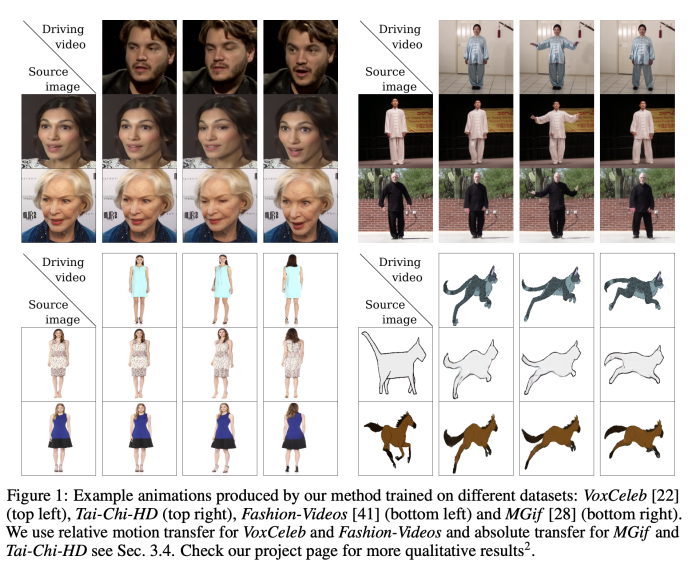  

## Method

우리는 source image S를 driving Video D의 object의 움직임과 비슷하게 animating 하는 것이 목표이다.
direct 한 supervision은 불가능하기 때문에(똑같은 움직임을 갖는 video pair 데이터셋 없음), Monkey-Net에서 영감을 받아 self-supervised 전략을 따른다.
학습을 위해서 같은 object category에 속하는 large collection 비디오 dataset을 사용하였다.
그리고 모델은 single frame과 video의 motion에서 학습된 latent representation을 결합하여 학습 비디오를 재건하도록 학습되었다.
같은 비디오 내에서 frame 쌍을 추출하고, motion-specific keypoint 변위와 local affine transformation을 결합하여 motion enocde를 학습한다.
test time 에서는 source image와 driving video의 각 frame과 encode를 수행하여 source object의 animation을 생성한다.

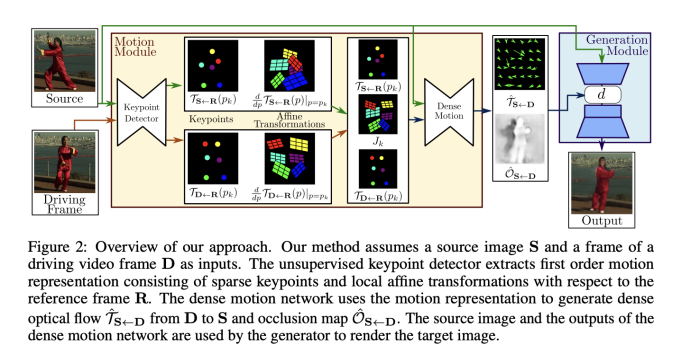

이 논문의 주요 모듈은 두가지로 구성되어 있다.
* **motion estimation module**: dense motion field를 driving video frame, source image 에서 예측한다. 
  dense motion field는 후에 S의 feature map을 D의 pose로 변환하기 위해 사용한다.
  motion field 는 function T(S<-D)로 모델링 되는데, 이는 D의 각 픽셀의 위치를 S에 맵핑하는 역할을 수행한다. 
  T(S<-D)는 backward optical flow라고 부르기도 하는데, forward optical flow 보다 bilinear sampling을 사용한 미분 방식에서 더 효율적이기 때문이다.
  또한, 우리는 abstract reference frame R이 존재한다고 가정한다.
  그래서 독립적으로 두가지 transformation을 예측할 수 있다 (S<-R, R<-D)
  X2Face와 다르게  reference frame은 나중에 파생 항목에서 취소되는 추상적인 개념이다. 
  그래서 이는 직접적으로 계산하거나, visualize 할 수 없다. 
  이런 선택은 D와 S 프로세스를 독립적으로 수행할 수 있도록 한다.
* **image generation module**: T(S<-D)를 따라서 source image를 warping 하고, O(S<-D)를 이용하여 inpaint를 수행한다. 

Motion Estimator 모듈은 두 가지 step으로 구성된다.
1. self-supervised 방식으로 구한 keypoints를 이용하여 transformation을 수행한다.
D와 S 각각을 개별적으로 keypoints 위치를 예측한다. 
   keypoints representation은 compact한 motion representation의 bottleneck으로 동작한다.
   각 keypoint의 neighbourhood의 motion은 local affine transformation으로 모델링 된다.
   keypoint displacements 만 사용하는 것에 비해 local affine transformation을 사용하면, 더 큰 변환을 모델링 할 수 있다.
   이를 위해 keypoint detector 네트워크는 keypoint 위치와 affine transformation 매개변수를 출력한다.
   
2. Densemotion network는 dense motion field T(S<-D)를 구하기 위해 local approximation을 합친다. 또한, occlusion mask O(S<-D)를 출력하여, 
   해당 part가 inpaint 되어 Source image를 warping 하여 D를 재건할 수 있게끔 한다.

### 1. Keypoints Estimation
self-supervised 한 방식으로 Source와 Driving frame 각각에서 keypoint를 추출한다.
또한 각 keypoint에서 local affine transformation 을 수행하기 위한 매개변수인 jacobian 행렬을 구한다. 
* Jacobina 행렬: 다변수 벡터의 도함수 행렬로, 비선형 변환을 국소적으로 선형 변환으로 근사시키는 것이다. 
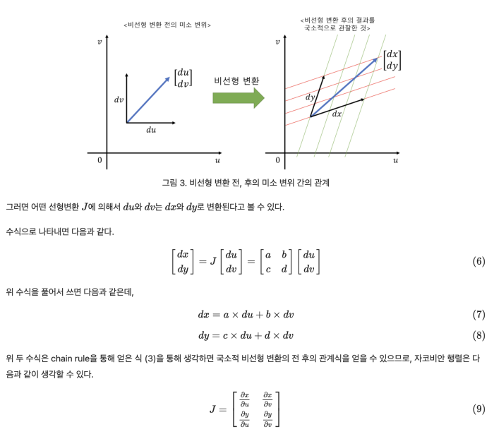
  
### 2. Local Affine Transformation for Approximation Motion Description
Motion Estimation module은 T(S<-D) backward optical flow를 예측한다.
T(s<-D)를 근사하기 위해 keypoint 주변의 first order Taylor expansion을 사용한다.
* 테일러급수: 미지의 함수를 도함수들의 한점에서의 값으로 계산된 값의 항을 무한합으로 나타내는 방법 
* 1차 테일러 급수: T(x, y) = T(a, b) + T'x(a, b)(x-a) + T'y(a, b)(y-b) + R(x, y)
* 절단 오차: R(x, y) = T''x(a, b)(x-a)/2! + T''y(a, b)(y-b)/2! + ...

먼저, Abstract Reference Frame R이 존재한다고 가정한다. 
* T(S<-D)는 T(S<-R)과 T(R<-D)로 구성된다.
* K개의 Keypoints: p1, p2, p3, ... pk
* Given Frame: X
* reference pose space: p
* X, S, D pose space: z

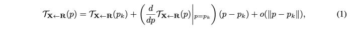  

T(R<-X) = T-1(X<-R) 이 성립하게 하기위해 T(X<-R)을 각 keypoint의 주변에서 locally bijective 하다고 가정한다.  
* pk = T(R<-D)(zk)  
* zk = T(D<-R)(pk)  

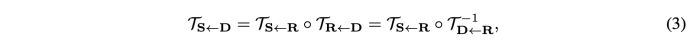  
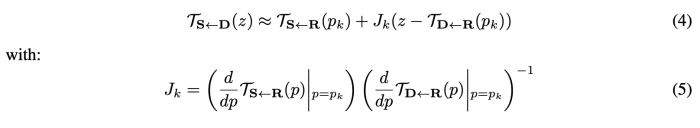  

* Jk = 2x2 identity matrix 
* T(S<-R), T(D<-R), d/dpT(S<-R) , d/dpT(D<-R) 모두 keypoint detector에서 예측할 수 있다. 

#### Combining Local Motions
misalignment issue는 network가 T^(S<-D)를 예측하기 더욱 어렵게 한다. 
그래서 대략적으로 T(S<-D) 식(4)을 이용하여 Source frame을 local transormation을 이용하여 warp 해준다.
K 개의 transformed images S1, S2, ..., Sk는 각 keypoint의 근처에서 aligned 된 이미지이다.
추가적으로 background를 고려하기 위해 S0 = S를 사용한다.

각 pk에 대해서 추가적으로 Dense motion network에서 어디에서 transformation이 이루어져야 하는지 indicating 해주는 heatmap Hk를 구한다.
각 Hk는 두 heatmap의 차이로 구한다.
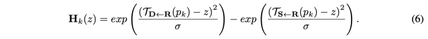  
* 표준편차: 0.01 사용

heatmap Hk와 transformed image S0, ..., Sk는 concat된 다음 U-Net 구조를 통과한다.
우리는 물체가 K개의 강체 부분으로 구성되어 있고 각 부분이 식(4)에 따라 움직인다고 가정한다.
따라서, 각 local transformation이 유지되는 위치를 나타내는 K+1 개의 마스크 Mk를 추정한다.  
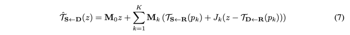   
* M0z : non-moving parts (background) 

### 3. Occlusion-aware Image Generation
Source image를 D^를 생성하기 위해 pixel-to-pixel align 을 수행하는 것이 아니다.
misalignment를 핸들링하기 위해 feature warping 전략을 이용한다.
convolution block을 이용하여 2-down-sampling 을 수행한후 feature map F (H'xW')를 구한다.
T^(S<-D)에 맞추어 F를 warping한다. S에 Occlusion이 있을 경우 optical flow가 D^를 생성하기에 충분하지 않을 수 있다.
실제로 S에서 가려진 부분은 이미지 왜곡으로 복구할 수 없으므로 inpaint 해야한다.

그래서 이를 해결하기 위해 Occlusion map을 도입한다. 
이는 inpaint 해야하는 feature map 영역을 마스킹 한다. Occlusion mask는 가려진 부분에 해당하는 feature의 영향력을 감소시킨다.
* transformed feature map은 아래와 같이 표현된다. 
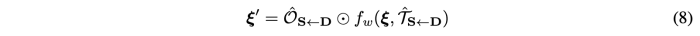   

Occlusion mask는 dense motion network의 final layer에 채널을 추가하여 구했던 sparse keypoint representation을 이용하여 구한다.
마지막으로 feature map 은 랜더링 하기위해 생성모듈의 후속 네트워크 계층에 공급된다. 

### 4. Training Losses

#### Reconstruction Loss
Perceptual loss를 베이스로 사용한다. 
* N: VGG-19 layer 
* Resolution: 256 × 256, 128 × 128, 64 × 64 and 32 × 32  

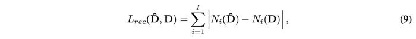  

#### Imposing Equivariance Constraint
keypoint predictor는 annotation을 사용하지 않기 때문에, performace가 안정적이지 않을 수 있다.
그래서 Equivariance constraint는 매우 중요한 요소이다. 
이 제약은 모델이 알려진 기하학적 변환과 모델의 키포인트 예측이 일관되도록 강제한다. 
이를 위해 이전에 unsupervised 키포인트 감지에 사용되었던 Thin Plate Splines Deformation (TPS)을 사용하였다.

또한, motion estimator는 키포인트 뿐만 아니라 Jacobian도 함께 예측하기 때문에, 잘 알려진 등분산 손실을 확장하여 야코비 행렬에 대한 제약 조건을 추가로 포함한다.

X 이미지에 대해서 TPS를 수행하여 새로운 이미지 Y를 얻는다고 가정할 때, local approximation을 아래와 같이 구할 수 있다.

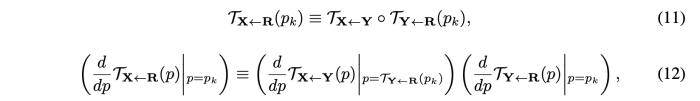

식(11)은 keypoint standard equivariance constraint와 일치한다.
* T(D<-R) = Driving Frame -> Keypoint Detection 
* T(X<-R) = Driving Frame (X) -> TPS Transform (Y) -> Keypoint Detection T(Y<-R) -> Warp Keypoint 
* Loss = L1(T(D<-R), T(X<-R))

식(12)은 두번째 constraint 로 작용하는데, 이는 jacobian을 zero가 되도록 잘못 강요하기 때문에 아래와 같은 formulation으로 수정하였다.

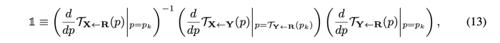  
* 1: 2x2 identity matrix

## Result

