---
layout: post   
title:  (Scaled-YOLOv4) Scaling Cross Stage Partial Network  
subtitle: AI Paper Review       
tags: [ai, ml, computer vision, GAN, facial animation, video synthesis, video generation, face generation, lip sync]      
comments: true  
---  

이 논문은 YOLO v4 object detection 네트워크를 통해서 CSP(Cross Stage Partial) 접근 방식을 이용하여 속도와 정확성을 유지하며 모델의 확장 및 축소가 가능함을 보인다. 
이 논문에서 제안하는 Network Scaling 접근 방식은 Depth, width, resolution 뿐만 아니라 네트워크의 구조도 변경시킨다. 
YOLO v4-large 모델은 COCO dataset에서 SOTA를 달성 했으며, Tesla V100에서 16 FPS의 속도를 보여준다.
YOLO v4-tiny 모델은 RTX 2080 Ti에서 443 FPS 속도를 낼 수 있다.

[Paper Link](https://arxiv.org/pdf/2011.08036v2.pdf)  
[Code Link](https://github.com/WongKinYiu/ScaledYOLOv4)  

## Introduction
효율적인 object detector를 디자인하기 위해서는 높은 정확도와 다양한 디바이스에서 real-time inference가 가능하도록 모델을 scaling 하는 기술이 매우 중요하다.
가장 흔한 model scaling 기술은 depth(#of layers), width(#of channels)를 바꾸어 학습하는 것이다.

이 네트워크를 한번만 학습하는 것 이외에도 Knowledge distilation을 이용하여 학습하기도 한다.
또한, NAS 기술은 EfficientNet-B0에 depth, width, resolution를 복합하여 스케일링하였다. 
이후, Radosavovic은 방대한 parameter search space AnyNet에서 제약조건을 요약, 추가한 후 RegNet을 설계하였다.
RegNet에서 그들은 CNN의 optimal depth는 60임을 밝혔다. 또한 bottleneck ratio=1 일 경우, width increase ratio=2.5 가 가장 좋은 성능을 냄을 밝혔다.

그리고 요새는 이런 scaling method가 object detection에 적용되면서, SpineNet, EfficientDet등이 개발되어 왔다.

분석을 통해서, SOTA object detector, CSPDarknet53 (backbone=YOLOv4) 가 network architecture search 기술에서 얻은 가장 최적의 구조와 가장 잘 매치함을 알아냈다.
CSPDarknet53의 depth, bottleneck ratio, width grow ratio는 65, 1, 2 이다. 
그래서 우리는 model scaling 기술은 YOLOv4에 기반하여 개발하였다.

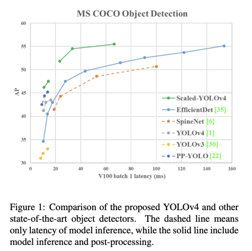  

--------------

##### (보충) YOLO v4
[(참고: https://herbwood.tistory.com/24)](https://herbwood.tistory.com/24)  

GPU에서 실시간으로 동작하면서, 하나의 GPU 만으로 매우 빠른 학습이 가능한 모델

* Model
  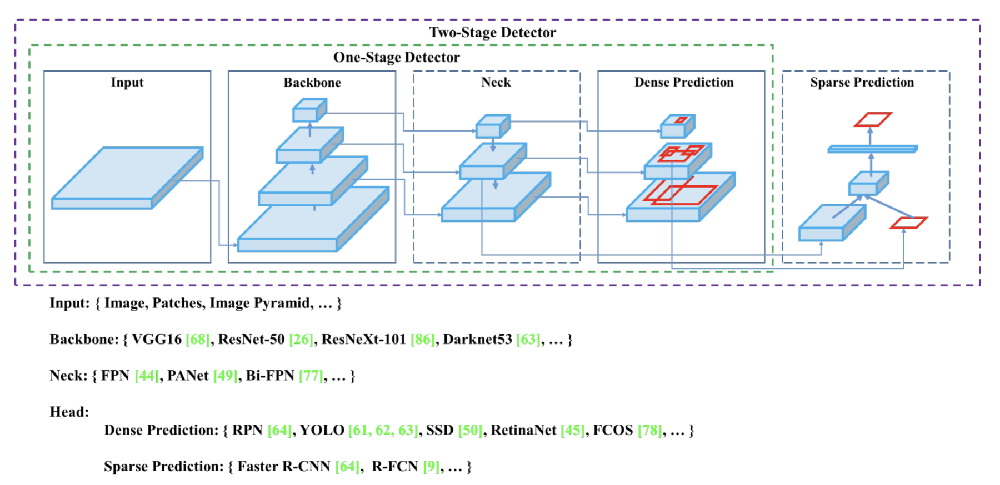  
  
  * Backbone  
  1. GPU platform backbone: CSPDarkNet53
  2. CPU platform backbone: MobileNet
  
  * Neck  
  다양한 크기의 Feature map을 수집하기 위해 block을 추가하거나 bottom-up path, top-down path를 집계하는 방법을 사용 
    
    * Additional Blocks
      * SPP (Spatial Pyramid Pooling)  
      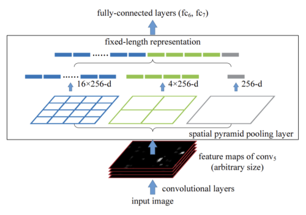
        
      * SAM (Self Attention Module)  
      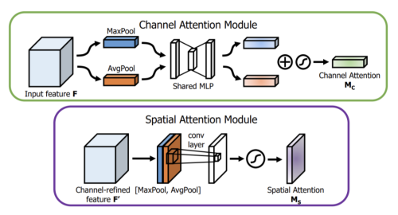
      
    * Path-Aggregation Blocks
      * PAN (Path Augmented Network)
      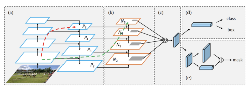
        
  * Head
    * One-stage Detector
      * Anchor-based
      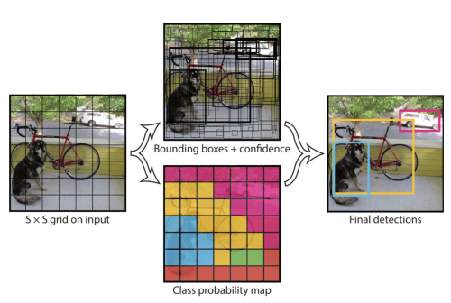

* Back of Freebies
offline 학습의 장점을 살려, 모델의 inference 시간을 늘리지 않으면서, 학습 비용만 추가하여 더 높은 정확도를 얻도록 하는 방법 
  * Data Augmentation
    * Pixel-wise 변형 
      * Photometric distortion: 대비, 채도, 명도, 노이즈 등 변화 
      * Geometric distortion: 이미지 크기, 자르기, 뒤집기, 회전 등 변화
    * Simulating object occlusion 
      * image-level: random erase (물체가 부분적으로 가려 보이지 않는 문제를 해결하기 위해 이미지의 일부분을 random한 값으로 채움), cutOut (이미지 일부분을 0으로 채움), Hide-and-seek (이미치 패치를 랜덤하게 숨김), Grid Mask (고정된 크기의 grid로 이미지를 가림)
      * feature map level: DropOut, DropConnect, DropBlock(Feature map 내에서 연속하는 영역의 activation을 0으로 만들어 네트워크에 regularization 효과)  
      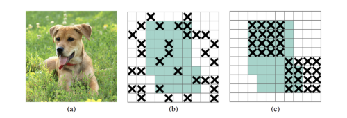  
    * Using Multiple Images
      * CutMix: 이미지 내 특정 패치 영역에 label이 다른 학습 이미지를 잘라 붙여 학습 픽셀을 효율적으로 사용하여 regularization 효과 유지 
      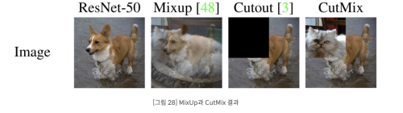  
      * Mosaic: 네개의 학습이미지를 섞는 방법
      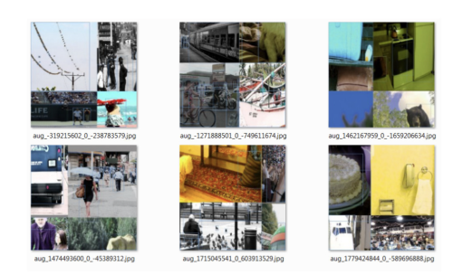   
    * Using GAN
      * Stylized Image Net : Texture bias 를 해결하기 위해  style transfer를 통해 shape는 유지하면서 texture만 변형
      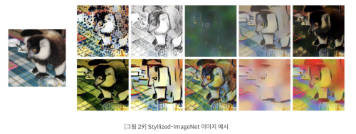  
  * Semantic Distribution Bias 
    * Focal Loss: Class imbalancec 문제를 해결하기 위해 easy negative 를 down weight 하여 hard negative에 집중하여 학습 시킴 
    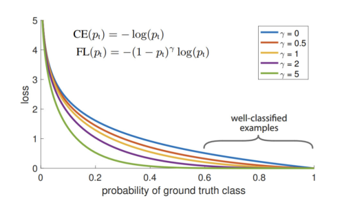  
    * One-hot hard representation
      * Label-smoothing: label을 0 또는 1 이 아니라 smooth하게 부여함으로써 모델의 regularization 및 일반화 능력을 향상시키며 recalibration에 도움을 줌 
  
* Objective Function of Bounding Box Regression
  * Anchor-based: bbox 좌표에 대해 직접적으로 MSE 수행
  * IoU-based
    * GIoU(Generalized IoU):
      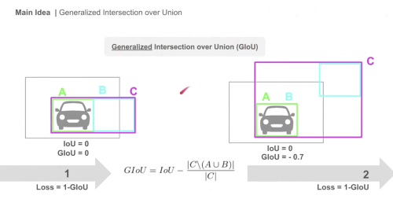  
        * box C: prediction과 GT를 포함하는 가장 작은 박스
        * C / (AUB): C 박스 영역에서 A, B 합집합을 뺀 영역 
        * A, B가 무한히 멀어질 경우 GIoU는 -1 까지 멀어질 수있고, loss는 0에서 2까지의 값을 가질 수 있다.
    * DIoU(Distance IoU): 
      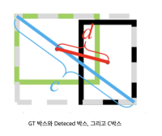  
      DIoU = IOU - D(b, b_gt)^2/c^2
      * pred box와 gt box의 중점사이의 유클리드 거리를 c박스의 대각선 거리로 나눈 값을 추가 penalty 항으로 사용 
      * GIoU에서 그 넓이가 너무 작거나 0인 경우 영향력이 낮아 수렴속도가 매우 느린 점을 개선하기 위함 
    * CIoU(Complete IoU): 
      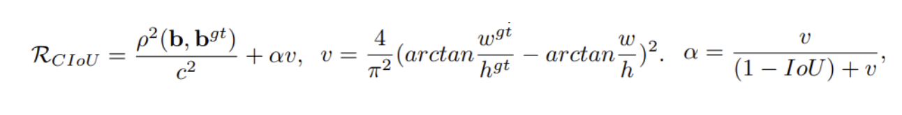  
      * DIoU에 Aspect Ratio를 추가한 버전 
      * a: overlapping 되자 않는 경우 더 빠른 수렴을 가능하도록 함 
  
* Main Idea of YOLO v4
  * Mosaic
  * Self-Adversarial Training (SAT):
  이 기술은 모델의 상태를 사용하여 입력 이미지를 변환하여 취약점을 알립니다. 
  먼저 이미지는 정상적인 훈련 단계를 거칩니다. 그런 다음 가중치를 통해 지지하는 대신 손실 신호를 사용하여 모델에 가장 해로운 방식으로 이미지를 변경합니다.
  나중에 훈련에서 모델은 이 특히 어려운 예제에 직면하고 주변에서 학습해야 합니다. 
  여기에서 다룬 기술 중 이 기술은 아마도 가장 직관적이지 않고 모델링 측면에 가장 가깝습니다.
  * CmBN: CBN을 변형시킨 버전으로 하나의 batch에서 mini-batch 사이의 batch statistics를 수집 
  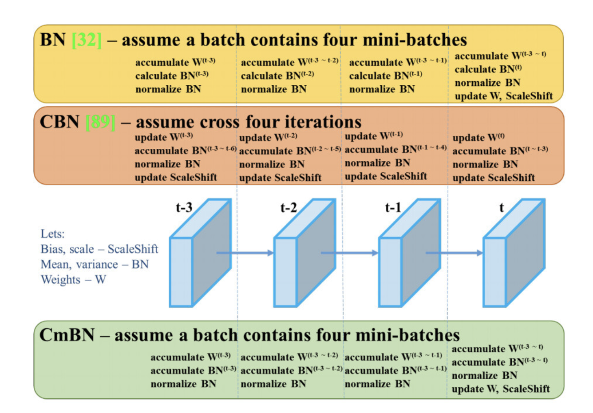  
  * SAM: SAM에서 spatial-wise attention을 point-wise attention으로 변형
  * PAN: shortcut connection을 concatenation으로 변경 
  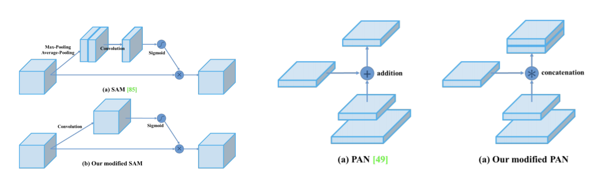  
  * Mish Activation: 
  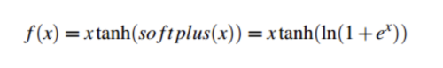  
    * 작은 음의 값을 허용하여 더 나은 표현력을 갖음
    * 양의 값에 대한 제한이 없어 saturation 방지
    * ReLU와 달리 연속적인 미분이 가능 
    * Loss 값이 smoothing 되는 효과가 있음 
  * Backbone: CSPDarknet53
  * Neck: SPP, PAN
  * HEAD: YOLOv3
  * Others
   
    * Bag of Freebies(BoF) for backbone 
      * CutMix and Mosaic data augmentation 
      * Dropblock regularization 
      * Class label smoothing 
    * Bag of Specials(Bos) for backbone 
      * Mish activation
      * Cross-stage partial connections(CSP)
      * Multi-input weighted residual connections(MiWRC)
    * Bag of Freebies(BoF) for detector
      * CIoU-loss
      * CmBN
      * DropBlock regularization 
      * Mosaic data augmentation
      * Self-Adversarial Training 
      * Eliminate grid sensitivity 
      * Using multiple anchors for a single ground truth 
      * Cosine annealing scheduler 
      * Optimal hyperparameters 
      * Random training shapes 
    * Bag of Specials(BoS) for detector
      * Mish activation 
      * SPP-block
      * SAM-block
      * PAN path-aggregation block
      * DIoU-NMS

--------------

## Related Work

### Real-time object detection
* one-stage object detector: T = T1st
  * inference time 이 constant
* two-stage object detector: T = T1st + m*T2nd (m: # of region proposals)
    * inference time이 fixed 하지 않음 
    
real-time object detector를 위해서는 one-stage 가 필수이다.
요즘 유명한 one-stage detector는 두가지 종류로 나뉜다.

* anchor-based: EfficientDet, YOLOv4, PP-YOLO 
* anchor-free: CenterNet

### Model Scaling
최근들어 Network Architecture Search(NAS) 가 많이 활용되고 있다.
EfficientNet은 depth, width, input size를 종합하여 scaling 을 수행한다.
EfficientDet의 메인 컨셉은 image size, width, # of BiFPN layer, # of box/class layer를 이용하여 스케일링 하는 것이다.
RegNet은 # of stage, input resolution은 고정하고, depth, initial width, slope, quantize, bottleneck ratio, group width 를 사용하여 스케일링한다.

## Principles of model scaling
### 1. General principle of model scaling

이 섹션에서는 일반적인 CNN 모델에 대해서 (1)image size (alpha), (2)number of layers(beta), (3) number of channels (gamma) 를 변경하면서 quantitative cost를 이해할 것이다.
* k: # of layers
* b: # of base layer channels
* ResNet layer is k∗[conv(1 × 1, b/4) → conv(3 × 3, b/4) → conv(1 × 1, b)]
* ResNext layer is k∗[conv(1 × 1, b/2) → gconv(3 × 3/32, b/2) → conv(1 × 1, b)]
* Darknet layer, is k∗[conv(1 × 1, b/2) → conv(3 × 3, b)].

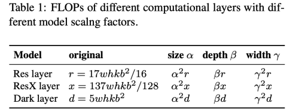  
해당 모델들을 각각 CSPNet 구조로 적용하였을때, 정확도를 개선하고, inference time을 줄임과 동시에, 파라미터와 계산 수를 줄 일 수 있다. 
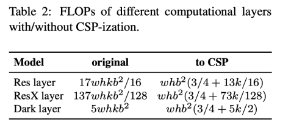  
  
따라서, CSP-ized models (Cross Stage Partial) 는 모델 scaling 에 매우 좋다.

-----------
##### (보충) Cross Stage Partial 이란?    

[(참고)](https://deep-learning-study.tistory.com/632)  

(1) Cross Stage Partial Network   
  
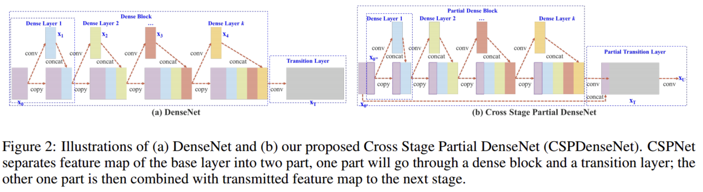  
DenseNet 구조에서, Dense layer의 입력값이 출력값과 concatenate 된다. 역전파 과정에서 dense layer의 입력값의 gradient information이 중복해서 사용된다.
결국 이는 아래와 같이 복사된 gradient 정보를 반복적으로 학습할 뿐이다. 
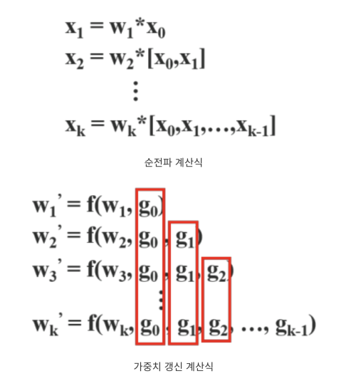  
CSP를 적용한 모델은 partial dense block과 partial transition layer로 구성된다.
partial Dense block 에서 input feature map은 두 부분으로 분할 된다. (x0 = x'0, x''0')
x''0은 dense block으로 전달되고, x'0은 stage의 마지막과 연결된다. 
Dense layer의 출력값 (x''0, x1, x2, ...)은 transition layer를 거쳐서 xT가 생성되고, xT는 x'0과 concatenate 되어 다음 translation layer를 통과하여 xU를 생성한다.
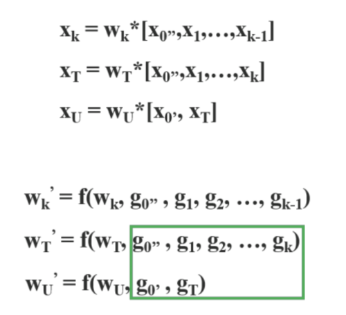  

위와 같이 함으로써, x'0의 gradient 정보는 복사되지 않는다.   DenseNet의 feature reuse특성을 활용하면서도, gradient flow 를 truncate 하여 과도한 양의 gradient information 복사를 방지한다.

(2) Exact Fusion Model   

multi-scale detection을 위해 feature pyramid를 생성하는 과정으로, feature pyramid로부터 concatenate 하는 과정은 많은 양의 memory와 CC를 유발한다.
이 문제를 해결하기 위해 Maxout 테크닉을 사용한다. 

-----------

### 2. Scaling Tiny Models for Low-End Devices
low-end 디바이스 에서는 inference speed는 model size, 계산량에만 영향을 받는 것이 아니라, 하드웨어의 resource 또한 매우 중요한 고려 대상이다.
그래서 tiny model을 scaling 할때는, memory bandwidth, memory access cost(MACs), DRAM traffic 또한 중요한 고려 대상이다.

#### Make the order of computation less than O(whkb^2)
lightweight model은 적은 계산량으로 요구되는 정확도에 도달하기 위해서 파라미터를 효율적으로 사용할 수 있게 utilize해야한다.
우리는 모델 스케일링 시 계산 순서가 가능한 적기를 바란다.  
* 효율적인 모델 구조인 DenseNet과 OSANet(One-shot Aggregation)의 계산량은 아래와 같다. 
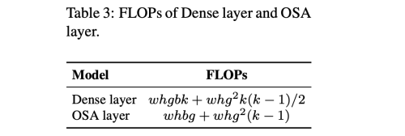  
* g: growth rate
* k << g< b
* computation complexity of DenseNet is O(whgbk) and that of OSANet is O(max(whbg, whkg^2))
* computation complexity of ResNet is O(whkb^2)

Dense layer, OSA layer 모두 ResNet 모다 계산 복잡도가 적기 때문에, 저자는 OSANet의 구조를 사용하였다.

--------------
##### (보충) One Shot Aggregation 이란 ? 
[(참고)](https://sh-tsang.medium.com/review-vovnet-osanet-an-energy-and-gpu-computation-efficient-backbone-network-for-real-time-3b26cd035887)  

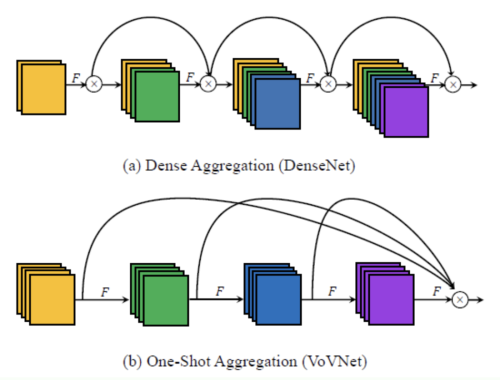  

DenseBlock의 Memory Access Cost는 아래와 같다.  
* MAC = hw(ci + co) + k^2cico  

(1) Dense Aggregation의 단점   

Dense connection은 MAC이 크다. 또한 이 bottleneck 구조는 gpu parallel computation의 효율을 저하시킨다.
또한 dense connection은 중간 레이어가 이전 레이어의 기능과 유사하지만 더 나은 기능을 생성하도록 한다.
결국 최종 계층은 중복 정보를 나타내기 때문에 이전 레이어와 feature를 집계하는 방법을 학습할 필요가 없게 된다.

(2) One Shot Aggregation
간단히 feature 들을 마지막 레이어에서 한번에 aggregation하자는 아이디어이다.
이를 통해 GPU 계산 효율을 높일 수 있고, 불필요한 1x1 conv 의 사용을 줄일 수 있다. 

--------------

#### Minimize/balance size of feature map
계산 스피드와의 가장 좋은 trade off를 얻기위해 새로운 컨셉인 CSPOSANet을 제안한다.
오리지널 CSP 디자인을 DensNet이나 ResNet에 적용하면, j th layer의 output은 1st + (j-1)st layer의 output의 합이 사용된다,
그래서 우리는 전체 computational block 을 하나로 다루어야 한다. 

OSANet의 계산 블록은 PlainNet 아키텍처에 속하기 때문에 계산 블록의 모든 계층에서 CSPNet을 만들면 기울기 자르기 효과를 얻을 수 있습니다. 
이 기능을 사용하여 기본 계층의 b 채널과 계산 블록에서 생성된 kg 채널을 다시 계획하고 표 4와 같이 채널 번호가 동일한 두 경로로 분할합니다.

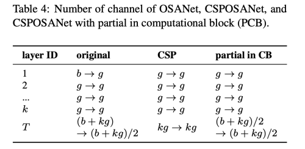  

#### Maintain the same number of channels after convolution
Power consumtion도 low-end device 에서 중요한 요소인데, 이에 가장 영향을 미치는 요소가 MAC 이다. 

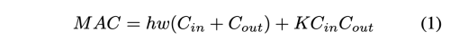  

smallest MAC이 되기 위해서는 Cin = Cout 이여야 한다.

#### Minimize Convolutional Input/Output (CIO)
DRAM IO를 통해 측정할 수 있다.
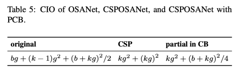  
kg > b/2 일때 Best CIO를 얻을 수 있다. 

## Scaled-YOLOv4
### CSP-ized YOLOv4
* Backbone: CSPDarknet53의 디자인에서, down-sampling convolution 계산은 residual block에 포함되지 않았다.
그래서 우리는 CSPDarknet의 각 stage 계산량을 whb^2(9/4+3/4+5k/2) 라고 추론할 수 있다.
위 식을 통해서 우리는 k>1일때만 계산 이득을 얻을 수 있음을 알 수 있다.
CSPDarknet53 에서 residual layer는 각 stage에서 1-2-8-8-4 개이다.
더 좋은 speed/accuracy trade-off를 얻기 위해 첫번째 CSP stage를 original Darknet residual layer로 바꿨다.
  
* Neck: 효과적으로 계산량을 줄이기 위해서 PAN 구조를 CSP-ize화 하였다.
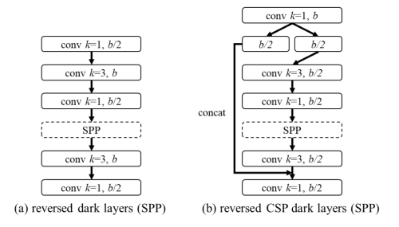  
이 변화로 인해 계산량을 40% 가량 줄일 수 있었다.
  
* SPP: SPP 모듈은 원래 neck의 첮번째 계산 목록 그룹 중간에 삽입되었다. 따라서 CSPPAN의 첫번째 계산 그룹 중간 위치에 SPP 모듈도 삽입하였다.

### YOLOv4-tiny
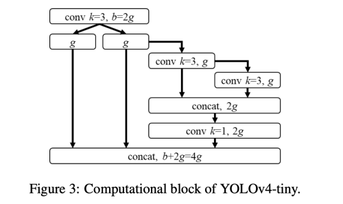  
CSPOSANet을 PCB 구조와 함께 사용하였다.
growth rate g=b/2, 최종적으로 b/2+kg=2b로 되게끔 사용하였다.
다른 디자인은 YOLOv3-tiny를 따랐다. 