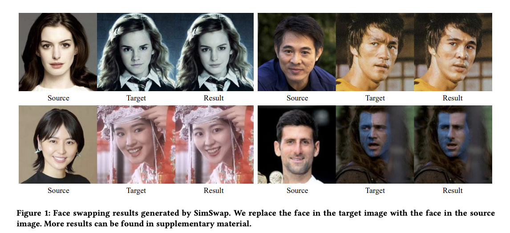
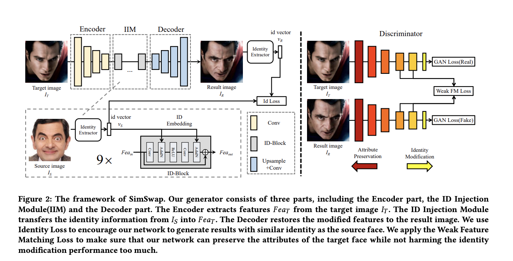
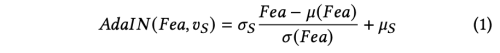
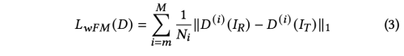
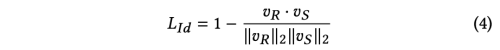
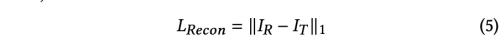
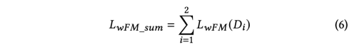
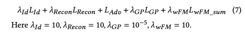
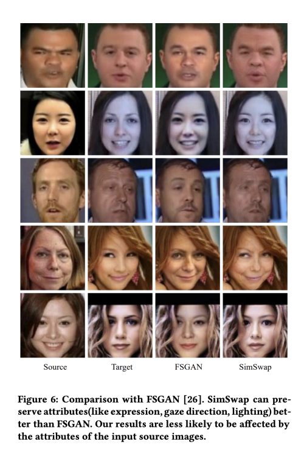
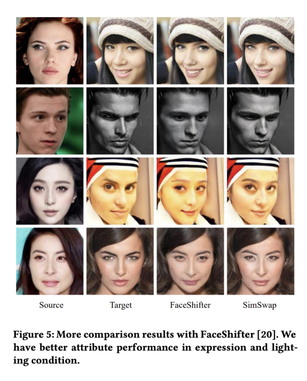

---
layout: post   
title: (SimSwap) An Efficient Framework For High Fidelity Face Swapping   
subtitle: AI Paper Review       
tags: [ai, ml, computer vision, GAN, Face Swapping, Image Translation]      
comments: true  
---  

고화질의 face swap 이미지를 만들기 위한 새로운 프레임워크로 Simple Swap (SimSwap)을 제안한다.
이전의 접근 방식들은 임의의 identity에 대해서 일반화 하기 힘들거나, 표정, 눈동자 방향을 등을 보존하는데 실패하였다.
SimSwap은 임의의 얼굴에 대해서 target face의 특징을 유지하면서 효과적으로 transferring을 수행할 수 있다.
저자는 위에서 언급한 defact를 극복하기 위해서 두가지 방법을 사용하였다. 
첫째는, ID Injection Module(IIM)을 사용하여 source face의 identity information을 target face에 feature level로 전달하였다.
이 구조를 통해서 임의의 얼굴에 대해서 수행을 할 수 있다.
둘째는 Weak Feature Matching Loss를 사용하여 facial attribute를 효과적으로 보존하였다.
이 모델은 이전의 SOTA 에 비해서 월등히 좋은 성능을 내었다.

[Code Link](https://github.com/neuralchen/SimSwap)  
[Paper Link](https://arxiv.org/pdf/2106.06340v1.pdf)  

  

## Related Work
Face Swapping 방식은 크게 두가지로 나뉜다. 

### 1. Source-oriented Methods
작업이 image level의 source face에서 이뤄지는 방식으로, 
특징을 target face에서 source face로 전달하고, source image와 target image를 blend 하는 방식이다
이전의 방식들은 3D model를 사용하여 자세 및 조명감을 사용하였지만, 이는 수동적인 개입을 필요로 했다.
자동적인 방식도 제안되었지만, 이는 특정한 face library에 있는 identity 만을 swapping 할 수 있었다.
게다가 3D model은 표정등을 재 생성하는데 많은 한계가 있다. 최근 FSGAN은 two-stage 구조를 사용하여서, 먼저 face reenactment 네트워크로 표정과 포즈에 대한 정보를 
전달하고, 두번째 stage 에서 face inpainting network를 사용하여 source iamge를 target image에 blending 하였다. 
source-oriented 방식의 단점은, source image에 너무 민감하다는 것이다.
그래서 과격한 표정과 큰 움직임이 있는 source face는 face swapping의 결과에 큰 영향을 미치게 된다.

### 2. Target-oriented Methods
작업이 feature level의 target face에서 이뤄지는 방식으로,
NN을 사용하여 target image에서 특징을 추출한 다음, feature를 수정하고 output face swapping image로 특징을 복원한다. 
유명한 DeepFakes 알고리즘은 Eoncoder-Decoder 구조를 최적화 하여, 특정한 identity 에 대해서 swapping을 수행할 수 있지만, 일반화 성능은 좋지 않다.
IPGAN은 Decoder로 보내기 전에 source image로 부터 identity vector를, target image로 부터 attribute vector를 추출한다.
이 방식은 identity를 유지하는데는 효과적이나, 표정이나 포즈를 유지하는데는 좋지 않았다.
FaceShifter는 정교한 2단계 프레임워크를 활용하여 최첨단 ID 성능을 달성했다.  
그러나 이전 방법과 마찬가지로 FaceShifter는 속성에 너무 약한 제약을 가하여 결과가 종종 표현 불일치로 인해 어려움을 겪었다.

 
## Method
먼저, 기존 구조의 한계점에 대해서 논의해보고, 임의의 identity로 확장할 수 있는 방법을 보이겠다.
그리고, target의 특징을 유지할 수 있게 도와주는 Weak Feature Matching Loss를 소개하겠다.

### 1. Limitation of the DeepFakes
DeepFake의 구조는 Common Encoder (Enc)와 2 identity-specific Decoder (Dec_s, Dec_t)로 구성되어 있다.
학습 단계에서, Enc-Dec_s는 warped source image를 받고, original unwarped source image를 복구해낸다.
Enc-Dec_t에서 똑같이 target image에 대해 수행한다.
그리고, test stage 에서 target image를 Enc-Dec_s 구조에 보내어 swapped face를 얻을 수 있다. 
Enc는 target face에서 identity, attribute가 포함된 feature 정보를 추출한다. 
Dec_s는 target의 feature를 source의 identity로 변경한다. (반드시 source 의 identity 정보는 Dec_s의 weight에 녹아들어 있어야한다.)
그렇기 때문에, DeepFake는 특정한 identity에 대해서 수행할 수 밖에 없다.

### 2. Generalization to Arbitrary Identity

이런 한계를 극복하기 위해서 Decoder로부터 Identity 정보를 분리시켜야, 전체적인 구조가 identity로부터 일반화 될 수 있다. 
저자는 Encoder와 Decoder 사이에 ID Injection module를 추가함으로써 구조를 개선시켰다. 

  

* target image I_t로 Encoder를 통과하여 Fea_T를 생성한다.
* 우리는 target face를 source face로 swap 해야하므로, Fea_T에 있는 identity information을 attribute information을 바뀌지 않게 하면서 교체하여야 한다.
* 하지만 Fea_T에 있는 identity, attribute information은 매우 엉켜 있고, 분리시키기가 어렵다.
* 그래서 전체 Fea_T에 대해서 수정을 수행하고, training loss를 사용하여 Fea_T에서 어떤 부분이 바뀌어야하고, 어떤 부분이 유지되어야 하는지 암묵적으로 학습하도록 하였다.
* ID Injection Module은 Fea_T의 identity information이 source face가 되도록 change 하는데 사용된다.
    * 이 모듈은 두가지 part, identity extraction part, embedding part로 구성된다.
    * identity extraction part 에서, identity와 attribute 정보를 포함하는 source image I_s를 처리한다.
    * 이때, 우리는 identity 만 필요로 하기 때문에, face recognition netowrk 를 이용하여 identity vector v_s를 추출한다.
    * embedding part 에서는 ID-Block를 사용하여 feature에 identity information을 주입한다.
    * ID-Block은 Residual Block의 수정버전으로, AdaIN(Adaptive Instance Normalization)이 Oribinal BatchNorm을 대체하였다. 
      
    * 여기서 mean(Fea), std(Fea)는 channel-wise로 계산된 값이다. 
    * mean(S), std(s)는  fc layer 를 사용하여 v_s 에서 계산된 값이다. 
    * 충분한 identity 를 보증하기 위해, 9 ID-Blocks를 사용한다.
* Identity information을 주입한 뒤, 이 수정된 feature를 Decoder 를 통과시켜 final result I_r을 얻는다.
* source image는 학습과정에서 다양한 identity를 사용하기 때문에 Decoder는 특정한 id에 관계되지 않는다.

* 학습과정에서 생성한 I_r에 대한 identity vector v_r 를 추출하고 v_r과 v_s 간의 거리가 최소화 되게 하는 Identity loss를 사용한다,
* 하지만, 이는 network가 오직 front face 이미지에 overfit되고 target attribute를 잃게 만들 수 있으므로, adversarial training을 활용하였다.
* Discriminator는 PatchGan 버전을 사용하였다.

### 3. Preserving the Attributes of the Target
Face Swapping task에서 modification은 오직 identity part에 대해서만 수행되고, attribute part(표정, 포즈, 조명 등)에 대해서는 바뀌지 않아야 한다.
하지만, 우리는 전체 Fea_T에 대해서 modification을 수행하기 때문에, attribute information은 identity embedding 에 의해 영향을 받을 수 있다.
이를 제한하기 위한 training loss 를 사용한다. 
그러나 모든 attribute을 명시적으로 제한하기로 선택한 경우 각 attribute에 대해 하나의 네트워크를 훈련해야 합니다.
매우 많은 attribute들이 존재하기 때문에, 이는 비실용적이다.
그래서 저자는 암시적인 제한을 수행하기 위해 Weak Feature Matching Loss를 제안한다. 

pix2pixHD의 Feature Matching Originated 아이디어는 Discriminator가 GT 이미지와 generated image에서 multiple layers of features를 추출한다.
* Original Feature Matching Loss  
   

저자는 face swapping task 에서는 GT가 없기 때문에, gt 대신 input target image를 사용한다. 
그리고 처음의 몇개 layer를 제거하고, 마지막 몇개 layer만을 사용한다.
* Weak Feature Matching Loss  
   

위의 두식은 비슷하지만 목적은 아예 다르다.
original feature matching loss는 학습을 안정화하고, Generator는 multiple level 에서 자연스러운 통계를 생성하는데 필요하다. 
shallow layer는 texture 정보를 포함하고, pixel level 로 제안하면서 중요한 역할을 수행한다.

하지만, 우리의 face swapping에서는 target image의 너무 많은 texture 정보는 결과가 target face와 비슷하도록 만들 수 있기 때문에, 처음의 몇 레이어를 제외하고 사용하였다.
attribute 정보는 매우 semantic information으로써 deep feature에 존재하기 때문에, 오로지 마지막 몇개의 레이어만을 사용한 것이다.

이로써 명시적으로 attribute를 제한하지 않아도, target face의 attribute 정보를 효과적으로 유지할 수 있었다.

### 4. Overall Loss Function
5가지의 loss function 을 사용하였다.
* Identity Loss  
   

* Reconstruction Loss: 만약 source face와 target face가 같은 identity를 가지고 있다면, generated face와 target face가 같아야함.
identity가 다를 경우는 0을 사용함.   
   

* Adversarial Loss and Gradient Penalty: Hinge version의 Adversarial loss를 사용하였다.
multi-scale Discriminator를 사용하여 large posture 상황에서도 좋은 performance가 나도록 하였다.
또한 Gradient Penalty term을 사용하여 gradient explosion을 방지하였다.

* Weak Feature Matching: Multi-scale Discriminator를 사용하였기 때문에 WFM loss는 모든 discriminator 에대해서 계산한다.
   

전체적인 Loss 는 아래와 같다.  
   

## Experiments
* Implementation Detail
    * Dataset: VGGFace2
    * remove smaller than 250x250
    * align and crop and resize: 224x224
    * ID Injection Module의 face recognition model을 위해서 pretrained ArcFace를 사용
    * Adam Optimizer(b1=0, b2=0.999)
    * pair one batch for images with same identity, another batch for image pairs with different identities
    * more than 500 epochs
    
* Result
   
   