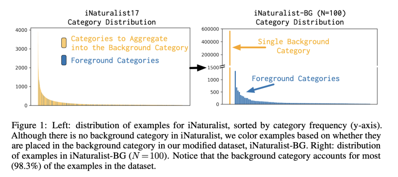
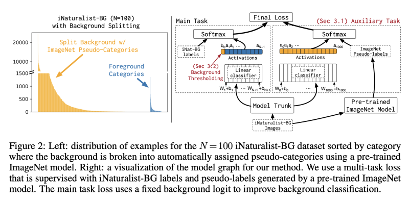
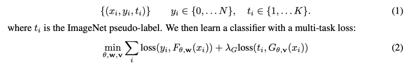
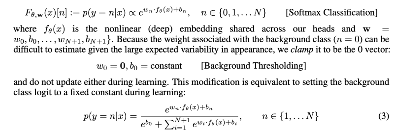

---
layout: post   
title: (Background Splitting) Finding Rare Classes in a Sea of Background   
subtitle: AI Paper Review       
tags: [ai, ml, computer vision, Image Classification, imbalanced classification, background classification]
comments: true  
---  

저자는 real-world에서 rare category를 가지고 deep model의 image classification 학습 정확도를 올릴 수 있는 문제에 관심을 가졌다. 
이 시나리오에서 dataset의 거의 대부분의 이미지들은 background category에 포함된다. (>95%) 
저자는 일반적인 fine-tuning 방식과 SOTA imbalanced dataset에 대한 접근 방식 모두에 대해 증명하였다. 
아주 주요한 발견은 background class로 인한 극심한 imbalance 문제는 기존의 사전 훈련된 모델에서 시각적 지식을 활용하여 크게 줄일 수 있다는 것이다.
특히, background category는 사전 훈련된 모델을 사용하여 훈련하는 동안 더 작고 일관된 pseudo-category로 분할된다.
기존의 사전 훈련된 이미지 분류 모델의 예측을 모방하여 학습하는 auxiliary loss를 추가하여 background splitting 을 image classification 모델에 통합한다.
이 프로세스는 자동이고, 수동적인 label을 필요로 하지 않는다.  
auxiliary loss는 이전의 동질적인 background instance 들을 구별하도록 요구하여, shared network의 feature representation을 정규화하고, 소수의 rare category에 대한 과적합을 줄일 수 있다.  
또한, 이런 background splitting 방법은 배경 불균형을 처리하기 위해 주요 classification loss를 수정하는 다른 방법과 결합할 수 있고, 이는 기존 불균형 학습 기술을 보완하는 방법이다.
이를 평가하기 위해, 학습 과정에서는 오직 적은 rare category들만 주어지는 (all others labelled as background) 수정된 버전의 iNaturalist dataset을 사용하였다. 

[Paper Link](https://arxiv.org/pdf/2008.12873.pdf)  

## Introduction

보통 image classification은 아주 균형잡히고 정제된 데이터셋을 사용하여 평가하는 경향이 있다.
최근에는 long-tail distribution을 가진 in-the-wild 데이터에 집중하기 시작했다. 
하지만 이런 데이터셋 역시 모두 선별된 이미지이고 some category에 속하는 이미지 이기때문에 인공적이다. 

반면에, real-world setting에서는 우리가 관심있는 category는 매우 rare 하고, 대부분의 이미지는 관심있는 어떠한 카테고리에도 속하지 않는다.
예를 들어, e-스쿠터라는 새로운 범주에 주석이 달린 새로 수집된 데이터 세트(예: 자율 차량에서 획득)를 생각해 보자.
수집된 이미지의 대다수가 e-scooter를 포함하지 않기 때문에 이것은 본질적으로 불균형이 심한 이진 이미지 분류 문제이며 희소 positive 만 포함한다.
추가 범주가 필요한 경우 multi-way 이미지 분류 문제로 모델링할 수 있습니다. 여기서 상당 부분의 이미지가 "배경" 범주로 레이블이 지정될 것이다.

이 작업은 소수의 희귀 범주의 이미지 분류를 위해 정확한 심층 모델을 훈련하는 문제에 중점을 둔다.
이 시나리오에서는 오직 category 마다 적은 수의 positive dataset이 존재할 뿐안 아니라, 전체 positive dataset이 background dataset의 수에 의해 지배된다.
(95% 이상이 background) 
저자는 imbalanced classification에 사용된 SOTA 방식인, data sampling과 loss reweighting 이 이 setting 에서는 효과가 없음을 밝혔다.

**Contributions**: 학습과정에서 background를 여러 작은 category로 쪼개서 imbalance 문제를 해결할 수 있는 방법을 제안한다.
main classification (rare category) loss를 수정하는 대신, auxiliary loss를 추가하여 사전 훈련된 모델의 예측을 모방학습하도록 한다.
그래서, 이런 접근 방식은 auxiliary classification task에 대한 distillation을 통해 대상 모델로 지식을 전송한다. 
오직 사전 훈련 모델만 필요하며, 추가적인 label은 필요없다. 
auxiliary classification loss와 main classification loss를 jointly 하게 학습시킴으로써, background category의 지배 효과를 줄일 수 있고, 적은 수의 rare category에 overfitting 하는 문제를 없앨 수 있다.

**Benchmarking**: 저자는 large background category setting 을 만들기 위해서 iNaturalist dataset (highly-imbalanced, lage-vocabulary)를 수정하여 사용하였다.
iNaturalist 2017 dataset은 (675,179)개의 많은 이미지와 5089의 많은 카테고리로 구성되어 있다. 
또한, 인위적으로 카테고리 목록을 선택하고 인터넷 검색 엔진에 쿼리하여 이미지를 수집하는 대신 수천 명의 실제 개인이 수집한 세계의 동식물을 식별하는 실제 사용 사례를 기반으로 하였다. 

먼저 수많은 카테고리를 하나의 background category로 만들었다. 
background class가 커질 수록 성능에 어떤 영향을 끼치는 지 테스트 하였다. foreground category 수를 N이라고 한다.   
  

## Method

### 1. Regularization with an Auxiliary Task
우리는 적은수의 rare category 에 대한 classification model을 학습시킬 때, 많은 수의 배경 예시에 초점을 맞추거나, 적은 positive set에 과적합 되는 퇴행성 솔루션을 피할 수 있는 매커니즘을 원한다.
저자의 솔루션은 대다수의 background class를 sub-category로 나눔으로써, distribution skew를 줄일 수 있다.

하지만 이는 추가적인 라벨을 필요로 한다. 그래서 pseudo-label을 사용하여 background 를 sub-category로 나눈다.
더 구체적으로 말하면, 다른 classification dataset으로 사전 학습한 모델을 이용하여 학습 데이터에 대해서 pseudo-label을 생성한다는 것이다.

우리는 background sub-categories 가 category distribution skew를 줄이고, 네트워크가 배경을 시각적 또는 의마적으로 일관된 많은 범주로 분할하여 각력한 기능 표현을 유지하길 바란다.
skew를 줄이기위해, model이 many sub-categories로 dataset을 분할 하는 것이 필요하다. 
robust feature representation을 장ㄹ려하기 위해서는 우린, model이 시각적으로 의미적으로 일관되게끔 sub-categories를 생성하는 것이 필요하다.

그래서 우린1000-way large-scale image classification dataset ImageNet 에서 학습된 ResNet50 모델을 선택하고, pseudo-label을 생성하기 위해 iNaturalist dataset 에서 평가하였다. 

  

그림 2-왼쪽은 사전 훈련된 모델에 의해 생성된 1000개의 ImageNet 범주로 분할된 N = 100에 대한 배경 범주를 보여준다.
이전에 가장 많은 background sub-category가 98%에서 많아봐야 4.5%가 된것을 볼 수 있다. 

더 정확히 말하면, main-task 에서 cross-entropy loss를 (N+1)-way classification(+1 category for background)로 학습함과 동시에, pre-trained ImageNet model로 생성한 pseudo-label로 regularization을 수행하는 auxilary task 를 수항핸다.
* let y {0, ..., N}, 0 = background class.  

  
* F: main classification head
* G: auxiliary classification head
* loss: Standard cross-entropy loss

### 2. Background thresholding

Softmax classification는 동일한 범주에 속하는 예제가 다른 클래스와 선형으로 분리될 수 있는 유사한 기능을 갖도록 권장한다.
이는 매우 다양하고 큰 background class에 매우 문제가 된다. 
그래서 저자는 이 문제를 해결하기 위해 classifier가 background category에 대해서 학습하지 못하도록 하였다. 
background category에 대해서는 고정된 activation (b0)을 사용하였다.  
  

이렇게 함으로써 N class probabilities의 합은 1보다 작게 된다.
위의 모델은 더 이상 foreground 범주 예제에서 background 예제를 분리하기 위해 초평면 w0을 학습하지 않지만 대신 모델이 모든 전경 범주에 대해 b0보다 낮은 logit 값을 생성하는 경우에만 예제를 배경으로 분류한다.

## Training Detail
* Background threshold: b0 = 0.1
* auxiliary loss weight: 0.1
* Batch size: 512