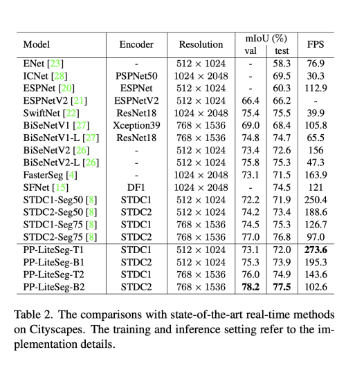
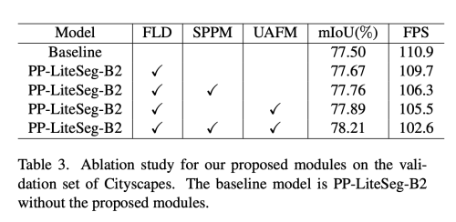

---
layout: post   
title: (PP-LiteSeg) A Superior Real-Time Semantic Segmentation Model    
subtitle: AI Paper Review       
tags: [ai, ml, computer vision, semantic segmentation, real-time segmentation]
comments: true  
---  

비록 semantic segmentation은 딥러닝으로 눈부신 비약을 이루었지만 실시간 방법의 성능은 만족스럽지 않다.
그래서, PP-LiteSeg는 real-time semantic segmentation task 를 제안한다. 
특히, 저자는 유연하면서도, lightweight Decoder(FLD)를 사용하여 이전의 디코더에서 계산량을 줄였다. 
reature representation의 힘을 늘리기 위해, 저자는 spatial, channel attention의 장점을 사용하여 input feature에 weight를 주는 unified Attention Fusion Module (UAFM)을 제안한다 . 
더욱이 Simple Pyramid Pooling Module(SPPM)를 이용하여 적은 계산 비용으로 global context를 통합한다. 

PP_LiteSeg는 정확도와 속도의 trade-off 측면에서 다른 method와 비교하여 가장 좋은 성능을 보였다.
PP-LiteSeg는 NVIDIA GTX 1080Ti 에서 72.0%  mIoU/273.6 FPS, 77.5% mIoU/102.6 FPS를 달성하였다.

[Paper Link](https://arxiv.org/pdf/2204.02681v1.pdf)  
[Code Link](https://github.com/PaddlePaddle/PaddleSeg)  

## Introduction
  

PP-LiteSeg는 encoder-decoder 구조를 따르고, 세개의 새로운 모듈로 구성되어있다.
* Flexible, Lightweight Decoder (FLD)
* Unified Attention Fusion Module (UAFM)
* Simple Pyramid Pooling Module (SPPM)

Encoder는 hierachical feature를 추출하고 decoder는 이를 fuse하고, feature의 sampling 을 해제한다. 
Encoder는 low-level 부터 high level로 가면서, channel 수는 증가하고, spatial size는 감소하는 것이 가장 효율적인 디자인이다. 
Decoder는 high-level 부터 low-level로 가면서, spatial 사이즈는 증가하고, channel 수는 최근의 모델과 동일하다.

그래서 저자는 점진적으로 channel 사이즈를 줄이면서, spatial 사이즈를 늘릴 수 있는 Flexible하면서 lightweight한 Decoder (FLD)를 제안한다. 
게다가 제안하는 decoder는 encoder에 따라서 손쉽게 decoder의 볼륨을 조정할 수 있다.
Flexible 디자인은 encoder와 decoder의 계산비용을 유연하게 밸런싱 할 수 있다. 

feature representation의 Strengthening은 segmentation의 정확도를 높이는데 아주 중요한 방법이다.
보통 이는 decoder 에서 low-level과 high-level의 feature를 섞음으로써 달성할 수 있다.
하지만, 현존하는 fusion module은 높은 계산 비용의 피해를 입는다.
저자는 Unified Attention Fusion Module을 통해서 feature representation을 효과적으로 강화한다.
UAFM은 weight a를 생성하고, input feature를 a와 섞는다. UAFM에는 spatial, channel attention 모듈 두개로 구성되어 있고 이는 feature 간의 inter-spatial, inter-channel 간의 관계를 추출한다.

Contextual aggregation은 segmentation 정확도를 향상시킬 수 있는 또다른 키포인트이다.
하지만 이전의 aggregation 모듈은 real-time 네트워크에서는 시간을 많이 소모시킨다.

PPM 프레임워크에 기반하여, 저자는 Simple Pyramid Pooling Module을 사용하여 intermediate과 output channel을 줄이고, short-cut을 삭제하고, concatenate operation을 add operation으로 대체한다.

실험 결과에 의해서 SPPM은 segmentation accuracy와 계산 비용을 줄이는데 효과적이라는 것을 보였다.

PP-LiteSeg는 CityScapes, CamVid dataset으로 검증하였다.

## Proposed Method
### 1. Flexible and Lightweight Decoder
Encoder-Decoder 구조는 semantic segmentation에 효과적이라고 밝혀져왔다.
일반적으로 encoder는 hierarchical feature를 추출하기 위해 연속된 layer들은 몇몇의 stage로 그룹되어 있다.
low-level부터 high-level로 갈수록 channel의 수는 점진적으로 증가하고 spatial size는 점진적으로 감소한다.
이런 디자인은 걱 stage 별로 계산량의 밸런스를 맞추게끔 되어있어 encoder에 효율성을 보장한다.

Decoder 또한 몇몇의 stage로 되어있고, 이는 feature들을 섞고 upsampling 한다.
비록 spatial size가 high-level부터 row-level 로 갈수록 증가하지만, 최근 light weight decoder는 모든 레벨에서 feature channel 의 수를 일정하게 유지한다.

그래서 shallow stage 에서의 계산량은 deep stage 보다 매우 크다. decoder의 효율성을 증가시키기 위해 저자는 flexible한 lightweight Decoder (FLD)를 제안한다.

  

FLD는 점진적으로 channel의 수를 감소시킨다.
또한, encoder 와 decoder 간의 더 좋은 밸런스를 맞추기 위해 계산량을 손쉽게 조정할 수 있다.

비록 FLD의 채널은 감소하지만, 저자는 실험을 ㄷ통해서 더 나은 정확도를 보일 수 있음을 밝혔다.

### 2. Unified Attention Fusion Module
multi-level 특징들을 섞는것은 segmentation의 정확도를 높이는데 매우 필수적인 요소이다.
게다가, element-wise summation과 concatenation 방법 외에도 연구자들은 SFNet, FaPN, AttaNet 등과 같은 방법을 제안해왔다.

저자는 Unified Sttention Fusion Module 을 통해서 섞인 feature representation을 더 강화하기 위해 channel, spatial attention을 적용한다.

#### UAFM framework
  

UAFM은 weight a를 생성하여서 Mul, Add operation을 이용하여 input feature를 w와 함께 효과적으로 섞는다.
디테일하게 말하면, deeper module의 output 인 F_high를 F_low 와 같은 사이즈로 만들기 위해서 bilinear interpolation을 수행하여 upsampling 하여 F_up을 만들고, F_up과 F_low를 attention 모듈의 input으로 사용하여 weight a 를 생성한다.
weight a는 element-wise 하게 F_up과 F_low와 multiply 된다. 
마지막으로 element-wise 하게 addition하여 attention-weighted feature를 얻는다.

#### Spatial Attention Module 
Spatial Attention 모듈의 동기는 입력 feature에서 각 pixel의 중요성을 나타내는 가중치를 생성하기 위해 inter-spatial 간의 관계를 활용하는 것이다.
(B) 에서 보듯이 spatial information을 추출하기 위해 각 channel-axis를 따라서 Mean&Max opperation을 수행하여 1XHxW 의 feature map 을 추출한다.
위 작업으로 네 개의 특징을 추출한 다음 (F_low와 F_up에 대해 각각 Mean, Max), 이를 concat 하여 F_cat (4XHxW)를 만든다.
F_cat에 Convolution과 Sigmoid를 수행하여 최종 output 인 a(1xHxW)를 얻는다.
  

Spatial Attention module은 계산 비용을 줄이기 위해 최대 연산을 제거하는 등 flexible하게 사용할 수 있다.

#### Channel Attention Module
Channel Attention은 inter-channel 간의 관계를 활용하여, 각 channel의 중요성을 나타내는 가중치를 생성한다.
(b)에서 channel attention 모듈은 average-pooling, max-pooling 을 사용하여 input feature의 spatial dimension을 줄인다.
이 과정은 (Cx1x1)를 가진 4개의 feature를 생성한다.
이 four feature를 channel axis에 따라서 concatenate을 수행한다음, conv, sigmoid를 수행한다.
  

### 3. Simple Pyramid Pooling Module
  
SPPM은 먼저 pyramid pooling module을 이용하여 input feature를 섞는다. 
pyramid pooling module은 세개의 각 1x1, 2x2, 4x4의 global average pooling operation을 사용한다. 
그 다음 convolution, upsampling operation을 수행한다.
conv 의 kernal size는 1x1, output channel 수는 input channel 의 수보다 적은 걸 사용한다.
마지막으로 upsampled feature들을 더하고, conv operation을 사용하여 refined feature를 만든다.

오리지널 PPM 과 비교하여 SPPM은 intermediate와 output의 channel 수를 줄이고, short-cut을 삭제하고, concatenation을 add operation으로 대체한다.
결론적으로 SPPM은 더 효율적이고 real-time 모델에 적합하다.

### 4. Network Architecture

두가지 버전의 PP-LiteSeg 버전을 사용한다.
PP-LiteSeg-T와 PP-LiteSeg-B는 각각 encoder로 STDC1, STDC2를 사용한다.
PP-LiteSeg-B는 더 높은 segmentation 정확도를 가졌지만, PP-LiteSeg-T가 더 빠른 속도를 보인다.

  

학습에는 cross entropy loss와 Online Hard Example Mining 기법이 사용되었다.

## Experiments
### Training Setting
* SGD, 0.9 Momentum
* Poly Learning rage scheduler
* Cityscapes Dataset
    * Batch size 16
    * Max iteration: 160,000
    * initial learning rate: 0.005
    * weight decay: 5e-4
    * img size: 1024x512
* CamVid
    * batch size 24
    * max iteration: 1000
    * initial learning rate: 0.01
    * weight decay: 1e-4
    * img size: 960x720
* augmentation
    * random scaling
    * random cropping
    * random horizontal flipping 
    * random color jittering
    * normalization
    
### Result
  
  
  
    
    