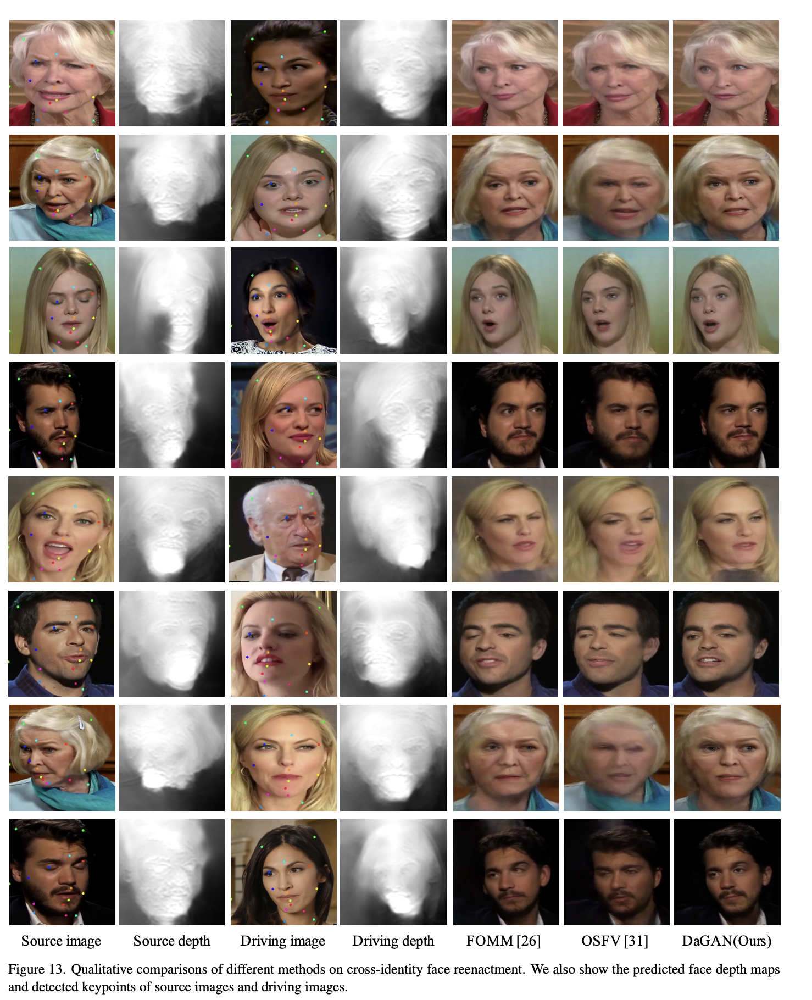

---
layout: post   
title: (DaGAN) Depth-Aware Generative Adversarial Network for Talking Head Video Generation    
subtitle: AI Paper Review       
tags: [ai, ml, computer vision, facial animation, Lipsync, Talking head video generation, GAN]
comments: true  
---  

말하는 얼굴 생성 기술은, source 이미지의 identity와 driving video의 pose를 합성된 얼굴이 포함해야한다.
현재 존재하는 방법들은 input 이미지로 부터 추출한 2D representation (appearance, motion)에  지나치게 의존한다.
하지만 Dense 3D facial geometry (pixel-wise depth)가 정확한 3D 얼굴 구조를 생성하고, 백그라운드로부터 noisy 정보를 구별할 수 있게 하기 때문에 이 작업에서는 매우 중요하다. 
그럼에도 불구하고 비디오로부터 dense 3D geometry annotation을 얻는 방법은 매우 비싸고, 이런 generation task에서 얻기란 불가능하다.
이 논문에서는, face video로 부터 3D annotation 없이 self-supervised geometry learning (depth)을 수행하는 방법을 제안한다.
학습된 dense depth maps를 기본으로 하여, 사람의 얼굴의 critical 한 움직임을 capture할 수 있는 sparse facial keypoints를 예측한다.
더 dense 한 방식으로, depth는 warping source 이미지를 위한 motion field 생성을 안내하기 위해 3D-aware cross modal (appearance, depth) attention를 학습하는데도 사용된다. 
모든 이런 contribution은 말하는 얼굴 생성을 위한 새로운 Depth-aware generative adversarial network (DaGAN)를 구성한다.

[Code Link](https://github.com/harlanhong/CVPR2022-DaGAN)  
[Paper Link](https://arxiv.org/pdf/2203.06605.pdf)  

## Introduction
Dense 3D geometry (pixel-level depth)는 말하는 얼굴 비디오 생성에 있어 아주 큰 이점을 준다.
먼저, 3D geometry는 움직이는 얼굴에서 실제같은 3D 얼굴 구조를 정확하게 복구할 수 있고, 실제 같은 3D 얼굴 구조를 유지하는 것은 진짜 같은 비디오를 생성하는 데 있어 매우 중요한 요소이다.
또한, dense geometry는 복잡한 배경 조건에서, noisy한 배경 정보를 구분할 수 있게 해주기 때문에, 모델이 더욱 robust하게 해준다.
마지막으로, dense geometry는 모델이 얼굴의 감정 관련 미세한 움직임을 식별하는데 특히 유용하다. 

이 논문에서는 pixel-wise depth map을 학습하기 위해, self-supervised 방식으로 geometric warping과 photometric consistency를 사용하여자동적으로 face video로부터 dense 3d facial geometry를 복원하는 방법을 제안한다. 
  

학습된 dense facial depth map을 기본으로하여, 이런 깊이 정보를 말하는 비디오 생성에 더 최적화 할 수 있는 두가지 방법을 제안한다.

* depth-guided facial keypoint detection: 네트워크에 의해 추정되는 facial keypoints는 feature warping을 위한 motion field를 생성하는데 사용되기 위해서 얼굴 구조를 잘 반영햐야 한다. 반면 depth map은 3D 구조를 명시적으로 나타낸다.
그래서, 저자는 input depth map으로부터 학습된 geometry representation과 input image로부터 학습된 appearance representation을 함께 사용한다.
  
* Cross-modal attention mechanism to guide the learning of motion field: motion field는 복잡한 배경으로부터 온 noisy information이 포함되어 있을 수 있고, 효과적으로 감정 관련 미세한 움직임을 포착하는데 어려움이 생긴다.
그래서 저자는 depth-aware attention (pixel-wise 3D geometry constraint on motion field)
를 사용하여 얼굴 구조와 움직임에 더 디테일한 생성을 주도한다.
  
## The Proposed DaGAN Approach

### 1. Overview

  

저자가 제안하는 DaGAN의 구조는 generator과 discriminator로 구성되어 있다.
저자의 generator의 핵심 구조는 위에 묘사되어 있고, discriminator의 적용은 FOMM(First Order Motion Module)에 영감을 받았다. 

Generation network는 세개의 part로 나눌 수 있다.
* self-supervised depth learning sub-network (Fd)
    * Fd는 연속적인 두 frame (I_i, I_i+1)를 사용하여 depth를 예측한다.
    * 그 다음 전체 framework는 Fd를 고정한체로 jointly 하게 학습된다.
    
* Depth-guided sparse keypoints detection sub-network (Fkp)
    * Source image Is와 Driving image Id가 주어졌을 때, Fd를 통해 각 depth maps (Ds, Dd)를 구한다
    * 구한 depth map들과  rgb image를 concat 하여 face keypoint를 생성한다. ({xd1,...,xdn}, {xs1,...,xsn})
    
* Feature warping module
    * keypoints (xs, xd) 를 input으로 받아서 motion field를 생성하고, 이를 이용해 source-image feature map을 warp한다. (Fw)
    
* Cross-modal Attention module  
    * 세밀한 얼굴 구조와, 미세한 표정 움직임을 집중하기 위해, Ds와 Fw를 이용하여 Dense depth-aware attention map을 학습한다. 
    * Depth-aware attention map은 warped feature를 정제하여 refined feature (Fg)를 생성하고 이를 이용해 더나은 합성 이미지 Ig를 얻는다.
    
### 2. Self-supervised Face Depth Learning 

input source 와 driving 이미지들로부터 dense face depth map을 자동적으로 생성하는 방법을 제안한다.

비록, 이전에 자율주행 시나리오에서 사용되는 outdoor scene depth를 unsupervised 한 방식으로 학습하는 방법인 SfM-Learner가 제안되었지만, 저자는 말하는 얼굴에서 얼굴의 depth를 학습하는 방법으로 확장한다.
outdoor scene에 비해 facial 비디오는 상대적으로 큰영역의 다이나믹한 모션을 포함하기 때문에, unsupervised facial depth 예측은 매우 도전적인 문제이다. 

저자는 depth network를 접근가능한 training face video를 이용하여 최적화한다. 
구체적으로, 주어진 연속적인 비디오 프레임 I_i, I_i+1 (I_i+1은 source image, I_i는 target image)를 사용하여, depth map D_Ii, camera intrinsic (카메라 초점거리, 주점 등) matrix K_Ii->I_i+1 , 상대적인 카메라 pose matrix (tilt, pan) R_Ii->I_i+1, 두 이미지 간의 translation t_Ii->I_i+1 를 포함한 몇몇의 geometric 요소를 학습하도록 한다.

여기서 Camera intrinsic K 또한 우리의 학습 데이터에서 얻을 수는 없다. 
K는 각 face video에 대해서 학습된다. 따라서 저자의 방법은 오직 비디오 프레임만을 요구한다.

  

Depth map D_Ii는 Depth network Fd를 통해 생성된다.
Camera Pose R, Translation t, camera intrinsic matrix K는 같은 pose network Fp를 통해 예측된다.

  

qk는 source image I_i+1이 warped 된 픽셀을, pj 는 target image Ii의 오리지널 pixel을 의미한다.
N은 image지의 픽셀 갯수를 의미란다.
BI는 미분가능한 bilinear interporation 함수를 의미한다.

그래서 우리는 Generated Ii와 Ii 간의 photometric consistency error 인 Pe를 self-supervised 한 방식으로 적용할 수 있다.
이때 L1과 SSIM을 사용하였다. 
* SSM: 이미지 유사성 비교 알고리즘 (structural similarity index measure) [[참고링크]](https://nate9389.tistory.com/2067)

  
여기서 a는 0.8로 설정하였다.
저자는 DaGAN 의 face depth network Fd 만을 사용하여 입력 얼굴 이미지의 깊이맵을 추정하며, 이는 앞으로 제안할 메커니즘에 추가로 사용된다.

### 3. Motion Modeling By Sparse Keypoints
depth network를 통해 Depth Map을 구하고 난 후, RGB 이미지와 이를 concat 한다.
keypoint estimator Fkp는 concatenated appearance (It||Dt) 정보를 입력으로 받아들여 사람 얼굴에서 sparse keypoint set을 정확히 추정할 수 있다. 

 

K는 detected face keypoint의 갯수를 의미한다. subscript t의 의미는 source image와 driving image를 의미한다.
이때, keypoint detector의 디자인은 FOMM (First Order Motion Model)을 따랐다.

source와 target 이미지간의 얼굴 움직임을 포착하기 위해 Feature warping 전략을 채택하였다.
첫번째로, initial 2D offset {On} 은 아래와 같이 계산하였다.
  

그 다음, FOMM 과 마찬가지로 2D dense coordinate map z 를 생성하였다.
그 다음, z에 각 상응하는 K keypoint에 K offsets를 더해서 dense motion field wm 을 생성하였다. 

  

위 그림처럼, 먼저 Dense 2d motion field wm을 활용하여 downsampled image를 warp 하여 initial warped feature map를 생성한다. 
그 다음 occlusion estimator T가 initial warped feature map을 input으로 받아서, motion flow mask Mm과 occlusion map Mo를 예측한다,

Mm은 예측된 dense 2D motion field wm에 서로 다른 confidence value를 배정하고, Mo은 feature map에서 inpaint 되어야할 영역을 지정해준다.
masked motion field를 활용하여 Source image Is를 encoder를 거쳐 생산한 feature map의 appearance를 warp 한다. 
다음, occlusion map Mo와 섞어서 warped source-image feature Fw를 얻는다.

  

여기서 Wp는 warping function을 말한다,

### 4. Cross-Modal Attention Module
학습된 depth map을 효과적으로 embedding 하여 보다 조밀한 방식으로 생성을 향상시키기 위해 cross-modeal attention mechanism을 제안한다.
깊이는 우리에게 조밀한 3D 기하학 정보를 제공하여 얼굴 구조를 더 잘 보존하고 표정과 관련된 미세한 얼굴 움직임을 생성할 수 있게 도와준다.

자세히 말하면, cross-model attention module을 이용하여 dense depth-aware attention map을 생성하여 warped feature Fw를 가이드 한다.

  

Depth encoder Ed는 source depth map Ds를 input으로 삼아서 depth feature map Fd를 생성하고, Fd에 linear projection을 수행하고, 
warped source-image feature Fw를 1x1 conv (kernel Wq, Wk, Wv)를 각각 사용하여 세개의 latent feature map Fq, Fk, Fv 로 만든다.

Fq, Fk, Fv는 attention mechanism 에서 각각 query, key value 를 의미한다. 

그래서 depth map 으로 생성되어 Geometry related query feature Fq는 Appearance-related key feature Fk와 섞여서 dense guidance를 생성할 수 있다.

우리는 마지막으로 refined feature Fg를 생성할 수 있다.
    

마지막으로 decoder는 Fg를 input으로 받아 최종 합성 이미지 Ig를 얻는다.

### 5. Training
학습 단계에서, source와 driving image간의 identity는 동일하고, inference 에서 달라진다.

   

#### Perceptual Loss (Lp)
driving image Id와 generated Image Ig 간의 perceptual loss를 최소화 시켜서, 시각적으로 sharp 한 이미지를 얻을 수 있다.
더욱이 Id에 대해서 pyramid 이미지를 만들어서 pyramid perceltual loss를 계산한다. 

   

#### GAN loss (Lg)
pix2pixHD를 따라 least square loss를 adversarial loss로 사용하였다.
dicriminator를 사용하여 서로 다른 크기의 feature map을 생성하여, multiple level Lg를 계산한다.
또한, discriminator feature matching loss도 최소화 하였다.

#### Equivariance loss (Le)
유효한 keypoint의 경우 이미지에 2D 변환을 적용할 때 적용된 변화에 따라 예측 키포인트가 변경되어야 한다.
따라서 이미지별 keypoint의 일관성을 보장하기 위해 등분산 손실 Le를 사용한다.
   

#### Keypoints distance loss (Ld)
감지된 얼굴 keypoint를 작은 neighborhood에서 crowd 하게 만들기 위해 두 개의 해당 키포인트 거리가 주어진 임계값 이상으로 떨어지면 모델에 페널티를 주기 위해 키포인트 거리 손실을 사용한다.
   
a: 0.2

## Experiments
* Dataset: VoxCeleb1, CelebV
* LamdaP = 10, LambdaG = 1, LambdaE = 10, LambdaD = 10
* Number of keypoints: 15
* First train depth network on VoxCeleb1

   