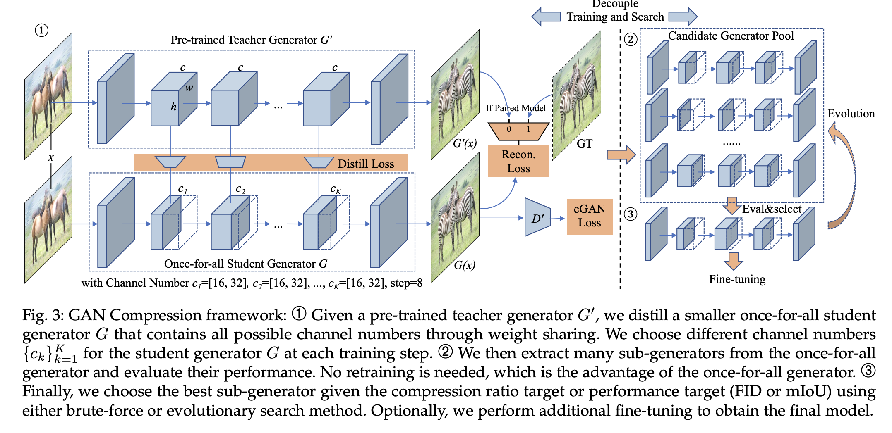
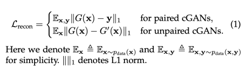
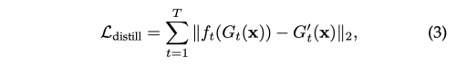
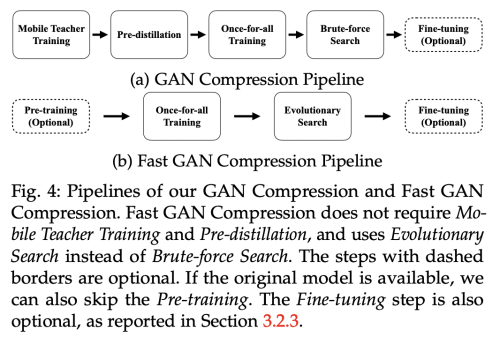

---
layout: post   
title: (GAN Compression) Efficient Architectures for Interactive Conditional GANs     
subtitle: AI Paper Review       
tags: [ai, ml, computer vision, GAN, Light weight, GAN Compression, Conditional GAN, Image-to-image Translation, Distillation, Neural Architecture Search]  
comments: true  
---  

conditional GAN은 많은 vision, graphic application이 이미지 합성을 조절할 수 있게 하는 기술이다.
하지만 최근 cGAN은 일반적인 recognition CNN에 비해서 1~2배 계산 비용이 많이 든다. 
예를들어, GauGAN 은 이미지 하나당 MobileNetV3이 0.44G MAC을 소비하는데 비해 281G MAC 을 소비하여, 대화식 배포가 어렵다.
이 논문에서는 cGAN의 generator의 inference time과 모델 사이즈를 줄일 수 있는 범용 압축 프레임워크를 제안한다. 
직접적으로 현존하는 압축 방법들을 적용시키면, GAN 학습의 어려움과 서로다른 구조 때문에 성능상의 저하를 가져온다. 그래서 저자는 이 문제를 두가지 방법으로 해결하고자 한다.
하나는 GAN 학습의 안전성을 위해 original model의 여러 중간층의 representation knowledge를 compressed model에 transfer 한다. 
그리고 unpaired 와 paired learning 을 통합한다.
두번째로, 현존하는 CNN 디자인을 활용하여, neural architecture search를 통해 효율적인 모델 구조를 찾았다.
search process를 가속화 하기위해, 모델 학습과 search 과정을 weight sharing 을 통해서 분리하였다.
이미지 퀄리티의 손상 없이 효과적으로 계산비용을 CycleGAN by 21×, Pix2pix by 12×, MUNIT by 29×, and GauGAN by 9× 배 줄일 수 있었다.

[Paper Link](https://arxiv.org/pdf/2003.08936.pdf)  
[Code Link](https://github.com/mit-han-lab/gan-compression)  

## Method

conditional GAN을 대화형 application을 위해 압축하는 일을 크게 두가지 이유로 도전적인 과제이다.
첫째는, GAN 학습은 매우 안정적이지 않다는 것이다. 두번째는, 인식모델과 생성 모델의 큰 구조 차이는 현존하는 CNN 압축 알고리즘을 직접적으로 적용시키기 어렵게 한다는 것이다.

이문제를 해결하기 위해, 저자는 효율적인 생성 모델에 맞게 조정된 훈련 프로토콜을 제안하고, NAS로 압축 비율을 추가로 높인다.
또한, 원래 압축 방법의 훈련 시간을 더욱 단축하는 Fast GAN 압축 파이프라인을 소개한다.

저자는 ResNet Generator를 예시로 사용하였지만 서로 다른 구조의 generator와 목적에 맞게 적용할 수 있다. 

  

### 1. Training Objective
#### Unifying Unpaired and Paired Learning
Conditional GAN은 source domain X과 target domain Y를 mapping하는 function G를 학습시키는 것이다.
이는, paired data {xi, yi} N 개와 unpaired data {xi} N개, {yj} M개 모두 이용하여 학습시킬 수 있다.
따라서, N과 M은 학습 이미지 숫자를 가리킨다.

넓은 범위의 학습 목표는 범용적인 목적의 압축 프레임워크를 개발하기 힘들게 한다.
이를 해결하기 위해 저자는 unpaired와 paired 학습을 teacher model이 어떻게 학습됬던지 간에 상관 없이 통합하였다.
original teacher generator G'가 주어졌을때, unpaired training setting 을 paired setting 으로 변환할 수 있다.

unpaired setting 에서, 우리는 teacher generator G'의 결과물을 Ground truth로 활용하여 compressed generator G를 paired learning 으로 학습시킬 수 있다.

학습 목표는 아래와 같이 요약할 수 있다.
  

이런 pseudo pair를 사용하여 학습하는 방법이 original unpaired training setting 에 비해 안정적으로 학습할 수 있게 도와준다.

#### Inheriting the Teacher Discriminator 
비록 우리는 generator의 압축을 목표로 하고 있지만, Discriminator D는 현재 generator의 취약점에 대한 유용한 정보를 가지고 있다.
그래서 저자는, 똑같은 discriminator 구조를 사용하고, teacher 의 pretrained-weight로 initialize 하여 compressed generator와 함께 fine-tune 하였다. 
실험을 통해 사전 학습된 discriminator은 student generator의 학습을 guide하는 역할을 하였다. 

#### Intermediate Feature Distillation
CNN compression에 널리 사용되고 있는 방법은 knowledge distillation이다.
output layer의 logit의 distribution 을 매칭시킴으로써, teacher model 로부터 student model 로 dark knowledge를 전달시킨다..
하지만, conditional GAN의 output은 확률론적이지 않고 deterministic 하다.
그래서 teacher의 output pixel로부터 dark knowldege를 전달하기 쉽지 않다.
특히나, paired training setting 에서 teacher model로부터 생성된 output image는 GT target image에 비해 추가적인 정보를 담고 있지 않다.
그래서 teacher model 출력을 단순히 모방하는 것은 큰 개선을 가져오지 않는다.

이 문제를 해결하기 위해, teacher model의 intermediate representation을 매칭한다.
intermediate layer는 더 많은 채널과 더 많은 정보를 제공허여, student model이 더 많은 정보를 얻을 수 있게 도와준다.

distillation의 목적식은 아래와 같다.  
  

이때, ft는 1x1의 학습가능한 convolution layer를 의미하며, student channel의 수를 teacher channel 수와 맞춰주는 역할을 한다.

### 2. Efficient Generator Design Space
잘 디자인된 student 구조는 knowledge distillation에서 마지막 성능 향상을 위해 필수적이다.
단순히 teacher model에서 채널 수만 줄이는 것은 계산 비용을 4배 이상 줄이기 시작하면, 성능이 기하급수적으로 줄어드는 것을 확인하였다.
또다른 가능한 이유는 현존하는 generator의 구조가 대부분 image recognition model에서 차용하였기 때문에 이미지 합성에는 최적의 구조가 아닐 수 있다는 것이다.

#### Convolution Decomposition and Layer Sensitivity 
현존하는 generator는 classification, segmentation에 사용하던 일반적인 CNN의 구조를 차용하였다.
최근에 효율적인 CNN 디자인으로 성능-비용의 trade off에서 좋은 성능을 내는 convolution의 decomposed version(depthwise+pointwise)를 널리 사용하고 있다.

저자는 decomposed convolution 역시 cGAN의 generator 디자인에 효과적임을 밝혀냈다.
하지만, 직접적으로 모든 convolution layer을 decomposing 할 경우 이미지의 성능을 심각하게 훼손 시킴을 알았다. 
몇몇 layer에 decomposing을 적용시킴과 동시에 성능이 떨어지고, 어떤 layer 에는 robust 하게 동작한다.
심지어, 이런 sensitivity pattern은 recognition 모델과 같지 않다.
upsampling layer는 더 적은 parameter를 가지고 있지만, model compression에 매우 예민하게 반응한다.
그래서 저자는 decompose를 ResBlock 에만 적용하였다.

#### Automated Channel Reduction with NAS
현존하는 generator는 hand-crafted channel 수를 가지고 있다.
압축율을 더 좋게 하기 위해서 저자는 channel width를 channel pruning 을 사용하여, 중복을 제거하고 계산 비용을 줄였다.
각 conv layer에 대해서, 8의 배수에서 선택하였고, 이는 MAC과 하드웨어 parallelism에 밸런스를 맞추기 위함이다.
NAS를 사용하여 MACs < F 가 되는 best channel configuration을 찾는것이 목적이다.
여기서 F는 hardware constraint와 target latency 이다.
하지만, layer의 수가 증가할수록 가능한 configuration은 기하 급수적으로 증가하고, 각 configuration에 맞는 서로 다른 hyper-parameter 셋팅을 하기엔 불가능하고, 이런 프로세스는 결국 시간 낭비가 될 수 있다.

#### Decouple Training and Search 
위 문제를 해결하기 위해, 최근 방식인 one-shot NAS 인 architecture search 와 training 과정을 분리한 방법을 사용하였다.
먼저, 서로 다른 채널 수를 지원하는 모든 네트워크를 한번에 학습을 시킨다. (once-for-all)
서로다른 채널수를 가지고 있는 각 sub-network는 동일하게 학습이 되었고, 독립적으로 작동할 수 있다.
sub-network는 weight를 공유한다.

각 training step 에서, 저자는 random하게 sub-network를 샘플링하고, weight를 update 하였다.
그래서, first several channel은 더 자주 update 되고, 모든 weight 중에서 더 critical하게 동작하게 된다.

모든 네트워크를 학습한 후에는, brute-force search 방법을 이용해 특정한 computation budget 내에서 best-performane를 보여주는 subnetwork를 선택한다.

모든 네트워크들은 weight-sharing을 통해 학습되었기 때문에, fintuning 은 필요하지 않다.

#### Fast GAN Compression
비록 GAN compression은 cGAN의 속도를 가속화 시킬 수 있지만, 전체 학습 파이프라인은 매우 느려질 수 있다.
이 파이프 라인에서는 먼저 MobileNet Style의 teacher network를 학습시키고 나서, student network로 pre-distill 을 수행하였다.

그다음 once-for-all 학습을 수행한다. 여기서 largest sub-network가 정확히 pre-distilled student 와 동일하다.
pre-distillation은 large sub-network를 제외시켜줌으로써 search space를 줄여주는 역할을 한다.

전체 과정은 아래와 같다.
  

비록, search space를 줄였더라도 결국 Mobile teacher training, pre-distillation, once-for-all training, brute-force search 전략으로 모든 sub-network를 검증해야하기 때문에 일반 학습 과정에 비해서 4-5배로 시간이 많이 소비되고,
이는 결국 search space에 제한을 주게된다.

이런 문제를 해결하기 위해 제안하는 Fast GAN compression을 제안한다.
이는 위의 GAN compression에 바해서 더 빠르고 간단하다.

학습단계에서, 우리는 더이상 MobileNet-style teacher network를 학습시기고 pre-distillation을 수행할 필요 없다 
직접적으로 original full network를 teacher로 사용하여 MobileNet-Style once-for-all network를 from scratch로 학습시킨다.

search stage에서는 모든 sub-network를 검증할 필요없이, 진화 알고리즘을 사용하여 찾는다.
진화 알고리즘은 큰 search space를 가능하게 하고, pre-distillation을 필요없게 한다.

전체 search process 동안 P 하위 네트워크 모집단을 유지한다. 모집단은 budget F를 충족하는 샘플링된 아키텍처 모델로 랜덤하게 초기화 된다.
그 후, T iteration을 수행한다. 각 반복에서 (rp * P) 최상의 하위 네트워크들이 상위 그룹을 형성한다.
그 다음, 다음 세대로 부모에 의해 (rm * P) 돌연변이 샘플과 ((1-rm)*P) 교차 샘플을 생성한다. 

최고의 sub-network를 찾고 나서, 옵션으로 pretrained discriminator와 함께 fine-tune 을 수행한다.
이 방법을 통해서 GAN Compression에 비해 70%의 학습시간, 90%의 탐색시간을 줄일 수 있었다. 