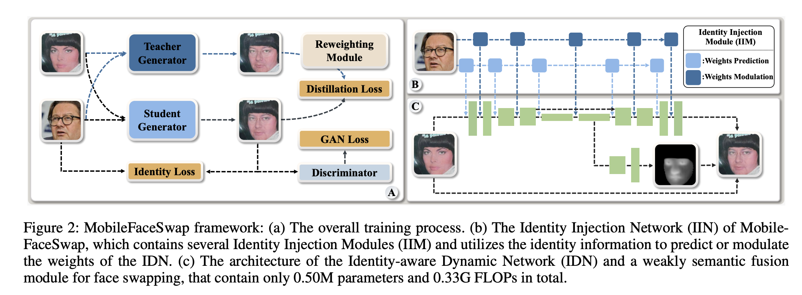
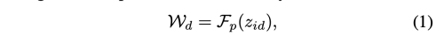
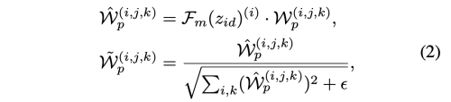
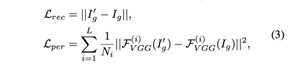
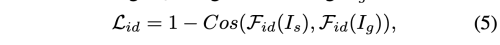
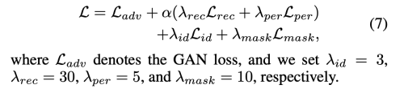

---
layout: post   
title: (MobileFaceSwap) A Lightweight Framework for Video Face Swapping     
subtitle: AI Paper Review       
tags: [ai, ml, computer vision, GAN, FaceSwap, Light weight model, Mobile Network]  
comments: true  
---  

face swapping의 진보된 기술은 놀라운 결과를 보이고 있다. 하지만, 대부분의 방법은 많은 파라미터와 계산 비용을 요구하기 때문에, real-time 어플리케이션에 적용하거나 edge device에 배포하기에는 매우 어렵다.
이 논문에서 우리는 주제에 구애받지 않는 face swapping 을 위한 동적 neural network 기술을 이용한  lightweight Identity-aware Dynamic Network (IDN)을 제안한다.
저자는 효과적인 identity injection module 을 디자인하기 위한, 동적 neural network 기술인 weight prediction, weight modulation을 제안한다.
IDN이 한번 업데이트되면 어떠한 target image와 비디오에도 적용하여 face swap을 수행할 수 있다.
IDN은 오직 0.50M 의 파라미터와 0.33G FLOPS 만을 필요하기 때문에 mobile 환경에서 real-time video에 대해 적용할 수 있다.
저자는 knowledge distillation 기반의 방법으로 안정적인 학습을 소개하고, loss reweighting module을 적용하여, 더 좋은 합성 결과를 만들었다.
결과적으로 이 방법은 teacher model과 다른 방법에 비해 SOTA의 성능을 내었다.  

[Paper Link](https://arxiv.org/pdf/2201.03808.pdf)  
[Code Link](https://github.com/Seanseattle/MobileFaceSwap)

## Method
Identity Injection Module (IIM)과 Identity-aware Dynamic Network(IDN), weakly semantic fusion 모듈을 포함한 MobileFaceSwap 네트워크 구조를 설명할 것이다.

그리고 Knowledge distillation과 loss reweighting module을 사용하여 학습 안정성을 향상시키고, 합성 성능 개선하는 방법을 소개할 예정이다.

  

### Network Architecture
주요한 구성 요소로, 하나는 필요한 매개변수를 얻기 위해 여러 Identity Injection Module (IIM)이 있는 Identity Injection Network(IIN)이고, 다른 하나는, 이런 매개변수를 사용하는 추론 프로세스를 위한 Identity-aware Dynamic Network (IDN) 이라는 경량 네트워크 이다.

ArcFace를 통해 source image의 identity representation이 주어지면, IIM은 IDN에 ID 정보를 주입하는 두 가지 동적 신경망 기술이 포함되어 있다.
injection 프로세스가 끝나면, light weight IDN을 통해서 target image나 video의 face를 swap 할 수 있다.

IDN은 U-Net 구조에서 standard convolution을 depthwise, pointweise conv로 변환한 구조이다.
주어진 source image에 따라서 IDN의 파라미터를 수정하기 위해, 저자는 depthwise, pointwise conv 각각을 위한 weights prediction, weights modulation을 제안한다. 

* C_in: input channels
* C_out: output channels
* K: kernel size of conv
* z_id: identity embedding 
* W_d: depthwise convolution
* W_p: pointwise convolution, IDN에 포함됨 
* F_p: prediction module that contain several convolution layers of the IIM
* F_m: modulation module of the IIM, which include several fully-connected layers and error is used for number stability

먼저, depthwise convolution의 가중치를 예측하기 위한 입력으로 ID embedding 을 입력으로 사용한다.  
  
여기서 예측해야하는 파라미터의 갯수는 (C_in * 1 * K * K) 이다. 

pointwise convolution의 파라미터를 예측하기 위해서는 (C_in * C_out * 1 x 1)로 위의 depthwise conv 보다 많다. 
또한, 이때 weight modulation을 사용하면 더 좋은 결과를 낼 수 있음을 확인하였다.

  

IIM을 적용하여 IDN은 주체에 상관없는 face swapping을 수행할 수 있고, 이는 오직 0.431M의 파라미터 수와, 0.328G FLOPs 만 요한다.

실제로, 생성된 이미지가 background 와 hair가 target image와 동일하게 하기 힘들다.
이런 문제는 결국 video face swapping 에 jitter를 발생시킨다. 

일반적으로, 이런 문제는 face segmentation과 같은 추가적인 post-processing으로 해결해왔다.
이 논문에서, 저자는 weakly semantic fusion module을 통해서 배경과 target image를 합성하는 방법을 제시한다.
저자는 IDN의 feature map을 제사용하여 weakly fusion mask를 예측한다.
semantic fusion module은 오직 0.083M의 파라미터와 0.005G FLOPs 만을 요한다.

비록 semantic fusion module이 매우 가볍더라도, mask 예측은 꽤 잘된다.

결과적으로 224x224 이미지에 대해 0.495M의 파라미터와 0.333G FLOPs 만을 필요로하는 네트워크를 만들었다. 

### Training Objectives
일반적으로, face swapping network 학습은 합성 결과를 보증하기 위해 많은 loss function을 요구한다. 
하지만 이런 서로다른 losses 들은 학습과정을 비안정적으로 만들고, unpaired data로 인해 제약이 없기 때문에 artifact를 쉽게 만든다. 

이 논문에서 저자는 knowldege distillation을 통해서 face swapping을 paired training으로 전환한다.

주어진 잘 학습된 face swapping 네트워크는 teacher로 작용하고, 제안된 네트워크는 student 로 작동하고, 
student output Ig 와  teacher output Ig' 간에 L1 loss와 perceptual loss를 사용할 것이다.

  

하지만 teacher 는 몇몇 bad case 에 대해서 완벽하지 않다.
그래서 저자는 이런 failuare case를 러프하게 두가지 카테고리로 나누었다.
하나는 teacher output이 source image의 identity를 잘 반영하지 못한것, 두번째는, teacher output이 artifact 등을 포함하여 자연스럽지 않은 것이다.
만약 우리가, 모든 teacher output에 대해서 equal weight를 배정한다면, student 역시 안좋은 결과를 학습할 것이다.

이 논문에서, 저자는 loss reweighting module을 제안하여 이런 문제를 없앴다. 
저자는 teacher network 의 identity similarity와 image quailty를 고려했다. 
source image와 teacher output 간의 square cosine distance를 계산하여 identity similarity 를 측정하였다.
하지만, 이미지 quality를 평가하는 것은 쉽지 않다.
따라서, 저자는 swapped 결과가 훈련 과정에서 점차 좋아지는 것을 관찰했기 때문에, teacher 결과의 quality를 적절히 평가하기 위해, 각 teacher의 output을 teacher 학습 process의 iteration 완료 percentage에 따하서 0-1 까지로 점수를 주었다.
그리고, ResNet-18 울 사용하여 L2 loss로 이 score을 regression하는 모델을 만들었다.

이 몰델을 Q라고 하고 teacher model의 quality를 평가하는데 사용하였다.
final distillation loss reweighting coefficient a는 아래와 같다.

  

distillation loss만 사용하는 것으로 identity를 감독하는 것은 부족하다.
그래서 더 좋은 identity supervision으로 ArcFace를 extractor  F_id 로 사용하여 source image와 generated image 간의 identity similarity를 계산하였다.

  

fusion mask 예측을 위해서 weak supervision을 사용한다.
이는 오직 background를 target image와 동일하도록 제안한다. 

* M_t: mask of target
* M_g: mask of generated image
* M[bg]: background elements of mask 

방법은 Bisenet을 이용하여 target mask 를 구하였다.

Total Loss 는 아래와 같다.  
  