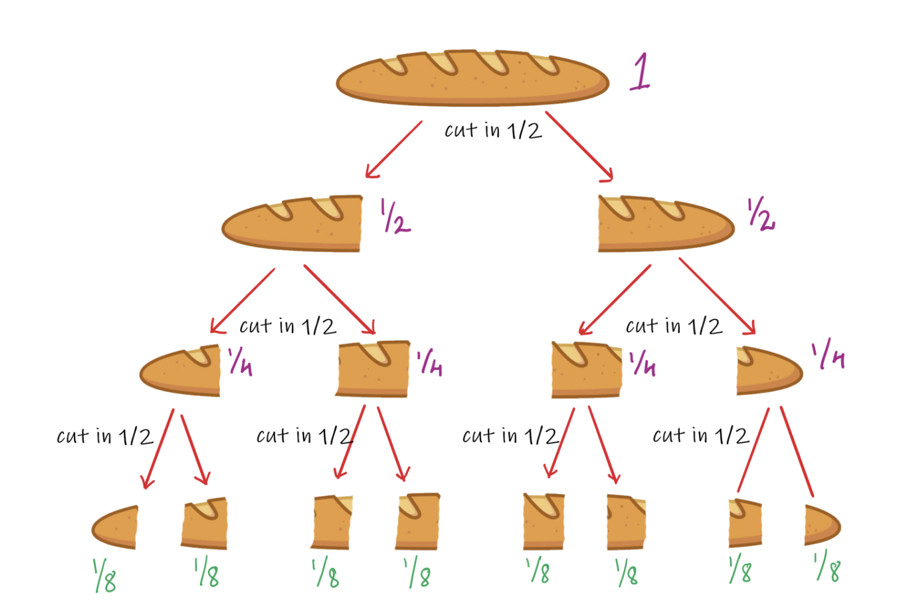
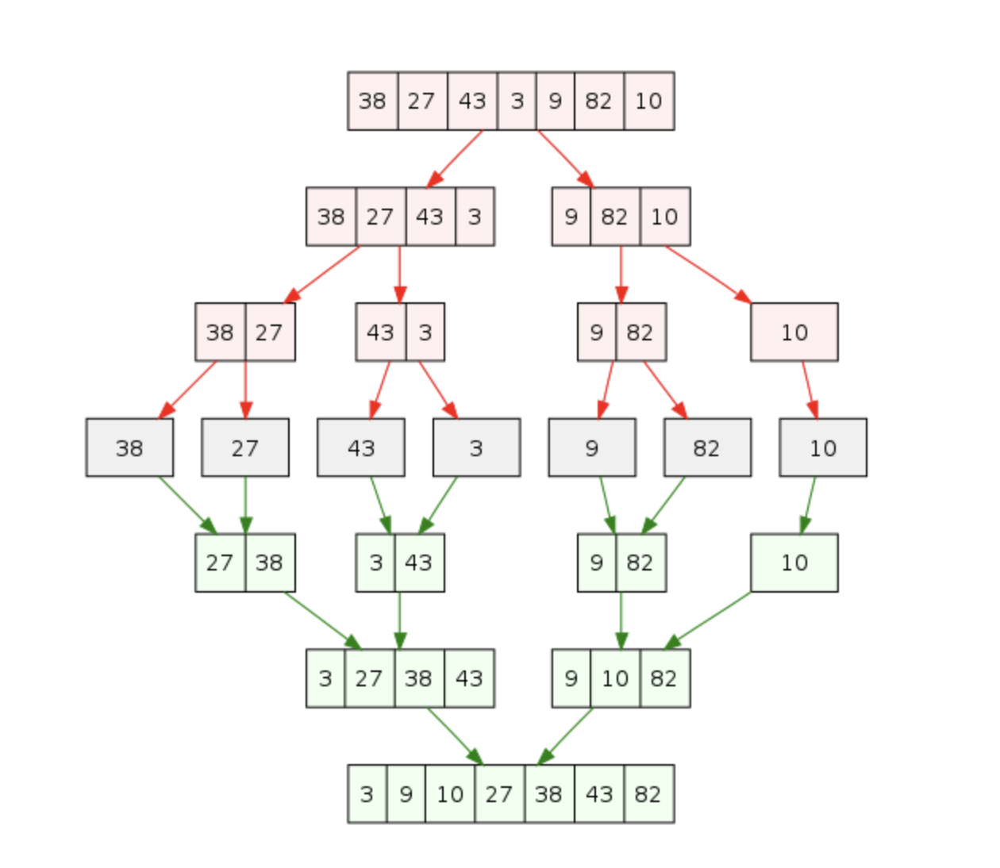
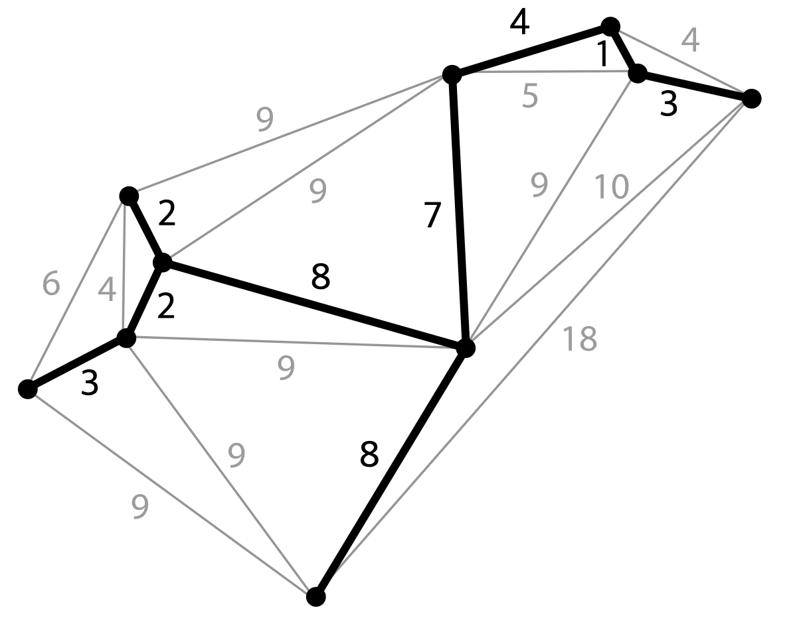
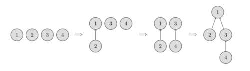
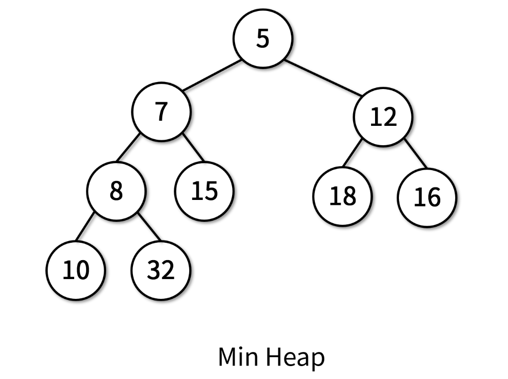
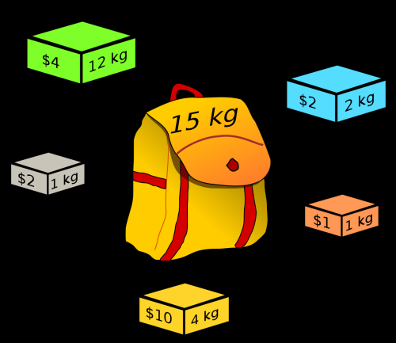
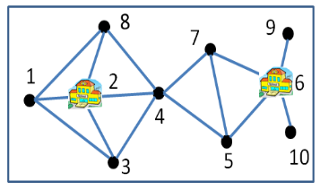
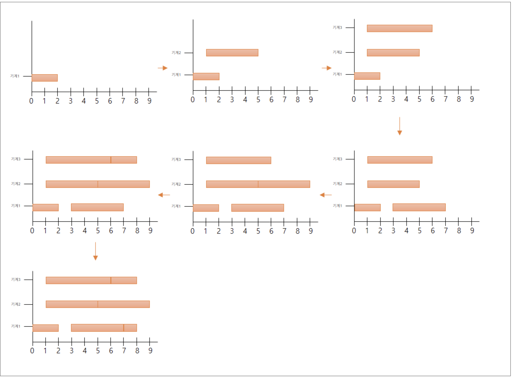

---
layout: post   
title: Algorithm   
subtitle: Fundamental         
tags: [programming, algorithm, fundamental, Computer Science]  
comments: true  
---   

# Fundamentals of Algorithm

## 알고리즘의 특징
* compactness
* runability
* finiteness
* efficiency

## GCD (Greatest Common Divisor)
* 유클리드 호제법
* gcd(n, m) = gcd(n-m, m) (n>m, natural number)
* Proof

```text
n = a*c, m = b*c

가정) 
a, b, c > 0, natural number
a > b 
a, b는 서로소 

gcd(n, m) = c
n-m = (a-b)*c
gcd(n-m, m) = c

참이 되기 위해서는 gcd(a-b, b)=1 로 서로소가 되어야 한다. 이를 증명하기 위해서 gcd(a-b, b)!=1 이 모순되는 지를 검증한다.
 
a-b = xd, b = yd
gcd(a-b, b) = d
a = xd + b = (x+y)*d
gcd(a, b) = d 이므로 위의 가정 a, b 는 서로소이다는 것에 모순이 되므로 gcd(a-b, b) = 1 이다. 
```

* Code

```python
def gcd(a, b):
    if b == 0:
        return a
    
    r = a % b
    a = b
    b = r
    return gcd(a, b)
```

## Category of Algorithm

### By Strategy
1. Divide and Conquer
2. Greedy Algorithm
3. Dynamic Programming
4. Approximation
5. Search (Backtracking, Branch and Bound)

### By Problem Category
1. Sorting Problem
2. Graph Problem
3. Geometric Problem

### By Computing Environment
1. Parallel & Distributed
2. Quantum

## Efficiency of Algorithm
1. time: 장비에 independent 한 방법으로 측정하고자, 사용된 instruction 들의 호출 횟수를 활용한 time complexity 계산 (Big-Oh) 
2. space: memory usage


## Divide and Conquer
1. Divide: Decompose problems to smaller problems
2. Conquer: Get answer form small problems derive the answer for larger problems from the small problems

  

* input size: n
* 문제의 input size가 커질수록 속도가 기하 급수적으로 느려질 때 유리함 
* smaller problem 들이 꼭 disjoint 하게 나눠지는 것은 아님
* 문제가 더이상 나눠지지 않을 때(size=1)까지의 Depth k 
    * n/2^k = 1 -> n = 2^k -> log n = k
    
### Merging Sort
  

* Divide: 입력 배열을 단순히 2개의 부분 배열로 분할
* Conquer: 2개의 배열간 비교를 수행하며 merge   

* Process
    1. 2개 리스트 값을 처음부터 하나씩 비교하여, 두개의 리스트 값 중 더 작은 값을 새로운 리스트로 옮김
    2. 둘 중 하나가 끝날때 까지 반복
    3. 나머지 리스트 값을 새로운 리스트에 복사
    4. 새로운 리스트를 원래 리스트로 복사
    
* Code (단순 리스트 사용)

```python

def merge_sort(arr, start, end):
    
    if start < end :
        # divide 
        mid = (start+end)//2
        merge_sort(arr, start, mid)
        merge_sort(arr, mid+1, end)
        # conquer
        merge(arr, start, mid, end)

def merge(arr, start, mid, end):
    i = start
    j = mid + 1
    # comparison
    sorted = []
    while (i <= mid and j <=end):
        if arr[i] < arr[j]:
            sorted.append(arr[i])
            i+=1
        else:
            sorted.append(arr[j])
            j+=1
    # 남은 리스트 복사 
    if i > mid:
        for k in range(j, end+1):
            sorted.append(arr[k])
    else:
        for k in range(i, mid+1):
            sorted.append(arr[k])
    # 원래 리스트로 이동 
    for k in range(start, end+1):
        arr[k] = sorted[k-start]

```

* 시간 복잡도
    * divide & merge: nlogn
    * 결과 리스트 복사, 이동: 2nlogn
    * 총합: o(nlogn)
* 특징
    * 단점: 임시 배열이 필요함 (추가 메모리 필요), n이 클수록 이동 횟수가 많아져서 큰 시간이 낭비 됨
    * 장점: 데이터 분포에 영향을 덜 받음, 정렬시간이 O(nlogn)으로 일정함, 분산 컴퓨팅에 유용함 
        * Linked list로 구현 시, index 만 변경되므로 리스트 복사, 이동 시간이 무시되어, 어떤 정렬보다 효율적일 수 있음 
  
* Code (linked list 사용)
    
```python
class Node:
    def __init__(self, data):
        self.data = data
        self.next = None

class LinkedList:
    def __init__(self):
        self.head = None
      
    def append(self, data):
      
        new_node = Node(data)
        if self.head is None:
            self.head = new_node
            
        else:
            cur_node = self.head
            while cur_node.next is not None:
                cur_node = cur_node.next
            cur_node.next = new_node

    def get_middle(self, head):
        
        # n = 2k
        # k = 중간 index, 2k = 끝 index
        
        if head is None:
            return head
        
        mid = head
        end = head
        while mid.next is not None and end.next.next is not None:
            mid = mid.next
            end = end.next.next
            
        return mid
    
    
    def merge_sort(self, head):
        
        if head is None:
            return head
        
        middle = self.get_middle(head)
        mid_start = middle.next
        middle.next = None
        
        left = self.merge_sort(head)
        right = self.merge_sort(mid_start)
        
        sorted = self.merge(left, right)
        
        return sorted
    
    
    def merge(self, left, right):
      
        if left is None:
            return right
        if right is None:
            return left
        
        result = None
        if left.data < right.data:
            result = left
            result.next = self.merge(left.next, right)
        else:
            result = right
            result.next = self.merge(left, right.next)
            
        return result
        

```
    
### Quick Sort
* Pivot: Object to split the given sequence to two subsequence 
  

* Process
  1. pivot 선택
  2. 리스트의 양쪽에서 서로 비교하며 pivot 보다 작은 요소를 모두 왼쪽으로, 큰 요소는 모두 오른쪽으로 교환
  3. 양쪽이 서로 교차되는 순간 stop 
  4. pivot과 마지막 비교 왼쪽 요소와 교환 
  5. pivot을 제외한 왼쪽 리스트와 오른쪽 리스트 각각을 독립적으로 다시 1,2,3을 수행 
  6. 리스트의 크기가 0이나 1이 될때까지 반복 
  
* Code

```python

def quick_sort(arr, left, right):
  
    if left < right:
        pivot = partition(arr, left, right)
        quick_sort(arr, left, pivot-1)
        quick_sort(arr, pivot+1, right)

def partition(arr, left, right):

    pivot_idx = (left+right)//2
    pivot = arr[pivot_idx]
    while left < right: # 교차할때까지 진행 
        while arr[left] < pivot:
            left += 1
        while arr[right] > pivot:
            right -= 1
        if left < right :
            arr[left], arr[right] = arr[right], arr[left]
            left += 1
            right -= 1
    arr[pivot_idx], arr[left] = arr[left], arr[pivot_idx]
    return left

```

* 시간 복잡도 
  * 순환 호출 
    * 최선의 경우: pivot이 중간값으로 선택 n/2^k 씩 균등하게 분할될 경우 log n번 호출 
    * 최악의 경우: 계속 불균등하게 1:(n-1)으로 나누어지는 경우 n번 호출 
  * 순환 호출에서의 비교 연산: pivot과 전체 리스트를 비교하므로 n번 
  * 총 최선의 경우 O(nlogn), 최약의 경우 O(n^2), 평균 O(nlogn)
  
* 특징
  * 장점: 속도가 빠르다. 추가 메모리 공간이 필요하지 않음, 다른 O(nlogn) 알고리즘과 비교했을때도 가장 빠르다, 불필요한 데이터 이동을 줄임, pivot이 추후 연산에서 제외됨
  * 단점: 정렬된 리스트일 경우 불균형 분할에 의해 오히려 시간이 더 걸림
    * pivot을 중간값을 고르는 것이 좋음 (n개의 숫자를 랜덤 샘플링한뒤 median 값을 이용)
  
* Additional Efficiency issue
  * 만약 comparison frequency가 작을 경우 recursive call에 대한 비용이 더 커지는 경우가 생김 
  * Large size => Small size: Quick Sort
  * Small size => Final Result: Insertion Sort
  

#### (참고) Insertion Sort
* 매 순서마다 해당 원소를 삽입할 수 있는 위치를 찾아 해당 위치에 넣음
* 두번째 원소부터 시작해서 앞 원소들과 비교하여 삽입합 위치를 지정한 후 원소들을 뒤로 옮기고 지정한 자리에 원소를 삽입하여 정렬하는 알고리즘

* Code 

```python

def insertion_sort(arr, n):
  
  for i in range(1, n):
    key = arr[i]
    
    j = i-1
    while j >= 0 and arr[j] > key:
        arr[j+1] = arr[j]
        j-=1
    arr[j+1] = key

```

* 특징
  * 장점: 안정적, 레코드수가 적을 수록 간단하여 유리, 정렬되어 있을 경우 효율적
  * 단점: 많은 이동, 레코드 많을 수록 불리
  
* 시간 복잡도
  * 최선의 경우: O(n)
  * 최악의 경우: O(n^2)
  * 평균: O(n^2)
  
### Selection Algorithm (Quick-select)
* N numbers are given, find k-th largest(smallest) number
* Process
1. Quick sort 알고리즘의 partition() 함수를 실행하면 찾고자 하는 index 값이 pivot을 기준으로 왼쪽인지 오른쪽인지 알 수 있음
2. 찾는 원소가 속한 배열에 대해 recursive 하게 수행
3. 찾는 원소와 pivot index 가 일치할때 까지 반복

* Code

```python

def partition(arr, left, right):
    
    pivot_idx = (left+right)//2
    pivot = arr[pivot_idx]
    while left < right:
        while arr[left] < pivot:
            left += 1
        while arr[right] > pivot:
            right -= 1
        if left < right:
            arr[right], arr[left] = arr[left], arr[right]
            left += 1
            right -= 1
    
    arr[left], arr[pivot_idx] = arr[pivot_idx], arr[left]
    return left
    

def selection(arr, k, left, right):
    pos = partition(arr, left, right)
    if k < pos:
        return selection(arr, k, left, pos-1)
    elif k == pos:
        return arr[pos]
    else:
        return selection(arr, k, pos+1, right)

```

* time complexity
  * Worst case: pivot 선정이 불균등하게 될 경우, selection이 n번 호출되고, partition() 호출이 O(n) 이므로, 총 O(n^2) 소요 
  * 이런 편중을 막기 위해, pivot 선정시 각 요소를 uniformly random 하게 선택하고, 만약 left 또는 right array의 size가 하나라도 3/4n 을 넘을 경우 pivot을 다시 선정하는 조건을 추가하면, subproblem의 크기는 최대
  3/4n 으로 제한된다. 이때 평균 time complexity는 O(n) 이 된다.
    

## Greedy Algorithm
* 각 단계에서, 가장 최선의 선택을 하는 기법
* After selecting a unit, do not change the decision
* Very Simple, but few problems are completely solved with this algorithm
  * Example: Coin Change
    * Given Coin Unit: 1, 5, 10, 50, 100, **160**, 500
    * Given Change: 200
    * Result of greedy algorithm: 160 * 1 + 10*4 -> 5개
    * But, Best Result: 100 * 2 -> 2개  
    * 즉, decision 간에 dependency가 있으면 greedy algorithm 이 통하지 않을 수 있다
  
* How to make greedy algorithm correct?
  * 만약 two decision이 dependency 하다면, 그들의 후보 combination 들을 평가한 후에 decision을 내리면 된다.
  
### Minimum Spanning Tree
* Tree (no cycle)
* connect to all vertices of given graph
* sum of the weights of its edge is the minimum over all trees

  

* 대표적인 algorithm: kruskal algorithm, prim algorithm

#### Kruskal algorithm
* 우선 edge set에서 tree 유무와 상관없이 weight sum을 최소화 하는 것만 신경쓰는 알고리즘
* Process
1. 모든 edge들을 weight에 따라 sorting
2. 가장 작은 weight edge 선택
3. 이때 cycle이 형성되면 선택하지 않음 (삭제)
4. 선택된 edge 수가 vertex - 1 개가 되면 종료 

* Pseudo Code

```text

Input: weighted graph G(V, E), |V| = n, |E| = m
Output: Minimum spanning tree

1. Sort all edges by their weights in ascending order
2. L = sorted list
3. T = {}
4. While (|T| < n-1) {

    e = argmin Weight(e) where e in L
    exclude {e} from L
    
    if not isCycle( {e} union T ):
        T = T union {e}
    else:
        continue

```

* Cycle Check Algorithm (Disjoint Union-Find algorithm)
  * Disjoint set representation을 사용 
  * Disjoint set: 여러 집합이 있을 때 서로 공통 원소가 없어 모든 집합의 교집합이 공집합
  * Disjoint Set Union-find
    * Tree를 사용하여 union find를 할 수 있다. 
    * Disjoint set의 차집합, 교집합은 공통원소가 없어 의미가 없다. 
    * 그래서 합집합을 찾는 것을 disjoint set union 이라 하고, 각 원소가 트리의 어떤 루트 노드에 연결되어 있는지를 찾는 연산을 disjoint set find 라고 부른다.  
      
      
    * 처음에 모든 vertex의 루트가 자기 자신이게끔 disjoint 하게 setting 
    * 합집합 시 해당 노드들의 루트를 찾아서 특정 기준으로 루트를 업데이트 (ex: 작은 수)
    * 루트 노드를 찾기 위해 부모가  자기 자신이 될때까지 재귀적으로 find
  
```python

class Node:
    def __init__(self, data):
        self.data = data
        self.root = self
    
def find_root(node):
    
    if node.root == node:
        return node
    else:
        return find_root(node.root)
    
def is_cycle(node1, node2):
    
    root1 = find_root(node1)
    root2 = find_root(node2)
    if root1 == root2:
        return True # root 가 같으면 이미 연결되어 있음
    else:
        return False
    

def union(node1, node2):
    
    root1 = find_root(node1)
    root2 = find_root(node2)
    # 작은 수를 root로 만듦
    
    if root1.data < root2.data:
        root2.root = root1
    else:
        root1.root = root2

```
  
* Cycle Checking Time Complexity
  * Tree를 만들며 union 할 때 heap tree를 사용하면 O(log* n)
  * n<=1 : log* n = 0 
  * n>1 : log* n = 1 + log* (logn) 
  * 즉, n이 1보다 작아질때까지 반복적으로 log를 적용해야하는 횟수를 의미 (iterative logarithm)
  * Heap data structure
      
    * heap: complete binary tree
    * Depth가 k 라고 했을 때, (k-1)까지 full binary tree이고, left-to-right으로 채워나간다.
    * 각 node가 key값을 가지고, 각 노드의 key값은 children의 key값 보다 작음 (큼)
    * Node 추가 time complexity: O(log n)
      * 값과 상관 없이 트리의 마지막에 새로운 노드를 추가
      * 형제 노드 값과 비교 없이, 바로 부모 노드와 비교하여 자신보다 작은지 확인하여, 더 크면 교체  
    * Node 삭제 time complexity: O(log n) (삭제한 자리에 마지막 노드 가져오고 자식 노드들과 비교) 
      * 힙의 삭제는 반드시 루트 노드에서 이루어짐
      * 루트 노드 삭제
      * 가장 마지막 노드를 헤드 노드로 이동
      * 자식 노드들과 비교하여, 더 크면 두 노드 중 작은 노드와 교환 
  
* Time-Complexity
  * Sorting Edge: O(nlogn)
  * cycle check: O(logn) * n
  * Total: O(nlogn)
  
#### Prim Algorithm
* Randomly select vertex
* n-1 개의 edge로 이루어진 tree를 구성할때까지 반복적으로 edge를 추가
* 각 step에서 greedy 한 방법으로 weight를 최소화 하는 edge를 선택함 
* Process
1. 임의의 vertex를 선택하여 T에 포함
2. T에 있는 노드와 없는 노드 사이 edge 중 가중치 최소를 찾음
3. 이 edge 중 T에 없던 vertex를 T에 포함
4. 모든 vertex가 T에 포함될때까지 반복 

* Pseudo Code

```text
// 초기화 과정
D = {} // distance
E = {} // 연결된 vertex (edge)
T = {p} // 연결한 vertex Tree 
for v not in T:
    if (p, v) edge exist:
        D[v] = weight(p, v)
        E[v] = p
    else:
        D[v] = infinite
        E[v] = None

while ( |T| < n ) {
    
    // Find Next Vertex to add
    v_min = argmin D[v]
    T = T union {v_min}
    
    // update distance and connected edge
    for (v not in T) {
        if ( weight(v_min, v) < D[v] ) {
            D[v] = weight(v_min, v)
            E[v] = v_min
        }
    }
    
}

```

* Code
  * n: 노드 수, m: 간선 수 
  * graph: list dict
    * {v1: [[weight, v1, v2], [weight, v1, v3], ...], ... }

```python

import heapq

def prim(graph, n, start_node):
    visited = [0] * n
    visited[start_node] = 1
    
    mst = []
    total_weight = 0
    
    candidate = graph[start_node]
    heapq.heapify(candidate)
    
    while candidate:
        
        weight, u, v = heapq.heappop(candidate)
        if visited[v] == 0:
            mst.append((u, v))
            total_weight += weight
            visited[v] = 1
            
            for edge in graph[v]:
                if visited[edge[2]] == 0:
                    heapq.heappush(candidate, edge)
                    
    return mst, total_weight

```


* Time Complexity: O(n^2)
* 대표적인 문제: 통신망, 도로망, 유통망에서 길이, 구축비용, 전송시간 등을 최소로 구축하려는 경우
* Vertex > Edge: Kruskal 
* Vertex < Edge: Prim


### Searching Shortest Path
* Directed Graph With Weighted Function
* 문제 종류 
1. Single-Source shortest path (하나의 source에서 모든 vertex 까지의 최단거리)
2. Single-destination: 모든 vertex에서 하나의 D까지 최단거리
3. Single-pair: 하나의 S로부터 모든 하나의 D까지 최단거리 
4. All-pair: 모든 vertex 서로간의 최단거리

* 특징
  * Negative cycle이 존재하면 안됨
  * Optimal Substructure이 존재 
  * S(u, v) <=  S(u, x) + S(x, v)
  
#### Dijkstra algorithm
* 한 노드와 다른 모든 꼭지점간의 가장 짧은 경로를 찾음 
* 데이크스트라 알고리즘은 초기 거리값을 부여하고, 단계를 거듭하며 개선시킬 것이며, 이 개선시키는 것을 간선완화 (edge relaxation)이라고 한다.
* 음의 간선을 포함할 수 없어 현실적인 문제와 유사
* Process 
1. 모든 꼭지점을 미 방문 상태로 표시한다. 
2. 모든 꼭지점에서 시험적 거리값을 부여한다. 초기점을 0으로, 다른 모든 꼭지점을 무한대로 설정한다. 이때 초기점을 현재 꼭지점으로 설정한다. 
3. 현재 꼭지점에서 미방문 인접 꼭지점을 찾아 그 시험적 거리를 현재 꼭지점에서 계산한다. 새로 계산한 시험적 거리를 현재 부여된 값과 비교하여 더 작은 값을 넣는다.
4. 만약 현재 꼭지점에 인접한 모든 미방문 꼭지점까지의 거리를 계산했다면, 현재 꼭지점을 방문한 것으로 표시하고, 미방문 집합에서 제거한다. 방문한 집합은 다시 방문하지 않는다.
5. 시험적 거리가 가장 작은 다음 미방문 꼭짓점을 새로운 현재위치로 선택하고 3단계로 되돌아간다. 
6. 두 꼭지점 사이 경로를 찾는 경우 도착점이 방문 상태로 표시되면 종료한다. 완전 순회 경로를 찾을 경우 미 방문 집합에 있는 꼭지점들의 거리 중 최솟값이 무한대이면, 더이상 연결이 없는 경우이므로 알고리즘을 종료한다.

* Pseudo Code

```text

dst = {} # source 에서 vertex 까지 최소 거리
prev = {} # 최단 경로 이전의 꼭지점
Q = [] # 방문하지 않은 노드 집합  
Graph = {v1: [[weight, v1, v2], [weight, v1, v3], ...]}

# Initialize
for v in Graph.keys():
    dst[v] = inf
    prev[v] = None
    Q.append(v)
    
# 시작점 Setting
dst[source] = 0

# Edge Relaxation
while len(Q) != 0:
    u = argmin dst[v] in Q
    
    for edge in Graph[u]:
        v = edge[2]
        weight = edge[0]
        alt = dst[u] + weight
        if alt < dst[v]:
            dst[v] = alt
            prev[v] = u
   
    remove u from Q

# Final Path
S = []
u = target
while prev[u] is not None:
    S.append(u)
    u = prev[u]
S.append(u)

```

* 시간 복잡도
  * V가 vertex 갯수, E가 간선 갯수 일 경우
  * Q를 배열로 구현시
    * min dist 를 찾는 작업 O(V)를 총 V번 호출하므로, O(V^2)
    * 거리 갱신 작업이 O(1)로 총 E번 호출하므로 O(E)의 시간 소요
    * 총 복잡도: O(V^2 + E), E = O(V^2) 이므로 결국 O(V^2) 이다
  * Q를 우선순위 큐인 binary heap 으로 구현 시 
    * min dist 찾는 작업이 O(logV)이고 총 V번 호출하므로 O(VlogV)
    * 거리 갱신 작업에서 decrease-key를 호출하므로, O(logV)이고, 총 E번 호출하므로 O(ElogV)
    * 총 복잡도: O((V+E)logV), E = O(V^2) 이므로 단순화 하면 O(ElogV)
  * Pseudo Code
  
```text

Q = PriorityQueue()

for v in Graph.keys():
    prev[v] = None  
    if v is not source:
        dist[v] = inf
    else: 
        dist[v] = 0 
    Q.push(v, dist[v])

while Q is not empty:
    u = Q.pop()
    for edge in Graph[u]:
        alt = dist[u] + edge[0]
        if alt < dist[edge[2]]:
            dist[edge[2]] = alt
            prev[edge[2]] = u
            Q.decrease_key(edge[2], alt)
```

* Prim 알고리즘과의 차이   

  | Dijkstra Algorithm | Prim Algorithm |  
  |---|---|  
  |Select minimum accumulated weights| Select minimum weights |
  |Selected starting point | Random starting Point|
  
* 대표적인 문제 
  * Car Navigation, Network & Communication ...

### Fractional Knapsack Problem
* Candidate
  * N Products
  * Each Product has weight & price
  * Knapsack has weight limit
  
  

* Pseudo Code

```text

Quality = Price/weight
sort the product by quality in descending order
S: Sorted Product List
C: Capacity
weight: product weight Dict
price: product price Dict
L = 0 // knapsack
W = 0 // weight
P = 0 // Price

x = S[0]
while (W + weight[x]) <= C) {
    L = L union {x}
    W += weight[x]
    P += price[x]
    remove x from S
    x = S[0]
}

// fractional 
if (C-weight[x]) > 0 {
    L = L union {x}
    P += price[x] * (C-weight[x])/weight[x]
}

```
  
* Time complexity: O(nlogn) + O(n) + O(1) = O(nlogn)

### Set Covering
* Condition
  * set U: N objects
  * set F: a set of subsets of U
  * select elements of F to include U
  
* Goal: Minimize the number of selected subsets

* example
  * Locating schools in a new city
  * 10 towns in this city as the following graph  
    
    
  * 2 conditions should be satisfied
    * school should be in one of towns
    * Distance from any town to a school should be less than 15 (== edge)
  
  * U = {1, 2, 3, ..., 10}
  * F = {Si: i-town에 학교를 지을때 커버되는 town set} 
  * S1 = {1, 2, 3, 8}, S2 = {1, 2, 3, 4, 8}, S3 = {1, 2, 3, 4}, ...
  
  * How to select a combination of Si to cover U: minimize the number of Si
  
  * 만약 sequential 하게 찾는다면, time complexity는 총 combination의 경우의 수로 O(2^n) 이다 (선택/미선택)
  
* Idea
  * select subset to cover the largest number of objects
  * then omit the covered objects
  * repeat until we cover all objects
  
* Pseudo Code

```text
U = {1, 2, 3, ..., n}
F = {Si | Si is subset of U, 1 <= i <= n}
C = {}

while U is not empty {
    S = argmax (U n Si) in F
    U = U - S
    remove Si from F
    C = C U S
}

```

* Time Complexity
  * argmax (U n Si) in F 는 Si 당 최대 갯수가 n개 일 수 있으므로 O(n^2)
  * 총 U의 갯수인 n 번 수행하므로 O(n^3)
  
* Bitwise logic operator를 사용하면 집합 연산을 빠르게 할 수 있다
* Greedy search 는 best solution을 보장하지는 못한다.
  * 위 예시에서 greedy 알고리즘의 정답은 {1, 2, 6} 이지만, 실제 best solution은 {2, 6}
  
* Greedy algorithm == Approximation algorithm

* 대표적인 문제: City planning, optimizing cctv arangement, find subset to cover known virus, flight crew scheduling, ...

### Task Scheduling

* Condition
  * Input: task set = {t1, t2, t3, ..., tn} , ti = (start time, end time)
  * Output: minimum number of machines to run all tasks
  * The # of machines are not restricted
  
* 전략 
1. Earliest start time first
2. Earliest end time first
3. Shortest job first
4. Longest job first

* Task 간의 time GAP 이 최소화 되게끔 concat 하면 correct solution을 보장 할 수 있다.
* Example
  * T =  { [0, 2], [1, 5], [1, 6], [3, 7], [5, 9], [6, 8], [7, 8] }
  
  
* Pseudo Code

```text

L = sorted T in the ascending order of starting time
M = {}
while L is not empty {
    t = L[0]
    if (isRunnable(t, m) for m in M ){ // task 의 시작시간의 기존 machine의 end time 보다 이상이면서 gap 차이가 가장 작은 것 
        m = m U t
    } else {
        m_new = {t}
        M = M U m_new
    }
    remove t from L
}


```

* time complexity
  * O (nlogn) + O(mn)
  * m = |M|, n = |L|
  
* 대표적인 문제: Business processing, Manufactoring processing, Process scheduling


