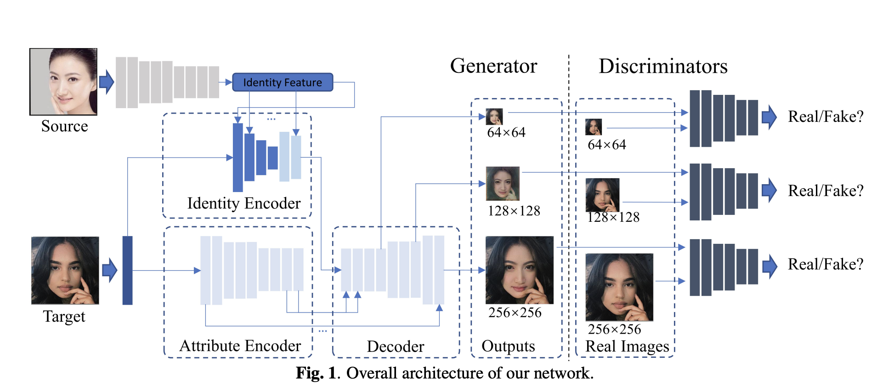
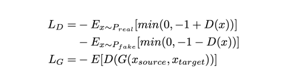
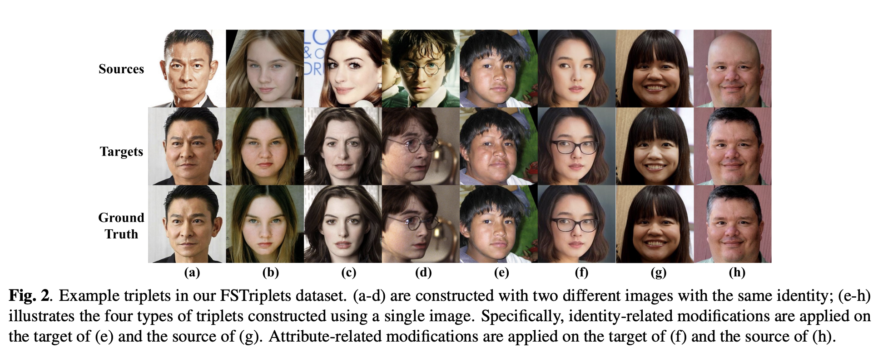
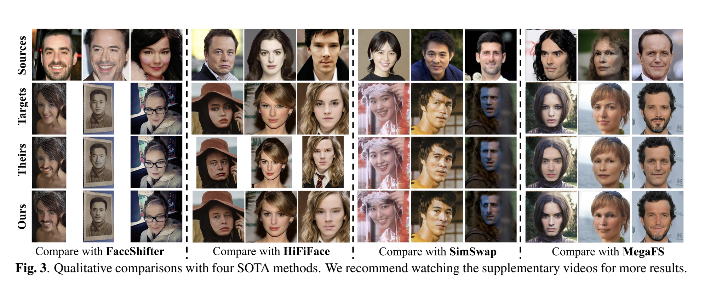

---
layout: post   
title: (MobileFSGAN) MIGRATING FACE SWAP TO MOBILE DEVICES: A LIGHTWEIGHT FRAMEWORK AND A SUPERVISED TRAINING SOLUTION     
subtitle: AI Paper Review       
tags: [ai, ml, computer vision, GAN, FaceSwap, Light weight model, Mobile Network]  
comments: true  
---  

현존하는 face swap 방법들은 시각적으로 그럴듯한 결과를 만들어 내기 위해 큰 네트워크에 의존하여 리소스 제약이 있는 플랫폼에서 사용이 불가능하다.
이 논문에서, 저자는 적은 파라미터로 모바일에서 face swap을 수행할 수 있는 새로운 lightweight GAN을 제안한다.
이미지 합성을 위한 가벼운 encoder-decoder 구조는 오직 10.2MB로 모바일 디바이스에서 실시간으로 돌아갈 수 있다.
학습 과정에서 작은 네트워크의 비 안정성을 해결하기 위해 FSTriplet 데이터셋을 구성하여 생김새 편집에 더욱 용이하도록 만들었다.
FSTriplet 은 source-target-result 를 제공하여, pixel-level label을 사용할 수 있는 첫번째 supervised 학습 과정을 제공한다.

저자는 또한 효과적은 back propagation을 위해서 multi-scale gradient losses를 디자인하였다. 이로인해 더 빠르고 좋은 수렴을 이끌어 내었다.
실험을 통해 다른 SOTA 알고리즘에 비해 적은 파라미터로 비교적 좋은 성능을 내었음을 보였다. 

[Paper Link](https://arxiv.org/pdf/2204.08339.pdf)  
[Code Link](https://github.com/HoiM/MobileFSGAN)

## Approach

  

### 1. Network Design
MobileFSGAN 은 GAN 기반의 프레임워크이다.
전체적인 구조는 위의 그림과 같다.
generator는 encoder-decoder 구조로, 두개의 encoder와 하나의 decoder로 이루어졌다.
identity encoder는 target image를 input으로 받고, AdaIN을 이용하여 source face embedding을 주입시켜, target identity를 교체한다.

  

input feature map f_in 먼저 누적 평균과 편차로 normalize 된다음, source identity embedding 에 따라 조절되는 채널 별 학습된 id 평균과 id 편차에 의해 demodulate 된다.

generator를 가볍게 만들기 위해 먼저, 모든 feature map의 채널 수를 고정하고, 적절한 capacity를 얻기위해 depth를 증가시켰다.
네트워크가 깊어질수록 파라미터가 exponential 하게 증가하는 현상을 막기 위함이다.

한편, encoder-decoder 간의 feature fusion, skip connection을 적용하여 feature 표현을 풍부하게 하고, gradient flow를 촉진시킨다.
더욱이, encoder 에서 오직 feature map을 3번만 downscale 하여, spatial structure가 잘 보존되도록 하였다.
모든 이런 노력의 결과로 generator의 사이즈 10.2MB를 가능하게 했다.

AdaIN은 공간 영역에서 동일하게 재정규화 하기 때문에 nonface 영역에 속하는 정보는 파괴될 수 있다.
그래서, 저자는 또한 attribute encoder를 설계하여 ID 인코더 전체에서 AdaIN에 의해 파괴된 모든 정보를 보존한다.
최종적으로, 두 encoder에서 나온 feature map은 공간적으로 섞여서 학습된 attention mechanism을 통해 decoder에 들어가고, attribute 속성은 유지하고, identity는 transfering 된다.

### 2. Training Losses
#### Adversarial Loss

  

#### Identity Preserving Loss
Arcface를 이용하여 face embedding 을 추출하여 source와 result 이미지의 cosine similarity가 같아지도록 유도한다.

  
f는 normalized face embedding을 의미한다.

#### Attribute Loss

VGG loss를 사용하여 target image와 result 이미지 간의 attribute가 보존되도록 유도한다.
  
F()는 VGG19 feature extractor를 의미하여 FaceShifter와 다르게 inference를 위한 추가적인 attribute encoder를 필요로 하지 않는다.

#### Pixel-level Loss
generated image와 gt 이미지간의 pixel-level Mean square loss fmf rPtksgksek.

total loss는 아래와 같다.
  

#### Multi-scale gradient Losses
파라미터 업데이터의 효율성을 높이기 위해, decoder에서 feature map size가 두배가 되기 전 시점에, convolution layer를 붙여서 RGB 이미지를 만든다.
총, 64x64, 128x128, 256x256 사이즈의 output을 만들어 낸다. 
학습 과정에서 이 세개의 output에 adversarial loss, identity-preserving loss를 적용시킨다.

### 3. FSTriplets Dataset
  

얼굴 이미지에 대해, identity, facial attribute를 수정한 FSTriplets dataset을 만들었다.
특히, identity-based 수정은 얼굴을 통통하게 하거나, 나이들게 하는 것을 포함하는 반면, attribute related 수정은 안경을 씌우거나, 헤어스타을 바꾸거나, 웃는 얼굴로 바꾸는 등을 포함한다.

일반적으로 FSTriplets 는 1.1M 이미지를 포함하며, 수정되지 않은 이미지는 277.1k 이다.
데이터셋은 15,552 명의 identity를 가지고 있다.
각 identity는 적어도 5개의 다른 이미지를 가지고, 평균 19.13 개가 있다.

#### Generate triplets from two images of the same person
result는 target image와 오직 identity만 달라야하고, source image와는 동일한 identity를 유지해야 한다. 
triplet 데이터셋 생성을 위해서 같은 사람에 대해 서로 다른 두 개의 이미지를 사용하였다. 
이때, 하나는 source로 사용하고 다른 하나는 swapped face로 정의한다. 
target image의 identity를 swap하게 되면, result는 GT와 같게 되어야 한다.

얼굴의 테두리 모양과 피부 스킨 texture는 identity의 clue로 작용하기 때문에, target 이미지에 대해서 뚱뚱하게 하여 얼굴라인을 바꾸고, 나이들게 만드는 변형을 통해 피부 질감을 변형하였다. 
이런 얼굴형 변형을 통해 모델이 face shape 또한 transfer 가능하게 하고, texture 변형을 통해서, source와 target 간의 성별이나 나이차이가 많이 나더라도 swapping 이 잘되도록 한다.

#### Generate Data from a single image
source와 target image를 동일하게 하면, supervision training 이 가능하여 학습이 안정적이지만 generator는 target image를 복사하게 되는 overfitting 문제가 생긴다.
이런 문제를 피하면서 학습의 안정성을 강화시키기 위해, 저자는 triplet을 하나의 single 이미지로 구성하였다.
source 또는 target에 대해 identity-related 또는 attribute-related 변형을 가해 서로다른 4가지 타입의 triplet을 구성하였다. 
하지만, identity-related 변형을 하면 source image와 Ground truth는 항상 같은 id를 가져야 한다.
반면, attribute-related 변형을 가하면, GT는 target image와 id가 같아야 한다. 

## Result
  