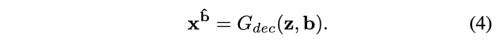

---
layout: post   
title: (Arbitrary Facial Attribute Editing) Only Change What You Want  
subtitle: AI Paper Review       
tags: [ai, ml, computer vision, GAN, Facial Attribute Editing]  
comments: true  
---  

facial attribute editing은 얼굴 이미지에서 하나 혹은 여러가지의 특성을 수정하는 것을 뜻한다.
최근에 GAN과 encoder-decoder 구조가 이런 task를 위해 널리 사용되고 있다.
attribute editing 은 특정 attribute 조건을 가진 얼굴 이미지의 latent representation을 decoding 하면서 수행된다.
현재 존재하는 몇몇의 방법은 attribute 를 임의로 변경하기 위해 attribute에 독립적인 latent representation을 설정하려고 시도한다.
하지만, attribute는 얼굴 이미지의 특징을 묘사하기 때문에 latent representation에 대한 독립적인 attribute 제약은 과도하다. 
이런 제약은 결국, 특히나, 식별가능한 attribute인 gender, race 등에 대해서 information 손실을 가져오거나 생성된 이미지에 예상치 못한 왜곡을 줄 수 있다. (over smoothing) 
attribute-independent 제약을 가하는 대신에 저자는 단지 특성의 변화만을 요구하는 attribute classification 제약을 가하고자 한다.
한편, 생성된 이미지의 속성을 제외한 다른 모든 디테일을 모존하기 위해 reconstruction 학습을 도입하고, adversarial 학습을 이용하여 시각적으로 더 진짜같은 이미지를 생성하도록 한다.
또한, 저자의 방법은 속성에 대한 강도 조작으로 자연스럽게 확장할 수 있다. 
CelebA 데이터셋에 대한 실험으로 이 방법은 SOTA 성능을 능가함을 보여준다. 


[Paper Link](https://arxiv.org/pdf/1711.10678v1.pdf)  
[Code Link](https://github.com/LynnHo/AttGAN-Tensorflow)  

## Attribute GAN (AttGAN)

attribute editing을 위해 얼굴 속성에 대한 binary 표현, 즉, 각 속성이 0(without)/1(with) code로 표현되며, 모든 속성들은 이 0/1 code들의 sequence로 표현되는 AttGAN 모델에 대해 소개한다.

### 1. Formulation
  

AttGAN은 두 기본 네트워크, Encoder G_enc, decoder G_dec와 속성 classifier C, discriminator D로 이루어져있다.

n binary attribute a = (a1, a2, ..., an)를 가진 face image x_a가 주어지면, encoder G_enc가 x_a를 latent representation으로 encoding 한다.
  

그다음 과정에서 decoder G_dec은 x_a의 속성을 또다른 attribute b=(b1, b2, ..., bn)을 가진 x_b로 decoding 한다. 
  

attribute editing 문제는 결국, 실제 이미지 x_a를 또다른 속성인 b를 가진 이미지로 변경시키는 encoder, decoder를 학습시키는 것이다.
이 학습 문제는 x_a에 상응하는 x_b 이미지를 알 수 없기 때문에 비지도 학습이다. 
한편으로, x_a 이미지는 b 속성을 가진 진짜 같은 이미지를 생성해야 한다. 이런 목적을 위해서 attribute classifier가 생성될 x_b의 속성이 원하는 속성으로 올바르게 바뀌도록 제약을 가한다.
또한 adversarial 학습을 사용하여 더 진짜 같은 이미지가 생성되도록 한다.

반면에, attribute editing 은 오직 원하는 속성만을 변경하고 다른 디테일은 유지되어야 한다.
이를 위해서 reconstruction 학습을 사용하여 latent representation z 가 세부 사항을 제외하고 속성을 복구하기에 충분한 정보를 보존하도록 한다.
  

요약하자면, 속성 a/b와 latent representation z 의 관계는 암묵적으로 두가지 측면으로 모델링 된다. 
1. z와 b는 decoder에서 실제같은 이미지 x_b를 생성하기 위해 상호작용해야 한다.
2. z와 a는 decoder에서 input image x_a와 근사한 이미지를 생성하기 위해 상호작용해야 한다.

#### Attribute Classification Constraint
얼굴 속성 편집 측면에서, 생성된 이미지 x_b는 새로운 속성인 b를 올바르게 가지고 있어야 한다.
하지만, Ground truth x_b가 없다. 그래서 저자는 attribute classifier C를 사용하여 생성된 이미지 x_b가 올바른 속성 b를 가지게끔 제한한다.
  

여기서 l_g(x_a, b)는 모든 attribute에 대한 binary cross entropy를 의미한다.
attribute classifier C는 encoder, decoder 와 함께 학습된다.
  

#### Reconstruction Loss
reconstruction 학습은 디테일을 제외한 속성들이 보존되기를 바란다.
이를 위해 decoder가 input image x_a를 원래의 속성 a를 가진 이미지로 생성하기 바란다. 

  
흐릿한 이미지를 생성하지 않기 위해 L2 대신 L1 loss를 사용하였다. 

#### Adversarial Loss
WGAN-GP을 따라서 adversarial loss를 설계 하였다.

 

#### Overall Objective
   
* lambda 1 = 100, lambda 2 = 10, lambda 3 = 1

### 2. Attribute Intensity Manipulation
위에선, 단지 속성에 대해서 있다, 없다 만을 고려했지만, 실제로 많은 속성들은 연속적인 특징으로 나타난다.
자유롭게 속성의 강도에 대해서 조절하기 위해 저자는 AttGAN을 아래와 같이 확장하였다. 
 

latent representation z를 두가지 part z_int, z'로 나누었다.
여기서 z'는 기존의 z와 동일하다. 추가적인 z_int는 attribute a/b와 동일한 dimension을 가지고 속성에 대한 강도 조절 역할을 한다.

Adversarial autoencoder (AAE)에 영감을 받아, 저자는 다변량 uniform 분포 U(0, 1)를 가지는 z_int를 만들기 위해서 adversarial learning 을 사용하였다. 
AAE가 전체 latent representation을  adversarial learning 에 사용하는 것과 다르게, 저자는 오직 z_int에만 적용하여, latent vector z'가 망가지는 것을 방지 하였다. 

 

위 식으로 b_int의 값은 U(-1, 1)을 따른다. b_int를 condition vector로 사용하여 Decoder G_dec을 아래와 같이 재 정의 할 수 있다.
 

## Experiments
CelebA 데이터셋은 40개의 binary 특성이 있지만, 여기서 시각적으로 강한 impact가 있는 13 가지의 특성만을 선정하여 테스트 하였다.
```text
“Bald”, “Bangs”, “Black Hair”, “Blond Hair”,
“Brown Hair”, “Bushy Eyebrows”, “Eyeglasses”,
“Gender”, “Mouth Open”, “Mustache”, “No Beard”,
“Pale Skin”, “Age”
```

 
