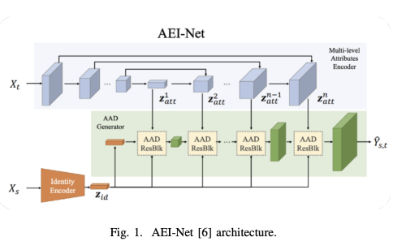
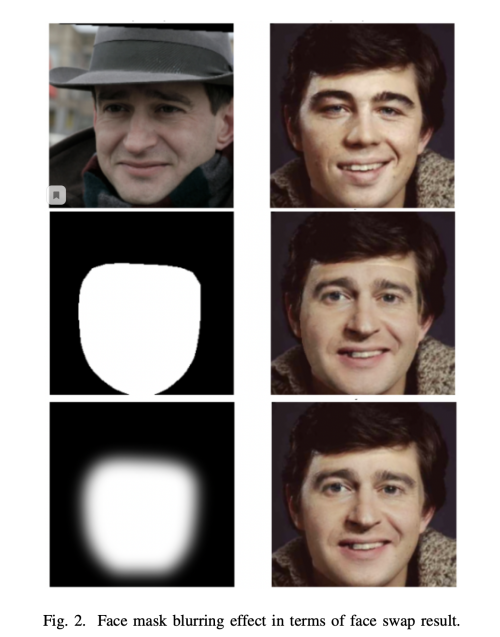
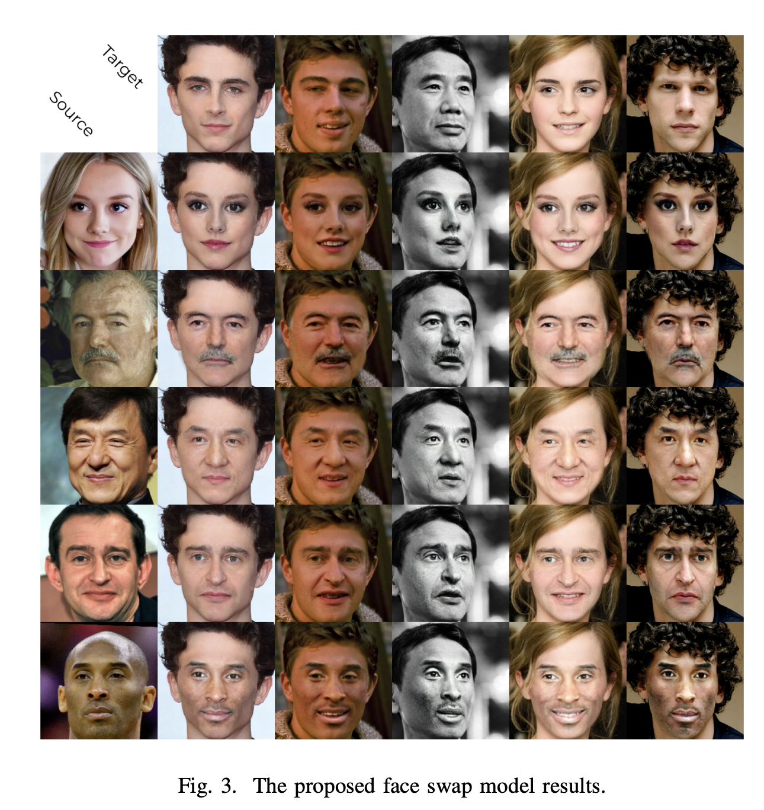
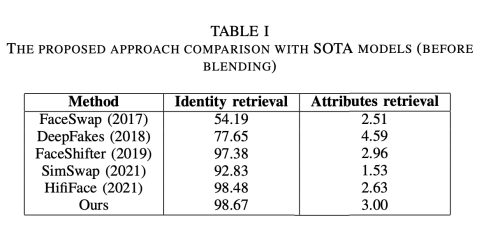

---
layout: post   
title: (A new face swap method for image and video domains) a technical report
subtitle: AI Paper Review       
tags: [ai, ml, computer vision, GAN, Face Swap]  
comments: true  
---  

Deep Fake 기술은 최근 몇년간 뜨거운 주제가 되었다. 연구원들은 정교한 GAN, autoencoder, 또는 다른 접든 방식을 통해서 정확하면서도 robust 한 face swap 알고리즘을 개발해 왔다. 
하지만 달성한 결과는 deep fake의 비지도적인 합성 task로 인해서 시각적으로 질이 조금 떨어지는 문제를 낳았다.
이러한 문제는 높은 fake detection 정확도를 야기한다. 첫번째 문제는, 현재 존재하는 image-to-image 접근 방식은 비디오 도메인에서의 특성을 고려하지 않고 frame 별 처리 방식은 face jittering 이나, 다른 distortion을 만들어낸다.
또다른 문제는, 생성한 데이터의 해상도가 계산 비용의 복잡성 때문에 낮다는 것이다. 세번째 문제는 source 얼굴의 비율이 더 클때 (더 큰 볼), 교체후 그냥 얼굴 테두리에 나타난다는 것이다.  
이 논문의 주요 목적은 이러한 문제를 해결하고 현존하는 솔루션에 비해 압도적인 결과를 만들어 내는 것이다.
저자는 FaceShifter 구조를 베이스로 하여 몇가지 문제를 고친 새로운 face swap 파이프라인을 제안한다.
새로운 eye loss 함수와, super-resolution block, 그리고 gaussian-based face mask 생성을 통해 이를 달성하고자 한다.

[Paper Link](https://arxiv.org/pdf/2202.03046.pdf)  
[Code Link](https://github.com/ai-forever/sber-swap)  

## The Proposed Approach
### Baseline Architecture
FaceShifter 모델 - AEI-Net의 부분을 차용하고 새로운 아이디어를 적용하여 결과의 성능 향상을 가져왔다.
* Identity (target) feature 는 Xs 로부터 ArcFace 모델을 이용하여 추출한다.
* Attribute feature는 Xt로부터 UNet-lite 구조를 이용하여 z1att, z2att, ..., znatt를 추출한다.
* Attribute 와 identity feature를 섞는다.
* Xs의 identity와 Xt의 attribute를 가진 output image Yst를 생성해낸다. 

전체적인 구조는 아래와 같이 세가지 파트로 구성된다.
* Identity encoder
* Encoder for Xt
* Xt의 feature과 identity vector에 기반하여 이미지를 생성하는 generator

  

저자는 추가적으로 attribute extraction으로 UNet, Linknet, Resnet 구조 모두 테스트 해보았는데, U-Net이 가장 좋은 성능을 내었다.

또다른 실험에서 AAD 블락의 갯수에 대해 테스트 해봤는데 2 AAD 블락을 사용하는 것이 가장 좋았다.

### Loss Function
추가적인 몇개의 loss를 사용하여 더 좋은 성능을 낼 수 있었다.

* L_id : identity loss, Yst와 Xs가 가까워야 한다. 
* L_adv: GAN loss
* L_rec: reconstruction loss, 랜덤하게 Xs=Xt를 사용하여 Yst=Xt 가 되게끔 하였다.
* L_att: attribute loss, Yst와 Xt의 z1att, z2att, ..., znatt가 가까워야 한다.

첫번째 수정은, 실험을 통해서 L_rec 을 위해서 X_t와 X_s가 같을 필요 없이 identity 만 같아도 잘 작동함을 발견했다.
왜냐하면 각 사람이 연속적인 프레임에 나타나는 데이터셋을 사용했기 때문이다.

또다른 수정은, 특히나 image-to-video transfer에서 눈의 모습이 시각적인 인지에서 가장 중요한 요소라는 직관을 기반으로 이루어졌다. 
이 경우 모든 단일 프레임은 사실적인 인식을 위해 동일한 시선을 나타내야한다. 따라서 저자는 특별한 eye loss 함수를 추가하기로 결정하였다.
Xt와 Y_st를 face keypoint detection 모델을 사용하여 L2 로 눈 영역 특성을 비교한다.

### Image-to-Video Improvements

image-to-video swap에서 original frame에 output area를 삽입하면 그 경계가 부자연스럽게 보이는 현상이 나타난다.
이런 효과는 source image와 target frame 간의 밝기차이 혹은 흐려짐 현상으로 나타난다.
그래서 부드럽게 합성 영역을 처리하기 위해 segmentation mask를 사용하였다.

face mask는 얼굴영역에 대한 단지 binary image 이다.
또한 또렷한 열굴 영역 이식 효과를 줄이기 위해, Gaussian Blurring 을 edge 에 적용하였다. 
  

Yst와 Xt는 얼굴 영역 비율이 다를 때가 있다. 
만약 Yst가  Xt에 비해 더 넓을 경우, transfer는 오직 부분적으로 이루어지고 Xs의 얼굴 모양을 유지할 수 없게 된다. 
이런 문제를 해결하기 위해, 저자는 생성된 얼굴과 target face의 keypoint를 track 한다.
만약 model로 부터 얻은 얼굴이 충분히 video에 있는 얼굴을 커버할 수 있다면, mask를 늘린다. 이렇게 함으로써 단순히 얼굴 뿐만아니라 얼굴형또한 transfer 하는 효과를 얻을 수 있다.
반대의 경우에는 마스크를 줄이고 blurring 정도를 늘려서 얼굴의 중앙 부분만이 transfer 되도록 한다.

## Result

  

평가를 위해서 수학적인 metric을 사용하였다.
* ID retrieval and shape ringnet: preserving identity 
* Exp ringnet: facial experession and saving emotions
* Eye ldmk: maintaining the direction of view

  
