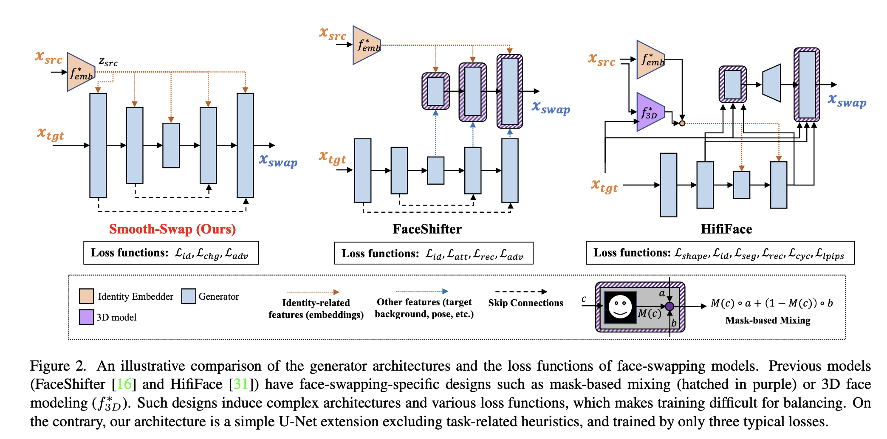
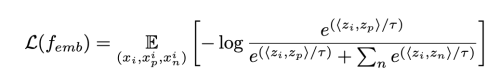
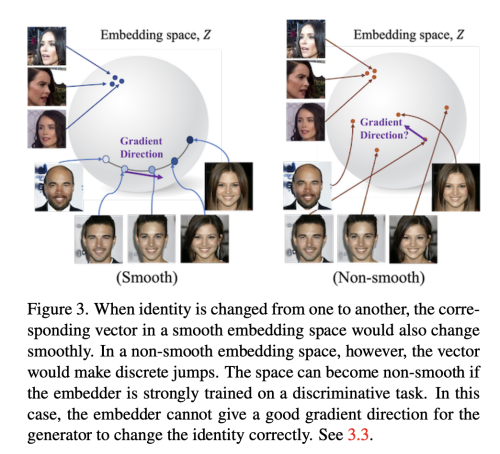
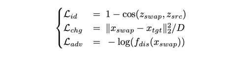
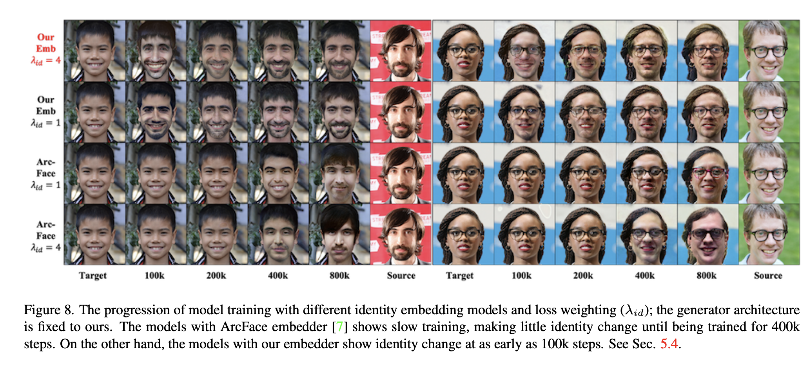

---
layout: post   
title: (Smooth-Swap) A Simple Enhancement for Face-Swapping with Smoothness  
subtitle: AI Paper Review       
tags: [ai, ml, computer vision, GAN, Face Swap]  
comments: true  
---  

face swap 모델은 그 생성 퀄리티로 인해 많은 주목을 받고 있지만, 복잡한 모델 구조와 loss function으로 인해 성공적인 학습에는 많은 주의를 요한다.
저자는 복잡한 hand-crafted 디자인을 제외하고 빠르고 안정적인 학습을 가능하게 하는 새로운 face swap 모델인 Smooth-swap 을 제안한다. 
Smooth-swap의 주요 아이디어는 identity embedding에 smooth를 생성하여, 안정적인 gradient 흐름을 제공하는 것이다.
기존 모델들ㅇ; discriminative task로 학습되었던 반면, 제안하는 방법의 embedding은 더 부드러운 공간을 촉진하는 supervised contrastive loss를 이용하여 학습된다.
향상된 smoothness와 함께, Smooth-swap은 U-Net 기반의 generator과 다른 세가지 베이직한 loss function으로 구성되어 기존의 모델들에 비해 훨씬 심플하다.
많은 실험을 통해서 face-swapping 벤치마크와 실제 얼굴이미지에서 저자의 모델은 SOTA의 성능을 낼 수 있음을 밝혔다.  

[Paper Link](https://openaccess.thecvf.com/content/CVPR2022/papers/Kim_Smooth-Swap_A_Simple_Enhancement_for_Face-Swapping_With_Smoothness_CVPR_2022_paper.pdf)  

## Problem Formulation & Challenge
### Problem Formulation
x_src, x_tgt 이미지가 주어져 있을때, face-swap 모델은 swap image x_swap을 생성한다.
이때 아래 세가지 조건을 만족해야한다.
* C1: x_src의 identity를 가져야 한다.
* C2: identity를 제외하고는 x_tgt의 모습과 같아야 한다.
* C3: 실제 같아야 한다.

위의 조건을 만족시키기 위해 대부분의 face-swapping 모델은 세가지 구성요소로 되어있다.
identity embedder f_emb, discriminator f_dis, 그리고 generator f_gen

  

여기서 identity embedder는 사전에 학습되어 고정된 모델이다.

### Challenge for Changing Identity
face-swap 에서 중요한 어려움은 위의 C1, C2 조건의 충돌에서 온다.
C1을 만족시키면 x_tgt의 특징을 없애고, C2를 만족시키면, 결국 아무런 변화를 가져오지 않는다.
만약 우리가 x_tgt에서 x_swap의 id와 관련 없는 변경 사항을 정확하게 추출하고 이를 C2 손실에 사용하면 이 충돌이 완화되었을 것이다.
불행히도, 이런 loss를 디자인하는 것은 매우 어렵고, 일반적인 대체로 perceptual 또는 pixel-level Lp loss를 사용한다.

충돌과 등방성 C2 손실의 주요 결과는 정체된 얼굴 모양 변화를 가져온다.
둥근턱에서 뾰족한 턱과 같은 형태 변화는 기하학적 변형을 포함하고 특징과 픽셀값의 극적인 변화를 수반한다.
따라서 x_tgt에서 벗어나 종종 먼저 손상되는 측면을 방지하는 C2 손실에 대한 큰 싸움이다.

이를 위해 이전의 모델들은 얼굴 모양을 올바르게 변형시키기 위해 3D face model을 이용하는 등의 많은 노력을 부었다.
하지만 이런 디자인은 추가적인 복잡성과, 모듈간의 밸런스를 섬세하게 조정해야하는 문제를 야기시킨다.
이 논문에서 서자는 이런 충돌은 새로운 모듈을 추가함으로써 완화시킬 수 있는 것이 아니라, identity embedder에 smoothness를 추가함으로써 가능하다는 가설을 세웠다.

### Importance of A Smooth Identity Embedder
대부분의 이전 모델들은 ArcFace를 identity embedder로 사용해왔다.
이미지를 embedder의 input으로 넣어서, 마지막 embedding vector를 비교하는 것이다.
이는 얼굴 이미지의 신원에 대한 적절한 유사성 메틑릭을 제공한다.
Arc Face를 사용하거나 또다른 face recognition model을 사용하는 것은 매우 non-smooth embedding space를 다루는 것과 같다. 
왜냐면, 오로지 이들은 discriminative task로 학습되기 때문이다.
embedder의 Smoothness는 face-swap모델 학습에 중요한 요소이다.
모델이 잘못된 identity를 가지고 x_swap 이미지를 생성할때 embedder는 이를 바로잡을 수 있는 좋은 gradient direction을 제공해야한다.
이런 gradient는 정확하면서 일관성 있어야 x_swap은 쉽게 x_tgt으로 돌아갈 수 있다.
만약 embedding space가 non-smooth 하다면, gradient는 연속공간에서만 잘 정의되기 때문에, gradient 의 방향은 에러가 많거나 노이즈가 많을 수 있다.

## Method: Smooth-Swap
### Smooth Identity Embedder
Smooth 한 embedder를 학습시키기 위해 supervised contrasrive learning loss를 찾았다.
 
* temperature: 0.07  

이 contrastive learning의 핵십은 embedding vector가 최대의 정보를 유지할 수 있게 한단,ㄴ 것이다.
face image들이 같은 identity를 가졌지만, 다른 나이나 다른 얼굴 모양을 가지고 있을때, discriminative embedder인 Arcface는 이런 정보를 점진적으로 지워버린다.
하지만, 이는 identity를 분류하는데 유용하지만, 매끄럽지 않은 임베딩 공간을 생성해낸다.
identity를 늙음에서 젊은으로 이동하거나, 둥그런 얼굴에서 날카로운 얼굴로 변형시킬때, embedding vector는 부드럽게 변하지 않는다.
우리의 목적에 맞는 임베딩은 정렬이 손상되더라도 더 풍부한 정보를 가지고 있어야 한다.
identity 변화에서 부드러운 path 이동은 good gradient 방향을 제공하고 face swapping model에 중요한 역할을 한다.

 

### Generator Architecture
generator의 구조는 score 기반의 SOTA 생성 모델인 noise conditional score network (NCSN++)를 차용하였다.
원래의 MCSN++ 사용과 다르게, conditional 구조가 지금 task에 더 유용하다.
그래서 저자는 NCSN++에서 두 파트를 수정하였다. time-embedding은 identity embedding으로, 그리고 input에서 output으로의 direct skipconnection을 추가하였다.

#### Details on Structure
NCSN++는 기본적으로 conditioning 구조와 모던한 디자인인 residual, attention block 등으로 이루어진 U-Net 구조이다.
오리지널한 목적은 noisy image를 input으로 받아서 input image와 같은 dimensionality를 가진 score vector를 출력하는 것이다.
다양한 noise level은 시간적 조건에 컨트롤 되기 때문에, time-embedding vector가 각각의 residual vlock에 추가되고, 전체 넓이와 높이 dim에 브로드캐스트 된다.

저자의 디자인은 이런 embedding vector를 identity embedding으로 교체하였다.
또한, Score vector는 image와 다르기 때문에 input image를 더해서 마지막 output image를 생성한다. 

저자의 모델 구조는 task-specific한 디자인 (3D face model, mask-based mixing) 을 포함하지 않는다.

#### Loss Function
generator를 학습시키기 위해 3가지의 베이직한 loss function을 사용한다.
  

여기서 단순히 pixel-level change loss만 사용할 뿐, feature level loss는 사용하지 않는다.

## Result
  
   
