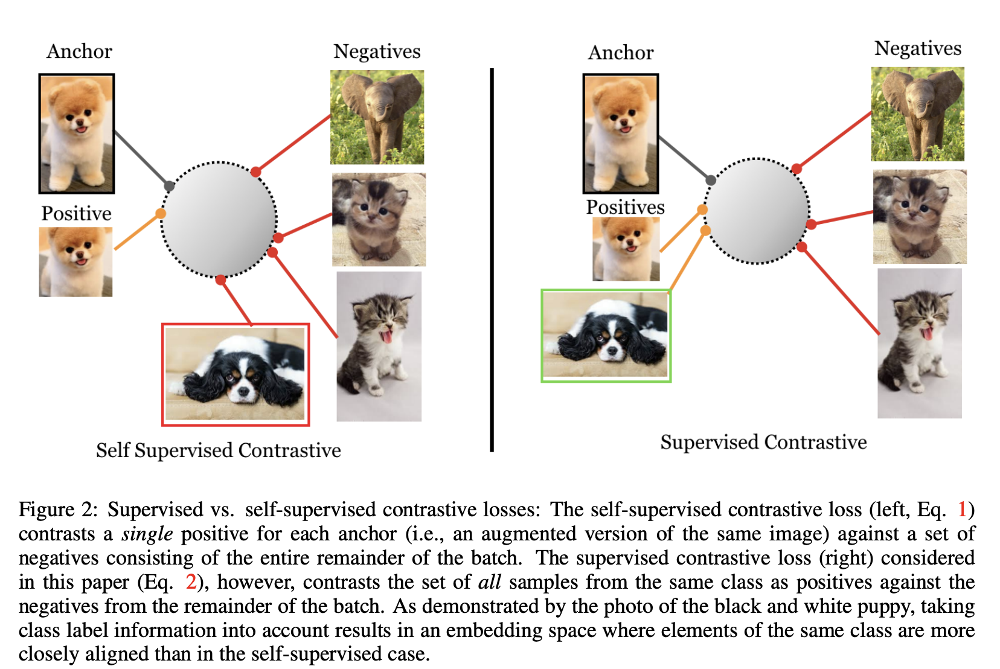
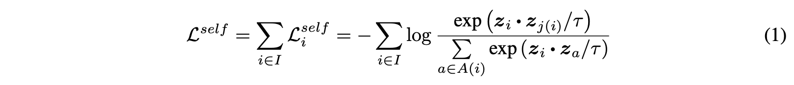
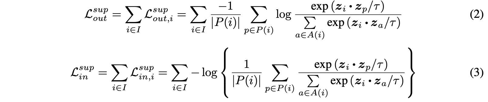
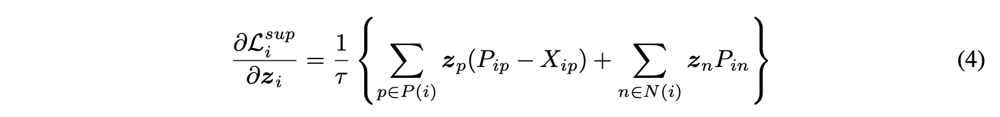
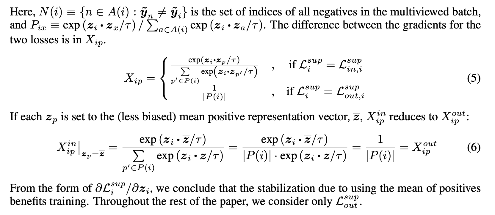

---
layout: post   
title: Supervised Contrastive Learning  
subtitle: AI Paper Review       
tags: [ai, ml, computer vision, self-supervised learning, contrastive learning]  
comments: true  
---  

contrastive learning을 self-supervised representation learning에 적용하는 것이 최근에 재기되면서, unsupervised training의 SOTA 성능을 가져오고 있다.
현대의 batch contrastive 접근 방식은 triplet, max-margin, N-pair loss 와 같은 전통적인 contrastive loss 보다 월등한 성능을 보여준다.
이 논문에서, 저자는 self-supervised batch contrastive 접근방식을 fully-supervised 한 셋팅으로 label에 대한 정보를 효과적으로 사용함을 보일 것이다.
같은 클래스에 포함된 군집된 포인트들은 embedding space내에서 서로 당겨질 것이고, 다른 클래스에 있는 군집간에는 서로 밀어낼 것이다. 
저자는 두가지 가능한 버전의 supervised contrastive (SupCon) loss를 테스트하여 가장 좋은 성능을 내는 formulation loss를 밝힐 것이다.
ResNet-200에서 저자는 top-1 정확도를 ImageNet 데이터셋에서 81.4%로 SOTA 성능을 내었다.
저자는 또한 다른 데이터셋과 두개의 ResNet 변형에서도 CrossEntropy 보다 일관된 성능을 나타냄을 보여준다.
loss는 자연적인 corruption에서 강인하고, hyperparameter setting에서도 안정적이다.

[Paper Link](https://arxiv.org/pdf/2004.11362.pdf)  
[Code Link](https://github.com/HobbitLong/SupContrast)  

## Introduction
최근에 재기된 contrastive learning은 self-supervised representation learning 에서 큰 진보를 가져왔다.
공통적인 아이디어는 아래와 같다.
* anchor와 positive 샘플은 서로 당기고, anchor와 negative 샘플을 밀어낸다. 

라벨이 없기 때문에 positive 샘플은 때로 샘플에 대한 data augmentation으로 구성되고, negative 샘플은 mini batch에서 램덤하게 선택한것으로 구성된다.
  

ㅕ연결은 데이터의 서로 다른 샘플간의 상호 정보를 최대화 하기 위한 contrastive loss로 이루어진다.

이 논문에서, 저자는 label의 정보를 극대화 시킬 수 있는 supervised learning 방식을 제안한다.
같은 클래스에서 추출한 정규화된 embedding은 서로 당겨지고 다른 클래스에서 추출한 embedding은 서로 밀어진다.
저자의 기술적인 참신함은 많은 negative 들 외에도 anchor 당 많은 positive를 고려하는 것이다. 
(단 하나의 positive를 사용하는 self-supervised contrastive learning과 대조적으로)  

이 positive 들은 anchor를 data augmentation 한 것이 아니라 anchor와 같은 class에서 온 것이다. 
이 loss는 triplet, N-pair loss의 일반화로 볼 수 있다. 
triplet은 앵커당 하나의 positive, 하나의 negative를 사용하고 N-pair는 앵커당 하나의 positive, 여러개의 negative를 사용한다.
앵커당 많은 positive, 많은 negative의 사용은 hard negative mining 없이도 SOTA의 성능을 달성할 수 있게 하였다.
이 contrastive learning은 large-scale classification에서도 cross-entropy 보다 더 일관된 성능을 보여주었다.
또한 self-supervised 또는 supervised 에 사용할 수 있는 통합 손실함수를 제공한다.

## Method
주어진 input batch data에서 augmentation을 두번하여 두개의 복사된 batch를 얻는다.
두 복사된 batch는 encoder를 통해 2048-dim의 정규화된 embedding으로 추출한다. 
학습과정에서 이런 representation은 projection network를 통과하지만 이는 inference time 에는 무시된다.
supervised contrastive loss는 projection network의 output으로 계산한다.
classification을 위한 학습된 모델을 사용하기 위해서는 고정된 representation을 이용하여 linear classifier만을 cross-entropy로 학습시키면 된다.

### 1. Representation Learning Framework
* Data Augmentation module: 각 input sample에 대해서 두 개의 random augmentation을 수행한다. 각각은 데이터의 다른 보기를 나타내며 원본 샘플에 있는 정보의 일부 하위집합을 포함한다.
* Encoder Network: 두 augmented sample들은 같은 encoder에 갈라져 input으로 들어가고, 한쌍의 representation vector를 얻을 수 있다.
vector는 정규화되는데, 정규화가 top-1 정확도의 향상을 가져옴을 실험을 통해 보였다.
  
* Projection Network: multi-layer perceptron으로 이루어져 있으며 output vector의 사이즈는 128 이다.
이 네트워크의 output 또한 normalize하여, projection space 내에서의 distance를 계산할 수 있게 inner product 하였다.
  self-supervised contrastive learning 처럼 마지막에는 projection layer를 버렸다. 결과적으로 inference-time은 encoder 모델 사용과 같다.
  
### 2. Contrastive Loss Functions
주어진 프레임워크에서, self-supervised 도메인에서 시작하여 이를 supervised 도메인에 적용하기 위한 옵션을 분석하여 contrastive loss의 family를 살펴보고 하나의 공식이 우수함을 보여줄 것이다.
N 개의 램덤하게 샘플링된 sample/label 쌍에대한 batch는 2N 쌍으로 사용한다. (x_2k-1과 x_2k는 하나의 샘플에 두개의 랜덤한 augmentation을 각각 수행한 것, y_2k = y_2k-1)
이 논문에서 N 샘플을 batch라 부르고, 2N의 augmented 샘플을 multiviewed batch라 부를 것이다.

#### Self-supervised contrastive Loss
  
i는 {1, 2, ..., 2N}을 의미한다.
zl = Proj(Enc(xl)) 을 의미하도 dot은 내적을 의미한다. t는 temperature parameter이다.
i는 anchor, j(i)는 positive, A(i)는 i를 제외한 index set이다.
각 anchor i에 대해서 하나의 positive pair 그리고 2N-2 개의 negative pair가 있다.

#### Supervised Contrastive Losses
지도학습의 경우 위의 식은 라벨의 존재로 인해 하나 이상의 샘플이 동일한 클래스에 속하는 경우를 처리할 수 없다. 
임의의 positive 수에 일반화하기 위해서 다양한 가능한 함수에 대해 선택을 할 수 있다.
  
* P(i): multiviewed batch 에서 모든 positive indices를 뜻함 
* 두 함수의 차이는 summation이 log 밖에 있는 것, log 안에 있는 것이다.

두 loss는 아래와 같은 특징을 가진다.
* Generalization to an arbitrary number of positives
* Contrastive power increase with more negatives
* Intrinsic ability to perform hard/negative mining

하지만 두 loss는 똑같지 않다.
log는 concave 함수로 Jensen's Inequality에 따라, Eq(3) (summation inside of log) < Eq(2) (summation outside of log) 이다.
그래서 Eq(2) 가 더 뛰어난 loss function 이라고 기대된다 (Eq(3)의 upper bound 가 되기 때문) 

실제로 Eq(2)가 Eq(3)에 비해 더 좋은 성능을 보여주었다.
어림짐작하기로, Eq(3)의 gradient의 구조가 학습을 위해 Eq(2)에 비해 덜 최적화 되어있기 때문이라고 생각한다.

Eq(2)의 positive normalization factor (1/P(i))는 positive 샘플의 bias를 제거해주는 역할을 한다.
하지만, Eq(3) 또한 같은 normalization factor를 가지고 있지만 이는 log 안에 있어서 단지 전체 손실에서 additive constant로만 기여하고 gradient에는 영향을 주지 못한다.
그래도 어떠한 normalization이 없다면 Eq(3)는 positive 샘플 내의 bias에 취약하여, sub-optimal training을 할 수 있다.

embedding z에 대한 Eq(2), Eq(3)의 gradient는 아래와 같은 형태를 가진다.

#### Connections to Triplet Loss and N-pairs Loss
supervised contrastive learning은 triplet loss와 매우 관계 있다.
triplet loss는 하나의 positive와 하나의 negative가 사용될때의 contrastive loss이다.
하나 이상의 negative loss가 사용되면 SupCon loss는 N-pairs loss와 같아진다.

