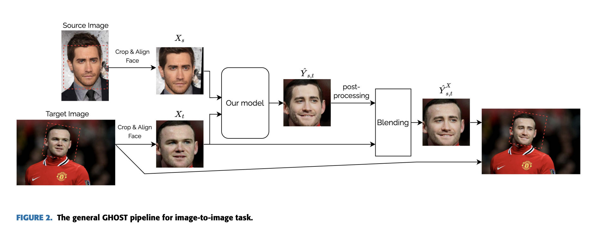

---
layout: post   
title: GHOST — A New Face Swap Approach for Image and Video Domains   
subtitle: AI Paper Review       
tags: [ai, ml, computer vision, GAN, face swap, Deep Fake]   
comments: true  
---  

deep fake 기술은 source와 target 이 이미지 또는 비디오인 face swapping 알고리즘을 나타낸다. 
연구자들은 정교한 GAN, autoencoder, 그리고 다른 정확하면서 강인한 알고리즘을 조사해왔다.
하지만, 결과는 사람이 평가하기에 완벽하지 않다. 이 연구에서, 우리는 image-to-image 그리고 image-to-video face swapping을 위한 새로운 one-shot 파이프라인을 
제안한다 - GHOST(Generative High-fidelity One Shot Transfer).
저자는 FaceShifter (image-to-image) 구조를 베이스라인 접근방법으로 잡고 몇가지 새로운, 예를 들어,
eye-based loss, face mask smooth 알고리즘, image-to-video face transfer 파이프라인, 
인접한 프레임과 super resolution 단계에서 나올 수 있는 jittering을 줄이는 등의 새로운 안정화 기술 등 주요한 구조적인 개선을 제안한다. 
실험단계에서, 저자는 이 방법이 ID retrieval, shape, eye gaze preserving 등의 매트릭에서 SOTA보다 나은 성능을 보임을 증명한다. 추가적인 연구를 통해서 파이프라인 단계가 전체적인 정확도에 대해 어떤 기여를 하는지 평가한다.
eye loss는 ID retrival에서 2% 성능향상을, eye gaze preserving 에서 45%의 성능향상을 가져옴을 밝혔다.  

[Paper Link](https://ieeexplore.ieee.org/stamp/stamp.jsp?tp=&arnumber=9851423)  

## The GHOST Approach 
대부분의 SoTA 구조는 장단점을 모두 가지고 있다. 
단점은 보통 다른 얼굴의 edge 에러, 시선 처리의 불일치, 특히 single image에서 video로 전환할때의 낮은 퀄리티를 포함한다.
그래서, 저자는 FaceShifter 모델을 베이스라인으로 잡고, 구체적으로 AEI-Net 부분과 output의 퀄리티와 안정성을 향상시키기 위한 새로운 스텝들을 적용하였다. 

Xs와 Xt는 각각 source와 target의 cropped된 얼굴이다.Y_st는 새롭게 생성된 얼굴을 뜻한다. 이들은 모두 256x256x3의 사이즈를 가지고 있다. 

제안하는 구조는 아래 그림과 같다. 

  

1. Identity Encoder는 사전에 학습된 ArcFace 모델을 시용하여, source image로 부터 source person identity의 정보를 유지한 vector z_id(size: 1x512)를 추출한다. 
2. Attribute Encoder는 U-Net구조를 가지고 있고 target image로부터 attribute feature z_att1, z_att2, ..., z_attn을 추출한다.
3. AAD generator는 단계적으로 attribute vector와 identity vector를 AAD ResBlock을 이용하여 섞고, source 의 identity를 가지고 target의 특징을 가진 새로운 얼굴 Y_st를 생성한다. 
4. Multiscale Discriminator 은 합성된 결과의 퀄리티를 좋게 하기 위해 real과 fake 이미지를 구분한다.

베이스라인 접근 방식을 뛰어넘기 위해, 저자는 더 높은 swap 정확도와 좋은 안정성을 이끌어낼 수 있는 추가적인 feature에 대한 loss를 추가하였다. 
이런 개선점은 구조 자체와 loss 개선으로 다양한 실험을 통해 저자의 모델이 더 좋은 성능을 내게끔 하였다는 것을 밝혔다. 

AEI-Net 구조의 일반적인 loss 파트는 아래를 포함한다.
1. L_rec: reconstruction loss 
    - 랜덤하게 X_s = X_t를 사용하여, Y_st = X_t 를 요구한다.   
      
      
2. L_att: attribute loss
    - Y_st와 X_t의 z_att1, z_att2, ..., z_attn 특징은 가까워야한다.   
      
      
3. L_id: Identity Loss
    - Y_st와 X_s의 identity encoder의 결과가 비슷해야한다. 
      
      
4. L_adv: GAN loss

이제 저자의 loss 수정에 대해서 진행하겠다. 먼저, 저자는 reconstruction loss를 SimSwap 모델의 아이디어를 사용하여 수정하였다. 
원래의 FaceShifter 구조의 아이디어는 X_s와 X_t가 같은 이미지여야 한다. 하지만, SimSwap에서는 같은 identity의 set of perseon P에 같이 속하는 이미지여도 된다. 
  

특히 image-to-video swap의 face swap 결과의 시각적 인식의 또다른 중요한 요소는 gaze direction이다.
이런 경우 모든 single frame은 realistic한 인식을 주기 위해서는 같은 방향으로 쳐다봐야한다.
그래서 저자는 gaze direction에 대한 heatmap 을 비교하는 L_eye loss를 사용한다. 

  

## Processing Pipeline
### General Pipeline
모델이 cropped face르 학습된 경우 우리는 단지 아무 이미지에 대해 swap 모델을 적용할 수 없다.
우리는 반드시 source 와 target image 들에 대해서 crop을 적용하여야 한다. 그다음 이 이미지에 대해 모델을 적용한 다음, 원래의 target image에 swap back 하여야 한다..

여기서 주요 문제는, 비록 Y_st가 X_t의 특징을 가지고 있지만 완전히 같지는 않다는 것이다.
그래서 만약 우리가 Y_st를 target image에 바로 집어 넣는다면, 그 경계라인을 볼수있다.
이를 해결하기 위해 제안하는 방법은 꽤 심플하다. 
먼저 output Y_st를 X_t와 섞은 다음에 target image에 넣는 것이다. 때때로 post-processing 기술을 model output에 적용하여 swap result의 퀄리티를 증진시킨다.
그래서, GHOST 솔루션의 일반적인 파이프라인은 아래와같다.

  

### Image-to-Video Face Swap
SCRFD 알고리즘을 기본적인 face detector로 사용하였다.
제안된 모델은 multiple face swap을 가능하게 한다. 이 경우 각 target과 detected face에 대한 identity vector를 계산하고, cosine similarity를 계산하여, video에서 올바른 사람을 결정한다.
이때 face recognition 모델로 ArcFace를 사용하였다.

더욱이, extraction step에서 frame에서 각 얼굴의 transformation matrix를 저장한다.
이 정보는 결과를 original frame으로 다시 되돌리는데 사용한다. 이 프로세스를 blending 이라고 부른다.
하지만, 만약 우리가 모델로 부터 얻은 이미지 전체를 삽입한다면, 시각적인 artifact는 삽입된 영역의 edge에 생길 것이다. 이런 현상은 source image와 target frame간의 밝기 차이와 합성된 이미지의 blurring 때문에 생긴다.
그래서 source image로 부터 generated face로 smooth transition을 보증해야한다. 
그래서 저자는 Segmentation Mask를 사용한다. 

Face Mask는 어떤 픽셀이 얼굴영역인지를 결정하는 binary mask이다. 그래서 우리는 정확한 얼굴의 위치를 결정하고 섬세하게 경계를 cropping 해야한다. 
face insert를 원활하게 하기 위해서, 저자는 Gaussian Blurring을 엣지에 적용하였다. 

  

모든 얼굴이 detection되었을 때, 연결된 프레임의 정보를 이용해서 bounding box를 smooth 할 수 있는 기회를 제공한다.
이런 기능은 detection의 안정성을 향상하고, result video의 face jittering 효과를 제거해준다.

  

더욱이, model은 source face의 모양을 유지하려고 하기 때문에 target과 generated face의 shape가 일치하지 않는다. 
이 문제를 해결하기 위해, generated face와 target face 모두에서 landmark를 추적한다.
landmark 의 coordinate가 크게 다를 경우, 저자는 face mask를 수정한다.
만약 모델로부터 얻은 face가 충분히 video에 있는 face를 커버한다면, face mask를 증가시켜서 head의 shape도 변형시킬 수 있도록 한다. 
반대로, mask를 줄이고, blurring effect를 증가하여 오로지 face의 central part 만이 transfer하도록 한다.

### Super Resolution Post-Processing
생성된 이미지는 오리지널 비디오와 비교하면 blurry하다. 그래서 저자는 face enhancement 모듈을 추가하였다. 
이것은 facial feature를 강화하고, 합성된 이미지가 더 자연스럽도록 한다.
그래서 저자는 face renovation 접근 방식을 사용하였다.
degraded image의 오리지널 퀄리티를 복원하는 Neural Network를 학습한다.
FFHQ 데이터셋에서 실험하였을때 (256x256으로 resized) degradation 함수는 아래와 같은 아이템을 사용한다.
* Blurring the image
* JPEG Compression
* Random Image Downsampling

  

### Training Details
VGGFace2 데이터셋을 사용하여 학습하였다.
training set의 퀄리티를 높이기 위해서 250 size보다 작은 모든 이미지를 제거하였다. 
그리고 다른 이미지들에 대해서 crop, align, 256 resize를 수행하였다.

학습 단계는 2 step을 따른다.  
first step은 eye loss를 사용하지 않았다.
lambda_adv=1, lambda_att=10, lambda_id=15, lambda_rec=10
second step에서 lambda_id=70으로, lambda_eye=1200으로 사용하였다.
모델은 총 12 epoch, batch size 16을 사용하였으며 NVIDIA Tesla V100 32GB GPU를 사용하였다.
Xs=Xt 비율은 0.2로 셋팅하였다. Adam Optimizer를 사용하고, generate, discriminator 모두 learning rate는 0.0004, weight decay 는 0.0001을 사용하였다. 

## Result
  
