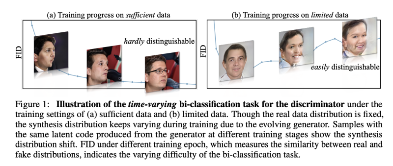
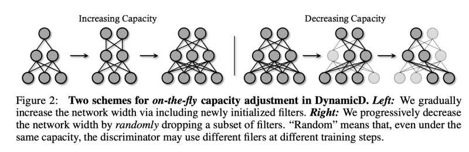
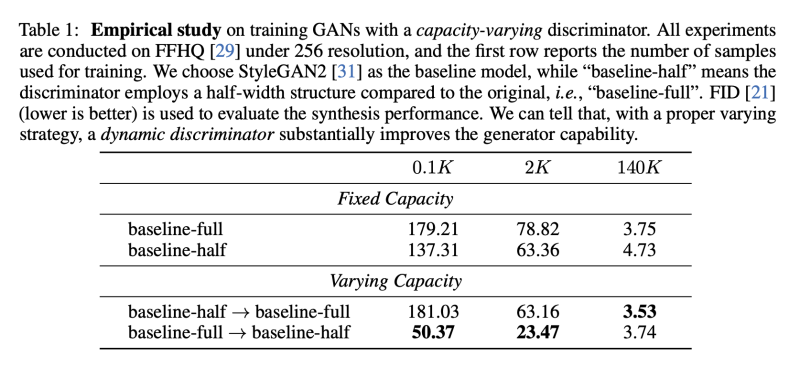
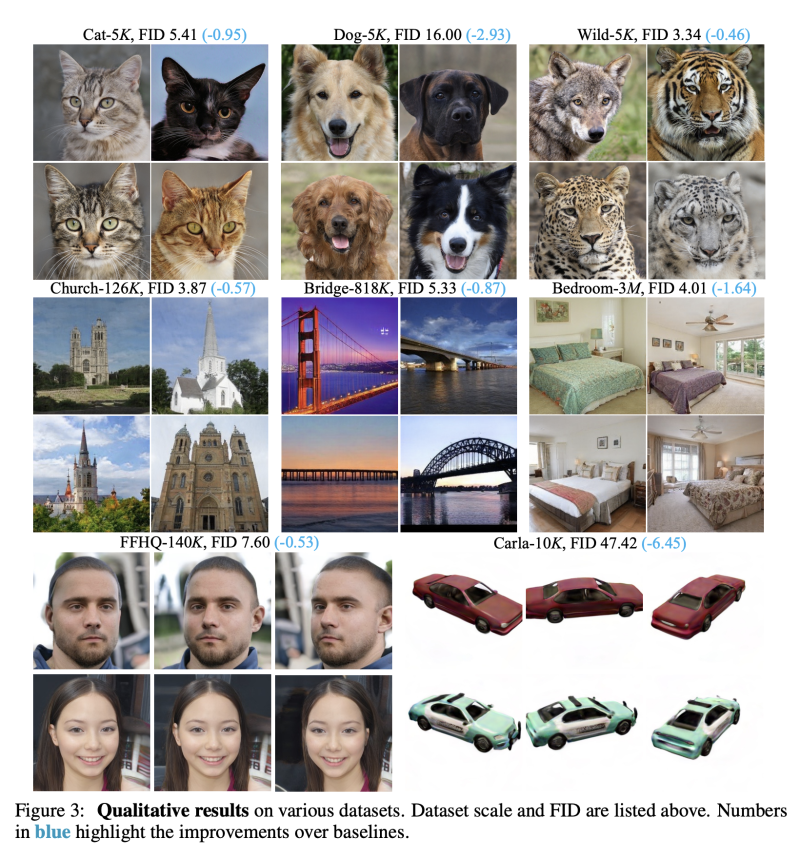

---
layout: post   
title: Improving GANs with A Dynamic Discriminator      
subtitle: AI Paper Review       
tags: [ai, ml, computer vision, GAN, Discriminator]   
comments: true  
---  

Discriminator는 GAN 네트워크 학습에서 진짜와 합성된 샘플을 비교홤으로써 중요한 역할을 수행한다. 
real data의 분포는 똑같지만, 합성 데이터의 분포는 generator가 진화하면서 계속 바뀌기 때문에, discriminator에 대한 bi-classification 작업에 대해 영향을 준다.
저자는 discriminator의 능력에 대한 즉석 조정이 이런 시간에 따라 달라지는 작업에서 더 좋은 성능을 가져온다고 주장한다.
Dynamic D로 칭하는 학습 전략에 대한 보완적인 실험을 통해서, 추가적인 계산 비용이나, 학습 목표 없이 합성 성능을 개선 할 수 있음을 밝혔다.
서로 다른 데이터 체계에서 GAN을 교육하기 위해 두가지 용량조정 계획을 개발하였다. 
(1) 충분한 학습데이터가 주어졌을때, discriminator는 점진적으로 학습 용량을 늘릴수록 효과를 얻는다. (2) 학습 데이터가 제한적일땐, 점진적으로 layer의 width를 줄일 수록 overfitting 문제를 없앨 수 있다.
2D와 3D 이미지 합성 작업 모두에서 실험을 수행함으로써, 저자의 Dynamic D는 일반화 할 수 있는 좋은 성능을 보여줌을 입증화였다. 
나아가 Dynamic D는 다른 discriminator 개선 접근 방식(including data augmentation, regularizers, and pre-training)과 함께 시너지를 낼 수 있고, GAN 학습을 위해 결합할 때 지속적인 성능향상을 가져온다. 

[Paper Link](https://arxiv.org/pdf/2209.09897v1.pdf)  
[Code Link](https://github.com/genforce/dynamicd)  

## Introduction
GAN은 generator와 discriminator로 구성되어 이미지 생성에서 큰 장점을 가지고 있다. 일반적으로 이 두가지 요소들은 학습과정에서 서로 경쟁을 한다. 
generator는 관찰된 data의 분포를 모방하며 진짜 같은 이미지를 생성해내고, disciminator는 real 데이터와 다른 fake sample을 구분해내어 generator가 더 좋은 합성을 할 수 있도록 만든다.
generator 쪽의 GAN의 개선에 많은 노력이 있었음에도 불구하고, 상대적으로 discriminator의 역할 중요도는 이 two-player 게임에서 떨어졌다.
사실 discriminator는 학습 데이터에 접근할 수 있으며, 어떻게 진짜와 가짜의 분포를 가깝게 할 수 있는지 실험하고, 자기 자신과 generator의 loss function을 파생한다. 
그래서, 적적한 discriminator의 학습 또한 GAN에서 매우 필수적이다.

GAN에서 discriminator는 bi-classification task를 수행한다.
이는 이미지가 학습 셋에서 왔는지 generator로부터 만들어진 데이터 인지 두가지로 분류하는 것을 목표로한다.
현존하는 image classification 연구는 모델 용량을 작업의 난이도에 맞추는 것에 집중한다. 그렇지 않으면 under-fitting이나 over-fitting 문제가 발생하기 때문이다.
예를들어, ResNet-50은 imageNet 분류에서 ResNet-101에 비해서 성능이 떨어진다. 왜냐하면 모델 용량이 데이터 다양성을 다루기에 충분하지 않기 때문이다.
그럼에도 불구하고, ResNet-152는 똑같은 task에서 ResNet-200보다 더 좋은 성능을 낸다. ResNet-200은 너무 많은 파라미터를 가지고 있어서 학습셋에 over-fitting 하기 때문이다.
이러한 관점으로부터, classifier로써의 GAN의 discriminator 용량은 앞서 말한 bi-classification task에 맞게 맞춰져야 한다.

학습 데이터가 고정된 채로 학습되는 보통의 image classification 작업과 다르게, GAN 학습은 generator의 합성 성능이 지속적으로 발전하면서, 시간에 따라 다르다. 
  

real data의 분포는 계속 똑같지만, 합성 데이터의 부노는 계속해서 달라진다.   
이때, 이러한 질문이 생긴다: **고정된 용량의 Discriminator가 다이나믹한 학습 환경의 요구를 충족시킬 수 있을까?**

이 문제에 답하기 위해, 저자는 Dinamic discriminaotor (Dynamic D)로 학습단계에서 즉석적으로 모델 용량을 조정하며 GAN을 학습하는 추가 실험을 진행하였다. 
먼저, Discriminator의 layer 넓이가 선형으로 조정되는 일반 형식을 조사하였다. 
이런 셋팅에서, generator는 Dynamic D에 의해 감독되며, 고정된 discriminator에 비해 더 좋은 합성 성능을 달성하였다. 
저자가 제안하는 학습 전략은 추가적인 계산 비용이나, loss function 없는 고 효율 방법이다. 
여기서 영감을 받아, 저자는 두가지 용량 조정 방법을 생각해냈고, 서로 다른 학습 데이터는 다른 방법을 사용해야함을 확인하였다.

한편으로, 충분한 학습데이터에서 generator의 성능이 좋아질 수록 discriminator의 작업은 더욱 어려워진다. 반대로, 제한된 학습 데이터셋에서는 모델이 오래 학습될 수록, discriminator는 전체 데이터셋에 대해서 단순히 memorize 할 가능성이 커진다.
결과적으로 over-fitting을 줄이기 위해 discriminator의 용량을 줄이는 것이 효과적이다. 

## Methodology
### Dynamic Discriminator
#### Increasing Capacity
약한 discriminator를 가지고 있다면, under-fitting이 생기게 되고, generator는 좋지 못한 이미지 합성에도 손쉽게 discriminator를 속일 수 있게 되기 때문에, bi-classification 작업은 점점 어려워진다.
그래서 저자는 점진적으로 몇몇 반복마다 새로운 neural fiter를 생성함으로써 discriminator의 용량을 늘려갔다. 
하나의 layer는 W_MN으로 M은 neural filter, N은 dimension을 나타내고, 증가 전략은 aM으로 칭한다. 

예를들어 convolution layer의 kernel이 M x N x 3 x 3이면, 우리는 spatial size 3x3의 또다른 aM 커널을 사용할 것이다. 
원래의 커널과 새로운 커널을 합쳐서 손쉽게 feature를 N에서 M + aM의 representation space로 증가시킨다.  
  

특히, 특정 레이어에 대한 이러한 수정은 output feature의 차원을 확대하여 다음 작업과 일치하지 않게 만든다. 
따라서, 우리는 dimension을 따라서 original kernel을 N에서 N+aN 으로 확대하여 결국, 원래의 kernel을 (M+aM) x (N+aN) x 3 x 3 으로 만든다.
특히, 첫번째 레이어는 항상 3 dimension을 input(RGB)로 받는다. 한번 새롭게 초기화된 filter는 original network에 통합되고, 모든 파라미터는 back-propagation을 통해서 업데이트 된다.
학습이 진행될수록, a는 매 n 반복마다 증가하고 discriminator의 모든 레이어는 동시에 증가한다. 
실제로, 일반적인 discriminator의 절반의 용량에서 시작하여 공정한 비교를 위해 종료 용량이 원본과 동일한지 확인한다. 

#### Decreasing Capacity
만약 bi-classification 작업이 상대적으로 간단하다면, 일반적인 discriminator는 단순히 학습 데이터를 외워버리는 over-fit를 일으킬 수 있다. 
합성 퀄리티는 매우크게 악화될 것이다. 
이를 해결하기 위해 저자는 랜덤하게 필터를 삭제하고, layer의 width는 점진적으로 줄어들게 된다.
저자는 용량을 계수 b를 이용하여 조절한다.
구체적으로, b가 주어지면, 우리는 언제나 랜덤하게 sub-kernel을 bM x bN x 3 x 3 만큼 매 iteration에서 샘플링한다.
증가 전략과 다르게, 저자는 실험적으로 모든 레이어를 감소시키는 것은 학습을 불안정하게 만들고, 특히 작은 kernel 수를 가지고 있는 lower-level layer를 조절할수록 이 같은 문제가 심해짐을 발견하였다.
그래서 저자는 이런 감소 전략을 여러 레이어 후에 적용한다. 감소 전략은 일반적인 Dropout과 다르다. 
저자의 방법은 "weight-level" dropout으로 학습 batch 내에서 모든 instance들이 공유함과 반면에, Dropout은 "feature-level" per-instance 정규화에 가깝기 때문이다. 

### Two Schemes for Different Data Regimes
#### Sufficient Data
직관적으로, 학습 초기 합성된 데이터는 노이즈로써 학습이 끝날때 쯤의 진짜같은 합성 데이터에 비해 매우 쉽게 구분된다. 
따라서 학습의 마지막 단계에서 더 큰 discriminator가 필요하다. 저자는 충분한 데이터에서는 증가전략을 채택하였다.
특히, 상대적으로 작은 네트워크로 시작하여야 더 잘 됨을 알았다.
그래서 계수 a는 0.5 부터 1.0으로 증가한다.
가장큰 네트워크는 원래의 네트워크와 동일한 사이즈가 되고, 추가적은 계산량이 발생하지 않는다. 
실험을 통해서 충분한 데이터셋에서는 감소 전략은 개선에 도움이 되지 않음을 밝혔다.

#### Limited Data
제한된 데이터에서 학습의 마지막 단계에서는 항상 over-fitting 이 발생하기 때문에, 저자는 감소 전략을 채택하였다. 
자세히 말하면, 감소 계수 b는 1.0 에서 시작하여 점진적으로 0.5로 줄어든다.
위에서 언급한 불안정성 문제때문에, low-level의 몇몇 레이어를 제외하고 감소를 수행한다.
마찬가지로 제한된 데이터셋에서 증가 전략은 오히려 over-fitting 이슈만 더 가속화 시킬 뿐이다.

## Results
   
   
