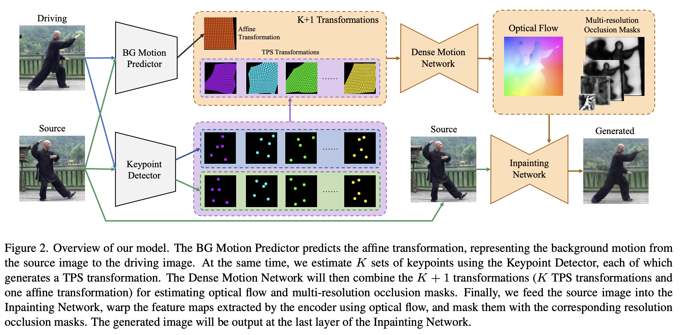
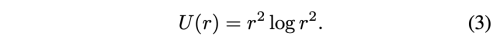
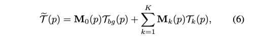
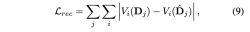

---
layout: post   
title: Thin-Plate Spline Motion Model for Image Animation      
subtitle: AI Paper Review       
tags: [ai, ml, computer vision, GAN, Facial Animation, Lip Sync, Image Animation]   
comments: true
---  

[Paper Link](https://arxiv.org/pdf/2203.14367.pdf)   
[Code Link](https://github.com/yoyo-nb/Thin-Plate-Spline-Motion-Model)  

Image animation은 source image의 고정된 물체가 driving video를 따라 살아 움직이도록 하는 기술이다.
최근 연구들은 사전 지식 없이 unsupervised 한 방식으로 임의의 물체에 motion을 transfer 하는 방식을 시도하고 있다. 
하지만 현재의 unsupervised 한 방식은 source와 driving image 간의 pose gap 차이가 크면 매우 어려워진다. 
이 논문에서는 이러한 이슈를 극복할 수 있는 새로운 end-to-end unsupervised motion transfer framework를 제안한다.
먼저, thin-plate spline motion estimation 이 더 유연한 optical flow를 생성하여 source image의 feature map 을 driving image의 feature map으로 warping 한다.
그다음 missing region을 더 realistic 하게 복구하기 위하여, multi-resolution occlusion mask를 사용하여 더 효과적은 feature fusion을 달성한다.
마지막으로, 추가적인 보조 loss function을 디자인하여, 네트워크 모듈에서 명확한 직업 분담이 이루어지므로, 네트워크가 더 고품질의 이미지를 생성할 수 있게 하였다.
저자의 방법은 말하는 얼굴, 몸, pixel animation 등 다양한 물체를 움직일 수 있다. 
실험 결과를 통해서 현재의 SOTA methods들 중에서 더 좋은 결과를 내었음을 밝혔다. 

## Method
  
* S: Source Image
* D: Driving Image
* TPS(Thin-plate spline): 얇은 금속 시트의 굽힘과 관련된 물리적 비유를 나타낸다.
  금속에 강성이 있는 것처럼 TPS fit도 굽힘에 저항하여 fit 표면의 부드러움과 관련된 패널티를 의미한다. 컨트롤 포인트 데이터셋으로 부터 각 픽셀에 가해지는 힘의 가중치를 계산하는 행렬을 구한다. 컨트롤 포인트는 전/후 위치 대응 쌍이며 최소 3쌍 이상이 있어야 한다. 

모델은 아래 모듈들로 구성된다.
* Keypoint Detector: S와 D 이미지를 각각 받아서 K TPS transformation을 생성하기 위해 KxN 쌍의 keypoint를 추정한다.
* BG Motion Predictor: S와 D를 concatenation 하여 BG Motion Predictor에서 아핀 배경 변환의 매개변수를 추정한다. 
* Dense Motion Network: 모듈은 모래시계형 네트워크이다. Keypoint Detector에서 K TPS 변환을 수신하고, BG Motion Predictor 에서 하나의 아핀변환을 수신한다.
광학 흐름은 이러한 K+1 변환을 결합하여 추정된다. 동시에 다중 해상도 occlusion 마스크는 왜곡된 feature map의 누락된 영역을 나타내기 위해 Decoder 부분의 다른 레이어에 의해 예측된다.
* Inpainting Network: 이역시도 모래시계형 네트워크이다. 예측된 optical flow를 이용하여 source image의 feature map을 warping 하고, feature map의 각 scale에 missing region을 채운다.
최종 생성된 이미지는 마지막 레이어의 결과값이다. 
  
### 1. TPS Motion Estimation
Motion Estimation은 T(S) = D가 되도록 하는 mapping T를 근사한다.
FOMM(First Order Motion Model), MRAA (Motion Representation for Articulated Animation) 모델이 local affine transformation 을 함께 사용하는 것과 달리, 저자가 제안하는 TPS motion extimation은 T를 근사한다. 
TPS transformation은 유연하고, 비선형 변환이기 때문에 더 복잡한 motion을 나타낼 수 있게 한다.

두 이미지에 상응하는 keypoints가 주어졌을 때, TPS transformation T_tps를 이용하여 하나에서 다른 하나로 최소의 distortion만으로 warping을 수행한다.

  

key point detector를 사용하여 S와 D 에 대한 KxN의 keypoints를 예측한다. 
여기서 K는 TPS transformation의 갯수이다.
모든 N 쌍(N=5 in this paper)의 키포인트는 S에서 D로 변환하는 하나의 TPS를 생성한다. 
k-th TPS transformation은 아래와 같다.

  

여기서 p=(x, y)T 는 픽셀 좌표를 나타내고, A_k (2x3), w_ki (2x1) 는 식 (1)을 풀었을 때 구할 수 있는 TPS 상관계수이다. 
U(r)은 radial basis 함수로 pixel p의 각 키포인트에 주는 영향을 뜻한다.

  

게다가 비디오에서 카메라의 움직임은 예측된 키포인트들이 background에 표시되게 하고, 이는 motion estimation에 편차를 발생하게 한다.
이런 문제를 해결하기 위해, 저자는 추가적으로 MRAA 처럼 배경움직임에 대한 모델인 배경 아핀변환을 예측한다.

  
여기서 A_bg (2x3)은 BG Motion predictor로 부토 예측한 affine transformation matrix 이다.

이제, 저자는 K+1 transformation (K tps transformation, one affine transformation) 을 통합하여 mapping T를 근사한다.
저자는 K+1 transformation을 사용하여 S를 warp 하고, 이 뒤틀린 이미지를 cascade하여 Dense Motion Network에 공급한다.

모듈은 K+1 contribution map M_k (HxW, k=0, ..., K)를 생성한다. 여기서 M_0은 T_bg에 대응한다.
contribution map은 softmax로 actvate 하여 모든 픽셀 위치에서 합을 1로 만든다. 

  

M_k (k=0, ..., K) 는 K+1 변환을 결합하여 광학흐름을 계산한다.
  

위에서 구한 T를 사용하여 Inpainting Network의 encoder로 부터 추출한 S의 feature map을 warp 하고, Decoder를 이용하여 D를 재건한다.

#### Dropout for TPS transformation
K TPS transformation을 사용하여 motion을 근사한다. 하지만 이들 중 단지 몇개만이 훈련의 초기단계에서 추정된 광학 흐름에 대해 작동할 수 있다. 
이것들의 contribution map이 모든 pixel location에 대해 zero 값이 될 수 있고, 전체 학습 stage에 어떠한 기여도 하지 못할 것이다.
그래서 network는 쉽게 local optimum 에 빠지고 안좋은 퀄리티의 이미지를 생성할 것이다.

저자는 TPS transformation 이 이와같은 현상을 피할 수 있도록 regularization 테크닉은 dropout을 적용한다.

구체적으로 exp(M_k(p)), k=1, ..., K 는 softmax에서 확률 P로 각각 0으로 설정되어 K TPS 변환 중 일부가 이 미니배치 훈련에서 광학흐름을 추정하는데 작동하지 않는다. 
그리고 0으로 설정되지 않은 항은 1 - P 로 나누어 sum of exp(M_i(p)) 가 일정하게 유지되도록 한다. 

bi, i=1, ..., K는 모수 1-P를 사용하여 베르누이 분포를 따른다.

  

Dropout은 network가 학습 초기 단계에서 몇몇의 TPS transformation에 대해 과도한 의존을 하지 않게 만들어 network의 robustness를 증가시킨다.
저자는 각 TPS transformation이 optical flow를 예측하는데 기여하기 시작한 몇 epoch 이후에는 이 dropout operation을 제거한다.

### 2. Multi-Resolution Occlusion Masks
Dense Motion Network와 Inpainting Network를 위해서, 저자는 모래시계형 구조를 차용하여, 서로다른 scale의 feature를 섞었다.
이는 다영한 연구에서 효과적이라고 밝혀졌다.
Dense Motion Network는 하나의 warped feature map의 빈곳을 inpaint 하기 위해 하나의 occlusion mask를 예측한다.
하지만, 많은 실험에서 feature map의 초점이 scale에 따라 변한다는 사실이 밝혀졌다. 
저화질의 feature map은 abstract 한 패턴에 포커스하고, 고화질의 feature map은 디테일한 질감에 더 포커스를 한다.
만약, 하나의 occlusion mask를 가지고 다양한 스케일의 feature map을 mask out 하기 위해 사용한다면, 학습하는 동안 서로 다른 스케일이 feature map 사이에서 어디에 더 포커스 할지 trade-off가 발생할 것이다.

따라서, 저자는 각 feature map layer에 대해서 서로 다른 occlusion mask를 예측한다.

Dense Motion Network는 optical flow 만을 예측하는 것이 아니라 decoder의 각 layer의 추가적인 convolution layer를 사영하여 multi-resolution occlusion mask를 예측한다.

예측된 optical flow와 multi-resolution occlusion mask를 Inpainting Network에 함께 공급한다.

Inpainting Network 에서 저자는 multi-scale feature를 섞어서 높은 질의 이미지를 생성한다. 

  

S를 encoder에 공급하고, optical flow T를 사용하여 각 layer의 feature map을 warp 한다. 
warped feature map 들은 대응하는 화질의 occlusion mask로 masked 하고, skip connection을 통해서 Decoder part와 concatenate 한다.
feature map은 두개의 residual block을 통과하여 upsampled 된다. 

### 3. Training Losses
FOMM과 MRAA를 따라서, 저자는 pretrained VGG-19를 사용하여 reconstruction loss를 계산한다.

  
i는 vgg-19 의 layer를 나타내고, j는 image를 downsampling 한 횟수를 나타낸다.

마찬가지로 Equivariance loss를 사용하여 Keypoint Detector를 훈련시킨다.  
  

T_ran은 random nonlinear transformation 을 의미한다.
FOMM, MRAA 과 마찬가지로 random한 TPS transformation을 사용하였다. 

저자는 bg loss와 warp loss 같은 보조 loss function 도 디자인 하였다.

affine transformation을 사용하여 background motion을 모델링하고, 
BG Motion Predictor를 사용하여 예측된 파라미터가 더 정확하고 안정되도록 하였다.

저자는 S, D 순서로 cascade 하여 BG Motion Predictor에 공급하여 affine transformation A_bg를 얻는다. 이는 S에서 D로 변환되는데의 background motion을 나타낸다.
다음, 반대 순서로 re-cascade 하여 affine transformation A'bg를 얻는다.

  

하지만 위의 식을 loss function으로 사용할 수 없다. 
왜냐하면 BG Motion Predictor의 결과값이 zero matrix를 만들면 두 식이 최소가 되기 때문이다.
그래서 위 식을 아래와 같이 reformulate 하였다.
  
여기서 I는 3x3의 identity matrix 이다.

Inpainting Network를 위한 추가적인 제약을 디자인하였다.
Inpainting Network의 encoder에 D를 공급하여, S의 warped encoder feature map을 사용하여 warp loss를 계산한다.

  
warp loss는 optical flow의 예측을 더 합리적으로 하고 warped feature map이 D와 더 가까워지도록 한다.

최종 loss 는 아래와 같다.

  

### 4. Testing Stage

test 단계에서는 source image S와 T개의 frame을 가진 driving video {D_t}를 사용한다.
FOMM 은 image animation에서 standard, relative 두 가지 모드가 있다.
standard mode는 각 프레임 D_t와 S 간에 직접적으로 식 (6)을 사용하여 motion을 예측한다.
반면 relative mode는 D_t와 첫번째 프레임 D_1 간에 모션을 예측하고, S에 적용한다.

하지만, standard 모드는 identity 간의 불일치가 클 수록 잘 동작하지 않는다. (thin person <-> fat person) 
relative mode는 D_1의 포즈가 S와 유사해야한다.
MRAA 에서는 추가적인 네트워크 disentanglement (adv)를 통해 S에 적용되어야 하는 모션을 예측하는 새로운 모드를 제안한다.

이 논문에서는 이 모드를 사용하였다.
저자는 MRAA 처럼 shape과 pose encoder를 학습하였다.
shape encoder는 S의 keypoint에 대한 모양을 학습하고, pose encoder는 D_t의 키포인트에 대한 포즈를 학습한다.
그 다음 decoder는 keypoint를 재건하여, S의 shape과 D의 포즈를 유지하게끔 한다.

encoder와 decoder 모두 fully connected layer로 이루어져있다.
저자는 이 네트워크 학습에서 video의 두 프레임을 사용하였는데, 하나의 프레임의 키 포인트를 랜덤하게 deform 하여, different identity의 pose를 시뮬레이션 하였다.

L1 loss를 사용하여 keypoint reconstruction을 수행하였다.

## Results
  
