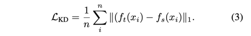

---
layout: post   
title: (Wavelet Knowledge Distillation) Towards Efficient Image-to-Image Translation       
subtitle: AI Paper Review       
tags: [ai, ml, computer vision, GAN, Knowledge Distillation, GAN Compression, Image-to-Image Translation]   
comments: true
---  

GAN 모델은 image-to-image translation 에서 놀라운 성과를 보여줘왔다. 
하지만, 매우 많은 파라미터 때문에 SOTA GAN 들은 저 효율적이고 메모리를 과도하게 사용한다.
이런 문제를 해결하기 위해, 이 논문에서는 GAN 성능을 frequency 관점에서 조사한다.
특히 작은 GAN은 높은 질의 high-frequency 정보를 생성하는데 결함이 있다.
이 문제를 해결하기 위해 저자는 새로운 knowledge distillation 방법으로 wavelet knowledge distillation을 제안한다.
teacher 모델이 생성한 이미지를 직접적으로 distilling 하는 것 대신에, wavelet knowledge distillation은 이미지를 discrete wavelet transformation을 통해
 서로다른 frequency band로 분리하고 오직 high frequency band 만을 distill 한다.
 결과적으로 student GAN 은 high frequency band에 더욱 집중하여 학습할 수 있다.
 실험을 통해서, 저자의 방법을 통해 cycleGAN으로 성능하락 없이 7.08x 압축율과 6.08x 가속화를 달성했다.
 추가적으로 discriminator의 압축 또한 압축된 generator의 성능을 향상시킬 수 있음을 밝혔다. 
 

[Paper Link](https://openaccess.thecvf.com/content/CVPR2022/papers/Zhang_Wavelet_Knowledge_Distillation_Towards_Efficient_Image-to-Image_Translation_CVPR_2022_paper.pdf)  
[Code Link](https://github.com/ArchipLab-LinfengZhang/wkd-datasets)  

## Related Work 

### Image-to-Image Translation
Pix2Pix는 처음으로 conditional GAN 모델을 image-to-image translation을 위해 적용한 모델이다. 
다음, Pix2PixHD는 더 고화질의 이미질을 생성하기 위해 corse to fine generator와 multi-scale discriminator를 사용하는 방법을 제안하였다. 
더 도전적인 과제는 unpaired dataset으로 image-to-image translation을 수행하는 것이다.
CycleGAN은 이런 문제를 해결하기 위해 generated image가 input domain으로 다시 재생성 되도록 하는 cycle-consistency loss를 사용하였다.
그다음, attention CycleGAN은 attention module을 사용하여 이미지에서 더 중요한 pixel에 집중하도록 하였다.
GauGAN에서 소개된 Spade 모듈은 batch normalization layer에서 semantic information을 잃는 문제를 해결하였다.
최근에 많은 연구자들은 CycleGAN에서 완벽한 재건이 매우 달성하기 어렵다는 것을 발견하였다.
이런 문제를 해결하기 위해 Park et al. 은 patch-wise contrastive learning을 사용하여 생성 품질을 높이고, 학습과정을 안정화시킴과 동시에 학습 시간을 단축시켰다.
고화질과 진짜같은 생성 이미지들은 수많은 계산과 많은 파라미터들을 필요로 한다.
이런 문제를 해결하기 위해, network pruning, NAS 같은 유익한 압축 방법이 제안되어져 왔다. 
Li et al. 은 once-for-all search 방법을 적용하여 tiny GAN 구조를 찾는 방법을 제안하였다.
Jin et al 은 inception-based residual block을 generator에 적용하고 channel pruning을 추가로 적용하여 이를 달성하였다.
Liu et al. 은 Content-Aware GAN Compression 방법을 사용하여 압축 과정 중 매우 중요한 영역은 유지되도록 하였다.
Li et al. 은 GAN compression 에서 discriminator의 역할을 다시 보고, 선택적으로 discriminator을 activation 하는 방법을 채택하였다.

### Knowledge Distillation
Knowledge distillation 은 주체스러운 teacher model의 감독하에 lightweight student model의 학습을 풍요롭게 하여 모델 압축과 정확도를 효율적으로 할 수 있게하는 방법이다.
이 아이디어는 Bucilua et al. 에 의해 처음 도입되었다.
다음 Hinton et al. 은 softmax에 temperature라는 hyper-prameter를 도입하여 teacher logit의 분포를 더 부드럽게 하여 학습하는 컨셉을 제안하였다.
최근에는 이런 KD를 intermediate feature와 이들의 관계에 대해 서도 적용하는 많은 방법들이 제안되고 있다.
이런 KD가 성공적으로 적용되었던 이미지 분류 task와는 다르게, object detection, semantic segmentation, pre-trained language models, machine translation, distributed training, multi-exit model 등 복잡한 
task 들에 대해선 매우 어렵다.

하지만 image-to-image translation 을 위한 GAN에 KD를 적용하는 효과에 대해서는 아직 많은 연구가 되지 않았다.
현존하는 많은 연구들은 직접적으로 student와 teacher의 생성된 이미지 간의 거리를 좁히는 방식으로 사용되어, student의 성능을 높이지 못하고 오히려 독이 될때도 있다.
몇몇의 분류 task에 사용되었던 KD 방법들이 image-to-image translation에 적용되었지만, 개선 효과는 거의 없었다,.
예를 들어, Li et al. 은  teacher과 student GAN의 중간 feature 간의 거리를 줄이는 방식을 사용하여 의미적 관계를 feature level로 전달하려고 하였다.
최근에 Chen et al.은 KD를 generator 뿐만 아니라 discriminator에도 적용하였다.
Jin et al. 은 generator에 중간 feature에 Global Kernel alignment를 적용하여 추가적인 layer 없이 strudent에 성능 향상을 시도하였다.
 이 방법들과 저자의 방법의 가장 큰 차이점은, 이전 GAN KD 처럼 중간 feature 를 distill하는 것이 아니라, 생성된 이미지를 distill 한다는 것이다.
 결과적으로 저자의 방법은 이전의 방법들과 직교하며, 함께 활용하여 더 나은 성능을 얻을 수 있다.
 
### Wavelet Analysis in Deep Learning

퓨리에 분석과 같은 다른 주파수 분석과는 다르게, wavelet transformation은 신호로부터 공간적이며, 주파수적인 정보를 동시에 얻을 수 있어 이미지 처리에서 더욱 효과적인 방법이다.
딥러닝의 성공에 따라, wavelet 방법을 NN에 다른 목표를 위해 적용하려는 많은 유용한 방법들이 제안되고 있다.
Williams et al. 은 max, average pooling을 discrete wavelet transformation으로 대체하는 
wavelet pooling 을 제안하여 image가 down sampling 되는 동안 global information을 더 효과적으로 유지되도록 하였다.
Chen et al. 은 wavelet 같은 auto-encoder를 제안하여 original image를 두 개의 저화질 이미지로 압축하여 inference 계산을 가속화하는 방법을 제안하였다.
Liu et al은 wavelet trasformation을 CNN에 적용하여 texture 분류에서 spectral 정보를 더욱 잘 활용하도록 하였다.

최근 연구에서 wavelet 분석이 image-to-image translation 작업에 적용되고 있다. 
Huang et al.은 처음으로 wavelet-SRNet을 적용하여 single image에서 고화질 이미지의 wavelet 상관계수를 예측하여 super resolution을 적용하는 방법을 제안하였다.
Liu et al.은 UNet 구조에 영감을 얻어 wavelet package를 CNN에 적용하여 더 큰 receptive field를 효과적으로 얻었다.

이 논문은 KD와 GAN compression에 처음 wavelet 을 적용하는 방법이다.

#### [Wavelet Transformation 참조](https://tech.onepredict.ai/94d98ece-06be-4215-b5ef-87a58ab8d2e3)
* Wavelet Transformation: 특정 규칙에 따라 모델링 된 웨이블릿 함수의 scaling, shifting 을 변환해가며 상관계수를 계산해 변환 
* Wavelet: 정해진 시간 안에서 증가와 감소를 반복하며 진동하는 평균이 0 인 진동으로 표현
    * 0으로 시작해서 0으로 다시 수렴 
    * 다양한 종류가 있음: Morlet, Symlets, Mexican, ...
* Scaling and Shifting
    * 웨이블릭의 길이를 시간 축의 방향으로 늘리거나 줄이며 조정함으로써 고주파에서 저주파까지 다양한 대역을 갖는 웨이블릿을 만들 수 있음
      
      
    * 위 식은 웨이블릿 변환을 수식화 한 것이며, 웨이블릿 함수(mother wavelet) 는 프시로 표현된다.
    * a는 scaling, b는 shifting 이다. 
    * 프시를 shifting (t 축 이동) 바꿔가며 원본 신호 x(t)와 상관계수를 계산하고, 다시 scaling 하고 다시 상관계수를 계산 하는 과정 반복 (convolution 연산)
    * 결과적으로 x 축은 시간, y축은 scale, scale을 웨이블릿의 중심주파수로 변환해 주파수값을 계산할 수 있다. 

## Methodology
### Wavelet Analysis

mother wavelet 함수인 프시가 주여젔을때, 카이는 프시의 dilation과 shift 조합이다.  
  
만약 카이 함수의 형태가 L2 공간의 기초를 생성한다면 프시는 직교 wavelet 일 것이다. 
discrete wavelet transformation (DWT)는 피라미드적 이미지 decomposition을 위한 수학적인 tool 이다.
DWT를 사용하여 각 이미지는 4 가지 band LL, LH, HL, HH로 분리된다. (L: Low frequency, H: high frequency)  
LL band는 추가적인 DWT를 통해서 LL2, LH2, HL2, HH2 로 분리된다.
더 정확히 말하면, 저자는 이 논문에서 모든 실험에서 3-level DWT 을 적용하였다. 
{HL3, LH3, HH3, LL3, HL2, LH2, HH2, HL1, LH1, HH1}  

### Knowledge Distillation
#### Knowledge Distillation for Image-to-Image Translation
image-to-image translation task 에서 
예측한 결과 f(x_i)는 categorical probability distribution이 아니라 pixel 값을 나타내기 때문에 KL divergence는 student와 teacher 간의 차이를 측정하는데 사용될 수 없다.
KL divergence를 대체할 naive 한 방법은 L1 norm distance를 사용하는 것이다.
다음 Hinton knowledge distillation으로 확장하여 아래와 같은 loss function을 설계할 수 있다.

  

이 방법이외에도 직접적으로 image-to-image translation에 적용할 수 있는 feature knowledge distillation 방법은 많다.
저자의 방법은 feature-based 방식이 아니기 때문에 다른 방법을 여기에 소개하진 않겠다.

#### Wavelet Knowledge Distillation
위에서 언급한 것에 기초하여, 저자는 오직 student와 teacher 간의 고주파수 성잘의 차이만을 최소화 하는 wavelet knowledge distillation 방법을 제안한다.
loss function은 아래와 같다.

  

프시H 가 의미하는 바는 DWT를 적용한 LL3를 제외한 {HL3, LH3, HH3, HL2, LH2, HH2, HL1, LH1, HH1} 밴드를 의미한다.
전체적인 training loss는 L_original + alpha*L_wkd 이다.

## Results

  
  

    
    

