---
layout: post   
title: (Teachers Do More Than Teach) Compressing Image-to-Image Models      
subtitle: AI Paper Review       
tags: [ai, ml, computer vision, GAN, Knowledge Distillation, GAN Compression, Image-to-Image Translation]   
comments: true
---  

GAN 은 이미지 생성에서 좋은 성능을 내었지만, 거대한 계산 비용과 메모리 사용량으로 인해 효율이 좋지 않다.
최근에 이런 GAN을 압축하는 많은 노력들은 작은 generator를 사용하여 image 의 퀄리티를 희생하거나, 시간이 많이 소모되는 NAS를 이용해 발전해왔다.
이 논문애소 저자는 teacher network가 효율적인 네트워크 구조를 찾을 수 있도록 search space를 제공하는 방식으로 이 문제를 해결하였다.
첫째로, 저자는 generative model의 search space를 다시 살펴보고 inception-based residual block을 generator에 도입하였다.
두번째로, 목표하는 계산비용을 달성하기 위해, one-step pruning 알고리즘을 적용하여 teacher model로 부터 student 구조를 찾고 점진적으로 search cost를 줄여나간다.
이는 학습 과정을 간소화하여 l1 sparsity reqularization이나, 관련 하이퍼파라미터를 필요로 하지 않는다.
마지막으로 저자는 Global Kernel Alignment(GKA)를 사용하여 teacher과 student 간의 feature 유사도를 향상시키기 위해 knowledge distillation을 적용한다.
이 논문의 방법은 original model 보다 비슷하거나 더 좋은 성능을 더 작은 계산비용으로 달성하였다. 

[Paper Link](https://openaccess.thecvf.com/content/CVPR2021/papers/Jin_Teachers_Do_More_Than_Teach_Compressing_Image-to-Image_Models_CVPR_2021_paper.pdf)    
[Code Link](https://github.com/snap-research/CAT)  

## Methods

이 섹션에서 저자는 conditional image generator 모델을 다시 살펴보고 inception-based residual block을 소개한다.
teacher model은 제안된 block design을 가지고 있고, 두가지 목적을 제공한다.
첫째, teacher model은 large search space로써 볼 수 있고, 다른 많은 네트워크 학습 필요 없이 one-shot NAS를 수행할 수 있다.
제안된 one-step pruning 방법으로 주어진 계산 예산을 만족하는 계산 효율적인 네트워크를 즉시 찾을 수 있다.

둘째, teacher model그 자체로 distillation을 수행할 수 있는 지식을 가지고 있다. teacher과 student network의 서로 다른 수의 channel수를 가지고 있는
intermediate feature 간의 유사도를 직접적으로 최대화 함으로써, 효과적으로 teacher의 정보를 student에 전달할 수 있다.

### 1. Design of Teacher Generator
Teacher로 부터 효울적인 student를 찾는 것은 teacher network가 매우 복잡하지 않은 이상 매우 간단하다.
이런 방법으로 teacher network는 knowledge distillation 뿐만 아니라 search space를 제공한다.
그래서 좋은 supernet을 얻기 위해 teacher generator의 디자인도 더 좋은 이미지를 생성하면서, 합리적인 search space를 가질 수 있게 변경되어야 한다.

#### Inception-based Residual Block 

저자는 pre-trained teacher generator가 large search space를 제공하도록 새롭게 구조를 디자인하였다.
저자는 더작은 네트워크를 찾기 위해, 다른 operation (다양한 kernel size), 다른 채널 수를 teacher network를 pruning 함으로써 찾도록 하였다.
이를 위해 저자는 판별모델에 널리 사용되는 inception module을 이미지 generator에 채택한 inception-based residual block(IncResBlock)을 제안한다. 

전톡적으로 generator에 있는 residual block은 오직 하나의 kernel size(3x3)을 가진 conv layer 만 포함하지만, 
IncResBlock은 다양한 kernel size(1x1, 3x3, 5x5)를 가진 convolution layer를 가진다. 

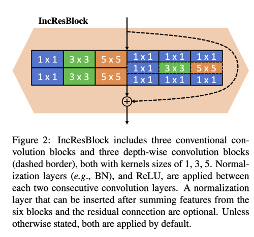  

추가적으로 depth-wise block을 IncResBlock 에 depth-wise convolution layer로 적용하여 성능을 감소시키지 않으면서, 계산비용을 줄여서 mobile device에 배포하기 더 좋게 만들었다.
특히, IncResBlock은 여섯가지의 operation, 두가지 타입이 convolution, 세가지의 서로다른 커널 사이즈를 가지고 있다.

비슷한 total computation cost를 달성하기 위해, 각 연산의 첫번째 convolution layer의 출력 채널 수를 원래 residual block 을 6으로 나눈 값으로 설정하는데, 이는 IncResBlock의 다른 연산수이다. 
저자는 위와 같은 디자인이 성능을 유지할 수 있게 해줌을 발견했다.

Pix2Pix와 CycleGan을 위한 teacher network를 얻기위해 오리지널 모델의 residual block을 모두 IncResBlock으로 대체하였다.
GauGAN에서는 SPADE 모듈과 residual 모듈 모두 대체하였다.

### 2. Search from Teacher Generator via Pruning 
저자의 searching 알고리즘은 두가지 파트로 나뉜다.
주어진 계산 예산에 대해 threshold를 결정하는 것, threshold 이하로 channel을 가지치기 하는 것이다.
현존하는 iterative pruning method와 비교하여, 저자의 방법은 pruning을 한번만 수행하기 때문에 one-step pruning 이라고 부른다.

#### Automatically threshold searching
저자는 batch Normalization 이나 Instance Normalization과 같은 정규화 계층의 scaling factor를 통해서 channel을 pruning 한다.
가지칠 채널을 선택하기 위해서는 threshold 가 필요하다.
regularization 없이 teacher model을 학습시켰기 때문에 teacher model을 sparse 하게 만들 제약이 없다.
정규화 계측의 scaling factor를 늘린다고 해서 모델을 작게 할 수 있다는 보장이 없다.
그래서 이전의 iterative pruning 방법은 메뉴얼하게 디자인한 threshold를 이용해서 channel을 pruning 하였지만, 이는 저자의 네트워크에 적합한 방식이 아니다.

이런 문제를 해결하기 위해, 저자는 MACs 나 latency와 같은 computation budget을 이용하여 threshold를 결정한다.
threshold  보다 작은 scale을 가지고 있는 모든 channel은 pruning 되며, 목표하는 계산 예산을 달성할때까지 걔속된다.

사전에 학습된 teacher model의 정규화 레이어의 scaling factor 들에서 binary search를 통해서 scale threshold를 찾는다.
자세히 말하면, 일시적으로 threshold 보다 적은 scaling factor를 가지고 있는 모든 채널을 prune 한다음에, pruned model에 대해 계산 비용을 계산한다.
만약 이가 budget 보다 더 적다면, 과도하게 가지치기 된 것이므로, 더 작은 threshold를 찾기 위해 도 낮은 간격으로 찾는다.

반대로 larger value 애 대해서는 더 높은 간격으로 찾는다.
이런 과정 중, 저자는 잘못된 모델을 피하기 위해 IncResBlock 외부의 conv layer의 output channel 수는 미리 정의 된 값보다 크게 유지되도록 하였다. 

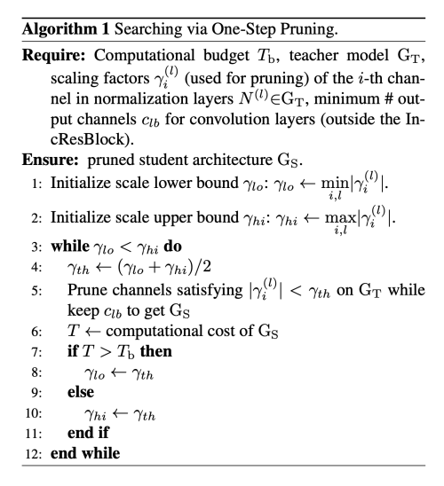  

#### Channel Pruning
IncResBlock이 주어졌을때, 정규화 계층과 상응하는 convolution layer의 channel을 같이 pruning 하기 위해서, 
특히, IncResBlock의 각 operation에 대한 첫 번째 정규화 레이어, 즉 기존 작업의 경우 첫 번째 kxk 컨볼루션 레이어 이후의 레이어와 depth-wise operation의 경우 첫 번째 1x1 컨볼루션 레이어 이후의 레이어를 pruning 한다.

### 3. Distillation from Teacher Generator
student network architecture를 얻고 나서, 먼저 모델을 from scratch 로 학습하여 Knowledge Distillation에서 teacher model을 더 잘 활용할 수 있도록 한다.
저자는 teacher model의 output image를 transfer 하는 것 보다 중간 feature space를 transfer 하는 것이 더 효과가 좋다는 것을 발견했다.

기존의 KD 방법들은 student와 teacher의 feature 간 channel 수를 맞추기 위해 학습가능한 auxiliary layer를 추가하여 학습을 시켰는데, 이렇게 하면 정보가 이 layer에 저장되어 버리는 문제가 생길 수 있다.
이런 information loss를 방지하기 위해 저자는 두 feature space를 직접적으로 비슷하게 만들 수 있는 방법을 제안한다.

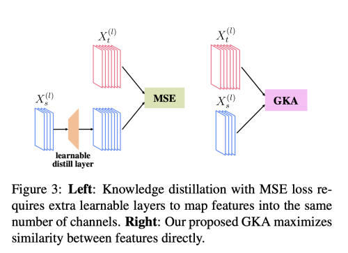

#### Similarity-based Knowledge Distillation
저자는 centered kernel alignment (CKA)를 기본으로 하여 두 매트릭 X(nxp1), Y(nxp2) 의 similarity를 계산한다.

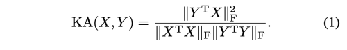  
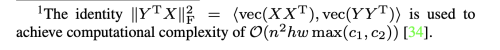  

이는 행의 직교 변환 및 등방성 스케일링에는 변하지 않지만 가역 형변환에는 민감하다. 
p1=hwc1, p2=hwc2 는 다른 값일 수 있다. Kornblith et al. 은 이 식을 사용하여 다양한 length를 가진 다르게 학습된 feature representation의 유사도를 계산하였다.

#### Global-KA
teacher과 student 의 feature 간의 유사도를 계산하기 위해 비슷한 메트릭인 Global-KA(GKA)를 소개한다.

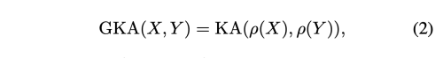  

여기서 로우는 matrix reshape operation으로 nxhwc 를 nhwxc 로 변환한다. 
채널 및 공간 픽셀에 대한 두 배치간의 유사성을 합산하고 배치단위 유사성을 설명하는 CKA와 다르게, GKA는 채널에 대한 유사성을 특징으로 하며, batchwise, spatial-wise 유사성을 특징화한다. 

이 연산의 계산 복잡도는 O(nhw max(c1, c2)^2) 이고, 이는 CKA의 배치 사이즈가 채널 수 보다 많을 때 보다 훨씬 적다. 
이 similarity를 최대화 시키면서 distillation을 수행한다.

#### Distillation Loss
S_kd는 KD를 수행할 layer들의 집합이고, X_t(l), X_s(l)은 teacher와 student의 layer l의 feature tensor를 의미한다.
distillation loss 는 아래와 같다. 

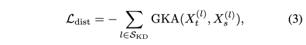  

### 4. Learning

original loss를 사용해서 teacher 모델을 학습시킨다. 

CycleGAN, Pix2Pix 학습 loss는 아래와 같다. 

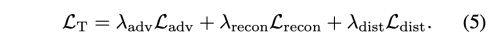  

GauGAN loss는 추가적으로 feature matching loss를 사용한다.

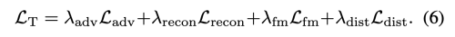  

## Results
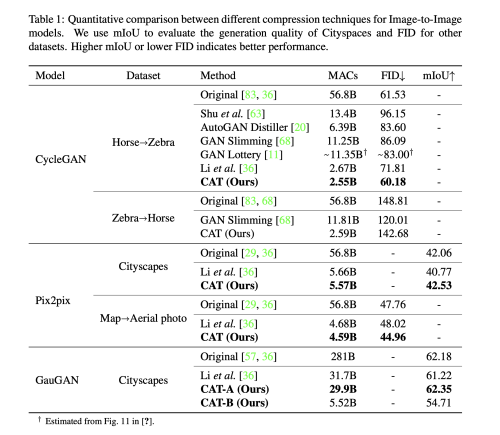  
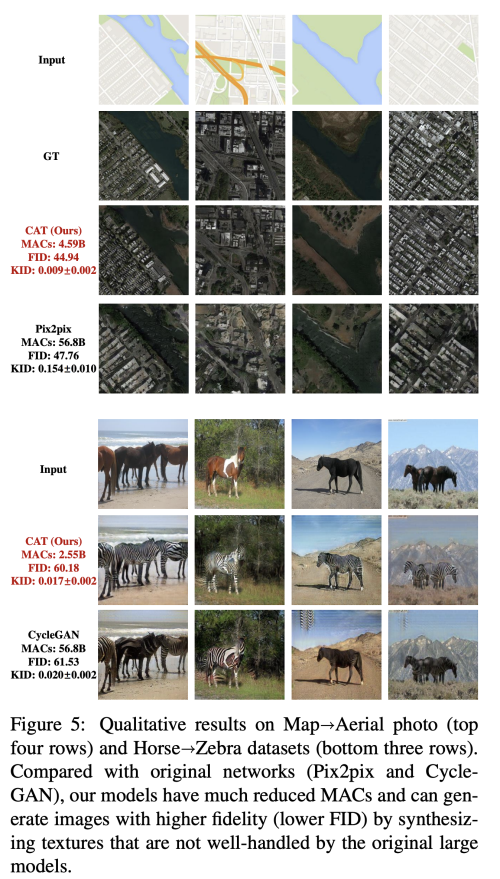  
