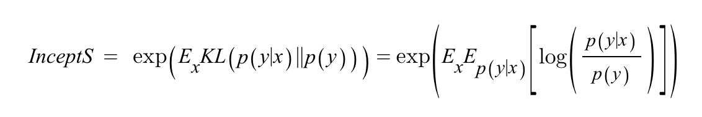
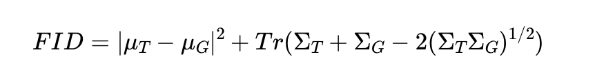

---
layout: post   
title: (Pros and Cons of GAN Evaluation Measures) New Developments      
subtitle: AI Survey       
tags: [ai, ml, computer vision, GAN, GAN Evaluation]   
comments: true
---  

GAN modeling이 놀라운 발전을 이루면서, 새로운 정량적, 정성적 평가 방법이 생겨나고 있다.
비록 Inception Score, Frechet Inception Distance, Precision-Recall, Perceptual Path Length 는 상대적으로 더 유명하지만, 
GAN 평가 법은 아직 정착된 이슈가 아니며, 여전히 많은 개선이 필요하다.
이 논문에서 저자는 모델을 평가할 때 중요해지고 있는 새로운 차원 (편향, 공정성)을 설명하고, GAN 평가와 Deepfake 간의 연관성에 대해 논의한다.
이는 ML 커뮤니티에서 중요한 관심영역이며, GAN 평가의 진보는 이를 완화하는 데 도움이 될 수 있다. 

[Paper Link](https://arxiv.org/pdf/2103.09396.pdf)  

## Background

가장 일반적인 GAN 평가 방법은 Inception Score (IS)와 Frechet Inception Distance (FID) 이다.
이 방법들은 ImageNet 데이터에 학습된 분류기 (InceptionNet)에 의존한다.

### Inception Score 
IS는 생성된 이미지에 대해 Conditional class 분포와 marginal class 분포간의 KL divergence를 계산한다. 
  
* x: generated image
* y: predicted label

여기서 중요하게 보는 metric은 Sharpness와 diversity 이다. 
* Sharpness: classifier가 확신을 가지고 prediction을 한다는 것이고, 이는 conditional distribution p(y|x) 가 low Entropy를 가진다는 뜻이다. 
  * H(Y|X) = p(y|x) log (1/p(y|x)) 가 작은 값을 가져야 한다. 
* Diversity: 샘플의 결과가 다양하게 나오려면 marginal distribution p(y) = sum_i (p(y|x_i)) 가 High Entropy를 가진다는 뜻이다. 

하지만 IS는 클래스 내의 다양성을 포착하지 않으며, label에 대한 사전확률 p(x)에 민감하지 않다.
(ImageNet Dataset과 Inception Model에 편향됨)  
또한, 신뢰하려면 큰 표본 크기가 필요하다.

### Frechet Inception Distance
FID는 생성 모델이 만든 이미지를 다른 네트워크를 가지고 평가하자는 아이디어에서 출발하였다. 
만들어낸 이미지에 대한 feature와 실제 이미지에 대한 feature가 비슷하다면 좋은 모델이라고 말하는 것이 FID의 기본 철학이다. 

저차원의 feature space 에서의 Wasserstein-2 거리를 계산한다. 

  
* T: Real Dataset
* G: Generated Dataset
* Tr: 대각 요소의 합 

보통 Inception V3 네트워크의 중간 layer의 pooled feature 값을 사용한다.
이 feature에서 평균과 공분산을 계산한다.

하지만 FID는 유한 데이터에 대한 기대값이 실제 값이 아니라는 점에서 통계적으로 편향되었다. 
또한 실측분포를 향해서 Wasserstein-2 거리를 측정했기 때문에, Zero-shot generation 이다 domain adaptation 에서의 품질을 평가하는데 부적절하다.

IS와 FID는 generator의 많은 측면을 성공적으로 캡쳐하지만 품질 맟 다양성을 일괄적으로 처리하게 때문에 진단 목적에는 적합하지 않다.
(Precision-Recall 은 이러한 단점을 해결한다. ) 또한, 이들은 계속해서 quality에 대한 사각지대를 가지고 있다. 

### Manual Inspection
GAN을 평가하는 또 다른 일반적인 접근 방식은 수동 검사이다.
이 접근 방식은 직접적으로 우리에게 이미지 품질을 알려줄 수 있지만, 샘플의 다양성을 평가하는 데 한계가 있다.
또한 이는 검토자의 편견이 들어 갈 수 있어 주관적이다.
또한 무엇이 현실적이고, 대상 도메인에 적합하지 않은지에 대한 지식이 필요하기 때문에, 일부 영역에서는 배우기 어려울 수 있다. (의학) 
또한 모델 개발 중 합리적인 시간 내에 검토할 수 있는 이미지 수에 의해 제약을 받는다. 

## New Quantitative GAN Evaluation Measures

### Specialized Variants of Fréchet Inception Distance and Inception Score

#### Spatial FID (sFID)

일반적인 pooled feature를 사용하는 것이 아니라 spatial features를 사용한다.
FID를 계산할때 일반적인 pool3 inception feature 뿐만 아니라 중간의 mixed 6/conv feature map의 처음 7 channel을 같이 사용한다.
왜냐하면 pool3 는 큰범위의 spatial information이 압축되어 있어 spatial 차이에 덜 민감하게 만들기 때문이다.
이러한 이유로 중간의 mixed 6/conv 를 함께 사용하면 spatial distributional similarity도 함께 측정할 수 있다고 본다. 

#### Class-aware FID (CAFD) and Conditional FID
