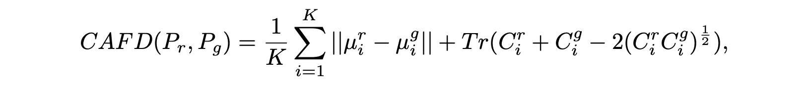
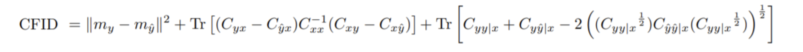
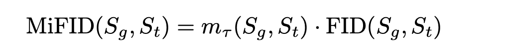
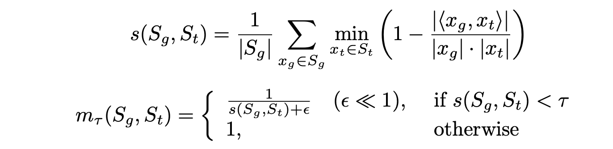
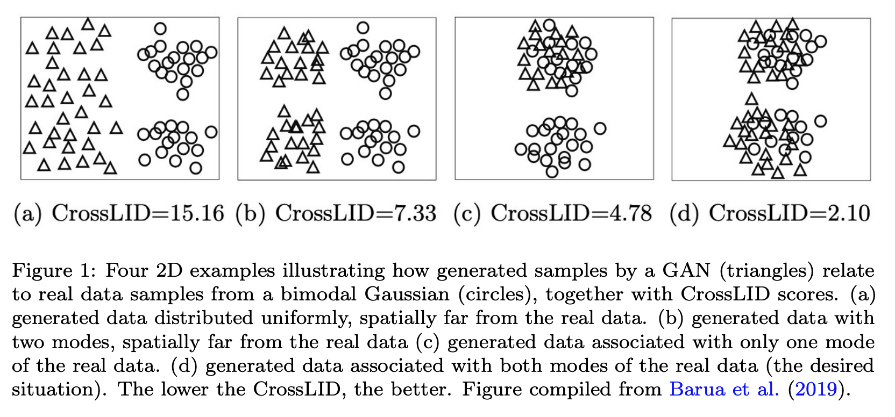
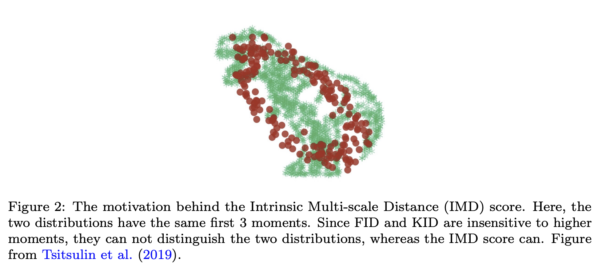

---
layout: post   
title: (Pros and Cons of GAN Evaluation Measures) New Developments      
subtitle: AI Survey       
tags: [ai, ml, computer vision, GAN, GAN Evaluation]   
comments: true
---  

GAN modeling이 놀라운 발전을 이루면서, 새로운 정량적, 정성적 평가 방법이 생겨나고 있다.
비록 Inception Score, Frechet Inception Distance, Precision-Recall, Perceptual Path Length 는 상대적으로 더 유명하지만, 
GAN 평가 법은 아직 정착된 이슈가 아니며, 여전히 많은 개선이 필요하다.
이 논문에서 저자는 모델을 평가할 때 중요해지고 있는 새로운 차원 (편향, 공정성)을 설명하고, GAN 평가와 Deepfake 간의 연관성에 대해 논의한다.
이는 ML 커뮤니티에서 중요한 관심영역이며, GAN 평가의 진보는 이를 완화하는 데 도움이 될 수 있다. 

[Paper Link](https://arxiv.org/pdf/2103.09396.pdf)  

## Background

가장 일반적인 GAN 평가 방법은 Inception Score (IS)와 Frechet Inception Distance (FID) 이다.
이 방법들은 ImageNet 데이터에 학습된 분류기 (InceptionNet)에 의존한다.

### Inception Score 
IS는 생성된 이미지에 대해 Conditional class 분포와 marginal class 분포간의 KL divergence를 계산한다. 
  
* x: generated image
* y: predicted label

여기서 중요하게 보는 metric은 Sharpness와 diversity 이다. 
* Sharpness: classifier가 확신을 가지고 prediction을 한다는 것이고, 이는 conditional distribution p(y|x) 가 low Entropy를 가진다는 뜻이다. 
  * H(Y|X) = p(y|x) log (1/p(y|x)) 가 작은 값을 가져야 한다. 
* Diversity: 샘플의 결과가 다양하게 나오려면 marginal distribution p(y) = sum_i (p(y|x_i)) 가 High Entropy를 가진다는 뜻이다. 

하지만 IS는 클래스 내의 다양성을 포착하지 않으며, label에 대한 사전확률 p(x)에 민감하지 않다.
(ImageNet Dataset과 Inception Model에 편향됨)  
또한, 신뢰하려면 큰 표본 크기가 필요하다.

### Frechet Inception Distance
FID는 생성 모델이 만든 이미지를 다른 네트워크를 가지고 평가하자는 아이디어에서 출발하였다. 
만들어낸 이미지에 대한 feature와 실제 이미지에 대한 feature가 비슷하다면 좋은 모델이라고 말하는 것이 FID의 기본 철학이다. 

저차원의 feature space 에서의 Wasserstein-2 거리를 계산한다. 

  
* T: Real Dataset
* G: Generated Dataset
* Tr: 대각 요소의 합 

보통 Inception V3 네트워크의 중간 layer의 pooled feature 값을 사용한다.
이 feature에서 평균과 공분산을 계산한다.

하지만 FID는 유한 데이터에 대한 기대값이 실제 값이 아니라는 점에서 통계적으로 편향되었다. 
또한 실측분포를 향해서 Wasserstein-2 거리를 측정했기 때문에, Zero-shot generation 이다 domain adaptation 에서의 품질을 평가하는데 부적절하다.

IS와 FID는 generator의 많은 측면을 성공적으로 캡쳐하지만 품질 맟 다양성을 일괄적으로 처리하게 때문에 진단 목적에는 적합하지 않다.
(Precision-Recall 은 이러한 단점을 해결한다. ) 또한, 이들은 계속해서 quality에 대한 사각지대를 가지고 있다. 

### Manual Inspection
GAN을 평가하는 또 다른 일반적인 접근 방식은 수동 검사이다.
이 접근 방식은 직접적으로 우리에게 이미지 품질을 알려줄 수 있지만, 샘플의 다양성을 평가하는 데 한계가 있다.
또한 이는 검토자의 편견이 들어 갈 수 있어 주관적이다.
또한 무엇이 현실적이고, 대상 도메인에 적합하지 않은지에 대한 지식이 필요하기 때문에, 일부 영역에서는 배우기 어려울 수 있다. (의학) 
또한 모델 개발 중 합리적인 시간 내에 검토할 수 있는 이미지 수에 의해 제약을 받는다. 

## New Quantitative GAN Evaluation Measures

### Specialized Variants of Fréchet Inception Distance and Inception Score

#### Spatial FID (sFID)

일반적인 pooled feature를 사용하는 것이 아니라 spatial features를 사용한다.
FID를 계산할때 일반적인 pool3 inception feature 뿐만 아니라 중간의 mixed 6/conv feature map의 처음 7 channel을 같이 사용한다.
왜냐하면 pool3 는 큰범위의 spatial information이 압축되어 있어 spatial 차이에 덜 민감하게 만들기 때문이다.
이러한 이유로 중간의 mixed 6/conv 를 함께 사용하면 spatial distributional similarity도 함께 측정할 수 있다고 본다. 

#### Class-aware FID (CAFD) and Conditional FID
기존의 FID가 single-manifold Gaussian 가정을 했던 반면에 Liu et al. 은 Gaussian Mixture Model (GMM)이 특징 분포에 더 잘맞는다고 가정하고, class information 도 도입하였다.

각 K 클래스에 대해서 Frechet Distance를 구하고 이를 평균하면 CAFD를 구할 수 있다. 
  

Soloveitchik et al. 은 conditional GAN을 평가하기 위해 conditional variant 를 적용하였다. 
두 개의 분포를 갖는 대신, 공통 입력에 대해 조건화된 두 종류의 분포를 고려한다. 
   

#### Fast FID
GAN 훈련을 위한 손실함수로 사용될 수 있도록 계산적으로 다루기 쉽게 만들기 위해 FID 계산 속도를 높이는 방법을 제안하였다.
real data 샘플은 학습 도중에 바뀌지 않기 때문에, 이들의 inception encoding은 한번만 계산된다.
그래서 fake 샘플의 수를 줄이는 것이 inception encoding의 계산 시간을 줄이는 것이다.

하지만 tr((cov(fake)*cov(real))^1/2) 를 구하는 것이 가장 큰 bottleneck 이다. 
그래서 FID는 명시적 tr((cov(fake)*cov(real))^1/2)을 계산하지 않고 이 문제를 피한다.
가짜 샘플 수에 따라 FastFID는 FID 계산속도를 25배에서 500배까지 높일 수 있다. 
또한 역전파를 더 빠르게 만들어 주기 때문에, 매트릭이 아니라 최적화 방법이다.

#### Memorization-informed FID (MiFID) 
FID 점수를 수정하여 훈련 샘플과 너무 유사한 이미지를 생성하는 모델에 불이익을 주었다.
   
* S_g: Generated sample
* S_t: Training sample

m_t는 memorization penalty로 생성 샘플과 실제 샘플 분포의 memorization 거리를 thresholding 하여 패널티를 준다.

 

직관적으로 memorization 거리가 적을 수록 학습 샘플과 생성 샘플간의 거리가 극심하게 멈을 의미한다.  

#### Unbiased FID and IS
FID와 IS는 유한한 샘플을 이용하여 계산하기 때문에, 예상 하는 값으로 편향되어 있어 실제 값이 아니다.
이런 편향은 점수계산에 사용하는 이미지의 수와 generator 자체에 따라 달라지므로 모델간의 객관적인 비교가 어렵다는 것을 발견했다.

이런 문제를 해결하기 위해 무한한 수의 샘플을 이용하여 계산하는 bias-free infinite FID, IS를 제안하였다.

#### Clean FID
FID의 민감성은 일관성이 없고 종종 모델 학습이나 테스트에 서로 다른 이미지 프로세싱 라이브러리를 사용할 때 틀리게 나온다. 
FID score는 generative 모델의 평가에 널리 사용되고 있지만, 각 FID 적용은 서로 다른 low-level image processing 방법을 사용하고 있다.
공통적으로 딥러닝 라이브러리에 사용되는 Image resizing 함수는 artifact를 가져오기도 한다.

FID 계산을 위해 수많은 미묘한 선택이 필요하며, 이런 선택에 일관성이 부족하면, FID의 점수가 크게 달라질 수 있다.
이런 문제를 해결하기 위해 표준화된 프로토콜을 도입하고, CleanFID 라고 사용하기 쉬운 FID evaluation 라이브러리를 제공한다.

#### Frechet Video Distance (FVD)

Video 에 대한 생성 모델을 평가 하기 위해 FID의 확장 버전인 FVD를 개발하였다. 
FVD는 각 프레임에 대한 퀄리티 뿐만 아니라, temporal coherence (시간적 일관성) 를 함께 측정한다.
Video 표현에 대한 적합한 특징을 얻기 위해,  Inflated 3D Convnet을 Kinetics-400, Kinetics-600에 학습시킨 모델을 사용한다.
이 모델은 프레임 시퀀스간의 시각적 content에 대한 temporal coherence를 고려한다.

I3D network는 Inception 모델 구조를 sequential data에 일반화 시킨 모델이며, human-centered Youtube Video로 구성된 Kinetics 데이터셋을 통해서 action-recognition 을 위해 학습된다.

FVD는 비디오들의 분포를 고려하며, 프레임 레벨의 측정 단점을 피할 수 있다. 

비디오 합성 평가를 위한 다른 측정 방법은 Average Content Distance (비디오 연속적인 프레임들간에 평균 L2 distance), Cumulative Probability Blur Detection(CPBD), Frequency Domain Blurriness Measure(FDBM), Pose Error, Landmark Distance(LMD) 등이 있다. 

위에 추가하여 Frechet Audio Distance (FAD)와 Frechet ChemNet Distance(FCD) 또한 음악 강화와 분자 생성 알고리즘을 평가하기 위해 개발되었다.

### Methods based on Self-Supervised Learned Representation

Classification-pretrained Embedding으로 계산하는 FID 점수는 인간 평가와 잘 상관관계가 있는 것으로 나타났다.

하지만, 아는 ImageNet에 편향되어 있기 때문에 오해의 소지가 있다. 
ImageNet  데이터셋이 아닌경우, FID 결과는 부적절하다.

Morozov et al.은 self-supervised learning 방식을 사용하여 non-ImageNet 벤치마크들에 대해서 GAN을 평가 할 수 있는 방법을 제안하였다.
일반적으로 contrastive 또는 클러스터링 기반 접근법을 통해 얻은 표현이 새로운 task나 domain으로우 더 나은 전달을 제공한다는 것을 밝혔다.
따라서, natural image에 대한 보편적인 embedding을 더 잘 전달할 수 있다. 
또한 self-supervised 표현은 보다 합리적인 모델의 순위를 보여주고 종종 FID 샘플 효율설을 향상시킨 다는 것을 보여준다.

### Methods based on Analysing Data Manifold
이러한 방법은 생성 모델에 의해 학습된 표현의 분리를 측정하며, 모델의 일반화, 견고성 및 해석 가능성을 개선하는 데 유용하다.

#### Local Intrinsic Dimensionality (LID)
Barua et al. 은 GAN 생성 샘플에서 발견된 이웃과 관련하여 실제 데이터의 LID를 평가하기 위한 새로운 평가 측정법인 CrossLID를 도입하였다.
직관적으로, CrossLID는 두 데이터 분포의 매니폴드가 서로 일치하는 정도를 측정한다. 
CrossLID의 아이디어는 아래와 같다.

  

이 방법은 다른 측정방법에 비해 더 GAN의 학습 프로세스와 관련이 깊으며, 모드의 붕괴에 대해 더 민감하며, 작은 노이즈나 image transformation에 대해서는 강인하고, 샘플 사이즈에 대해서도 강인하다.
하지만 이 방법은 local dimensionality를 정의하기 어려워서 더 복잡하고 고차원의 데이터에는 적용하기는 애매하다.

#### Intrinsic Multi-scale Distance (IMD)  

현재의 평가 방법들은 분포의 처음 두 모먼트 (mean, covariance) 또는 세번째 모먼트만을 반영한다. 
아래 그림처럼 FID, KID(Kernel Inception Distance) 은 데이터의 global 분포에 민감하지 않다.  
  

IMD은 데이터의 모든 모먼트를 측정에 사용하여 intrinsic(본질적)이면서 multi-scale 하다.
* intrinsic: 변환 또는 회전과 같은 다양체의 등각 변환에는 변함이 없다
* multi-scale: local과 global information 모두 capture 

이 방법은 실험적으로 정렬되지 않은 데이터에서도 데이터 manifold의 구조를 식별하는데 효과적이라는 것이 밝혀졌다.
IMD는 데이터의 geometry에 기반하여 데이터의 분포를 비교한다는 점에서 Geometry Score 과 비슷하다.

Barannikov et al. 은 Cross-Barcode (P, Q)를 개발하였는데, 이는 고차원 공간의 분포쌍이 주어지면, 분포가 집중된 manifold 사이 다중 스케일 토폴로지 불일치를 추적한다.
Cross-Barcode를 기반으로 다양한 토폴로지 발산 점수를 도입하고 이를 적용하여 이미지, 3D 모양, 시계열 등 다양한 영역에서 심층 생성모델의 성능을 평가한다.
이들이 제안한 방법은 도메인에 구애 받지 않으며 사전 훈련된 네트워크에 의존하지 않는다.

#### Perceptual Path Length (PPL)
StyleGAN3 에 처음 도입된 방법으로 PPL은 generator의 latent space가 얼마나 뒤얽혔는지를 측정한다.
직관적으로 덜 curved 한 latent spcae는 상대적으로 많이 curved 한 latent space 에 비하여 지각적으로 부드러운 변환을 만들어낸다.

공식적으로 PPL은 연속적인 이미지 사이의 잠재 공간 Z에서 가능한 모든 endpoints 에 대한 지각 차이의 경험적 평균이다.

   

(하는 중...)

