---
layout: post   
title: Systematic Analysis and Removal of Circular Artifacts for StyleGAN     
subtitle: AI Paper Review       
tags: [ai, ml, computer vision, GAN, Style GAN, Artifacts, Synthetic data, Generated Image]   
comments: true
---  

StyleGAN은 고화질과 진짜 같은 얼굴을 생성하는 SOTA 생성 모델 중 하나이다. 
비록 StyleGAN 모델로 부터 생성된 이미지는 시각적으로 괜찮아 보이지만, 때때로 눈에띄는 circular artifacts를 가지고 있다. 
이 논문에서 저자는 StyleGAN 모델 구조의 다양한 단계에서의 circular artifacts 가 어떻게 생기는 지에 대해 메커니즘 분석과 광범위한 실험을 통해 체계적인 조사 결과를 제공한다. 
StyleGAN에서 원치않는 Artifact를 생성하는 주요 모듈을 강조할 것이다. 
이 조사에서는 왜 이런 artifacts가 circular 하게 생기고 상대적으로 작고, 드물게 2개 이상의 part로 나뉘는 지에 대해 설명한다. 
게다가 저자는 이런 artifacts를 제거할 수 있는 솔루션으로 새로운 pixel-instance normalization layer (PIN)을 제안한다. 

[Paper Link](https://arxiv.org/pdf/2103.01090.pdf)

## Analysis of StyleGAN and Generated Artifacts

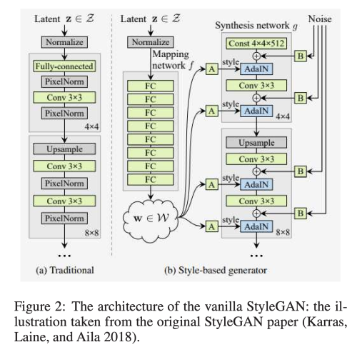  

StyleGAN은 2017년에 제안된 Progressive GAN (PRGAN)의 구조를 사용하여 점차 low-resolution에서 high-resolution 이미지를 생성하도록 하였고, 여기에 몇가지 변화를 주어 합성 할수 있는 네트워크를 만들어냈다.
예를들어, StyleGAN은 잠재공간에서 벡터 대신 학습된 상수를 입력으로 취한다. 생성된 이미지의 변화를 달성핟기 위해 두 가지 새로운 무작위 소스를 사용한다: MLP 매핑 네트워크와 각 컨볼루션 후 노이즈 입력이다.

학습된 affine transformation은 매핑 네트워크의 출력에 적용되며, 이러한 값은 각 resoution에 Adaptive Instance Normalization을 통해 전송할 스타일을 정의하는데 사용된다.
상관관계가 없는 픽셀당 가우시안 노이즈 입력을 추가하여 추가적인 확률적 변동을 명시적으로 도입한다. 이는 학습된 스케일링 계수에 의해 스케일링 된다. 

## A Case Study

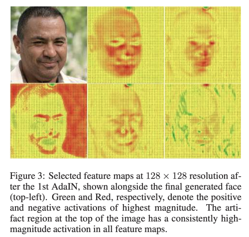  

StyleGAN 으로 생성된 이미지를 보면 윗쪽 부분에 circular artifact 가 생긴 것을 볼 수 있다. 
이런 artifacts 가 어떻게 생성되었는지 보기 위해 128x128 feature map 을 첫번쨰 AdaIN layer 다음 모든 채널에 대해서 시각화 해보았을때 아래와 같은 사항을 관찰할 수 있다.

1. 대부분의 feature energy는 소위 얼굴영역이라고 불리는 object 주변에 분포한다.
2. 모든 feature map 에 대해서 일관되게 반복되는 peak spot 이 있으며, 그 위치는 생성된 얼굴 이미지의 원형 아티팩트와 유사하다. 이러한 위치를 artifact region 이라고 언급한다.

이런 관찰을 확인하기 위해, 전체 feature channel 에 결쳐 feature map 에서 다양하게 선택된 pixel 에 대해 강도를 plotting 해보았다. 

  

(a) background 영역에 비해 face 영역의 강도가 더 큼을 알 수 있다.
(b) artifact 영역을 포함하여 보았을 때 평균적으로 one-order 더 높음을 알 수 있다.
(c) final feature map 에서 이런 현상이 더 강화되어 나타난다. 

artifact region 은 상대적으로 작은 영역이지만, 그 강도는 더 높기 떄문에 모든 layer로 propagation 되기 더 쉽다. 
그래서 StyleGAN은 intermediate feature map 에서 이런 현상이 관측되면 이를 지우거나 없애기 어렵다. 

## Cause of Circular Artifacts

먼저 다음과 같은 주장을 제기하고 그에 상응하는 정당성을 제기할 것이다. 

1. 높은 확률로 intermediate layer은 높은 magnitude를 가진 face region과 일치하지 않는 특정한 region(artifact region)을 가진 feature map을 생성한다. 
2. 높은 magnitude를 가진 artifact region pixel은 down layer로 propagated 된다. 
3. Style GAN 에서 사용하는 Instance Norm(IN) artifact-region의 강도가 facial region 의 강도보다 더 커지게 촉진한다. 

### Claim 1

학습 단계에서 모델은 face feature에 집중하여 학습하고, 정확한 얼굴을 합성하는데 우선순위를 둔다. 
대조적으로 학습된 모델은 학습 데이터의 background 영역과는 관련성이 적다. StyleGAN의 노이즈 주입으로 학습된 모델과 상관 없는 무작위 변수를 도입하여 모든 채널에 걸쳐 얼굴 영역이 아닌 부분의 특징맵에 다양한 분산을 가진 무작위성을 유도한다.
더욱이 StyleGAN 구조는 512 channel 까지 증가하기 때문에 높은 확률로 몇몇 feature map은 이런 높은 magnitude를 가진 영역을 가질 수 있다. 

실험을 통해서 2번째 AdaIN 을 통과한 초기 단계의 feature map 에서 artifact 영역은 몇몇의 채널에서만 극히 크지만 다른 곳에서는 작게 sparsely random 하게 분포한다.
대조적으로 얼굴 영역의 크기는 모든 채널에 걸쳐 상대적으로 작은 분산을 가진다. 

저자는 높은 magnitude의 artifact 채널이 무작위 input 에 의해 초기화 되었다고 추측한다. 
추측을 검증하기 위해 latent vector에 서로 다른 random noise input을 적용하여 StyleGAN 이미지를 생성하였다. 

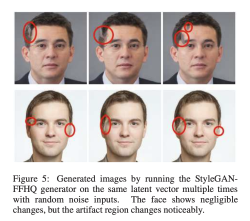  

오직 noise input 만 다르게 했는데 서로 다른 artifact 위치를 가짐을 볼 수 있다. 
실험 결과를 보아서 artifact는 학습된 generator로 부터 오는 것이 아니라, input의 random noise 로부터 온다는 것을 알 수 있다. 

### Claim 2

마지막 layer 에서는 이런 artifact region 에 대한 강도가 더욱 강하게 나타남을 관찰 할 수 있었다.
이로써 우리는 랜덤하게 sparse 하게 생성된 artifact가 마지막 layer 까지 전파되어 마지막으로 circular artifact를 생성함을 추측할 수 있다.

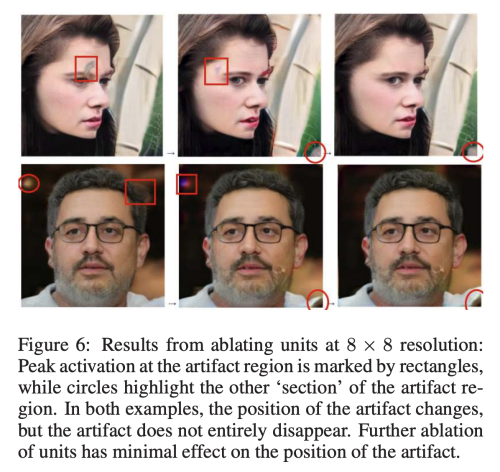   
얼굴에 대해 훈련된 GAN의 특정 숨겨진 유닛이 생성된 이미지에 어떻게 영향을 미치는 지 시각화 할 수 있는 GANDissect 프레임워크를 사용하였다. 
활성화 크기가 높은 채널이 몇개 밖에 없기 때문에 artifact 영역에서 최대 활성화로 Conv 단위를 제거할 수 있다. 
위에서 살펴본 요인을 배재하기 위해 Noise 없이 StyleGAN을 학습시켰다. 

위 그림은 8x8 resolution unit을 제거하였을 때 결과이다. 
이로써 우리는 하나의 single conv unit을 제거함으로써 생성되는 artifact의 위치를 변경하기에 충분하며, 이러한 패턴은 심지어 매우 초기단계에 기인한다는 것을 알 수 있다.
추가적인 high magnitude를 가진 conv unit을 제거하였을 때 새로운 위치의 artifact 가 생기고 비슷한 위치로 옮겨지는 것을 알 수 있었다.
artifact의 위치가 변하기는 하지만 artifact가 완전히 없어 지지 않으며, 더 많은 unit을 삭제하는 것 또한 artifact의 위치 변화에 거의 영향이 없음을 관찰 할 수 있다. 

이로써 여러 채널이 함께 singe artifact를 생성하는 것을 알 수 있다. 

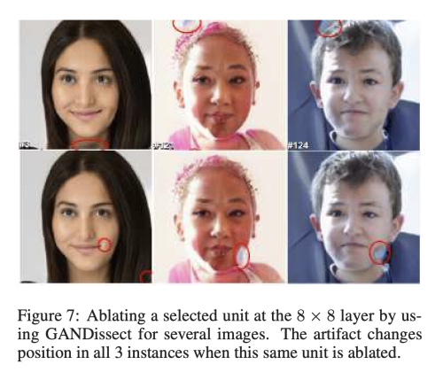   

실험 결과를 통해서 final artifact region에 대해서 똑같은 unit이 높은 활성화를 갖는 것을 관찰 할 수 있다. 

위 그림은 특정한 unit을 제거하는 것이 여러 이미지에 대해 마지막 artifact를 위치를 변화시킬 수 있음을 보여준다.
저자는 artifact는 가장 큰 magnitude를 가진 artifact region을 가진 unit에 의해 결정된다고 본다.

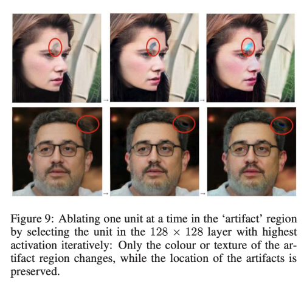   

위 그림을 통해서 128x128 layer 에 있는 가장 높은 활성화를 가지는 하나의 unit을 순차적으로 삭제했을 때, artifact의 위치는 변화하지 않고, 그 texture나 색상만이 변함을 관찰 할 수 있다. 

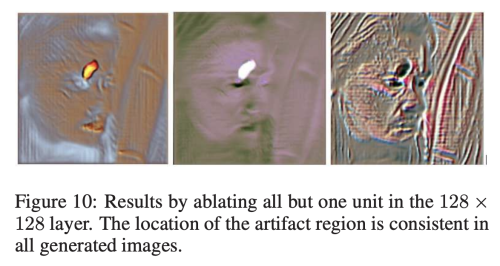  

위 그림에서는 반대로 하나를 제외하고 모든 unit을 제거했을 때의 결과인데, 여젼히 artifact가 같은 위치에 존재하고 있음을 관찰할 수 있다. 

이것은 가장 두드러진 artifact가 generator의 더 깊은 곳에서 더 많은 unit으로 확산하는 것을 보여주는데, 해당 강도는 AdaIN의 mean, variance 에 따라 달라진다. 

### Claim 3

lxl intermediate feature map이 있다고 했을 때, highest magnitude를 가진 pixel set S1 이 al^2 (a<0.5) 라고 했을 떄, 
나머지 low magnitude 를 가진 pixel set S2를 (1-a)l^2  라고 하자.

각 pixel set S1 과 S2 의 mean & variance를 m1>0, sigma1, m2>0, sigma2 라고 할때 아래의 식이 성립한다. 

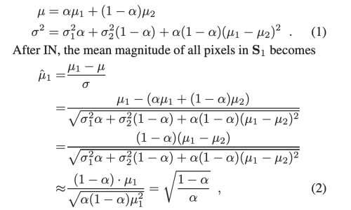  

여기서 |m2| << |m1|, sigma1, sigma2 << |m1| 라고 가정하면,  
mean이 a의 함수로써 단조롭게 감소하고, m1은 high-magnitude region 이 작을 때, 매우 크게 증가한다. 

## Proposed Solution for Artifact Removal

Batch Instance Normalization에 영감을 받아서 저자는 새로은 pixel instance normalization (PIN) 을 제안한다. 
이는 IN 과 PN 사이 균형을 맞춘 방법이다. 
PIN은 StyleGAN의 circular artifact를 제거하기 위해 고안된 방법이다. 

Pixel Normalization 방법은 아래와 같다. 

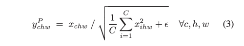  

StyleGAN 에서 사용하는 Instance Normalization 은 아래와 같다. 

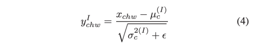   
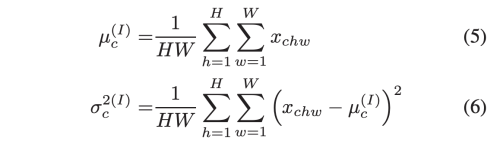   

PIN은 PN과 IN의 weighted combination 이다.

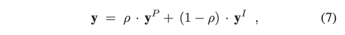   

여기서 p는 0-1 사이의 값이고, dot은 channel-wise product를 뜻한다. 

