---
layout: post   
title: Coordinate Attention for Efficient Mobile Network Design     
subtitle: AI Paper Review       
tags: [ai, ml, computer vision, Mobile Network, Attention Module, Light Weight]     
comments: true  
---  

최근 모바일 네트워크 디자인은 channel attention 을 이용해서 모델 성능을 높이는데 많은 효율성을 보여왔다. 
하지만, 이것들은 일반적으로 공간 선택적 attention map을 생성하는데 중요한 positional 정보를 무시한다. 
이 논문에서, 저자는 embedding positional information을 channel attention에 적용하는 모바일 네트워크를 위한 새로운 attention 메커니즘인 Coordinate Attention 을 제안한다. 
2D Global Pooling을 통해 feature tensor를 단일 feature vector로 변환하는 channel attention 과는 달리, coordinate attention 은 channel attention 을 
두 공간 방향을 따라 feature를 각각 집계하는 두 개의 1D feature encoding process로 분해한다. 
이 방법을 통해 긴 범위에 걸친 의존성은 하나의 spatial direction을 따라 캡쳐되고 반면에 정확한 positional information은 다른 spatial direction을 따라 보존된다. 
결과 feature map은 각각 분리되어 direction-aware과 position-sensitive attention map으로 인코딩되어 관심 객체의 표현을 증가시키기 위해 input feature map에 보완적으로 적용될 수 있다. 
저자의 coordinate attention은 간단하면서도 추가적인 오버헤드 없이 일반적인 mobile network에 유연하게 적용되어 들어갈 수 있다. 
여러 실험을 통해서 저자의 coordinate attention은 ImageNet Classification 에 효과적일 뿐만 아니라 다른 object detection, semantic segmentation 등의 많은 task에 효과적임을 밝혔다. 

[Paper Link](https://openaccess.thecvf.com/content/CVPR2021/papers/Hou_Coordinate_Attention_for_Efficient_Mobile_Network_Design_CVPR_2021_paper.pdf)  
[Code Link](https://github.com/houqb/CoordAttention)   

## Related Work

### Mobile Network Architecture
최근 SOTA 모바일 네트워크는 대부분 Depthwise separable convolution 이나 inverted redisual block 을 기반한다. 
HBONet은 각 inverted residual block에 down-sampling 연산을 적용하여 spatial information 표현을 모델링하였다. 
ShuffleNetV2 는 channel split 모듈과 channel shuffle 모듈을 inverted residual block 전후에 사용하였다. 
MobileNetV3 는 NAS 를 사용하여 최적의 activation function 과 각 depth 별 inverted residual block의 expansion ratio 를 찾았다. 
게다가 MixNet, EfficientNet, ProxylessNAS 는 또다른 searching 알고리즘을 사용하여 DSConv 의 최적의 kernel 사이즈와 expansion ratio, input resolution, depth, width 를 찾았다. 
최근에는 심층적으로 depthwise separable convolution을 활용하는 방법을 재고한 MobileNeXt 제안되었다. 이는 모바일 네트워크를 위한 고전적인 병목구조를 채택한다. 

### Attention Mechanisms

Attention 메커니즘은 다양한 computer vision task 에서 도움이 되고있다.
성공적인 예시 중 하나는 SENet 으로 채널 간의 상호 의존성을 효율적으로 구축하기 위해 각 2D feature map 을 squeeze 한다. 
CBAM 은 대형 커널이 있는 컨볼루션을 통해 spatial information을 인코딩하는 아이디어를 도입하여 더욱 발전시켰다. 
후에는 GENet, GALA, AA, TA 등의 아이디어는 서로 다른 spatial 메커니즘이나 디자인을 사용하여 attention block을 발전시켰다. 

Non-local/Self-Attention 네트워크는 spatial 또는 channel-wise attention에 대한 능력으로 최근 많이 사용되고 있다. 
NLNet, GCNet A2Net, SCNet, GSoP-Net, CCNet 등의 예제들은 모두 non-local 메커니즘을 사용하여 서로 다른 타입의 spatial information을 캡쳐한다. 
하지만 self-attention 모듈의 많은 계산 비용 때문에 이방법은 큰 모델에 많이 사용되고 작은 모바일 모델에는 적합하지 않다. 

이런 접근 방식과 다르게 저자의 접근 방식은 positional 정보와 channel-wise 관계를 더욱 효율적으로 캡쳐하여 모바일 네트워크에서 feature의 표현능력을 더욱 증대시킬 수 있다. 

2D global pooling operation을 두개의 one-dimensional encoding process 로 factorizing 함으로써, attention 방법을 사용한 다른 light weight 모델에 비해 더 좋은 성능을 보였다. 

## Coordinate Attention

Coordinate Attention block은 모바일 네트워크에서 학습된 feature 의 표현력을 향상시키는 것을 목표호 하는 계산 단위로 볼 수 있다. 

* input X = {x1, x2, ..., xc}
* output Y = {y1, y2, ..., yc} is shame size to X

### Revisit Squeeze-and-Excitation Attention
일반적인 convolution 은 그 자체로 채널간의 관계를 모델링 하기 어렵다., 
채널 상호 의존성을 명시적으로 구축하면 최종 분류 결정에 더 많은 기여를 하는 유익한 채널에 대한 모델 민감도를 높일 수 있다. 
더욱이 Global Average Pooling 은 convolution 만으로는 부족한 모델이 global information을 캡쳐하는데 도움을 준다. 

SE block은 두가지 스텝인 Squeeze and exitation 으로 나누어 볼 수 있다. 이는 global information 임베딩과 channel 관계를 adaptive 하게 recalibration 하기 위해 디자인 되었다. 

c-th channel에 대한 squeeze step 은 아래와 같이 공식화 할 수 있으며, 이는 global information을 collectiong 한다. 

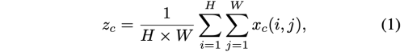  

두번째 step 은 excitation step 으로 channel-wise 의존성을 캡쳐한다. 
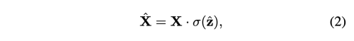  
여기서 dot은 channel-wise multiplication 이고, sigma는 sigmoid function을 나타낸다. 
여기서 z는 아래와 같은 함수를 통해 생성한 결과이다. 
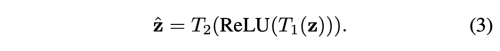  
여기서 T1, T2는 linear transformation으로 각 channel 의 종요성을 capture 하기 위해 학습된다. 

SEBlock 은 최근 mobile network에 널리 사용되고 있으며 SOTA 성능을 내기 위한 중요한 요소로 증명되었다. 
하지만, 이는 오직 channel 간의 관계에 대한 중요성만을 reweighting 해주는 역할이기 때문에 공간 선택적 feature map을 생성하는 데 중요한 positional information은 무시한다. 

### Coordinate Attention Blocks
저자의 coordinate attention 은 channel 간의 관계와 상세한 positional 정보를 가진 long-range 의존성을 함께 인코딩하는 두 가지 스텝으로 이루어졌다. 
1. Coordinate Information Embedding
2. Coordinate Attention Generation

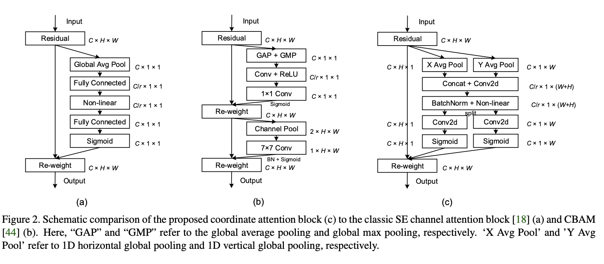  

#### Coordinate Information Embedding
Global Pooling 은 종종 channel attention에서 spatial information을 globally 하게 인코딩하게 위해 사용하지만, global spatial information을 channel descriptor로 압축하기 때문에
spatial 구조를 캡쳐해야하는 vision task에 필수적인 positional information을 보존하기 어렵다. 
attention block이 정확한 위치 정보를 사용하여 장거리의 상호작용을 공간적으로 캡쳐하도록 유도하기 위해, 저자는 global pooling을 한쌍의 1D feature encoding operation으로 factorize 하였다. 

저자는 두가지 spatial 범위의 kernel (H, 1), (1, W)을 사용하여 각 채널에 대해 수작, 수평 coordinate로 각각 인코딩한다. 
그래서 c-th channel의 output은 각각 아래와 같디. 

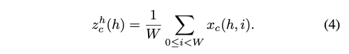    
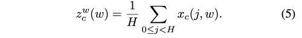   

위 두 변환은 각각 두 공간 방향을 따라 특징을 집계하여 한쌍의 방향 인식 특징맵을 생성한다. 
이는 단일 특징 벡터를 생성하는 channel attention 방법에서의 Squeeze operation 과는 다소 다르다. 
이런 두 가지 변환은 Attention block이 한 공간 방향을 따라 장거리 의존성을 포착하고, 다른 공간 방향을 따라 정확한 위치 정보를 
보존할 수 있게 네트워크가 관심 대상을 더 정확하게 찾는데 도움을 준다.

#### Coordinate Attention Generation

위의 식들은 global한 수용 필드를 가능하게 하고 정확한 positional 정보를 인코딩하게 해준다., 
이런 풍부한 정보에 대한 장점을 이용하기 위해, 저자는 두번째 변환인 coordinate attention generation 을 도입하였다. 
저자의 디자인은 다음의 세가지 기준을 참조한다. 
우선 새로운 변환은 매우 간단하면서, 모바일 환경에 적합하기 위해 매우 저렴한 계산비용으로 가능하여야 한다.
또한 positional 정보를 충분히 다 활용하여 정확하게 우리가 관심있는 영역을 하이라이팅 할 수 있어야 한다. 
또한 채널간의 관계성을 캡쳐하여, 현존하는 연구 방법처럼 효율적이여야 한다. 

이를 위해 먼저, 위에서 생성한 feature map 들을 concat 하고, 1x1 conv transformation인 F1을 적용한다. 

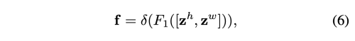  

delta는 non-linear activation function을 뜻하고, f는 C/r x (H+W) 사이즈를 가진다. 
r은 reduction ratio로 block size를 컨트롤한다. 
그 다음 f를 spatial dimension에 따라 두가지 tensor로 분리한다. 

* f_h = C/r x H
* f_w = C/r x W

또다른 두가지 1x1 convolution 인 F_h, F_w 를 사용하여 위의 f_h, f_w를 input X와 같은 channel 수로 변환한다. 
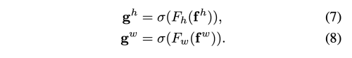  

여기서 sigma는 sigmoid function을 뜻한다. 
모델 복잡도를 줄이기 위해 저자는 f의 channel number를 줄이는 reduction ratio를 사용한다 (r=32) 

최종 attention weights를 사용한 output은 아래와 같다. 

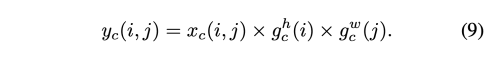  

### Implementation

이를 MobileNetV2와 MobileNeXt 에 적용한 그래프는 아래와 같다. 
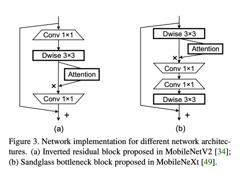  

## Results

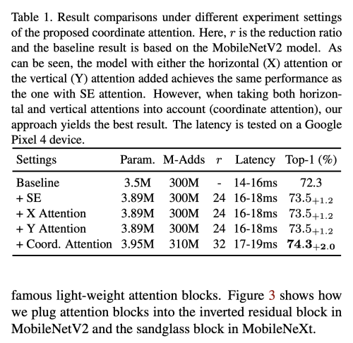  
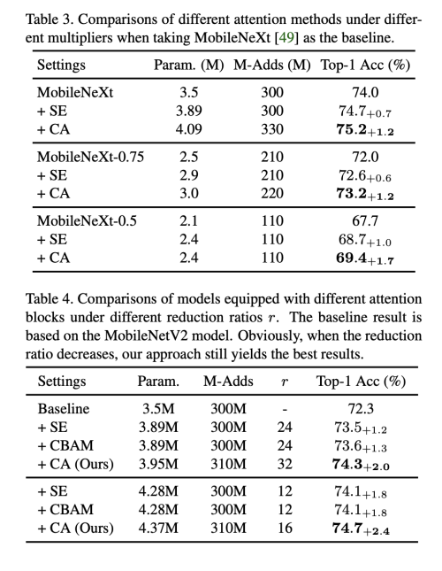  
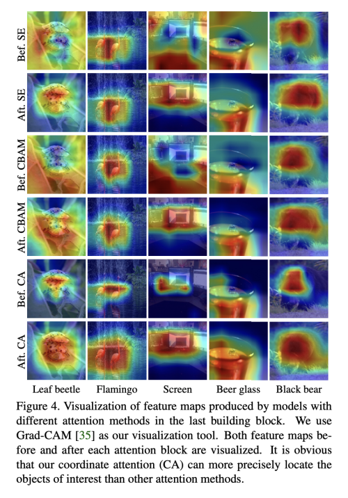  
