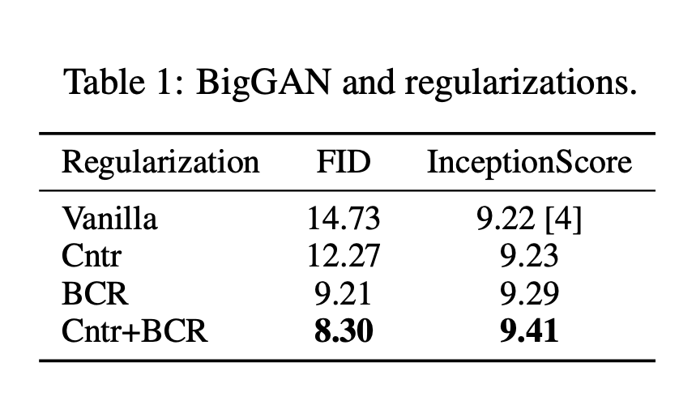

---
layout: post   
title: Image Augmentations for GAN Training       
subtitle: AI Paper Review       
tags: [ai, ml, computer vision, GAN, Data augmentation]       
comments: true  
---  

Data Augmentation 은 분류기의 강인성과 정확도를 향상시키기 위해 넓게 연구되어 왔다. 
하지만 이전 연구에서 이미지를 합성하는 GAN 모델의 성능 개선을 위한 image augmentation의 잠재성에 대한 연구는 되지 않았다. 
이 논문에서 저자는 GAN 학습을 위한 다양한 augmentation 테크닉에 대해 다양한 셋팅으로 테스트하며 그 효율성을 보여준다. 
그리고 vanilla GAN과 regularization과 함께 쓴 GAN 모델에 대해서 어떻게 이미지를 augment 해야 GAN 으로 생성된 이미지의 충실도가 상승하는 지 가이드라인과 인사이트를 제공한다.  
놀랍게도 저자는 GAN으로 생성된 이미지와 real 이미지 모두에게 augmentation을 사용하였을때 잠재적으로 생성 성능이 SOTA 성능보다 향상됨을 밝혔다. 
이런 GAN 학습 방법이 다른 augmentation-based regularization 테크닉 (contrastive loss, consistency loss) 과 함께 사용되면 생성된 이미지의 퀄리티를 더욱 높일 수 있다. 
저자는 CIFAR-10 데이터에서 consistency loss, contrastive loss 그리고 추가적인 regularization과 함께 conditional generation을 수행했을 때 새로운 SOTA 성능을 제공함을 밝혔다. 

[Paper Link](https://arxiv.org/pdf/2006.02595.pdf)  

## Augmentations and Experiment Settings

### Image Augmentations
우리의 목표는 어떻게 각 이미지에 대한 operation이 GAN 셋팅에서 작용하는지 조사하는 것이다.
그래서 augmentation을 바꾸지 않고 10 개의 베이직한 image augmentation operation 들과 , 추가로 3 개의 진보된 이미지 augmentation 테크닉을 선택하였다. 

  

오리지널 이미지 I_0 (H, W) 을 pixel range [0-1]로 normalize 하였다. 
각 augmentation t~T 에 대해서 강도 lambda_aug 는 uniformly 하게 선택하였다. 
t(I_0)은 augmentation을 수행한 이미지를 나타낸다. 

### Data
모든 augmentation 전략들을 CIFAR-10 dataset (60K images, 32x32, in 10 classes)에 대해 테스트하였다. 
이 데이터셋의 사이즈는 large scale GAN 모델 연구에 적합하기 때문이대. 이 작업을 위해 저자는 50K는 학습에, 10K는 검증에 사용하였다.

### Evaluation metric
FID를 정량적인 평가를 위해 사용하였다. better FID가 항상 더나은 이미지 품질을 의미하지 않는 다는 것은 인정하지만, FID는 많은 GAN 검증에 널리 사용되고 사람들의 평가에 일관성있게 작용한다는 것은 검증됬기 때문이다.
각 실험에서 랜덤한 seed를 사용하고 모든 run들을 통합하여 학습된 모델 중 FID 가 top 15%에 랭크된 모델을 report 하였다. 
FID는 test set에서 계산되었다.

### GAN architectures and training hyperparameters

GAN의 search space는 매우 크다. 저자의 주요목적은 다른 augmentation 전략에 대한 평가이기 때문에 일반적으로 사용하는 두가지 셋팅과 GAN 구조인 unconditional image generation SNDCGAN과 conditional image generation BigGAN을 사용한다.
이전의 연구처럼, 저자는 SNDCGAN을 batch size 64, total training step 200K로 학습하였다.
BigGAN은 batch size 256, training step 100K를 사용하였다. 
모든 실험에는 hinge loss를 사용하였다.

첫번째 연구에서는 추가적인 regularization을 사용하지 않고 그다음에 추가적인 regularization인 consistency regularization, contrastive loss를 사용하여 augmentation을 utilize 하였다.

## Effect of Image Augmentations for Vanilla GAN

먼저 기존에 사용된 이미지 augmentation 효과를 연구하기 위해 real image 만을 augmentation 하였다.
그다음 discriminator에 fed 하기 전에 real과 generated image 모두 augmentation 하는 새로운 방법을 제안한다.
이는 GAN performance를 상당히 증진시킨다. 

### Augmenting Only Real Images Does not help with GAN Training

 

위 실험 결과를 통해서 저자는 GAN 에서 real image 만을 augmentation 하는 것은 강도나 전략에 상관없이 FID를 악화시킨다는 것을 발견하였다. 

예를들어, 아무 augmentation을 하지 않은 SNDCGAN의 baseline은 FID 24.73을 달성하였지만, 가장작은 강도로 translation을 수행하였을 때만 해도 31.03 FID가 되었다. 
더욱이 FID는 augmentation의 강도를 증가시킬 수록 더욱 악화되었다. 
이 결론은 전통적인 이미지 augmentation이 광범위하게 GAN 에서 채택되고 있다는 점을 감안할 때 매우 놀라운 것이다. 
이러한 경우 Discriminator가 augmentation 한 데이터를 데이터 분포의 일부로 볼 가능성이 높다는 것에 주목한다. 
이는 generated image가 augmentation artifact를 포함하고 있다는 점으로 증명할 수 있다. 
FID는 generated image와 unaugmented real image 간의 feature distance를 계산한 것이기 때문에, generated image의 augmented artifact가 FID를 악화시킨다고 믿는다. 

### Augmenting Both Real and Fake Images Improves GANs Consistency 

위의 관찰 결과에 기초하여, generated image에 똑같은 방식으로 augmentation을 수행하여 discriminator에 통과하면 어떤 결과가 나올지 궁금해진다.
이런 방식으로는 augmentation artifact는 real과 fake 이미지를 구분하는데 사용되지 않을 것이다. 

합성 이미지에 대한 augmentation을 평가하기 위해, 저자는 SNDCGAN과 BigGAN을 real image와 generated image 모두에 augmentation을 수행하여 discriminator에 fed 하였다.
real image에 대한 augmentation과 다르게, 저자는 generated image에 augmentation 할때 Gradient를 유지하여야 한다. 
Discriminator 는 t(I_real)과 t(G(z)) 의 차이를 구별하도록 학습된다. 

 

위의 실험 결과를 통해서 다양한 augmentation과 서로다른 강도의 augmentation 전략은 FID를 매우 크게 향상시킨다. 

그래서 real과 fake 이미지 모두 augmentation을 수행하는 것이 GAN 의 성능을 개선하는데 큰 도움을 줄 수 있다는 결론을 내릴 수 있다. 

또한, translation, zoomin, zoomout이 다른 operation 들에 비해 훨씬 효과적인 성능을 낼 수 있음을 밝혔다. 
이로써 공간 변화를 초래하는 augmentation이 대부분의 단순한 시각 변화를 유도하는 augmentation 보다 GAN의 성능을 더 향상시킨다는 결론을 내렸다. 

### Augmentations Increase the Support Overlap between Real and Fake Distributions
왜 real과 fake 이미지 모두에 augmentation을 수행해야 GAN의 성능을 향상시킬 수 있는지 이유에 대해 조사하였다. 
간단하게 말하면, GAN의 목적은 generated image의 분포가 real image의 분포와 비슷하게 만드는 것이다.
하지만, 이전 연구에서 언급한 바와 같이, GAN을 훈련하는 것의 어려움은 겹치지 않는 이 두가지 centerated 분포에서 비롯된다.
real image 분포는 종종 저차원 매니폴드 또는 그 주변에 집중된다고 가정되며, 유사하게 생성된 이미지 분포는 이 구성에 의해 퇴화한다.
그래서 instance noise를 augmentation으로 추가하여, real image와 fake image 간의 distribution에 대한 overlapping을 증가시키려는 시도가 있었다.
다른 이런 semantic-preserving augmentation은 모두 이러한 효과를 얻으려고 한 것이다.

 

위 결과에서 볼 수 있듯이 augmentation을 수행할 수록 real과 fake 간의 분포가 점점더 겹침을 볼 수 있다. 
하지만 모든 augmentation이나 강도가 생성된 이미지의 품질을 높이는 것은 아니다. 
몇몇 적용은 오히려 natural image의 분포와 더욱 멀게 하여 더 안좋은 결과로 이끌 수 있다. 

## Effect of Image Augmentations for Consistency Regularized GANs

이제 augmentation을 사용하여 더 진보된 regularized GAN을 세울 수 있다.
Consistency Regularized GAN (CR-GAN) 은 GAN의 학습 안정성과 생성 품질을 높일 수 있다.
Balanced Consistency Regularization (BCR) 을 real과 fake 이미지 모두에 적용하였다.

  
  

BCR 강도는 10으로 하여 알고리즘을 적용하였을때, 결과가 Figure 3, 5의 bcr 결과이다. 
이 결과를 통해서 Consistency regularization을 augmentation에 적용하였을때 generation 품질을 더 높일 수 있다는 결론을 낼 수 있다. 

더욱 중요하게 SOTA 성능을 내기 위해서는 augmentation type 과 같도를 신중하게 선택하여야한다. 
SNDCGAN은 zoomout 을 0.4 강도로 하였을때 best 였고, BigGAN 에는 translation을 0.4 강도로 하였을 때 best 였다.

이전에 언급했던 것과 같이 augmentation 테크닉은 크게 두 그룹으로 나눌 수 있다.
* spatial transformation: zoomout, zoomin, translation, translationx, translationy, cutout, cutmix
* visual transformation: brightness, redness, greenness, blueness, mixup

실험 결과 spatial transformation을 BCR과 함께 사용할 때 성능이 좋음을 밝혔다. 
추가로 instance noise는 GAN의 학습에 안정성은 줄 수 있으나, 생성 품질을 좋게 하지는 못했다.

## Effect of Images Augmentations for GANs with Contrastive Loss
Image augmentation은 Contrastive Learning의 필수 요소로, self-supervised learning에서 좋은 성능을 낼 수 있게 한다. 
저자는 어떻게 contrastive loss (CntrLoss)를 적용하여 GAN 학습을 regularizing 하는 지 설명한다.
그리고 Cntr-GAN 의 성능이 어떻게 서로다른 augmentation에 대해 영향을 받는 지 분석한다. 

### Contrastive Loss for GAN Training

contrastive loss는 positive pair은 서로 당기고 negative pair은 서로 밀어내게끔 하는 방식이다.
Cntr-GAN은 real, fake 이미지 모두에 대해 랜덤하게 augment 하여 discriminator을 regularize 한다.
CntrLoss는 discriminator가 다른 image representation은 떨어지게 하고, 동일한 이미지의 augmentation 들에 대해선 가깝게 한다.

  
  

CntrLoss는 large batch size를 선호하기 때문에 더 큰 capacity를 가지고 있는 모델인 Big-GAN에 테스트 하였을 때 결과는 위와 같이 더 좋은 성능으 ㄹ내었다.

Cntr과 BCR 모두를 사용하였을 때, 훨씬 더 좋은 성능을 냄을 밝혔다. 
이때 강도는 Lambda_Cntr = 0.1, lambda_bcr = 5 이다.

### Cntr-GAN Benefits From Stronger Augmentations
전반적으로 Cntr-GAN 이 BCR-GAN 보다 더 강력한 augmentation을 선호한다는 것을 발견하였다.
Spatial Augmentation은 여전히 visual augmentation 보다 더 잘 작동하며, 이는 simclr의 color jittering 강도를 변경하는 것이 성능향상에 도움 될 수 없다는 저자의 관찰과 일치한다.
아래 결과에서 저자는 Cntr-GAN 에 도움되는 다른 대표적인 augmentation 방법과 함께 simclr에서 crop/resize 조정 강도를 변경한 결과를 제시한다.
대부분의 augmentation은 CntrGAN은 약 0.5 정도의 높은 강도에서 최고 성능에 도달한다.

  
