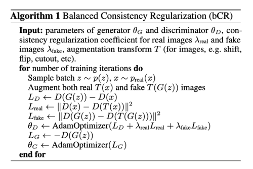
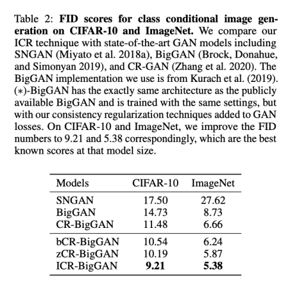

---
layout: post   
title: Improved Consistency Regularization for GANs         
subtitle: AI Paper Review       
tags: [ai, ml, computer vision, GAN, Consistency Regularization]       
comments: true  
---  

최근 consistency cost를 discriminator에 적용함으로써 GAN의 성능이 발전해 왔다. 
저자는 이 테크닉을 몇가지 방법으로 개선시켰다. 먼저 consistency regularization은 GAN 샘플에 artifact가 어떻게 생기는지 소개하고 어떻게 이를 고칠 수 있는지 설명한다.
그다음 consistency regularization에 몇가지 수정을 더해 성능을 개선할 수 있는 방법을 제안한다.
저자는 수많은 실험을 거쳐서 정량적으로 이 방법이 성능을 향상시킬 수 있음을 증명한다.
CIFAR-10, CelebA 데이터셋에서의 unconditional image 합성이 다양한 GAN 구조에서 최고의 FID 성능을 냄을 주장한다.
CIFAR-10 에서의 conditional image 함성에서는 SOTA 성능을 내었다.
마지막으로 ImageNet-2012 데이터셋에서 BigGAN 모델에 이 방법을 적용했을때 FID score가 6.66 에서 5.38로 크게 개선 되었음을 보여준다. 

[Paper Link](https://arxiv.org/pdf/2002.04724.pdf) 

## Improved Consistency Regularization

semi-supervised 또는 unsupervised learning 에서 consistency regularization 테크닉은 매우 효율적이며, 최근에 널리 사용되고 있다.
이 테크닉 뒤의 직감은 모델 학습에 모델이 input과 의미론적으론 같은 augmentation에 대해서 일관된 예측을 하는 것과 같은 몇몇의 사전지식을 encode 하는 것이다. 

augmentation(transformation)은 flipping, rotating, sentence back-translating, adversarial attact 등 많은 형식을 취할 수 있다.

불일치성에 패널티를 가하는 것은 쉽게 L2 loss 가 instance pair 에 대해 또는 KL-Divergence 가 분포에 대해 최소화 되는 것을 달성할 수 있다. 
GAN 문헌에서 Wei et al. 은 WGAN 훈련을 개선하기 위해 Lipshitz 연속성 고려사항에서 파생된 consistency term을 제안한다.
최근에는 CR-GAN은 discriminator에 consistenct regularization을 적용하고 상당한 개선을 달성하였다.

아래에서는 GAN의 성능을 개선하고 CR을 일반화 시킬 수 있는 저자의 새로운 두가지 테크닉 bCR, zCR을 설명한다. 
저자는 두가지 모두를 섞어 사용 (ICR) 할 경우 SOTA 성능을 낼 수 있음을 보여준다. 

  

### 1. Balanced Consistency Regularization (bCR)  

CR-GAN은 discriminator에 real image x와 augmented real image T(x) 간의 차이에 대한 패널티를 주는 loss 를 추가하였다.
여기서 주요 문제는 CR-GAN 은 discriminator가 실수로 augmentation을 target data set의 실제 feature 로 믿을 수 있다는 점이다. 왜냐하면 이런 augmentation이 오직
real image에만 적용되기 때문이다.

이런 현상을 consistency imbalance 라고 하고, 이는 특정한 타입의 augmentation 때문이라고 알기 어렵다. 
하지만 augmentation 된 샘플이 real image에 속하지 않는 시각적인 artifact를 포함하는 경우 명시적인 augmentation artifact로 생성된 샘플을 생성할 수 있다. 

예를들어, 우리는 쉽게 CR-GAN에 cutout augmentation을 적용하였을때의 효과를 아래와 같이 관찰할 수 있다. 

  

원치않은 효과는 진보된 augmentation 들을 선택하게 하는데 많은 제약을 가한다. 

이 문제를 바로잡기 위해, 저자는 generated sample 또한 discriminator에 fed 하기 전에 augmentation을 수행하는 것을 제안한다.
이로써 discriminator는 real과 fake augmentation 모두에 대해 정규화되고, 오직 의미있는 visual information에 집중하게 된다.

특히, Graidnet update 스텝에서 generator의 cost는 수정없이 discriminator 만 {x, T(x)}, {G(z), T(G(z))} 에 의해 패널티를 부여받는다. 

  

### 2. Latent Consistency Regularization (zCR)  
위에서는 consistency regularization을 discriminator룰 위한 input image space 에서 고려하였다.
이번 섹션에서는 저자는 다른 질문을 던진다.
latent space 에서의 augmentation을 가하는 것이 consistency regularization을 강화시키는 데 도움이 될까?
주어진 GAN 모델은 generator와 discriminator로 이루어져 있기 때문에 이 테크닉을 특정한 아날로그 방식으로 discriminator와 generator 모두에 적용하면 합리적일 것 같아 보인다.

이를 위해 저자는 generator의 input에 작은 파동을 더하는 augmentation T(z) = z + delta_z, delta_z ~ N(0, sigma_noise)를 제안한다.
이 작은 파동인 delta_z는 매우 작아서, discriminator의 결과가 이에 동요하여 크게 변화하지 않기를 기대한다. 
그래서 discriminator에는 D(G(z))와 D(G(T(z)))의 차이를 최소화 하는 항목을 추가하였다. 
하지만 오직 GAN loss 에만 이를 적용하면, generator는 잠재된 z에 대한 특정 샘플을 생성하기 위해 붕괴되기 쉽다. 
왜냐하면, 쉽게 위의 제약을 만족시킬 수 있기 때문이다.

이를 피하기 위해, 저자는 generator의 loss 에도 G(z)와 G(T(z))의 차이를 최대화 하는 항목을 추가하였다. 
이는 생성자가 비슷한 latent vector에 대해 diverse 하도록 촉진한다. 

  

### 3. Putting It All Together

bCR, zCR은 GAN성능을 향상시켰지만, 이들을 같이 사용할때 효과가 있을 지는 분명하지 않다. 
왜냐하면, 같은 목표 달성을 위해 서로 다른 방식으로 같이 사용하는 것이 그 이익을 더할 수 없기 때문이다. 
하지만, 수많은 실험을 토해서 두가지 방법을 같이 사용하는 것이 좋은 성능을 낼 수 있음을 밝혔다. 
이를 저자는 Improved Consistency Regularization (ICR) 이라고 부른다.
저자는 augment를 input image와 latent space 모두에 적용하고, discriminator와 generator 모두에게 정규화 term 을 사용한다. 

## Results
### Unconditional GAN
lambda_real = lambda_fake = 10 for bCR, while using sigma_noise = 0.03,
lambda_gen = 0.5, and lambda_dis = 5 for zCR.

  

### Consitional GAN
lambda_real = lambda_fake = 10, together with sigma_noise = 0.05, lambda_gen = 0.5,
and lambda_dis = 20.

  