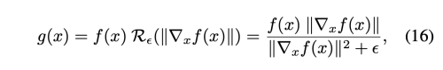

---
layout: post   
title: (GraN-GAN) Piecewise Gradient Normalization for Generative Adversarial Networks         
subtitle: AI Paper Review       
tags: [ai, ml, computer vision, GAN, Gradient Normalization]         
comments: true  
---  

현대의 GAN은 ReLU 및 LeakyReLU를 포함한 discriminator에서 piecewise linear activation을 주로 사용한다. 
이러한 모델은 각 조각이 입력 공간의 부분집합을 처리하고, 부분 집합 당 기울기가 일정한 piecewise 선평 맵핑을 학습한다. 
이러한 종류의 discriminator에 대해서 저자는 입력 공간에서 piecewise k-Lipschitz 제약을 보장하는 새로운 입력 종속 정규화 방법인 gradient normalization (GraN)을 제시한다. 
Spectral Normalization과는 다르게 GraN은 개별 네트워크 계층에서 처리를 제한하지 않으며, gradient penalty와 달리 거의 모든 곳에서 조건별 립사츠 제약을 엄격하게 적용한다. 
실험적으로 저자는 여러 데이터 세트(CIFAR-10/100, STL-10, LSUN bedrooms, and CelebA)에서 향상된 이미지 성능을 보여주었다. 

[Paper Link](https://openaccess.thecvf.com/content/WACV2022/papers/Bhaskara_GraN-GAN_Piecewise_Gradient_Normalization_for_Generative_Adversarial_Networks_WACV_2022_paper.pdf)  

## Related Works

### Stabilizing GANs
이전 대부분의 GAN 안정화를 위한 방법은 아래와 같은 방식들 중 하나를 따랐다.
1. 새로운 loss function 제안
2. 개선된 모델 아키텍처 고안
3. Discriminator에 새로운 제약 도입

여기서 저자는 네트워크 용량을 희생하지 않고 훈련을 개선하는 D에 대한 아키텍처 정규화를 구성하면서 연구의 마지막 라인을 따라간다. 

D를 constraining 하면서 안정화 하는 앞선 연구중 하나는 Wasserstein GAN 이다.
이들은 새로운 loss function을 제안하고 weight-clipping을 사용하여 D가 1-립시츠가 되도록 하는 정규화 방법으로 사용하였다. 

* 립시츠 연속함수란?
  * 두 점사이의 거리를 일정 비 이상으로 증가시키지 않는 함수 
  * 두 거리 공간 (X, Y), 함수 f: X->Y 및 음이 아닌 실수 K >= 0 가 다음 조건을 만족하면 K-립시츠 연속함수라고 한다. 
    * 임의의 x에 대해서 dy(f(x), f(x'))/dx(x, x') <= K
  * 성질
    * 절대 연속함수로 거의 어디서나 미분 가능 함수이다. 
    * f가 K-립시츠 함수라면, 거의 어디서나 \|f'\| <= K 이다.

* WGAN
  * 기존처럼 BCE를 사용한 Discriminator를 사용할 경우, 학습이 진행될 수록 D는 학습이 잘되어 0에 가까운 gradient를 generator에 넘겨주게 되고, 이는 G에 유용하지 않다. (vanishing gradient) 
  * WGAN에서는 Earth Mover's Distance(=Wasserstein Distance)를 사용
  *   
  * 출력이 0 ~ 1로 제한되지 않아 loss로 사용하기 적합하지만, 너무 큰 숫자는 피해야 하기 떄문에 1-립시츠제약을 걸어준다. 
  * \|D(x1) - D(x2)\|/\|x1-x2\|ㅇ,<= 1  
  * 여기서 이 제약은 -0.01 ~ 0.01로 weight clippling 함으로써 달성할 수 있다고 실험적으로 밝혔다. 

하지만 후속 연구들에서 gradient penalty가 최적화를 방해하지 않고, 네트워크 용량을 감소시키지 않기 때문에 더 효율적이라고 밝혀졌다. 

### Gradient Penalties

> gradient penalty P(x) = (|grad_f(x)| - 1)^2 형식이다.

WGAN 기반으로 구축된 가장 인기 있는 GAN 변형 중에 WGAN-GP 가 있다. 
weight clipping을 사용할 경우 가중치가 양쪽 끝에 몰리는 현상이 나타난다.
하지만 GP를 사용하면서 discriminator에 batch Norm을 layer norm으로 대체하여 사용할 경우 가중치가 고르게 퍼지며, 더 좋은 성능을 냄을 밝혔다. 

gradient regularization은 실험적으로 GAN의 성능 향상에 큰 성공을 가져왔지만, 주어진 위치에서 원하는 값을 정확하게 시행하지 않을 수 있다는 것이다. 
또한 시간이 지남에 따라 이동할 수 있는 입력 도메인의 하위집합에만 적용된다. 

#### example code
```python
import torch

class Discrimintor(torch.nn.Module):
    
  def __init__(self):
    self.netD = None # discriminator 정의 
  
  
  def forward(self, x):
    return self.netD(x)
  
  def _gradient_penalty(self, real_data, generated_data, gp_weight=1):
    batch_size = real_data.size()[0]
    device = torch.device("cuda:{}".format(real_data.get_device()))
    # Calculate interpolation
    alpha = torch.rand(batch_size, 1, 1, 1)
    alpha = alpha.expand_as(real_data)

    alpha = alpha.to(device=device)
    interpolated = alpha * real_data.data + (1 - alpha) * generated_data.data
    interpolated = torch.autograd.Variable(interpolated, requires_grad=True)

    interpolated = interpolated.to(device=device)

    # Calculate probability of interpolated examples
    prob_interpolated = self(interpolated, None)

    # Calculate gradients of probabilities with respect to examples
    gradients = torch.autograd.grad(outputs=prob_interpolated, inputs=interpolated,
                                    grad_outputs=torch.ones(prob_interpolated.size()).to(device=device),
                                    create_graph=True, retain_graph=True)[0]

    # Gradients have shape (batch_size, num_channels, img_width, img_height),
    # so flatten to easily take norm per example in batch
    gradients = gradients.view(batch_size, -1)

    # Derivatives of the gradient close to 0 can cause problems because of
    # the square root, so manually calculate norm and add epsilon
    gradients_norm = torch.sqrt(torch.sum(gradients ** 2, dim=1) + 1e-12)

    # Return gradient penalty
    return gp_weight * ((gradients_norm - 1) ** 2).mean()

```

### Weight Normalization

layer의 가중치를 정규화하는 방식으로 가중치 W을 다음과 같이 re-parameterize 한다.

> w = p*w/|w|

여기서 p는 norm을 조정하는 학습된 스칼라이다. 

piecewise linear network는 f(x) = w*x + b 에서 각 x는 선형적으로 맵핑되며, 여기서 w는 암묵적으로 x에 의존하기 때문에, (로컬) 선형 모델의 유효 가중치 벡터로 해석될 수 있다.
WN을 연상시키는 방식으로 GraN 역시 본질적으로 grad(f(x)) = ||w||으로 normalize를 수행한다. 
단, GraN은 한번에 단일 layer에서만 수행하는 대신 full network에서 수행하고, 네트워크를 re-parameterizing하는 대신 piecewise 일정한 gradient를 적용한다. 

### Spectral Normalization and Gradient Attenuation under Global Lipschitz Constraints

SN은 D의 목적함수에 추가적인 패널티 없이 D가 1-립시츠 제약조건을 만족하도록 하는 새로운 대안이었다. 
이는 각 weight 매트릭스의 maximum singular value로 나누며, layer-wise weight normalization 테크닉을 적용하여 수행한다.  

spectral norm은 L2 norm 과 같은 의미이다. 

> g(x) = Wx  
> lipschitz of g(x) = sup sigma(gradient(g(x))), where sigma(A) is L2 matrix norm of A and sup means supremum  
> lipschitz of g(x) = sup sigma(W) = largest singular value 

W_sn = W / sigma(W)  

단 singular value decomposition을 이용하여 largest singular value를 계산할 경우 계산량이 매우 많기 때문에 power iteration method를 이용해서 값을 추정하는 방식을 채택하였다.   
[Power iteration Method](https://velog.io/@cleansky/EVD-%EC%97%86%EC%9D%B4-Eigenvalue-%EC%B0%BE%EA%B8%B0-Power-Iteration-Power-Method)  

  

SN은 학습 과정에서 효과적인 GAN의 stablizer 라고 실험을 통해 밝혀졌고, 최근의 large scale GAN의 주요 컴포넌트로 자리잡았다.

구조적인 레벨에서 네트워크를 전역적으로 립시츠 제약하기 위해 네트워크 용량에 대해 균형을 잡는 것과 정규화 하는 것은 매우 어렵디. 
실제로 Anil et al.은 표준적인 GAN에서 전역적 립시츠 제약이 걸려있을 경우 간단한 테스크 조차 해결하는 것이 어렵다는 것을 보였고, 
unit gradient가 있는 부드러운 SNed ReLU 네트워크는 전체적으로 선형이 되며, gradient norm 보존과 weight matrix 직교을 통해 이를 해결하였다. 

GraN은 이를 피하기 위해, 입력공간과 관련하여 D에서 불연속성을 허용하고 립시츠 상수 K를 부분적으로 제한한다. 
이후 연구는 립시츠 제약 조건에 의해 유도된 기울기 감쇠를 새로운 직교 컨볼루션 연산자와 결합했다. 
대조적으로 GraN은 부분적인 의미에서 국소적으로 수행하면서 K를 전역적으로 제한하지 않고 임의의 부분적인 선형 네트워크위에 적용할 수 있다. 

## Background

### Generative Adversarial Networks
Goodfellow et al. 은 cross-entropy (CE) loss 기반의 목적함수로 G와 D를 학습하였다.  
  

이때 Discriminator의 output은 D(x) = sigmoid(f(x)) 이다. 

loss G의 Gradient는 아래와 같다. 
  

때문에, D(x)가 generated sample에 대해서 0 에 근하게 되면 gradient가 Generator를 업데이트 하는데 거의 영향을 미치지 못하게 된다.
이는 특히 학습 초기에 generated sample과 real sample간 분별이 쉬울 떄 발생할 수 있다. 

이런 문제를 해결하기 위해, G를 non-saturating 할 수 있는 대체적인 loss function을 제안하였다. 
이에 대한 gradient 는 아래와 같다. 
 

이 경우에는 Discriminator가 자신있게 fake 샘플을 구별 (D(G(z))=0) 하여도 여전히 gradient에 영향을 줄 수 있다. 
이를 더 쉽게 부르기 위해 "NSGAN" (Non-saturating GAN) 이라고 하자. 

하지만 이 역시도 학습이 어느정도 진행 된 후 generated sample과 real sample의 분포가 비슷해지면 saturating 문제가 생긴다. 

나중에, WGAN 모델은 두가지 이슈를 해결하기 위한 시도를 하였다. 
첫째, Jensen-Shannon 발산의 사용으로 인해 P_g와 P_r 에 대한 분리는 낮은 그레디언트로 이어진다. (자신있는 D가 빠르게 포화되어 gradient vanishing 현상이 나타남)
두번쨰, 고정된 D에 대해, optimal G 는 D(x)의 가장 높은 값을 가진 점에서 Dirac Delta 합을 샘플링하여 모드의 붕괴를 촉진한다. 
이를 Wasserstein distance를 이용하여 해결한다. 

 

여기서 D(x)=f(x)라고 했을 떄 f(x)는 1-Lipschitz 제약을 받는다. 

Gradient는 아래와 같고, 학습 초기 뿐만 아니라 학습 후반에도 saturate 하지 않는다. 
 

또 다른 많이 사용하는 GAN loss는 hinge loss 이다.

 

D를 효과적으로 1-Lipschitz function으로 제약하기 위한 몇가지 방법들이 제안되어왔다. 
WGAN은 weight clipping을 사용하고, 반면 WGAN-GP 은 soft-gradient 패널티를 사용하여 성능을 향상시켰다. 

더욱 최근에는 SNGAN은 모든 레이어마다 spectral norm을 적용햐여 1-립시츠 제약을 적용시켰다. 
이러한 제약 함수의 구성이 일반적으로 전체 립시츠 상수가 1로 느슨하게 제한된다는 것을 보였다. 

WGAN 학습을 위해 D를 1-립시츠로 제약하는 것은 NSGAN 을 학습시키는 것에도 효과적이라는 사실이 밝혀졌다. 
이런 부드러운 제약이 왜 효과적인지 보이면 아래와 같다. 
NSGAN의 loss G의 gradient는 아래와 같다. 

 

함수 f가 K-립시츠 제약을 받는다면, NSGAN, WGAN loss 의 gradient 모두 K에 바운드 된다. 
따라서 학습 과정의 gradient는 explode 하지 않고 학습에 안정성을 가져올 수 있다. 

이 논문에서 저자는 대체적인 방법으로 gradient를 거의 모든 gradient 부분에 piecewise K-립시츠 제약을 거는 방법을 제안한다. (이는 global K-립시츠 제약과는 반대이다. )
그리고 실험을 통해서 이 방법이 discriminator과 critics에 효과적임을 보여준다. 

### Deep Pieceweise Linear Networks
요즘의 딥러닝 네트워크는 ReLU, LeakyReLU 같은 piecewise linear activation function을 사용하는 것이 지배적다.
이러한 ㅘㄹ성 함수는 영역이 saturation 하지 않도록 하기 때문에 매우 깊은 네트워크의 학습이 vanishing gradients 없이 학습할 수 있도록 한다. 

f(x, param) = w(x, param) x + b(x, aram)
wx는 flatten tensor의 scalar dot-product 이다.따라서 w, b가 x에 piecewise constant가 된다는 의미는 어떤 input 의 subset S_k가 있을때, 
아래와 같이 표현하고,
 
w_k, b_k는 하위 집합 S_k내에서 x로 부터 독립적이다. 이때 S_k는 input 차원 d(HxWxC)에 포함된다. 

따라서 S_k에 있는 모든 input x는 아래 식을 만족한다. 
  
이는 S_k 내에 있는 x에 대해 linear하다.

따라서, f(x)는 연속적이면서, piecewise linear function들의 combinaiton 이고, 
따라서, 그 자체가 continuous piecewise linear function이다.

f(x, param)은 x가 S_k에 포함될때 linear function이고, w_k, b_k를 effective weight로 해석할 수 있다.
위와같은 구조가 주어졌을 때 gradients는 아래와 같다. 

  

## Gradient Normalization

이 방법은 piecewise linear network를 거의 모든 영역에서 1-립시츠 제약을 할 수 있는 방법이다.

gradient normalized function g(x)을 아래와 같이 정의한다. 

  
여기서 R(n) = n / (n^2 + e)로 normalization factor 이다.
(n = |gradient(f(x))| )
실험을 통해서 R(n) =  1/(n+e) 역시 비슷한 결과를 생성하지만 위 식에 비해 조금 잘못된 결과를 낸다는 사실을 밝혔다.
그렇기 떄문에 R(n)에 대한 선택도 영향을 준다. 

주어진 normalization에서 만약 f가 임의의 piecewise linear function 이면 g 역시도 1-립시츠 제약을 받는 piecewise linear 이다. 
반면 g(x)의 gradient는 bounded 되어 있지만 g(x) 자체는 bound 없이 real value를 받을 수 있다. 
더 좋게 설명하자면 아래와 같다. 

  

위에서 |gradient(g(x))| < 1은 boundary 를 제외하고 만족한다.
여기서 boundary는 input x가 Subset_k에 포함되지 않는 영역인데, 이 부분에서는 gradient 가 존재하지 않ㅁ는다. 
그렇기 떄문에 g는 일반적으로 연속적이지 않고, globally 1-립시츠 제약을 보장하지 않는다.
하지만 저자는 경험적으로 g(x)가 상당한 섭동에 대한 제한된 유한 차이를 가지고 있다는 것을 발견하였다. 

따라서 g는 piecewise 1-립시츠이고, 1-립시츠는 각 서브셋 S_k 안의 어떤 포인트에서도 만족된다. 
또한 국소적으로 1-립시츠 연속성이 거의 모든 지점에 존재하는데, 이는 1-립시츠 연속성이 유지되는 모든 지점 x (within Subset_k) 주변에 open ball 이 있기 떄문이다. 
저자는 실험적으로 |gradient(gx)| 가 tight 한 바운드를 가지고 있어도 GAN 핟습의 모든 영역에서 도움을 줄 수 있음을 밝혔다. 

### Gradient Normalized GANs

D(x) = sigmoid(f(x)) 라고 했을 떄 D는 Discriminator 이고, D(x) = f(x) 라고 했을 때는 D는 비평가(critics)라고 표현한다. 
f(x)가 piecewise linear 할때, gradient normalized discriminator (GradND)와 critic (GraNC)은 D(x) = sigmoid(g(x)), D(x) = g(x) 라고 각각 정의한다. 


t는 positive constant로 g를 K-립시츠 제약을 가하는 데 사용한다 (K = 1/t) 
GraND 에서 t는 sigmoid의 temperature 역할을 한다. 

spectral normlaization 처럼 K 역시 오직 추가적인 하이퍼파라미터일 뿐이다. 
더욱이 실제로 저자의 방법은 Spectral normalization 과 다르게 립시츠 상수에 대한 엄격한 경계를 달성한다. 

## Comparison to Layer-wise Norms
### Spectral Normalization
GP는 부드럽게 립시츠 연속성을 data 의존적인 방법으로 장려한다.
이를 개선한 방법으로, Spectrally Normalized GAN (SNGAN)은 구조적인 레벨로 이를 달성하였다. 
특히 linear layer l(x) = Wx는 input에 적용하기 전 W/sigma(W) 로 정규화되었다. 
하지만 WN의 형태는 각각의 row에 대해 적용되는 것이 아니라 전체 매트릭스에 작용한다.

SN은 layer-wise 1-립시츠 제약으로 power iteration을 통해 근사화한다.

SN의 한가지 단점은 레이어 별로 적용하기 때문에 용량을 줄이고, gradient를 약화 시키면서 네트워크를 과도하게 제한하는 경향이 있다. 
SN은 모든 레이어에 립시츠 제약을 가하면서 글로벌 1-립시츠를 보장한다. 
하지만 upper-bound 는 종종 loose하고 과도하게 네트워크를 구혹하고, gradient를 약화시킨디ㅏ.
비교적으로 GraN은 네트워크 전체에 적용하고, 레이어 마다의 weight는 그 다양성을 가지고 움직일 수 있으며, 
입력과 관련된 기울기가 항상 단위 표준인지 확인한다. 

## Results

  
  