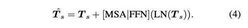

---
layout: post   
title: Region-Aware Face Swapping         
subtitle: AI Paper Review       
tags: [ai, ml, computer vision, GAN, Face Swap, Deep Fakes]          
comments: true  
---  

이 논문은 로컬-글로벌 방식으로 Identity 일관성을 유지하면서 조화로운 고화질 얼굴 생성을 달성한 새로운 RAFSwap(Region-Aware face swap) 네트워크를 제안한다.
1) Local Face Region-Aware (FRA) branch는 잘못 정렬된 crossscale semantic 상호 작용을 효과적으로 모델링하기 위해 트랜스포머를 사용하여 local id 관련 특징들을 augment 한다.
2) Global Source Feature-Adaptive (SFA) branch는 id-consistent swapped face를 생성하기 위해 글로벌 id 관련 단서를 추가로 보완한다.

게다가 StyleGAN2와 호환 가능한 Face Mask Predictor (FMP) 모듈을 적용하여, unsupervised 한 방식으로 id 관련한 soft facial mask를 예측하여 더 실용적으로 조화로운 고화질 얼굴 생성을 가능하게 하였다. 
수많은 실험을 통해서 저자의 방법이 기존 방법들에 비해서 SOTA를 달성하였음을 밝혔다. 

[Paper Link](https://openaccess.thecvf.com/content/CVPR2022/papers/Xu_Region-Aware_Face_Swapping_CVPR_2022_paper.pdf)  

  

## Method

  

저자의 방법은 GAN inversion framework인 pSp를 기반으로 개발되었다.

먼저 source와 target 이미지를 계층적 feature encoder를 이용하여 계층적 feature F_s = {F_s0, F_s1, Fs2}, F_t = {F_t0, F_t1, F_t2}를 추출한다. 
여기서 0, 1, 2는 small, medium, large scale을 의미한다. 
모든 feature map은 512 channel을 가진다. 이와 동시에 BiseNet을 이용히여 source와 target 이미지의 입술, 코, 눈썹, 눈 등의 semantic label 인 M_s. M_t를 추출한다. 
그 다음, FRA, SFA 를 적용하여 source 이미지로부터 구별가능한 identity feature인 local F_l, global F_g를 추출한다. 
이 feature은 위에서 추출한 feature F_t에 element-wise 하게 더해진다.
그 다음,계층적 feature map으로 부터 학습된 스타일을 추출하기 위해 pSp, 18 mapping 네트워크를 학습시킨다. 
모든 스타일 벡터들은 StyleGAN2 구조를 가진 generator를 통과하여 합성되고 raw swapped face 를 생성한다. 
StyleGAN2의 feature map은 FMP를 통해 soft mask M을 생성해낸다. 
최종적으로 위에서 생성된 이미지와 마스크를 섞어 이미지를 생성한다.

### Facial Region-Aware Branch 
  

#### Region-Aware Identity Tokenizer

국소적인 영역에서 입술, 코, 눈썹, 눈 과 같은 id 관련 특징을 추출하기 위해 RAT를 제안한다. 
이는 source feature F_s를 중요한 local id 관련 토큰인 T_s (NxLx512)를 추출한다. 
여기서 N은 feature map 의 서로 다른 scale 수 이고, L은 region 의 갯수이다.
(N=3, L=4) 

SEAN을 따라서, 저자는 region-wise average pooling layer를 적용하여, local semantic representation을 얻는다. 
자세히 말하면, semantic label을 bilinear interpolation을 이용하여 resize하여 각 source feature map 과 사이즈를 맞추었다.
그 다음 각 region의 pixel-level feature은 통합하고 평균을 내어 상응하는 token으로 들어간다.
그 다음 모든 계층적 id 관련 토큰에 linear layer를 적용한다. 
tokenizer operation은 아래와 같다. 

 

#### Transformer Layers

AdaIN 기반 방법은 중요한 local feature 간의 feature interaction이 부족하여 swapped face의 잘못된 identity consistency를 유발할 수 있다. 
저자는 서로 다른 Scale과 semantics에 걸쳐 토큰 간의 상호작용을 모델링 하기 위해 transformer layer T를 도입하는데, 이는 feed-forward network (FFN), layer normalization (LN), Residual connection(RC) 과 함께 Multihead Self Attention(MSA) 레이어를 기반으로 한다.
  

A는 (NLxNL size)의 Attention matrix로 모든 토큰 간의 관계를 나타낸다. 

  
  

#### Region-Aware Identity Projector

우리는 source 얼굴과 target 얼굴 사이 잘못 정렬된 속성(시선, 표정)을 고려하면서 대상 feature에 id 관련 토큰을 공간적으로 투영해야 한다. 
편집된 source region의 style을 reference style face로 대체하는 SEAN과 달리, 저자는 대상 얼굴에 adaptive 하게 id 정보를 전송하고 그 속성을 변경하지 않도록하는 Region-Aware Identity Projector를 고안하였다. 

  

여기서 RS는 reshape operator를 뜻환다. 

### Source Feature-Adaptive Branch
FRA를 수행한 다음 source image의 local identity-relevant 특징들이 target face에 합쳐진다. 
하지만, 몇몇의 global representation 또한 swapped face의 identity consistency에 중요한 영향을 끼친다. (skin, 주름, 얼굴 요소간 거리)  
그래서 저자는 global source feature-Adaptive branch를 디자인하여 global information을 서로다른 identity를 구분짓는 보완적인 단서로 제공가능하게 하였다. 
source와 target 간의 공간적인 misalignment를 피하기 위해, source feature map의 가장 작은 size를 먼저 Global Average Pooling을 수행한다. 
그다음 MLP들을 적용하여 adaptive 하게 global feature과 합쳐지도록 하였다. 
마지막으로 3개의 스케일 만큼 글로벌 feature를 브로드캐스트하고 동일한 해상도로 F_l을 추가하여 통합 target feature F_t를 얻는다. 

  

### Face Mask Predictor 

배경의 occlusion과 distortion을 해결하기 위해, MegaFS는 사전 훈련된 segmentation model에 의해 생성된 hard face mask를 직접 활용하였는데, 
이는 가장자리 주변에 artifact를 생성하는 경향이 있고 계산적으로 친화적이지도 않다. 

Labels4Free에 영감을 받아 저자는 현존하는 모델 구조를 사용하는 방법을 채택하였다.
먼저, pre-trained StyleGAN2는 이미 사전의 semantic을 풍부하게 포함하고 있다.
그리고 identity-constraint는 mask 모듈이 id 관련 영역에만 집중하도록 강요할 수 있다. 
그래서 StyleGAN2의 feature map이 특정한 mask supervision 없이 soft face mask를 생성하도록 할 수 있었다.

  

feature map들의 resolution은 16 ~ 256 이고 각 feature map에 bottleneck을 적용하여 channel수를 32로 줄이고 resolution을 256으로 upsample 하였다.
마지막으로 모든 결과를 concat 하고 1x1 conv와 sigmoid를 사용하여 1 channel mask를 얻는다. 

  

### Objective Functions
크게 3가지 loss인 identity loss, reconstruction loss, perceptual loss를 사용하였다. 
* Identity Loss 
  
* Reconstruction Loss
  
* Perceptual Loss
  

L = 0.15 x L_id + 1 x L_rec + 0.8 x L_p 를 사용하여 학습하였다. 
또한 It = Is, It!= Is는 1:4 비율을 사용하여 학습하였다. 
Adam Optimizer는 b1 = 0.9, b2 = 0.999, learning rate = 0.0001을 사용하여 batch size 8로 50K step 학습하였다. 

## Results

  
  