---
layout: post   
title: (InstructPix2Pix) Learning to Follow Image Editing Instructions      
subtitle: AI Paper Review       
tags: [ai, ml, computer vision, GAN, Image Generation, pix2pix, Diffusion Model, Stable Diffusion, GPT, Image Synthesis]          
comments: true  
---  

저자는 사람의 지침으로 이미지를 수정하는 방법을 소개한다.
image와 모델이 수행해야 할 지침을 입력하면 모델은 이 지침을 따라서 이미지를 수정한다.
이 문제를 위한 학습데이터를 얻기위해 두개의 large pretrained model, language model (GPT-3) 와 text-to-image model (Stable Diffusion)의
정보를 통합하여 대규모의 image editing 데이터를 만들었다.
저자의 conditional diffusion model 인 InstructPix2Pix는 직접 생성한 데이터에서 학습하였으며, inference시 실제 이미지와 사용자가 작성한 지침에 일반화할 수 있다. 
이미지 수정과정은 forward 과정에서 수행되기 때문에 per-example fine-tuning 과정이나 inversion 과정이 필요 없어서 매우 빠르게 이미지 편집을 수행할 수 있다.

[Code Link](https://github.com/timothybrooks/instruct-pix2pix)  
[Paper Link](https://arxiv.org/pdf/2211.09800v2.pdf)  

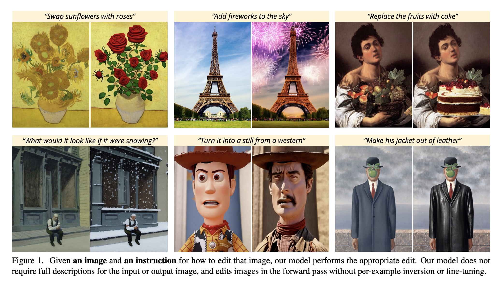  

## Prior Work
### Composing Large Pretrained Models
최근 작업들은 큰 pretrained model들이 multimodal task를 해결하기 위해서 하나의 모델만을 가지고 수행하지 않는다.
예를들어 image captioning, visual question answering 과 같은 task들은 large language model과 text-image model의 정보를 모두 필요로 한다.
pretrained model을 통합하는 테크닉은 아래 같다.
- joint finetuning on new task
- prompting을 통한 communication
- energy based model을 통한 확률 분포 통합
- 모델을 통한 다른 모델 feedback guiding
- iterative optimization

저자의 모델도 사전 학습된 두개의 모델의 능력을 보완적으로 사용한다. 하지만 저자는 학습 데이터 pair를 생성하기 위해 사용하기 때문에 약간 다르다.

### Diffusion-based generative models
최근에 Diffusion model의 진보로 인해 SOTA 이미지 합성이 가능하게 되었다.
text-to-image diffusion model은 임의의 text caption으로 부터 진짜 같은 이미지들을 생성해낸다.

### Generative models for image editing
image editing model은 전통적으로 style transfer나 image domain간의 변환과 같은 하나의 편집 작업만을 목표해왔다. 
많은 editing 접근 방식은 image를 latent space로 치환시키거나 encode하여 latent vector를 조작한다.
최근 모델은 CLIP embedding을 text를 이용한 image editing의 가이드로 활용한다.
저자는 이중 하나의 방법인 Text2Live를 비교대상으로 삼아 additive image layer가 CLIP 유사성 목적에 최적화 되도록 사용한다.

최근 작업들 사전 학습된 text-to-image diffusion model을 image editing에 사용한다.
반면 몇몇의 text-to-image 모델들은 자연적으로 image 수정 능력이 있다. (DALLE-2)
이런 모델을 사용하여 targeted editing을 수행하는 것은 non-trivial이다. 
왜냐하면 대부분의 경우에 비슷한 text prompt에 대해서 비슷한 이미지를 생성한다는 보장을 하지 못하기 때문이다.

최근에 이런 문제를 해결하기 위해 Prompt-to-Prompt 라는 방법이 제안되었다.
이 모델은 비슷한 text prompt에 대해 유사한 이미지를 생성할 수 있고, 독립된 편집을 수행할 수 있다.

저자는 이 방법을 학습 데이터 생성에 사용하였다. 
실제 이미지를 편집하기 위해 SDEdit은 pre-trained model을 사용하여 새로운 목적 prompt와 함께 
input image에 noise를 더하거나 없애는데 사용하였다. 

최근 작업은 주어진 caption과 user-drawn mask를 가지고  local inpainting 를 수행하거나
적은 image collection을 사용하여 학습시킨 후 특정 object에 대해서 새로운 이미지를 생성하거나 concept을 학습한다.
또는 single image에 해서 fine-tuning을 진행하고 새로운 text description을 가지고 새로운 이미지를 생성한다.

이런 방법들 다르게 저자의 방법은 오직 하나의 이미지와 어떻게 이미지를 수정할지 지침만을 가지고 직접적으로 어떠한 이미지에 대해서 forward pass만으로 image 수정을 수행한다.

### Learning to follow instructions
저자의 방법은 현존하는 text 기반의 image 편집 방법인 text label에 대해서 반대되는 지침에 대해서 수행하는 방식과 다르다.
이런 editting 지침의 큰 장점은 정확히 사용자가 모델에게 자연어로 수행할 부분에 대해 지침을 내리면 되고, 추가적인 정보를 제공할 필요 없다.
(예시 이미지 모음이다, input/output 이미지 유지 되어야 하는부분 등) 

### Training data generation with generative models
일반적으로 deep model은 매우 많은 학습데이터를 요한다. 
인터넷에 있는 데이터는 종종 적합하지만, 때로는 supervision을 위한  paired data가 존재하지 않을 수 있다.
생성모델을 값싸고 풍부한 training data로 활용함으로써 관심 영역에 대해서 더 큰 진보를 이룰 수 있다.
이 논문에서도 저자는 두개의 서로 다른 기성 생성모델 (언어, text-to-image)을 사용하여 학습 데이터를 생성하였다.

## Method
저자는 instruction 기반 image editing 문제를 지도학습 문제로 처리한다.
(1) 먼저 저자는 text editing instruction과 image 편집 전/후 paired data 를 생성한다.
(2) 생성한 데이터 셋으로 image editing diffusion 모델을 학습한다.

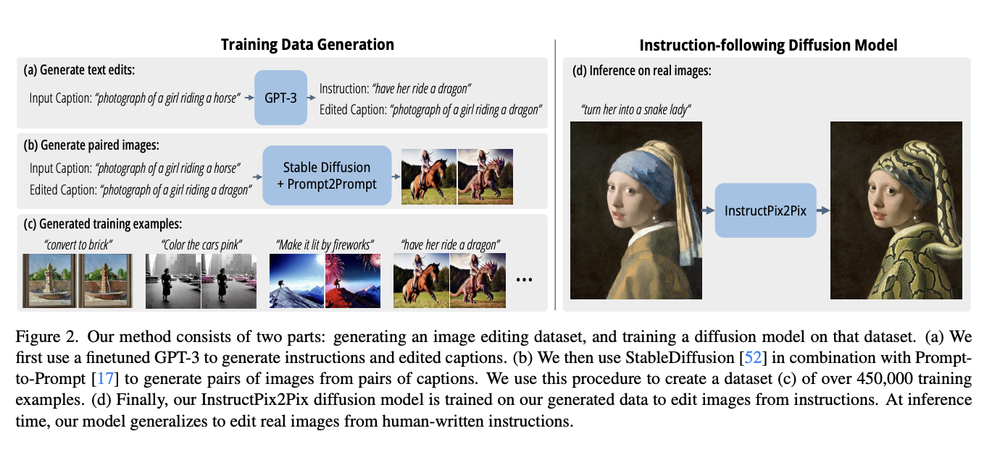  

### 1. Generating a Multi-modal Training Dataset

#### 1-1. Generating Instructions and Paired Captions
먼저 text domain에서 large language model을 사용하여 image caption에 대해 editing instruction, 편집 결과 text caption을
생성하였다. 
text domain에서만 적용하는 것은 모델이 이미지 변화와 text instruction 간에 관련성 있는 것은 유지하면서 많고 다양한 eidt 모음을 생성할 수 있게 해준다. 
저자의 모델은 finetuning GPT-3에의해 학습된다. 

fine-tuning 데이터를 생성하기 위해 LAION-Aesthetics V2 6.5+ 데이터셋에서 700 input caption을 샘플링하고 메뉴얼하게 instruction과  output caption을 작성하였다. 
이 데이터를 이용하여, 저자는 GPT-3 Davinci model을 1 epoch, default training parameter로 finetuning 하였다.

저자가 LAION dataset을 사용한 이유는 매우 많고, 다양한 컨텐츠가 있기 때문이다. 
비록 많은 노이즈가 있는 데이터셋이지만, dataset filtering과  classifier-free 가이드를 통해서 완화됨을 밝혔다. 

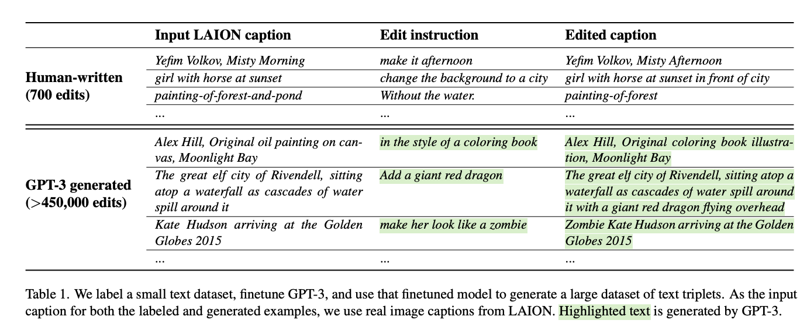  

#### 1-2. Generating Paired Images from Paired Captions

text-to-image 모델을 통해서 paired caption을 paird image로 생성한다.
하지만 이 모델들은 매우 작은 prompt 변화에서 조차 image-consistency를 보장하지 못한다. 
이는 우리의 목적에 부합하지 못한다. (not produce random different image)
그래서 저자는 Prompt-to-Prompt 모델을 사용한다. 이 모델은 몇번의 denosiong step을 통해 cross attention을 생성한다. 

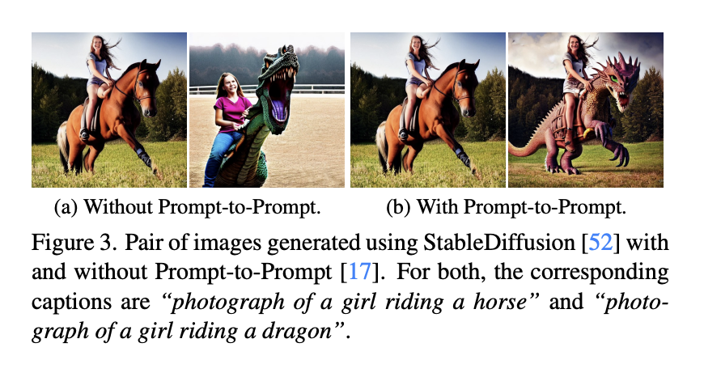  

비록 이는 생성 이미지를 완전히 이해하는데 도움이 되더라도, 어느 정도 바꿔야 하는지가 요구될 수 있다. 
예를어, 큰 값으로 변화를 원할 수록, 생성된 이미지 pair  간의 유사성은 줄어들어야 한다.
다행히도 Prompt-to-Prompt는 이를 파라미터로 가지고 있어서 두 이미지 사이의 유사성을 컨트롤 할 수 있다. 
불행히도, 최적의 컨트롤 값을 알기는 어렵다. 

그래서 저자는 랜덤 컨트롤 파라미터 p (~U(0.1,0.9))를 가지고 100개의 샘플을 생성하여, CLIP 기반의 메트릭을 사용하여 필터링 하였다. 
이 메트릭은 CLIP space에서 두 이미지 변화 consistency를 측정한다. 

### 2. InstructPix2Pix
저자는 Stable Diffusion Model을 베이스로 사용하였다. 
Diffusion model은 일련의 denoising autoencode을 통해서 샘플을 생성하고, data 분포로 그 점수를 평가한다. 
Latent Diffusion 은 사전에학습된 VAE의 latent space에서 작동하여 difusion model의 효율성과 퀄리티를 향상시켰다. 
예를들어 이미지 x가 있을 때, diffusion process는 encoded latent z = E(x)에 노이즈가 더해진 z_t를생성한다.
우리는 이미지 조건 c_i와 text instruction c_t가 주여졌을때 z_t에 더해진 노이즈를 예측하는 네트워크를 학습한다. 
아래 latent diffusion 목적 함수를 최소화 하며 학습한다. 

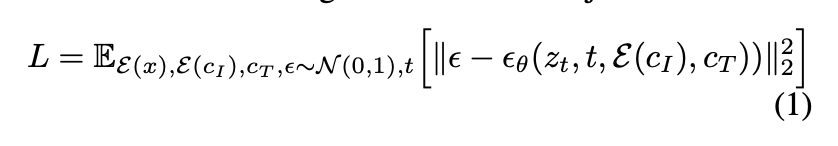  

Wang et al.은 large image diffusion model을 fine-tuning하는 것이 이미지 변환 작업(특히 paired data가 부족한 경우)을 위해서 모델을 처음부터 학습시키는 것 보다
월등히 좋은 성능을 낸다는 것을 밝혔다. 

저자는 그래서 모델을 사전에 학습된 Stable Diffusion Checkpoint로 초기화 하여 text-to-image 생성 능력을 증강시켰다. 
image conditioning 을 지원하기 위해 z_t와 E(c_i)를 concatenating 하는 first conv layer에 추가적인 input channel 추가하였다. 

단, 새롭게 추가된 채널에 적용하는 weight은 0으로 초기화 되었다. 
text 조건 메커니즘은 caption에서 의도하는 방법을 사용하였다. 

#### 2-1. Classifier-free Guidance for Two Conditionings
Classifier-free diffusion guidance는 생성된 샘플의 품질과 다양성을 절충하는 법이다. 
이는 class-conditional, text-conditional 이미지 생성 모델에서 공통적으로 사용되며,
생성된 이미지가 조건에 더 일치록 만들어준다.

Classifier-free guidance 는 효과적으로 확률 밀도를 암묵적인 classifier p(c|z_t)가 조건 c에 높은 가능성을 할당하는 데이터로 이동시킨다. 
이를 도입하는것은 diffusion model을 conditional과 unconditional denoising으로 jointly하게 학습하게 하며, 
inference를 평가하기 위해 두 점수를 통합한다. 

unconditional denoising을 평가하는 것은 간단하게 condition setting c를 null value로 고정하는 것이다. 

inference time에, guidance scale s>=1 을 가지고 conditional e(z_t, c)애 얼마나 다가갔고, unconditional e(z_t, null)에서얼마나 멀어졌는지 평가한다.  
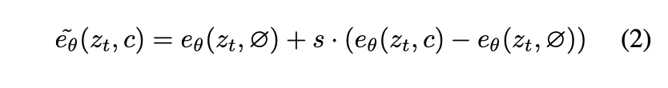  

저자의 task에서 score network e(z_t, c_I, c_t)는 두가지 조건, input image c_i, text instruction c_t를 가진다. 
Liu et al.은 조건부 diffusion model은 다양한 서로다른 conditional value로부터 점수를 구성할 수 있다고 주장하였다. 
저자 역시같은 컨셉을 적용하였다. 

학습과정에서 예시의 5%는 c_i = null로, 또다른 5%는 c_t = null로, 또다른 5%는 c_i,c_t = null로 설정하였다. 
그래서 자자의 모델은 conditional, unconditional denoising을 사용할 수 있게 되었다. 
저자는 두 guidance scale s_I, s_t를 도입하여, 학습된 샘이 input image에 더 사응할지, edit instruction에 상응할지 trade-off를 조정할 수있게 하였다. 

수정된 score estimate는 아래와 같다. 

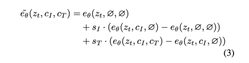  

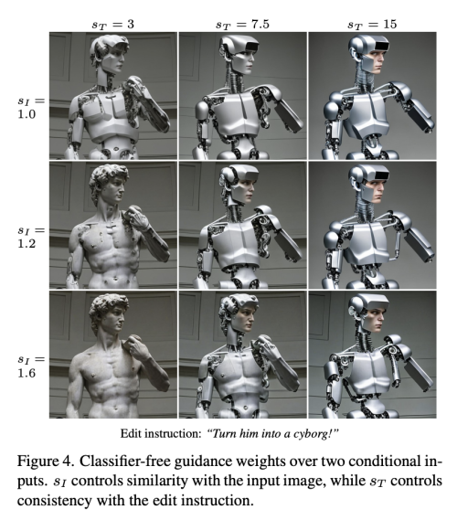  

## Implementation Details
### Instruction and Caption Generation
GPT3를 finetune하여 edit insturction과 edited caption을 생하였다. 
fine-tuning에서 사용한 text prompt는 "\n##\n"을 seoarator token으로 사용하여 input caption을 cocatnated  하였다. 
text completion은 instruction과 edited caption을 concatenation한것이고 이는 "\n%%\n"을 seperator token으로 사용하였다. 
stop token은 "\nEND"를 사용하였다.
또한 input과 output caption이 같은 generation은 제거하였다. 
inference 시에 새로운 caption에대해 temperature=0.7, frequency-penalty=0.1을 사용하였다. 

### Paired Image Generation
Prompt-to-Prompt 를 사용하여 before/after image pair를 생성하였다. 
Stable Diffusion v1.5 checkpoint의 exponential moving average (EMA) weight와 개선된 ft-MSE autoencoder weight를 사용하였다. 
이미지를 생성하기 위해 Euler ancestral sampler 를 사용한 100 denoising step을 이용하였으며, 각 생성 pair에 동일한 latent noise를 사용하였다. 

Prompt-to-Prompt 는 특정 편집 유형 (단어 스왑, 구문 추가, 증가 또는 감소)에 따라 두번째 생성된 이미지의 cross-attention weight을 다르게 대체한다.
단어의 무게를 줄이는 것 대신 단계의 첫번째 부분에 대해 두번째 이미지의 self-attention weight를 교체했고, 모든 edit에 동일한 attention weight 대체 전략을 사용하였다. 

각 caption pair에 대해서 100 pair image를 생성하였다. 
image-image CLIP threshold 0.7을 사용하여 이미지가 너무 다르지 않게, image-caption CLIP threshold 0.2를 사용하여 caption의 변경 내용이 이미지의 변경 내용과 일치하도록 
CLIP 방향 유사성은 0.2로 설정하였다. 
각 캡션 쌍에 대해 CLIP 방향 유사성에 따라 모든 필터를 통과 하는 이미지쌍을 정렬하고 최대 4개의 예를 유지하였다. 

### Training InstructPix2Pix

모델은 총 10,000 스텝, 8x40GB NVIDIA A100 GPU로 25.5 시간 학습하였다. 
256x256 resolution 으로 total batch size 1024로 학습하였다.
또한 random horizontal flip augmentation, crop augmentation (256~288) 을 사용하였다. 
learning rate = 0.0001로 설정 하였다 (witout learning rate warm up)

다른 training setting은 public StableDiffusion code를 따랐다. 
비록 256x256에 학습하였지만, inference 시에 512에도 일반화가 잘됨을 발견하였다. 
일반적으로 editing image는 512x512 사이즈에 대해서 100 denoising step을 적용하였을 때 A100 GPU에서 9초 정도 소요된다. 

### Classifier-free Guidance Details
input image c_i 와 text instruction c_t 의 조건을 따르는 classifier-free guidance를 적용하였다.

저자는 scale factor s_i, s_t를 사용하여 각 조건에 대해서 분리되어 조건을 줄 수 있도록 하였다. 
저자가 수정한 score estimate는 아래와 같다. 

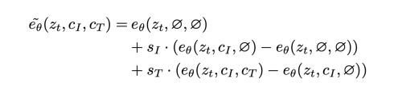  

저자의 조건부 확률에 따른 classifier-free guidance 공식은 아래와 같다. 

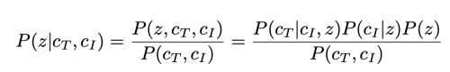  

로그를 취하고 z로 미분하면 아래와 같이 표현할 수 있다.

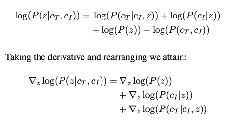  

scale factor s_i는 P(c_i|z_t)를 이미지 조건 c_i에 더 높은 loglikelihood를 가지도록 확률분포를 이동시키고, 
s_t 역시 P(c_t|c_i, z_t) 가 c_t에 더 높은 likelihood를 가지도록 확률분포를 이동시킨다. 

저자의 모델은 c_i,c_t의 with/without 조건을 각각 예측하면서 암묵적인 classifier를 학습할 수 있다. 

## Results

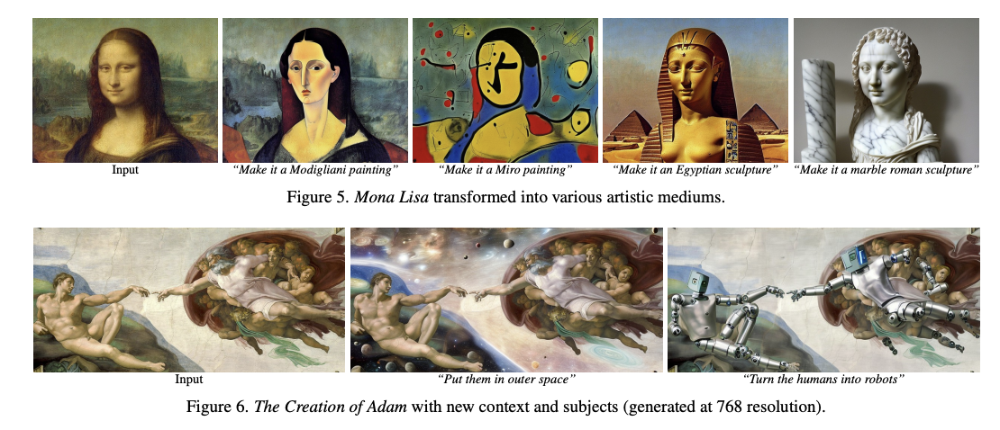  
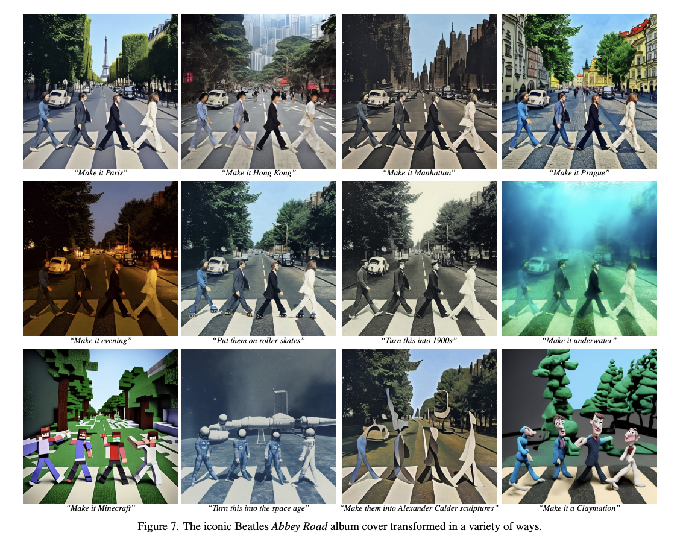  
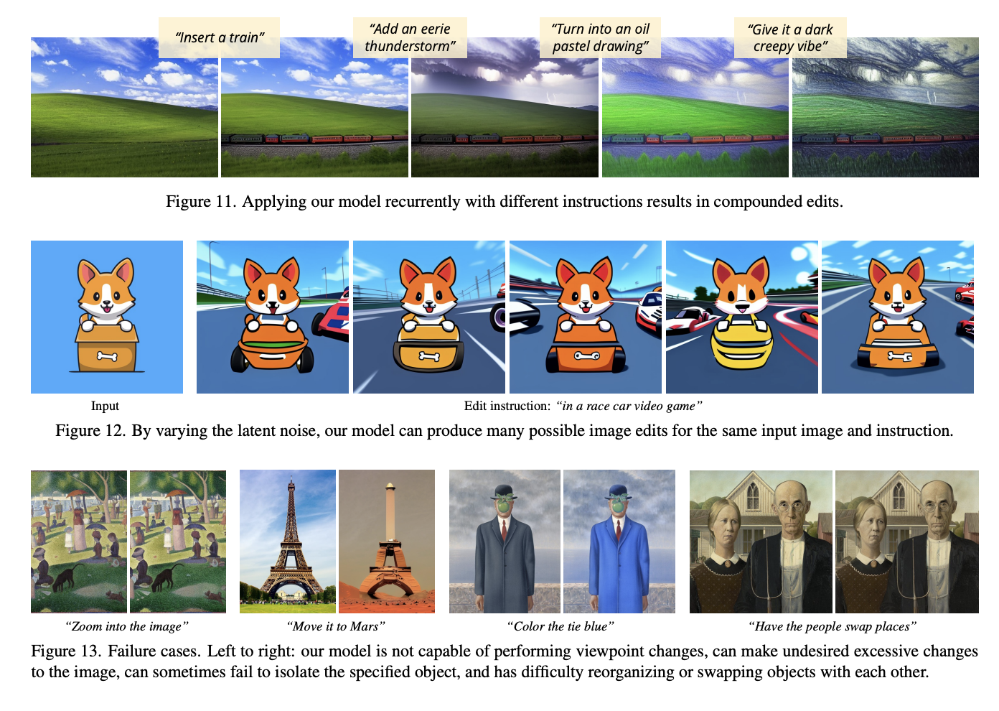  
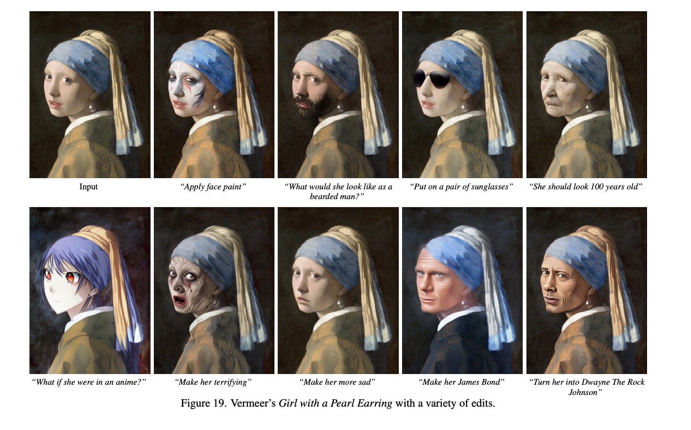  

